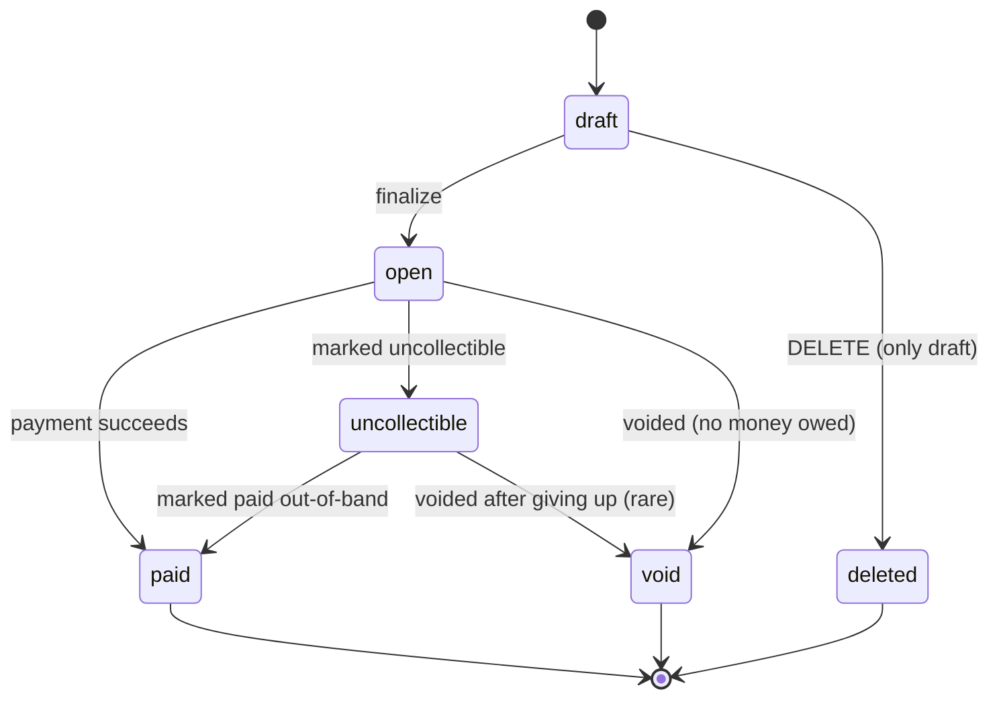
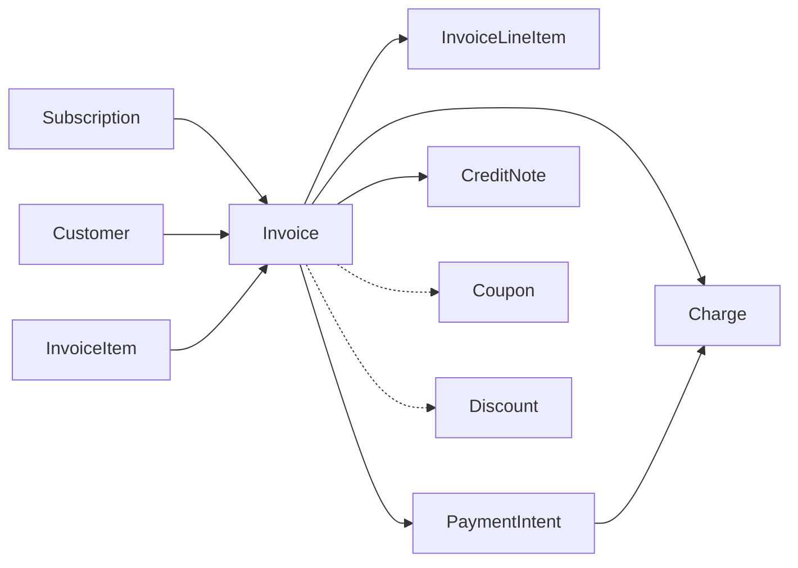

# Invoice

> API resource: `invoice` · API version: `2026-04-22.dahlia` · Category: [Billing](README.md)

## What it is

An `Invoice` is a statement of what a customer owes you for a defined billing period or set of charges. It is an **immutable, numbered, legally-significant document** once finalized — once issued, you cannot edit its line items, only add credits/refunds against it. Invoices are the primary unit of recurring billing: every subscription period auto-creates one. They can also be created standalone for one-time bills, deposits, or proforma quotes.

The invoice carries: a list of line items, an amount due, a tax calculation, applied discounts/credits, payment status, dunning state, and a hosted PDF that can be emailed to the customer.

## Why it exists

Charging a card directly is fine for one-off purchases. The moment you need any of:

- A document the customer (or their finance team) keeps for accounting,
- Proration when plans change mid-cycle,
- Tax computed line-by-line,
- Multiple line items aggregated into one charge,
- Dunning (retry on failure),
- Compliance with VAT / GST / sales-tax invoice requirements,

…you need an Invoice. It is the system that turns "the customer owes us $X" into "the customer was billed $X with proof and we have a record of how that number was computed."

## Lifecycle & states

This is the single most important state machine in Stripe Billing. Memorize it.



### `draft`

The invoice is being assembled. **Everything is mutable.** You can:

- Add/remove [InvoiceItems](invoice-items.md) (one-off charges to be on this invoice).
- Edit `description`, `footer`, `metadata`, `due_date`, `collection_method`, `default_payment_method`, tax rates, custom fields.
- Apply or remove [Coupons](../03-products/coupons.md) / [PromotionCodes](../03-products/promotion-codes.md).
- Delete the entire invoice.

A subscription auto-creates a draft invoice ~1 hour before the period close. Stripe finalizes it automatically on the period end (configurable via subscription `pending_invoice_item_interval`, `auto_advance`, etc.).

### `open`

The invoice has been finalized and issued. **Lines are now frozen.** You can change very little:

- ✏️ `metadata`, `description`, `footer`.
- ✏️ `default_payment_method`, `payment_settings`, `default_source`.
- ✏️ `auto_advance` (turn dunning on/off).
- ✏️ `due_date` (only if not yet paid and `collection_method=send_invoice`).

You **cannot**:

- ❌ Add or remove line items.
- ❌ Change amounts on existing lines.
- ❌ Change customer or currency.
- ❌ Apply a new coupon (already finalized).
- ❌ Delete it.

To reduce or refund a finalized invoice, use a [CreditNote](credit-notes.md).

### `paid`

Terminal success. `paid: true` and `status: paid`. Receipts have been (or can be) sent.

### `uncollectible`

You've given up on collecting. Stripe stops dunning. The invoice still exists, doesn't count toward MRR/ARR. Often used after exhausting retries on a delinquent customer. Reversible to `paid` (you marked it paid out-of-band) or, less commonly, `void`.

### `void`

You canceled the invoice; nothing is owed. Used for issuing-error corrections or canceled subscriptions whose final invoice shouldn't bill. **Voiding is irreversible** — you cannot un-void. Voiding doesn't refund anything; if money was already paid, you need a Refund and/or a CreditNote.

### `deleted`

Only `draft` invoices can be deleted. Once finalized, void is the only "make this go away" option, and the invoice number is reserved forever.

> **Why "finalize freezes everything."** An invoice is a tax document. Editing line items after issuance is illegal in most jurisdictions. Stripe enforces this so your books stay audit-clean.

## Anatomy of the object

### Identity & numbering

| Field                                                | Notes                                                                                                                                                                                |
| ---------------------------------------------------- | ------------------------------------------------------------------------------------------------------------------------------------------------------------------------------------ |
| `id`                                                 | `in_…`                                                                                                                                                                               |
| `number`                                             | Customer-facing invoice number (e.g. `ABC-0001`). Assigned at finalization, never changes. Drafts have `null`. Format: `<invoice_prefix>-<next_invoice_sequence>` from the Customer. |
| `account_country`, `account_name`, `account_tax_ids` | Snapshotted from your account at finalization — so the issued invoice shows the seller details as they were on issue date.                                                           |
| `customer`                                           | `cus_…`. Cannot change after creation.                                                                                                                                               |
| `subscription`                                       | `sub_…` if generated by a subscription cycle. Null for manually-created invoices.                                                                                                    |
| `created`                                            | Created date (might be a draft for many days).                                                                                                                                       |
| `finalized_at`                                       | Set the moment status leaves `draft`.                                                                                                                                                |
| `livemode`, `metadata`                               | standard.                                                                                                                                                                            |

### Period

| Field | Notes |
|---|---|
| `period_start`, `period_end` | The billing period this invoice covers. For subscription invoices, taken from the subscription cycle. For manual invoices, defaults to `now` for both unless InvoiceItems set their own period. |

### Money

| Field | Notes |
|---|---|
| `subtotal` | Sum of line `amount` before discounts/taxes. |
| `subtotal_excluding_tax` | Subtotal minus inclusive taxes. |
| `total_discount_amounts` | Array per discount applied. |
| `total_taxes` | (newer field replacing parts of `tax_amounts`) total tax across lines. |
| `total` | Final number the customer owes (subtotal − discounts + taxes + shipping). |
| `amount_due` | What's still unpaid — total minus credits already applied. **This is what gets charged.** |
| `amount_paid` | Cumulative across all payment attempts that succeeded. |
| `amount_remaining` | `amount_due − amount_paid` after each attempt. |
| `amount_shipping` | Shipping subtotal for the invoice. |
| `starting_balance`, `ending_balance` | Customer balance applied/left after this invoice. |
| `pre_payment_credit_notes_amount` | Credit notes issued before payment attempt. |
| `post_payment_credit_notes_amount` | Credit notes issued after payment (after refund). |

### Lines

| Field | Notes |
|---|---|
| `lines` | Subobject `{ data: [InvoiceLineItem, …], has_more, total_count }`. **Read-only after finalization.** Each line points back at either an InvoiceItem (`type: invoiceitem`) or a SubscriptionItem (`type: subscription`). See [InvoiceLineItem](invoice-line-items.md). |

### Tax

| Field | Notes |
|---|---|
| `automatic_tax.enabled` | Whether Stripe Tax computed taxes for this invoice. |
| `automatic_tax.status` | `requires_location_inputs | complete | failed`. Failure means tax couldn't be computed (e.g. no address); the invoice can't auto-finalize. |
| `default_tax_rates`, `customer_tax_ids` | Snapshots taken at finalization. |

### Payment & dunning

| Field | Notes |
|---|---|
| `collection_method` | `charge_automatically` (default for subscriptions) or `send_invoice` (manual — customer pays from a hosted page). |
| `default_payment_method` / `default_source` | Override of the customer's default for this invoice. |
| `payment_settings.payment_method_types` | Whitelist of PMs the hosted invoice page offers. |
| `payment_intent` | `pi_…` of the most recent attempt. **For finding out *why* a payment failed, retrieve this PI.** |
| `auto_advance` | Whether Stripe will run dunning. Defaults to `true` for subscription invoices. |
| `attempt_count` | How many payment attempts have happened. |
| `attempted` | True after at least one attempt. |
| `next_payment_attempt` | Unix seconds of the next scheduled retry. Null when terminal or `auto_advance=false`. |
| `due_date` | Net-N due date for `send_invoice` mode. |
| `paid_out_of_band` | True if you marked it paid externally (cash, wire, …). |

### Hosted artifacts

| Field | Notes |
|---|---|
| `hosted_invoice_url` | Stripe-hosted page where the customer can pay or view. Persistent URL, safe to email. |
| `invoice_pdf` | Direct PDF link, persistent. |
| `receipt_number` | Set after successful payment. |

### Credits & adjustments

| Field | Notes |
|---|---|
| `discounts` | Array of [Discount](../03-products/discounts.md) IDs applied to the invoice. |
| `total_credit_balance_transaction` | If billing credits applied, the [BillingCreditBalanceTransaction](billing-credit-balance-transactions.md). |
| `applied_balance_transactions` | Customer balance transactions applied to the invoice. |
| `credit_notes` (via separate API) | List with `GET /v1/credit_notes?invoice=in_…`. |

### Rendering

| Field | Notes |
|---|---|
| `rendering` | Display options: `amount_tax_display`, `template`, `pdf.page_size`. |
| `custom_fields` | Up to 4 key/value pairs displayed on the PDF (often used for PO numbers). |
| `footer` | Free-text bottom-of-page string. |
| `description` | Optional description visible to the customer. |
| `statement_descriptor` | Bank statement text when paid. |

## Relationships



## How CreditNotes apply to an Invoice

This is the answer to "the invoice is finalized and the customer overpaid / was overcharged — now what?" It's a question every billing engineer hits.

A [CreditNote](credit-notes.md) is the *legal* mechanism for reducing a finalized invoice's amount. It does not edit the original invoice — instead, it issues a complementary document ("we credit you $X off invoice ABC-0001") and adjusts:

- The invoice's `amount_remaining` (if pre-payment) — customer now owes less.
- The customer's `balance` (if `credit_amount > 0`) — credit toward future invoices.
- A [Refund](../01-core-resources/refunds.md) (if `refund_amount > 0`) — money goes back to their card.
- An out-of-band tracking field (if `out_of_band_amount > 0`) — you refunded them via a different channel and want Stripe to record it.

The math at credit-note creation:

```
credit_note.amount = sum of line credits + tax credits + shipping credit
                   = refund_amount + credit_amount + out_of_band_amount
```

Two regimes:

### Pre-payment credit note

Invoice is `open` (not yet paid). Issuing a credit note for the full amount marks the invoice `paid` (with `amount_paid: 0`) — effectively a "void with audit trail." More commonly you issue a partial pre-payment credit note: customer paid late but with a discount, so you issue a credit note for the discount, reducing `amount_remaining`. Stripe then bills the new lower amount.

### Post-payment credit note

Invoice is `paid`. You issue a credit note → must specify how the money returns:

- `refund_amount=X` → Stripe creates a Refund on the underlying Charge.
- `credit_amount=X` → Customer balance increases by X (negative balance) so the next invoice is reduced.
- `out_of_band_amount=X` → No automatic action; just a record that you refunded externally.

A credit note can be **reverted only by `voiding`** the credit note — like any other tax document, it's append-only in the legal sense.

See the deep guide at [CreditNote](credit-notes.md).

## Common workflows

### 1. Subscription invoice (auto)

Nothing for you to do — Stripe creates the draft, auto-finalizes, attempts payment. You react to webhooks: `invoice.created`, `invoice.finalized`, `invoice.paid` / `invoice.payment_failed`.

### 2. One-off invoice (manual)

```http
# Step 1: create invoice items (line items) tied to the customer
POST /v1/invoiceitems
  customer=cus_…
  amount=10000
  currency=usd
  description=Setup fee

POST /v1/invoiceitems
  customer=cus_…
  amount=2500
  currency=usd
  description=Add-on hours

# Step 2: create the invoice — it pulls in pending invoiceitems
POST /v1/invoices
  customer=cus_…
  collection_method=send_invoice
  days_until_due=30
  custom_fields[0][name]=PO Number
  custom_fields[0][value]=PO-1234

# Step 3: finalize (or wait for auto-finalize)
POST /v1/invoices/in_…/finalize
```

Once finalized, `hosted_invoice_url` is populated; email it to the customer.

### 3. Charge automatically vs. send invoice

- `collection_method=charge_automatically` — Stripe charges the customer's `default_payment_method` immediately on finalize.
- `collection_method=send_invoice` — Stripe doesn't charge anyone; customer pays via the hosted invoice URL with whatever PM you allowed in `payment_settings.payment_method_types`.

### 4. Apply a credit before customer pays

Customer balance has $20 (from `customers/.../balance_transactions` with `amount=-2000`). On finalize, Stripe automatically applies up to the invoice total. The invoice's `starting_balance` is `-2000`, `ending_balance` is `0`, `amount_due` is reduced by $20.

### 5. Issue a credit note for a refund

```http
POST /v1/credit_notes
  invoice=in_…
  refund_amount=1500
  lines[0][type]=invoice_line_item
  lines[0][invoice_line_item]=il_…
  lines[0][quantity]=1
  reason=duplicate
```

Stripe creates a Refund for $15 on the invoice's Charge and records the credit note.

### 6. Void an unpaid invoice

```http
POST /v1/invoices/in_…/void
```

Status → `void`. Customer can no longer pay this invoice. The `subscription` (if any) doesn't change — voiding the invoice doesn't cancel the subscription.

### 7. Mark uncollectible

```http
POST /v1/invoices/in_…/mark_uncollectible
```

Dunning stops; invoice no longer shows as a debt for revenue analytics.

### 8. Pay out of band

```http
POST /v1/invoices/in_…/pay
  paid_out_of_band=true
```

Marks `paid: true` without taking any money. Use when the customer wired you funds outside Stripe.

### 9. Update a draft

```http
POST /v1/invoices/in_…
  description="Updated description"
  custom_fields[0][name]=PO Number
  custom_fields[0][value]=PO-9999
```

Lots more is editable in `draft` than in `open`.

## Webhook events

| Event | Fires when | Common reaction |
|---|---|---|
| `invoice.created` | Draft invoice exists. | Stash `id`. Optionally add InvoiceItems before finalize. |
| `invoice.updated` | Field change on draft *or* limited edits on open. | Re-sync. |
| `invoice.finalized` | Status moved draft → open. | Send your own pre-charge notifications, snapshot for billing UI. |
| `invoice.finalization_failed` | Auto-finalize couldn't complete (usually tax error). | Investigate `automatic_tax.status`, fix customer address, retry. |
| `invoice.payment_succeeded` | Payment attempt succeeded. | Reconcile, fulfill if not already. Note: can fire multiple times if a refund + re-charge happens. |
| `invoice.paid` | Reached terminal `paid`. | Same as above; `invoice.paid` is more reliable as a "definitive" signal. |
| `invoice.payment_failed` | Attempt failed. | Show "update payment method" to user. Stripe will retry per your dunning settings. |
| `invoice.payment_action_required` | 3DS / SCA required. | Send the customer to the hosted invoice URL to authenticate. |
| `invoice.marked_uncollectible` | You gave up. | Update internal "delinquent" state. |
| `invoice.voided` | You voided. | Cancel any provisional service grants. |
| `invoice.sent` | Invoice email sent. | UI confirmation. |
| `invoice.upcoming` | Preview event N days before the next subscription invoice. | Add prorated InvoiceItems for usage; show preview to customer. |
| `invoice.will_be_due` | Configurable lead before due date. | Send your own reminder. |
| `invoice.overdue` | Past due, still unpaid. | Pause service, notify CSM. |
| `invoice.deleted` | Draft was deleted. | Clean up local pending state. |

> **`invoice.paid` vs. `invoice.payment_succeeded`** — both fire on success, but `payment_succeeded` can fire on intermediate successes (e.g. partial payment if your account allows it). For most teams, `invoice.paid` is the single source of truth.

## Idempotency, retries & race conditions

- `POST /v1/invoices` and `POST /v1/invoiceitems` accept `Idempotency-Key`. Use them when called from a queue.
- `finalize`, `pay`, `void`, `mark_uncollectible` are idempotent (calling on an already-terminal invoice errors with `invoice_payment_state_invalid` rather than re-doing).
- Webhook ordering: `invoice.payment_succeeded` may arrive before `invoice.paid` (or after). Don't rely on order — check `status` on retrieval.
- A `subscription.updated` event and a related `invoice.created` may interleave. Lookups by ID are the safe pattern.

## Test-mode tips

- [TestClock](test-clocks.md) is the only sane way to test multi-cycle flows. Attach the customer to a clock at creation, then advance the clock past the next billing cycle to force invoice generation.
- `stripe trigger invoice.payment_failed` — generates a failed-payment scenario.
- Use `4000 0000 0000 0341` for a card that auths but fails on capture (good for testing dunning at the *capture* step).
- Use the magic Stripe Tax test address for clean tax behavior in test mode.

## Connect considerations

- Invoices are scoped to one Stripe account. To bill on behalf of a connected account: pass `Stripe-Account: acct_…` on creation — invoice lives there.
- For destination-charge-style billing, the platform's Subscription/Invoice can have `application_fee_percent` (subscription field) which sets the platform's cut on each renewal.
- A connected account with restricted Billing capability cannot issue invoices in some currencies — check `account.capabilities`.

## Common pitfalls

- **Editing an open invoice.** You can't change lines. People hit this constantly. The escape hatch is CreditNote (post-issue) or void + re-issue (rare; only safe before payment).
- **Voiding to "fix" a wrong amount on a paid invoice.** Voiding is for unpaid invoices; for paid ones use CreditNote with `refund_amount`.
- **Forgetting that voiding doesn't cancel the subscription.** They're separate. Cancel the subscription separately.
- **Auto-finalize firing before you've added expected InvoiceItems.** Subscription draft auto-finalizes at the end of the period. Either add items *before* `invoice.finalized`, or set `subscription.pending_invoice_item_interval` to extend the window.
- **Letting `automatic_tax` fail silently.** `invoice.finalization_failed` is the signal. Customer probably has incomplete address.
- **Mixing currencies.** A Customer is locked to its currency. The first invoice's currency is the customer's currency forever. Plan accordingly.
- **Treating `paid` as terminal.** Refunds + post-payment credit notes can still happen. `paid` is "the bill is settled," not "this object is closed."
- **Computing your own totals.** Read `total`, not the sum of lines. Stripe applies taxes, discounts, credits, and rounding in a specific order; reproducing it locally is a recipe for off-by-one drift.

## Further reading

- [API reference: Invoice](https://docs.stripe.com/api/invoices/object)
- [Invoicing guide](https://docs.stripe.com/invoicing)
- [Dunning](https://docs.stripe.com/billing/subscriptions/payment-failures)
- [CreditNote API](https://docs.stripe.com/api/credit_notes)
