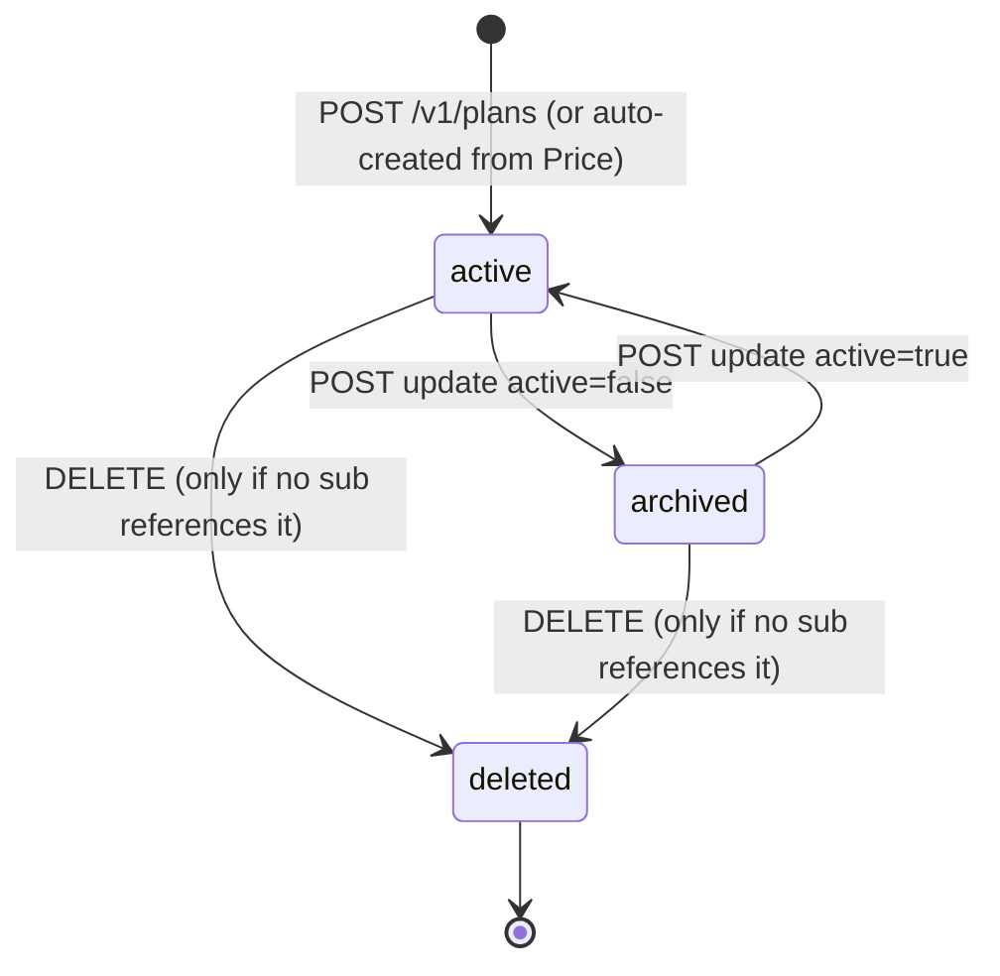
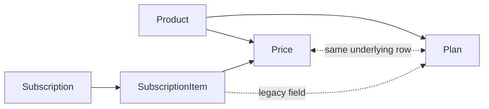

# Plan (legacy)

> API resource: `plan` · API version: `2026-04-22.dahlia` · Category: [Billing](README.md)

> **Status: legacy.** New code should use [Price](../03-products/prices.md) with a `recurring` block. Plan is preserved for backwards compatibility and is *not* being removed, but every Plan field has a Price equivalent and Stripe internally represents both as the same row.

## What it is

A `Plan` is the pre-2018 way of describing recurring pricing. It bundles together: an amount, a currency, a billing interval (`day | week | month | year`), an interval count, optional trial days, optional usage-based config, and a foreign key to a [Product](../03-products/products.md).

Architecturally, a Plan is a **view over a Price** with `recurring` set. Creating a Plan via `POST /v1/plans` creates a Price under the hood with the equivalent `recurring` config, and that single underlying row is then projectable in either shape. `subscription.plan` is populated alongside `subscription.items[].price` for any Subscription whose item refers to a recurring Price.

In modern Stripe, a Price unifies one-time and recurring pricing in one object; Plan was the old "recurring-only" predecessor.

## Why it exists

Historical accident, kept alive for compatibility:

- Prior to 2018, recurring billing was modeled by Plan and one-time billing was modeled by SKU. Stripe unified both under Price.
- Many production integrations were written against `plan=plan_…` references and webhook payloads that include `subscription.plan`. Removing the Plan API would break them silently.
- Some third-party tooling (older Zapier integrations, accounting connectors, internal scripts) still constructs Plans.

So Plan persists as an alias surface. You should never *create* a Plan from new code — but you'll see them in API responses and you may inherit a codebase full of them.

## Lifecycle & states

Plan has a tiny lifecycle: created → optionally archived (`active=false`) → optionally deleted.



- **`active: true`** — usable for new subscriptions; appears in `/v1/plans` listings by default.
- **`active: false`** (archived) — not selectable in Checkout/portal flows; existing subs continue to bill against it; hidden from default lists.
- **deleted** — only allowed if **no Subscription** references the plan (or its underlying Price). Stripe rejects the delete otherwise. Modern guidance: archive, never delete.

Because Plan is a view over Price, archiving a Plan archives the underlying Price (and vice-versa). The two are the same row.

## Anatomy of the object

Mostly mirrors a Price's recurring shape.

### Identity

| Field | Notes |
|---|---|
| `id` | `plan_…` (or `price_…` if created via the Prices API — both ID prefixes are valid). |
| `object` | `"plan"` |
| `livemode`, `metadata`, `created`, `nickname` | standard. |
| `active` | Boolean. |
| `product` | `prod_…`. Required. |

### Money

| Field | Notes |
|---|---|
| `amount` | Integer, smallest currency unit. **Null for tiered plans** — see `tiers`. |
| `amount_decimal` | String, supports sub-cent precision (for usage pricing). |
| `currency` | ISO-4217 lowercase. |

### Recurrence

| Field | Notes |
|---|---|
| `interval` | `day | week | month | year`. |
| `interval_count` | Default `1`. `interval=month, interval_count=3` = quarterly. Stripe enforces a maximum total window (effectively ~1 year combined). |
| `trial_period_days` | Days of free trial when this plan is added to a sub (overridable per-sub). |

### Usage / metering (legacy)

| Field | Notes |
|---|---|
| `usage_type` | `licensed` (fixed quantity) or `metered` (quantity from [UsageRecords](usage-records-legacy.md)). |
| `aggregate_usage` | For metered: `sum | last_during_period | last_ever | max`. How per-period quantity is rolled up. |
| `billing_scheme` | `per_unit` (price × quantity) or `tiered` (use `tiers[]`). |
| `tiers` | Array of `{ flat_amount, unit_amount, up_to }`. Defined when `billing_scheme=tiered`. |
| `tiers_mode` | `graduated` (apply each tier to its slice of quantity) or `volume` (whole quantity at the tier its total falls into). |
| `transform_usage.divide_by` / `.round` | Pre-tier quantity transform (e.g. report bytes, bill per GB → divide_by=1_000_000_000, round=up). |

### Misc

| Field | Notes |
|---|---|
| `nickname` | Internal label, not shown to customers. |
| `metadata` | standard. |

## Relationship to Price



- A Plan **is** a Price with `type=recurring`. Creating one creates the other.
- A SubscriptionItem references a Price via `price=price_…` and exposes the same value as `plan=plan_…` (both surfaces of the same row).
- Updating a Plan field (`active`, `metadata`, `nickname` — the writable ones) updates the underlying Price.
- The Plan API rejects price-only fields (`lookup_key`, etc.). To use those, use the Price API.

## Common workflows

### 1. Migrate from Plan to Price (the only workflow you should be doing)

Old code:

```http
POST /v1/subscriptions
  customer=cus_…
  items[0][plan]=plan_abc
```

New code:

```http
POST /v1/subscriptions
  customer=cus_…
  items[0][price]=price_abc
```

The same Subscription, same billing behavior. Webhook payloads will still include `plan` for backwards-compat consumers; just stop *reading* it.

### 2. Look up "what Price does this Plan correspond to?"

It's the same ID-space row. `plan_abc` and `price_abc` may share an ID; if they don't, retrieve the Plan and inspect — `POST /v1/plans` from years ago generated `plan_…`-prefixed IDs, while plans created through the modern Prices API show `price_…` even when fetched via `/v1/plans`.

```http
GET /v1/plans/plan_abc
# → object: "plan", id: "plan_abc", product: "prod_…"

GET /v1/prices/plan_abc
# → object: "price", id: "plan_abc", recurring: { interval, … }
```

Both endpoints accept either ID.

### 3. List recurring Prices via the Plan API

```http
GET /v1/plans?active=true&limit=100
```

Returns every recurring Price as a Plan-shaped row. Useful when migrating: enumerate, dual-write to your DB with both IDs, then switch reads.

### 4. Create one (avoid in new code)

```http
POST /v1/plans
  amount=1000
  currency=usd
  interval=month
  product=prod_…
  nickname="Pro monthly"
```

Modern equivalent — do this instead:

```http
POST /v1/prices
  unit_amount=1000
  currency=usd
  recurring[interval]=month
  product=prod_…
  nickname="Pro monthly"
```

### 5. Archive

```http
POST /v1/plans/plan_abc
  active=false
```

Existing subs continue billing.

## Webhook events

Plans emit Plan-shaped events; the same row also emits Price events. Both sets are reliable; new listeners should subscribe to the Price events and stop reading the Plan ones.

| Event | Fires when | Listener typically does |
|---|---|---|
| `plan.created` | New Plan/Price (recurring) created. | Sync to your local catalog. |
| `plan.updated` | `active`, `metadata`, `nickname` changed. | Re-sync. |
| `plan.deleted` | Plan deleted (rare; usually archived). | Remove from catalog. |
| `price.created` / `price.updated` / `price.deleted` | Modern equivalent. **Prefer these.** | Same. |

Stripe will typically emit *both* `plan.*` and `price.*` for the same change. If you subscribe to both, expect duplicate work and dedupe by `data.object.id`.

## Idempotency, retries & race conditions

- `POST /v1/plans` accepts `Idempotency-Key`. Use it.
- Plan/Price are the same row, so simultaneous edits via both APIs race the same way any concurrent updates do — last write wins on the field.
- Deletion races: archive instead. Deletion fails if any Subscription still references the row (active or canceled-but-retained for invoice history).

## Test-mode tips

- Plans are not time-driven; TestClock is irrelevant to the Plan itself, only to the Subscriptions consuming it.
- `stripe trigger plan.created` for fixture flow.
- When seeding test data, prefer creating Prices and letting the Plan view come along for the ride.

## Connect considerations

- Plans are scoped to one account. Connected accounts have their own Plans/Prices.
- Cross-account references aren't a thing — a platform Plan cannot back a connected-account Subscription. Each account creates its own pricing.
- For platforms that want shared product catalogs, you typically copy-create Prices on each connected account at onboarding rather than sharing IDs.

## Common pitfalls

- **Creating new Plans in 2026.** Don't. Use Price. Plan exists only to keep old code running.
- **Reading `subscription.plan` in new handlers.** Read `subscription.items.data[i].price` instead. The `plan` field is populated only when there's exactly one item; multi-item subs don't have a single canonical "plan."
- **Assuming `plan_…` and `price_…` IDs are different rows.** They're the same row exposed under two API shapes. A Plan retrieved by its `price_…` ID returns the Plan view; same for the inverse.
- **Trying to give a Plan one-time pricing.** Plans are recurring-only by definition. For one-time, use Price.
- **Deleting Plans referenced by canceled subscriptions.** Stripe still rejects this in many cases — canceled subs keep their reference for historical invoices. Archive and move on.
- **Mixing `plan` and `price` parameters in the same item.** Stripe accepts one or the other, not both. Mixing throws `parameter_invalid_combination` (or similar).
- **Using the Plan API to discover product catalog.** Use `/v1/prices` — it returns one-time and recurring; `/v1/plans` only returns recurring. New catalog UI built on `/v1/plans` will silently omit one-time products.
- **Building a "is this a Plan or a Price?" branch in your code.** It's always a Price. The Plan view is just a compatibility shape.

## Further reading

- [API reference: Plan](https://docs.stripe.com/api/plans/object) — legacy reference.
- [API reference: Price](https://docs.stripe.com/api/prices/object) — modern equivalent.
- [Migrate from Plans to Prices](https://docs.stripe.com/billing/subscriptions/migrate-prices) — Stripe's official migration guide.
- [Price](../03-products/prices.md) — the deep guide for the modern object.
- [Subscription](subscriptions.md) — how Plans/Prices are consumed.
