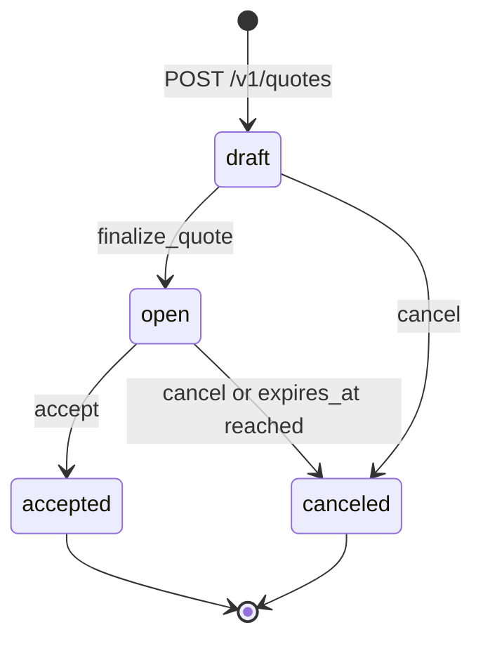

# Quote

> API resource: `quote` · API version: `2026-04-22.dahlia` · Category: [Billing](README.md)

## What it is

A `Quote` is a **draft proposal of pricing and terms** that, when accepted by the customer, materializes into an [Invoice](invoices.md), a [Subscription](subscriptions.md), or a [SubscriptionSchedule](subscription-schedules.md). Stripe handles the PDF, the hosted acceptance page, the numbering, the optional emailing, and the conversion to billable objects.

Think of a Quote as the pre-sales artifact: the document a sales rep sends ("here's what your contract would look like") and the legally-tracked record of when the customer agreed.

## Why it exists

Without it, "send a sales proposal that becomes a subscription on accept" is a multi-system tangle: a doc generator (PDF), an esign provider (acceptance), a manual-when-they-sign API call to create the Subscription, plus reconciliation between the proposed and actual amounts. Quote folds all of that into Stripe:

- **Branded PDF** with line items, totals, taxes, discounts.
- **Hosted acceptance page** the customer clicks through (with terms and signature capture, depending on configuration).
- **Atomic conversion** on accept — Stripe creates the downstream Invoice/Subscription/Schedule with exactly the proposed terms.
- **Quote revisions.** New quote can supersede an old one (`from_quote`) with version tracking.
- **Connect-aware.** Application fees and transfer destinations propagate to the resulting Subscription.

When you want a CRM/CPQ-lite flow without standing up a separate proposal system, Quote is the answer.

## Lifecycle & states



- **`draft`** — being assembled. Everything is mutable: line items, customer, expiration, header/footer, discount, tax. No PDF yet (or a watermarked draft preview).
- **`open`** — finalized. PDF is generated, `number` is assigned, `hosted_quote_url` is populated. **Lines are now frozen.** Customer can accept, you can cancel, or `expires_at` will auto-cancel.
- **`accepted`** — terminal. The customer (or you, on their behalf) accepted. Stripe atomically created the downstream `invoice`, `subscription`, or `subscription_schedule`. Their IDs populate on the quote.
- **`canceled`** — terminal. Either you canceled or it expired. No money moved, no downstream object created. Quote number stays reserved.

There is no "rejected" state — customer non-action just leaves it in `open` until expiry, then `canceled`. There's no "expired" terminal status; expiry is `canceled` with `cancellation_reason` indicating expiry (verify exact field name).

## Anatomy of the object

### Identity & numbering

| Field | Notes |
|---|---|
| `id` | `qt_…`. |
| `object` | `quote`. |
| `number` | Customer-facing quote number (e.g. `Q-0001`). Assigned at finalize. Drafts are `null`. Reserved forever — even canceled quotes keep their number. |
| `status` | `draft | open | accepted | canceled`. |
| `created`, `livemode`, `metadata` | standard. |

### Relations

| Field | Notes |
|---|---|
| `customer` | `cus_…`. Required at finalize (drafts can be customer-less briefly). |
| `from_quote` | `{ quote: qt_…, is_revision: true }` if this quote is a revision of an earlier one. Lets you keep the lineage when re-quoting after negotiation. |
| `invoice` | `in_…` populated after `accept` if the quote produced a one-off invoice. |
| `subscription` | `sub_…` populated after `accept` if recurring. |
| `subscription_schedule` | `sub_sched_…` populated after `accept` if multi-phase. |
| `test_clock` | `clock_…` if the customer is on a test clock. |

### Line items

| Field | Notes |
|---|---|
| `line_items` | Like `invoice.lines`: `{ data: [...] }` with each line carrying a Price + quantity (+ optional discounts/tax_rates). Editable on draft, frozen on open. Listed via `GET /v1/quotes/qt_…/line_items`. |

### Money

| Field | Notes |
|---|---|
| `currency` | Lowercase ISO. |
| `amount_subtotal` | Sum of line subtotals before discounts/taxes. |
| `amount_total` | Final amount the customer would owe. |
| `total_details` | `{ amount_discount, amount_tax, amount_shipping, breakdown: { discounts, taxes } }`. |
| `computed.upfront` | `{ amount_subtotal, amount_total, total_details, line_items }`. The "due-at-acceptance" amount (one-off lines + first subscription cycle, depending on settings). |
| `computed.recurring` | `{ amount_subtotal, amount_total, total_details, interval, interval_count }` for the recurring portion of the quote. **Important** for showing customers "$X today, then $Y/month." |

### Subscription configuration

| Field | Notes |
|---|---|
| `subscription_data` | `{ description, effective_date, trial_period_days, metadata, billing_cycle_anchor, ... }`. Used when accept produces a Subscription. |
| `subscription_data_overrides` (newer) | Phase-level overrides for multi-phase quotes. |
| `subscription_schedule_data` (when applicable) | Multi-phase recurring quote configuration. Triggers creation of a SubscriptionSchedule on accept instead of a plain Subscription. |

### Tax

| Field | Notes |
|---|---|
| `default_tax_rates` | Apply to all lines lacking their own. |
| `automatic_tax.enabled` | Stripe Tax compute on. |
| `automatic_tax.status` | `requires_location_inputs | complete | failed`. Quotes can't finalize if tax fails. |

### Discounts

| Field | Notes |
|---|---|
| `discounts` | Quote-level coupons or promotion codes applied to all lines. |

### Display & delivery

| Field | Notes |
|---|---|
| `header` | Headline shown at top of PDF. |
| `description` | Body text on PDF. |
| `footer` | Footer text. |
| `pdf` | Persistent download URL (after finalize). |
| `hosted_quote_url` | Stripe-hosted page where the customer accepts. |

### Lifecycle controls

| Field | Notes |
|---|---|
| `expires_at` | Unix seconds when the quote auto-cancels if still `open`. Default: 30 days from finalize (configurable). |
| `collection_method` | `charge_automatically | send_invoice` for the resulting invoice/subscription. |
| `invoice_settings` | Settings forwarded to the resulting Invoice (days_until_due, etc.). |

### Connect

| Field | Notes |
|---|---|
| `application_fee_amount` / `application_fee_percent` | Platform's cut on the resulting invoice/subscription. |
| `transfer_data.destination` | Where to route net funds. |

## Relationships

```mermaid
graph LR
    QT[Quote] --> CUS[Customer]
    QT --> LI[QuoteLineItem]
    LI --> PRC[Price]
    QT -.-> FROM[Quote (predecessor)]
    QT ==> INV[Invoice]
    QT ==> SUB[Subscription]
    QT ==> SS[SubscriptionSchedule]
    QT -.-> COUP[Coupon]
```

A Quote always has one Customer (post-finalize) and can produce *one* of an Invoice, Subscription, or SubscriptionSchedule on accept (determined by the lines and `subscription_data` / `subscription_schedule_data` configuration).

## Common workflows

### 1. One-off sale: draft → finalize → email → accept → invoice

```http
# 1. Draft
POST /v1/quotes
  customer=cus_…
  line_items[0][price]=price_one_time_widget
  line_items[0][quantity]=10
  description=Annual hardware bundle
  expires_at=1746489600

# 2. Finalize (PDF + URL generated; status → open)
POST /v1/quotes/qt_…/finalize_quote

# 3. (Optional) Stripe emails the PDF to the customer
POST /v1/quotes/qt_…  # set customer email if needed; or your own send

# 4. Customer clicks accept on hosted_quote_url, OR you accept on their behalf
POST /v1/quotes/qt_…/accept
  # → Quote.invoice = in_…, status = accepted
```

### 2. Recurring subscription quote

```http
POST /v1/quotes
  customer=cus_…
  line_items[0][price]=price_pro_monthly
  line_items[0][quantity]=15
  subscription_data[trial_period_days]=14
  subscription_data[description]=Pro tier — 15 seats
```

After accept: `quote.subscription = sub_…` is created with the trial.

### 3. Multi-phase quote (year 1 promo, year 2 full)

```http
POST /v1/quotes
  customer=cus_…
  line_items[0][price]=price_base_annual
  subscription_data[effective_date]=now
  # configure subscription_schedule_data for the multi-phase ramp
```

(Hedge: exact param shape for multi-phase quote configuration is an evolving area; check the current API reference.) After accept: `quote.subscription_schedule = sub_sched_…` is created.

### 4. Quote revision (renegotiation)

```http
POST /v1/quotes
  from_quote[quote]=qt_old
  from_quote[is_revision]=true
  line_items[0][price]=price_negotiated
```

The new quote has its own number, but `from_quote` records the lineage. The old quote stays `open` (or `canceled` it manually) — Stripe doesn't auto-cancel the predecessor.

### 5. Cancel an unaccepted quote

```http
POST /v1/quotes/qt_…/cancel
```

`status → canceled`. No effect on any downstream objects (there are none yet).

### 6. Preview line items before finalize

```http
GET /v1/quotes/qt_…/line_items
```

Useful for an internal review UI before sending to the customer.

### 7. Download PDF programmatically

```
GET <quote.pdf>     # signed URL, persistent
```

Or fetch via `GET /v1/quotes/qt_…/pdf` (depending on API version).

## Webhook events

| Event | Fires when | Listener typically does |
|---|---|---|
| `quote.created` | Draft created. | Add to internal "open quotes" list. |
| `quote.finalized` | Status moved draft → open. | Send your own custom email if not using Stripe's; update CRM. |
| `quote.accepted` | Status moved open → accepted. | Provision service. **Read `quote.subscription` / `quote.invoice` to find downstream IDs.** |
| `quote.canceled` | Open quote canceled or expired. | Update CRM "deal lost / expired"; re-engage flow. |
| `quote.will_expire` | Configurable lead before `expires_at`. | Email the customer "your quote expires in 3 days." |

## Idempotency, retries & race conditions

- All mutating endpoints accept `Idempotency-Key`. Use it on `accept` especially — accidentally double-accepting is harmless (Stripe rejects with `quote_already_accepted`) but cleaner with idempotency.
- The `accept` step is **atomic**: either the downstream Subscription/Invoice is created or the quote remains `open` with an error. No half-states.
- If `automatic_tax.status=failed` (customer address incomplete), `finalize_quote` errors. Surface the error to your sales UI — customer needs to update their address.
- Webhook ordering: `quote.accepted` may arrive before or after `customer.subscription.created` (when the downstream is a Subscription). Don't rely on order; look up by ID.
- A revision (`from_quote`) doesn't auto-cancel the predecessor. If your sales process requires "only one open quote per deal," cancel the old one yourself.

## Test-mode tips

- The full draft → finalize → accept flow works end-to-end in test mode. Use `cus_…` test customers.
- Stripe Tax in test mode produces real-shape tax math — use it to verify per-line tax on quote PDFs.
- For recurring quotes, attach the customer to a [TestClock](test-clocks.md) before creating the quote so the resulting subscription is on the clock and you can advance through its lifecycle.
- `stripe trigger quote.accepted` produces a fixture event; use the real flow if you need the downstream Subscription/Invoice to actually exist.

## Connect considerations

- Quote lives on the same account as the Customer. Pass `Stripe-Account: acct_…` for connected-account quotes.
- `application_fee_percent` / `application_fee_amount` set on the quote propagate to the resulting Subscription/Invoice — the platform's cut is fixed at quote-accept time.
- `transfer_data.destination` similarly propagates.
- A Standard connected account that issues quotes is fully responsible for them; the platform can't accept on their behalf.

## Common pitfalls

- **Forgetting to call `finalize_quote`.** A draft quote isn't a quote — there's no PDF, no number, no `hosted_quote_url` for the customer. Surfaces as "I created the quote and the URL is null."
- **Not handling `quote.will_expire`.** Customers forget. The lead-time webhook is your nudge to send a follow-up. Without it, perfectly good deals expire silently.
- **Letting `automatic_tax.status: failed` block finalize.** Means customer address is incomplete. Surface to your sales rep so they can update the customer record.
- **Editing a quote that's `open`.** Lines are frozen. To change pricing, create a revision (`from_quote`) and cancel the original.
- **Treating `quote.pdf` as the only proof of acceptance.** The legal record of acceptance is `quote.status=accepted` plus `status_transitions` timestamps; the PDF is a snapshot of terms, not the signature.
- **Accepting on behalf of the customer without a paper trail.** Stripe lets you `POST /v1/quotes/qt_…/accept` server-side, but for legal certainty you usually want the customer to click through `hosted_quote_url` themselves. Use server-accept only for B2B contexts where you have a separate signed agreement.
- **Assuming a recurring quote always creates a Subscription.** If you've configured `subscription_schedule_data` for multi-phase, accept produces a SubscriptionSchedule (and an underlying Subscription). Read all three downstream fields after accept.
- **Setting `expires_at` to far in the future "to be safe."** Stale open quotes pile up and confuse the sales pipeline. Use realistic expiries (~30 days) and let `quote.will_expire` drive nudges.

## Further reading

- [API reference: Quote](https://docs.stripe.com/api/quotes/object)
- [Quotes guide](https://docs.stripe.com/quotes)
- [Quote acceptance flow](https://docs.stripe.com/quotes/overview#quote-acceptance)
- [Subscription](subscriptions.md) — common downstream object
- [SubscriptionSchedule](subscription-schedules.md) — for multi-phase quote outputs
- [Invoice](invoices.md) — for one-off quote outputs
- State diagram in [_meta/state-machines.md](../_meta/state-machines.md#quote)
