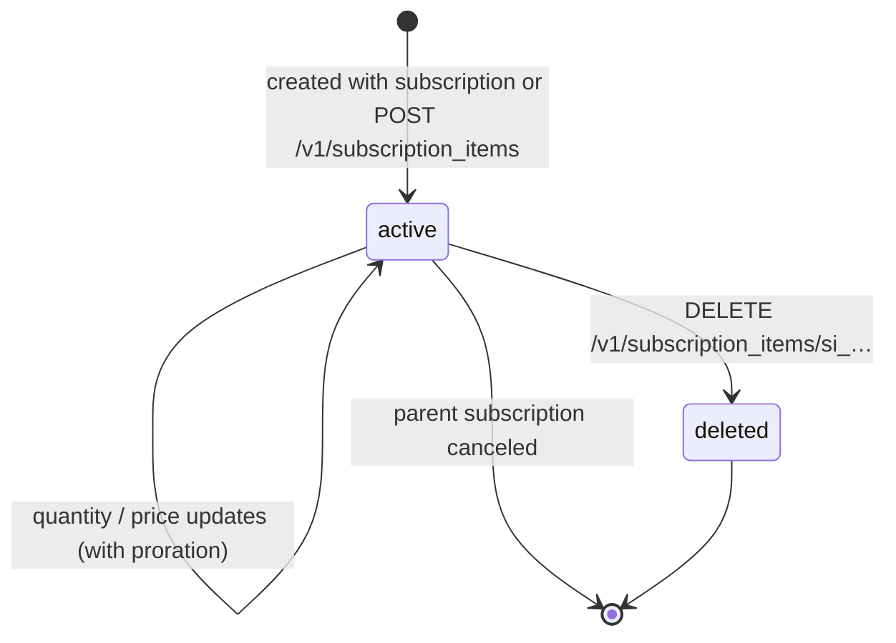
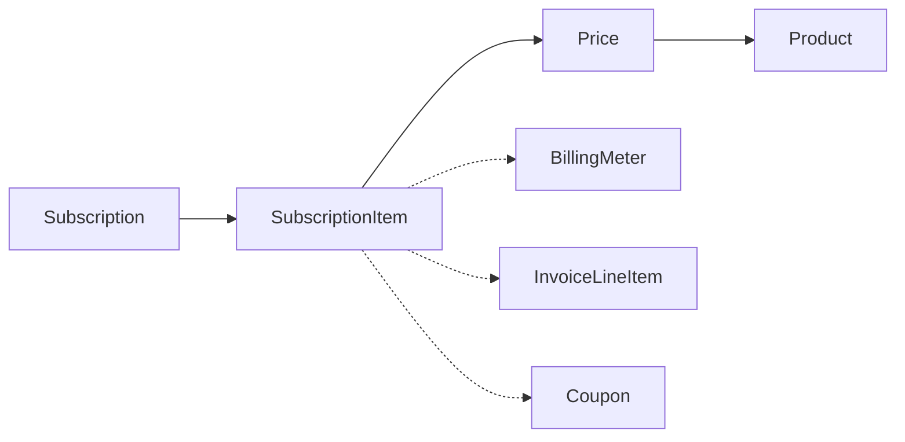

# SubscriptionItem

> API resource: `subscription_item` · API version: `2026-04-22.dahlia` · Category: [Billing](README.md)

## What it is

A `SubscriptionItem` is **one [Price](../03-products/prices.md) + one quantity** inside a [Subscription](subscriptions.md). Subscriptions own one or more SubscriptionItems; each item is what actually gets billed at renewal.

If a Subscription is "the customer pays us recurring money," a SubscriptionItem is the line of *what specifically* they pay. A SaaS plan with three add-ons is one Subscription with four SubscriptionItems (base + three add-ons), each tied to its own Price.

## Why it exists

The Subscription is the *envelope* (lifecycle, status, billing cycle, dunning). The SubscriptionItem is the *content* (what's actually being charged for and how much). Splitting them lets you:

- **Mix Prices on one bill.** Tiered SaaS: base seat $10/user/month, premium support $50/month flat, storage $0.10/GB. Three SubscriptionItems, one renewal invoice.
- **Edit billing without churning the customer.** Change quantity, swap Price, add an item — all done at the SubscriptionItem level without canceling/recreating the Subscription. Status stays `active`, customer keeps service.
- **Mix recurring cadences.** Annual base item + monthly metered overage item, both on one Subscription. (Cadences must be compatible — see pitfalls.)
- **Hook metered billing.** A SubscriptionItem with a metered (`recurring.usage_type=metered`) Price is the anchor that [BillingMeter](billing-meters.md) usage events charge against.

> **The big mental shift:** Most edits to a Subscription's billing should be made on its SubscriptionItems, not the Subscription itself. The Subscription's top-level fields are about lifecycle (cancellation, trial, dunning); the SubscriptionItem's fields are about pricing.

## Lifecycle & states

SubscriptionItems don't have a status enum. Their lifecycle is implicit:



- **active** — currently part of a non-canceled subscription. Will be billed at next renewal.
- **deleted** — removed from the subscription. The SubscriptionItem object disappears (you can't retrieve it after delete). Any proration credit/charge from removal is recorded on the Subscription's next invoice.
- When the parent Subscription cancels, its SubscriptionItems implicitly retire — they remain readable in the Subscription's `items` array but no further billing happens.

## Anatomy of the object

### Identity

| Field | Notes |
|---|---|
| `id` | `si_…`. **This is the ID you use** when updating quantity, swapping price, or referencing the item from line-level proration. |
| `object` | `subscription_item`. |
| `created`, `metadata` | standard. |

### Relations

| Field | Notes |
|---|---|
| `subscription` | `sub_…`. Required. Immutable. |
| `price` | `price_…`. The catalog Price driving recurring amount + currency + interval. Swappable via update. |
| `plan` | Legacy mirror of `price` for old Plans-API integrations. Reading it is fine; new code should use `price`. |

### Quantity & billing

| Field | Notes |
|---|---|
| `quantity` | Integer ≥ 0. Multiplier on `price.unit_amount`. Not present (and not allowed) for metered prices. |
| `billing_thresholds.usage_gte` | Optional integer. When usage on this item ≥ this value, Stripe immediately generates an invoice for the subscription (instead of waiting for the period end). Useful for capping invoice frequency on heavy-usage items. |

### Tax & discounts

| Field | Notes |
|---|---|
| `tax_rates` | Per-item `txr_…` overrides. Take precedence over Subscription / Customer defaults. |
| `discounts` | Per-item discount array (coupon or promotion code). Stack with subscription-level discounts per Stripe's allocation rules. |

### Trial

| Field | Notes |
|---|---|
| `trial.end_behavior` / related | Per-item trial extensions on add. Hedge: most trial config lives at the Subscription level; per-item trials are a newer narrower concept. |

## Relationships



- A SubscriptionItem belongs to exactly one Subscription. The Subscription's `items.data` is the list.
- It always has exactly one Price. To "change the plan," update `price` on the SubscriptionItem (or delete + add).
- Each renewal generates an [InvoiceLineItem](invoice-line-items.md) with `type: subscription` and `subscription_item: si_…`.
- For metered Prices, the SubscriptionItem is the link between usage and billing — usage events submitted to a [BillingMeter](billing-meters.md) (with the customer ID) are aggregated and applied to whichever subscription_item has that meter's price.

## Common workflows

### 1. Create a Subscription with multiple items

```http
POST /v1/subscriptions
  customer=cus_…
  items[0][price]=price_base_seat
  items[0][quantity]=10
  items[1][price]=price_premium_support
  items[2][price]=price_storage_metered
  payment_behavior=default_incomplete
```

Three SubscriptionItems are created in one shot. (Note `items[2]` has no `quantity` — metered Prices don't take one.)

### 2. Add an item to an existing subscription

```http
POST /v1/subscription_items
  subscription=sub_…
  price=price_addon
  quantity=1
  proration_behavior=always_invoice
```

`always_invoice` charges the prorated amount immediately. `create_prorations` (default) accumulates into the next renewal. `none` skips proration entirely.

### 3. Change quantity (seat-based billing)

```http
POST /v1/subscription_items/si_…
  quantity=15
  proration_behavior=always_invoice
```

This is the canonical "user added 5 seats" flow. **Do not POST to /v1/subscriptions to change quantity** — go through the item.

### 4. Swap price (upgrade/downgrade plan)

```http
POST /v1/subscription_items/si_…
  price=price_pro_tier
  proration_behavior=always_invoice
```

Stripe computes the proration: refund unused portion of old price, charge prorated new price. The result is one or two proration lines on the next invoice (or an immediate one with `always_invoice`).

### 5. Remove an item

```http
DELETE /v1/subscription_items/si_…
  proration_behavior=create_prorations
  clear_usage=true   # for metered: discard unbilled usage
```

If this is the *last* item on the subscription, you can't delete it — cancel the subscription instead.

### 6. Per-item discount

```http
POST /v1/subscription_items/si_…
  discounts[0][coupon]=COUPON_PROMO
```

Discount applies only to lines from this item, not the rest of the subscription.

### 7. Report usage on a metered item

The modern path uses [BillingMeter](billing-meters.md) events keyed by customer ID + meter event name:

```http
POST /v1/billing/meter_events
  event_name=api_calls
  payload[stripe_customer_id]=cus_…
  payload[value]=42
```

Stripe aggregates and applies to whichever SubscriptionItem on that customer has the meter's Price. The legacy `POST /v1/subscription_items/si_…/usage_records` API still works but is deprecated for new integrations; see [usage-records-legacy](usage-records-legacy.md).

## Webhook events

SubscriptionItems do not have dedicated `subscription_item.*` events. Watch the parent Subscription:

| Event | Tells you about SI changes |
|---|---|
| `customer.subscription.updated` | Items array changed (add / remove / quantity / price). Inspect `previous_attributes.items` for the diff. |
| `customer.subscription.created` | Initial items materialized. |
| `invoice.created` / `invoice.upcoming` | Items will produce these lines on the upcoming invoice. |
| `customer.subscription.pending_update_applied` | A queued item change just took effect (paid an outstanding invoice). |

## Idempotency, retries & race conditions

- `POST /v1/subscription_items` and updates accept `Idempotency-Key`. Use them — accidentally adding two copies of an add-on item is silent and immediate.
- **Pending update gotcha.** If the subscription's `latest_invoice` is unpaid, item changes go into `subscription.pending_update` instead of applying. Your code POSTs `quantity=15` and gets a successful response, but reads the subscription back and sees `quantity=10`. Inspect `pending_update.subscription_items` — the change is queued there until the customer pays.
- Concurrent edits on the same item are last-writer-wins. Stripe doesn't merge. Serialize from a single worker if your app concurrently adjusts seats.
- Removing an item with `clear_usage=false` (metered) leaves unbilled usage that will be billed *on the next invoice* even though the item is gone. Usually you want `clear_usage=true` unless you're explicitly trying to bill final usage.

## Test-mode tips

- A [TestClock](test-clocks.md) is the right way to verify proration math: create the sub, advance the clock partway through the cycle, change the item's `quantity` with `proration_behavior=always_invoice`, inspect the resulting invoice's lines.
- Use `GET /v1/invoices/upcoming?subscription=sub_…&subscription_items[0][id]=si_…&subscription_items[0][quantity]=20` to *preview* the proration math before committing.
- For metered testing, submit `POST /v1/billing/meter_events` with a test customer and trigger the next renewal via TestClock to see usage materialize on the invoice.

## Connect considerations

- A SubscriptionItem inherits the connected-account context of its Subscription. Pass `Stripe-Account: acct_…` on item operations.
- Per-item `tax_rates` and `discounts` apply on the connected account's books.
- `application_fee_percent` lives on the Subscription, not items — you can't fee-share differently per item.

## Common pitfalls

- **Editing the Subscription to change quantity / price.** That endpoint accepts `items[0][id]=si_…&items[0][quantity]=N` and works, but the modern, clearer pattern is `POST /v1/subscription_items/si_…`. Bonus: it doesn't accidentally clobber other items by omission.
- **Forgetting `proration_behavior`.** Default `create_prorations` accumulates into next invoice. Many teams expect immediate billing → use `always_invoice`. Read the Subscription's `proration_behavior` field as the global default.
- **Adding a quantity to a metered Price.** Errors. Metered Prices are quantity-less; usage drives the amount.
- **Adding incompatible-cadence items.** All non-metered items on one Subscription must share the same `recurring.interval` (e.g., all monthly). Mixing monthly + annual non-metered items in one sub errors. (Metered items have more flexibility, but verify.)
- **Deleting the last item.** Errors with `subscription_must_have_items`. Cancel the subscription instead.
- **Setting `clear_usage=false` when removing a metered item.** Leaves uncharged usage that surprises the customer on the next bill.
- **Treating per-item `discounts` as additive with subscription-level discounts.** Stripe applies them per its discount-allocation rules, which can produce non-obvious totals. Preview with `GET /v1/invoices/upcoming` before committing.
- **Updating during an unpaid invoice and not noticing the change went into `pending_update`.** Surfaces as "I changed the quantity and it didn't take." Always re-read the subscription after a critical edit and check `pending_update`.

## Further reading

- [API reference: SubscriptionItem](https://docs.stripe.com/api/subscription_items/object)
- [Manage subscription items](https://docs.stripe.com/billing/subscriptions/multiple-products)
- [Proration](https://docs.stripe.com/billing/subscriptions/prorations)
- [Subscription](subscriptions.md) — the parent
- [BillingMeter](billing-meters.md) — for metered usage charging
- [Price](../03-products/prices.md) — what each item references
