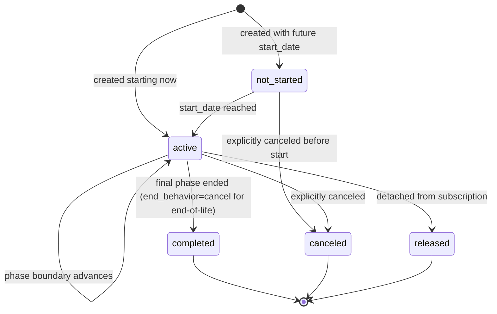
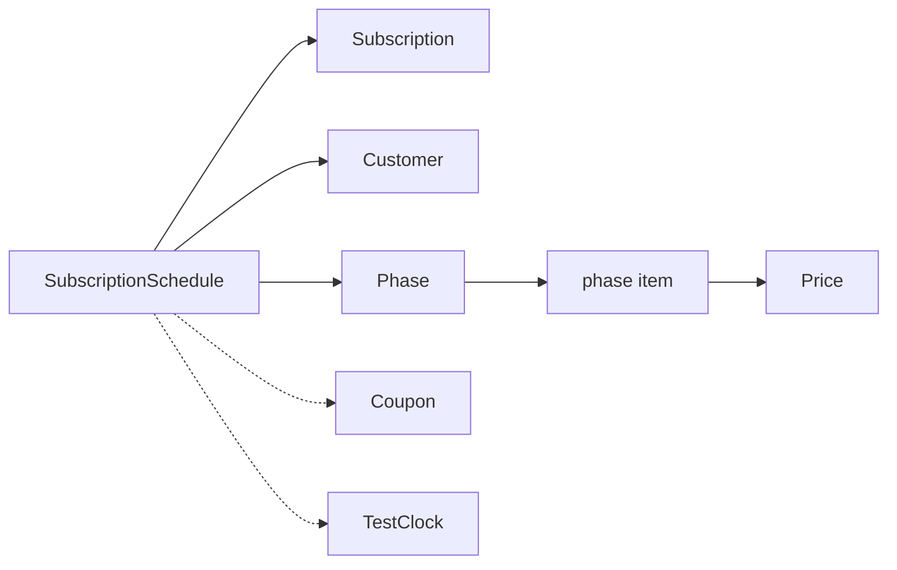

# SubscriptionSchedule

> API resource: `subscription_schedule` · API version: `2026-04-22.dahlia` · Category: [Billing](README.md)

## What it is

A `SubscriptionSchedule` is a **multi-phase script** that drives how a [Subscription](subscriptions.md) evolves over time. It's a sequence of `phases[]`, each describing the price/quantity/discounts/duration of one chapter of the subscription's life. Stripe walks the phases automatically, transitioning the underlying subscription at each phase boundary.

The Subscription is "the customer is paying us recurring." The Schedule is "...and here's the agreed-upon roadmap of how that pricing will change."

## Why it exists

A bare Subscription is mutable but ephemeral — to express "trial 14 days → discount 20% off for 3 months → full price thereafter, then auto-cancel after 12 months total" you'd have to script your own cron of API calls timed to phase boundaries. Crons drift, miss DST, and silently fail.

SubscriptionSchedule is Stripe's "we'll run that cron for you, deterministically." Use it when:

- **Promotional ramps.** "30% off for 3 months, then standard rate."
- **Fixed-term contracts.** "12 months committed at this price, then auto-cancel" or "...then auto-renew at next year's price."
- **Scheduled price changes.** "Bump from price_v1 to price_v2 on Jan 1 with 30 days notice."
- **Annual contracts with mid-term changes.** "Year 1 base plan, year 2 bumps to pro tier."
- **Reseller / channel deals.** Bulk-discounted N renewals expiring back to standard pricing.

When a Schedule is attached to a Subscription, **edits to billing should flow through the Schedule's phases**, not the Subscription's items. Editing the underlying Subscription directly during a managed phase fights the Schedule.

## Lifecycle & states



- **`not_started`** — created with a future `start_date`. No subscription yet (or the subscription exists but is in a "scheduled" pre-active state). Phases are mutable.
- **`active`** — at least one phase is currently in effect. The `current_phase` field points to which one. The schedule is *managing* the subscription. You can edit `phases[]` after the current phase, but not the current phase itself in destructive ways.
- **`completed`** — all phases ran to completion. The `end_behavior` was `release` and the subscription continues unmanaged, OR `cancel` and the subscription was canceled.
- **`canceled`** — schedule was explicitly canceled. The underlying subscription is also canceled (subscription cancellation is the typical effect).
- **`released`** — schedule was detached from its subscription. The schedule object stops controlling anything. The **subscription continues** with whatever state it was in at release time. Useful when you've decided to manage the sub manually going forward.

## Anatomy of the object

### Identity

| Field | Notes |
|---|---|
| `id` | `sub_sched_…`. |
| `object` | `subscription_schedule`. |
| `created`, `livemode`, `metadata` | standard. |

### Relations

| Field | Notes |
|---|---|
| `subscription` | `sub_…` of the managed Subscription. Null while `not_started` if `start_date` is future and Stripe hasn't created the sub yet. |
| `customer` | `cus_…`. Required. |
| `test_clock` | `clock_…` if customer is on a test clock. |

### Status & boundaries

| Field | Notes |
|---|---|
| `status` | `not_started | active | completed | canceled | released`. |
| `current_phase` | `{ start_date, end_date }` of the in-effect phase. Null when `not_started` or terminal. |
| `end_behavior` | `release | cancel`. What happens after the final phase ends. `release` is the common default for "ramp ends, sub continues." `cancel` is for finite-term contracts. |
| `released_at`, `released_subscription`, `canceled_at`, `completed_at` | Terminal timestamps and references. |

### Phases (the meat)

`phases[]` is an ordered array. Each phase carries:

| Phase field | Notes |
|---|---|
| `start_date`, `end_date` | Unix seconds. End of phase N == start of phase N+1 (no gaps). |
| `iterations` | Alternative to `end_date` — "this phase runs for N billing cycles." |
| `items[]` | Same shape as Subscription items: `{ price, quantity, tax_rates, discounts, metadata, billing_thresholds }`. The pricing for this phase. |
| `coupon` / `discounts[]` | Phase-level discount(s). Apply to all items in this phase. |
| `default_tax_rates` | Phase-level tax rates. |
| `automatic_tax` | Stripe Tax on/off for this phase. |
| `proration_behavior` | How the boundary into this phase handles proration: `create_prorations | none | always_invoice`. |
| `billing_cycle_anchor` | `automatic | phase_start` — whether the cycle re-anchors at the phase boundary. |
| `collection_method` | `charge_automatically | send_invoice` — can change per phase. |
| `default_payment_method` | Override for this phase. |
| `transfer_data`, `application_fee_percent` | Connect — can vary per phase. |
| `add_invoice_items[]` | One-off InvoiceItems to add at phase start (e.g., setup fee on first phase). |
| `trial`, `trial_end` | Free-trial within a phase. |
| `description`, `metadata` | Per-phase free text. |

### Defaults

| Field | Notes |
|---|---|
| `default_settings` | A bag of defaults applied to phases that don't override (default_payment_method, billing_cycle_anchor, collection_method, etc.). Lets you set sub-wide settings once. |

## Relationships



A Schedule manages exactly one Subscription. The Subscription's `schedule` field points back at the Schedule when managed. Releasing severs the link in both directions.

## Common workflows

### 1. 3-month promo then full price

```http
POST /v1/subscription_schedules
  customer=cus_…
  start_date=now
  end_behavior=release
  phases[0][items][0][price]=price_base
  phases[0][coupon]=PROMO_30PCT
  phases[0][iterations]=3
  phases[1][items][0][price]=price_base
```

Three monthly invoices at 30% off, then phase rolls to full-price phase, then `release` so the sub continues at full price unmanaged.

### 2. 12-month contract, auto-cancel at end

```http
POST /v1/subscription_schedules
  customer=cus_…
  start_date=now
  end_behavior=cancel
  phases[0][items][0][price]=price_pro_annual
  phases[0][iterations]=1
```

One annual invoice, then sub cancels. (For monthly cadence: `iterations=12`.)

### 3. Mid-term plan upgrade scheduled

Customer's contract bumps from base to pro at month 6:

```http
POST /v1/subscription_schedules
  customer=cus_…
  start_date=now
  end_behavior=release
  phases[0][items][0][price]=price_base_monthly
  phases[0][iterations]=6
  phases[1][items][0][price]=price_pro_monthly
  phases[1][iterations]=6
```

### 4. Convert an existing Subscription into a Schedule

```http
POST /v1/subscription_schedules
  from_subscription=sub_…
```

Stripe creates a Schedule whose `phases[0]` mirrors the current subscription state. Then you POST updates to add future phases.

### 5. Update future phases (don't touch current)

```http
POST /v1/subscription_schedules/sub_sched_…
  phases[0]= …current phase, must be re-included verbatim…
  phases[1][items][0][price]=price_new
  phases[1][iterations]=6
```

**Critical:** the `phases` array is *replaced*, not merged. You must re-send the current phase as `phases[0]` exactly as it stands, then your edits as `phases[1+]`. Omitting the current phase will error.

### 6. Release (stop managing, let sub continue)

```http
POST /v1/subscription_schedules/sub_sched_…/release
```

Schedule → `released`. Subscription continues with current phase's pricing as its baseline. Future API edits go to the Subscription directly again.

### 7. Cancel (stop everything)

```http
POST /v1/subscription_schedules/sub_sched_…/cancel
  invoice_now=true
  prorate=true
```

Cancels both the schedule and the underlying subscription. Optional immediate invoice for unbilled usage.

## Webhook events

| Event | Fires when | Listener typically does |
|---|---|---|
| `subscription_schedule.created` | Schedule POSTed. | Persist plan-roadmap UI. |
| `subscription_schedule.updated` | Phases edited or any field changed. | Re-sync. |
| `subscription_schedule.released` | Released from sub. | Update internal state to "no longer scheduled." |
| `subscription_schedule.canceled` | Schedule + sub canceled. | Deprovision. |
| `subscription_schedule.completed` | Final phase finished naturally. | Surface "contract ended" / re-engage flow. |
| `subscription_schedule.expiring` | Approaching the final phase's end (configurable lead). | Email "your contract is about to end / will renew." |
| `subscription_schedule.aborted` | Stripe aborted the schedule (couldn't progress, e.g., terminal subscription failure during `not_started` window). | Investigate `cancellation_details` / latest_invoice. |

Plus all `customer.subscription.*` events on the managed subscription continue to fire.

## Idempotency, retries & race conditions

- All mutating endpoints accept `Idempotency-Key`. Use it.
- **Phase array semantics** are the most common race: read-modify-write the schedule when adding a phase, and another writer can clobber your read. Either serialize from one worker or use a strongly-typed local model and resync via webhooks.
- A phase boundary and a renewal-payment failure can land close together. The Schedule won't roll forward if the subscription enters `past_due` mid-transition; phases pause until recovery (or schedule aborts after dunning gives up). Watch `customer.subscription.updated` and `subscription_schedule.updated` together.
- Editing the underlying Subscription directly while the Schedule is `active` is allowed for non-pricing fields (metadata, default_payment_method) but **not for items/price/quantity** — the Schedule overwrites at the next boundary. Surface as "I changed the price on the sub and it reverted next month."

## Test-mode tips

- Use a [TestClock](test-clocks.md) attached to the customer. Advance the clock past phase boundaries to verify transitions, proration math, and the resulting invoices.
- `stripe trigger subscription_schedule.created` produces a fixture event but doesn't simulate phase progression — use the TestClock for that.
- Preview mid-schedule changes with `GET /v1/invoices/upcoming?schedule=sub_sched_…` (hedge: support varies; otherwise pass `subscription` of the managed sub).

## Connect considerations

- Schedule lives on the same account as the Customer. Pass `Stripe-Account: acct_…` for connected-account schedules.
- Per-phase `application_fee_percent` and `transfer_data` let the platform's cut change across the contract — useful for "intro promo we eat the fee, full price we take the cut."
- A platform-managed schedule on a connected account requires the connected account to have appropriate billing capabilities throughout the schedule duration; capability loss mid-schedule will abort future phases.

## Common pitfalls

- **Editing a Subscription's items while it's managed by a Schedule.** Your changes get overwritten at the next phase boundary. Edit phases on the Schedule instead, or `release` the Schedule first if you want manual control.
- **Forgetting that `phases` is a replace, not a merge.** Any update must re-send the current phase exactly. Omitting it errors; mis-spelling it silently changes the current phase.
- **Setting `end_behavior=cancel` and not realizing the customer hard-cancels at term end.** They get no auto-renewal. For "auto-renew at then-current price," use `end_behavior=release` and let the sub continue.
- **Confusing `release` with `cancel`.** `release` keeps the customer paying; `cancel` ends them. Released schedules are common; canceled ones are for "the deal is off."
- **Trying to schedule a non-Stripe-Tax tax change.** Per-phase `default_tax_rates` works; per-phase `automatic_tax.enabled` toggles work. But mid-schedule customer address changes still affect tax at finalize time, regardless of phase config.
- **Building "scheduled cancellation in 3 months" with your own cron instead of a one-phase Schedule with `end_behavior=cancel`.** Crons drift. Schedules don't.
- **Not reacting to `subscription_schedule.aborted`.** Means the schedule died mid-flight (typically because dunning escalated). Customer is now off-script — likely needs CSM follow-up.
- **Assuming releasing the schedule cancels the sub.** It doesn't. The sub continues unmanaged.

## Further reading

- [API reference: SubscriptionSchedule](https://docs.stripe.com/api/subscription_schedules/object)
- [Subscription schedules guide](https://docs.stripe.com/billing/subscriptions/subscription-schedules)
- [Managing complex subscription lifecycles](https://docs.stripe.com/billing/subscriptions/scheduled-changes)
- [Subscription](subscriptions.md) — the managed object
- [TestClock](test-clocks.md) — essential for testing phase transitions
- State diagram in [_meta/state-machines.md](../_meta/state-machines.md#subscription-schedule)
