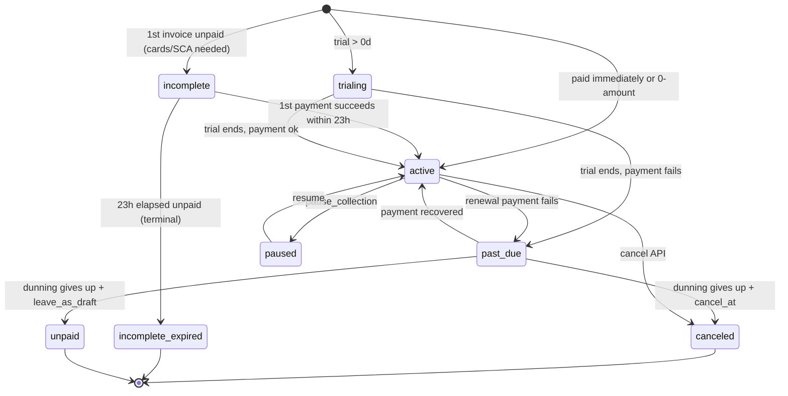
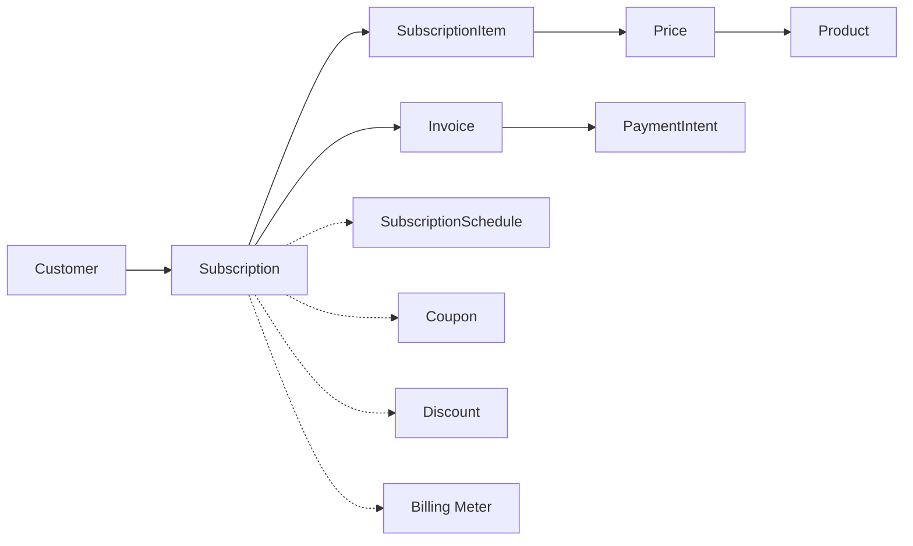

# Subscription

> API resource: `subscription` · API version: `2026-04-22.dahlia` · Category: [Billing](README.md)

## What it is

A `Subscription` is the persistent recurring-billing relationship between a [Customer](../01-core-resources/customers.md) and one or more [Prices](../03-products/prices.md). It is the engine that:

1. Generates an [Invoice](invoices.md) at the close of each billing cycle.
2. Attempts payment automatically (unless you override).
3. Manages trials, proration, mid-cycle plan changes, pausing, and cancellation.
4. Tracks dunning and recovery state when payments fail.

A Subscription is composed of one or more [SubscriptionItems](subscription-items.md) — each item binds the subscription to a specific Price with a quantity. Most subs have one item; tiered SaaS products often have multiple.

## Why it exists

Without it, "bill the customer $10/month" would mean: write a cron, generate invoices, charge cards, retry on failure, prorate when they upgrade, calculate VAT per period, expose a hosted page so they can update their card on file. Subscription is Stripe's implementation of all of that, and the source of truth that downstream systems (analytics, CSM, dunning) read from.

## Lifecycle & states



What each state means:

- **`incomplete`** — only happens with `payment_behavior=default_incomplete`. The subscription was created, the first invoice exists, but the first payment hasn't succeeded yet (often because 3DS / SCA challenge is pending). The customer has 23 hours to confirm; otherwise → `incomplete_expired`.
- **`incomplete_expired`** — terminal failure of the first payment within the 23h window. Subscription is dead; no further attempts. Customer was never charged.
- **`trialing`** — inside a free-trial window. No invoices generated until the trial ends.
- **`active`** — current period is paid (or trial + free). The healthy state.
- **`past_due`** — a renewal invoice failed payment. Stripe is retrying per your `Smart Retries` / dunning configuration. Service decisions (suspend? grace period?) are yours to make.
- **`canceled`** — explicitly canceled (now or at period end), or dunning escalated to cancel. Terminal. Check `cancellation_details` to know who/why.
- **`unpaid`** — alternative dunning terminal: subscription stays open but billing is paused; future invoices are created but remain unpaid. Used when you want to eventually recover the customer rather than cancel them.
- **`paused`** — `pause_collection` set. Stripe stops creating new invoices. Existing open invoices remain. Trials and proration still tick if you configured them to.

## Anatomy of the object

### Identity

| Field | Notes |
|---|---|
| `id` | `sub_…` |
| `customer` | `cus_…`. Immutable. |
| `status` | enum, see above. |
| `created` | unix seconds. |
| `livemode`, `metadata` | standard. |

### Items

| Field | Notes |
|---|---|
| `items` | `{ data: [SubscriptionItem, …] }`. Each links to a Price + quantity. **Edit items, not the subscription, when changing what's billed.** |

### Periods

| Field | Notes |
|---|---|
| `current_period_start`, `current_period_end` | The cycle currently being billed. Renewal happens at `current_period_end`. |
| `billing_cycle_anchor` | The reference timestamp used to derive future cycle ends. Setting this on update lets you align cycles (e.g. "everyone bills on the 1st"). |
| `start_date` | First-ever cycle start. |
| `ended_at` | When subscription went terminal (canceled / incomplete_expired / unpaid). |
| `cancel_at` | Scheduled cancellation time. |
| `cancel_at_period_end` | Boolean shortcut — true means "cancel when current period ends." |
| `canceled_at` | When cancellation was *requested* (not when it became effective). |
| `cancellation_details.reason` | `cancellation_requested | payment_disputed | payment_failed`. |
| `cancellation_details.feedback` | What the customer said in the portal (enum). |
| `cancellation_details.comment` | Free text from portal. |

### Trial

| Field | Notes |
|---|---|
| `trial_start`, `trial_end` | Trial window. `trial_end` is the moment trialing → active. |
| `trial_settings.end_behavior.missing_payment_method` | What to do if trial ends with no PM: `cancel | create_invoice | pause`. |

### Pricing & math

| Field | Notes |
|---|---|
| `default_payment_method` | Override of the customer's default. |
| `default_source` | Legacy; ignore. |
| `default_tax_rates` | Apply to every invoice this sub generates. |
| `automatic_tax.enabled` | Stripe Tax computes per-invoice. |
| `discount` / `discounts` | Coupon(s) applied to the subscription. |
| `application_fee_percent` | Connect: % of each invoice that goes to platform. |
| `transfer_data.destination` | Connect: where the invoice's net goes. |
| `proration_behavior` | `create_prorations | none | always_invoice`. Default for updates. |
| `collection_method` | `charge_automatically` (default) or `send_invoice`. |
| `days_until_due` | For `send_invoice` mode — net-N. |
| `billing_thresholds` | Auto-trigger an early invoice if usage/amount exceeds threshold. |

### Pending changes

| Field | Notes |
|---|---|
| `pending_update` | A queued update awaiting payment of an existing invoice. **Important** — Stripe doesn't apply destructive plan changes mid-period if the latest invoice is unpaid; the change waits here. |
| `pending_setup_intent` | A SetupIntent created for confirming a saved-card flow. |
| `pending_invoice_item_interval` | Window during which InvoiceItems can be added before the next invoice auto-finalizes. |

### Dunning

| Field | Notes |
|---|---|
| `next_pending_invoice_item_invoice` | When the next "ad-hoc" invoice will be generated for pending items. |
| `latest_invoice` | `in_…` of the most recent invoice. **For "why is this sub past_due?", retrieve this invoice and inspect its PaymentIntent.** |

### Test clock

| Field | Notes |
|---|---|
| `test_clock` | `clock_…` if the customer is locked to a test clock. |

### Schedule link

| Field | Notes |
|---|---|
| `schedule` | `sub_sched_…` if this sub is governed by a [SubscriptionSchedule](subscription-schedules.md). When set, plan changes flow through the schedule, not the sub. |

## Relationships



## Common workflows

### 1. Create a subscription with default-payment behavior

```http
POST /v1/subscriptions
  customer=cus_…
  items[0][price]=price_abc
  payment_behavior=default_incomplete
  payment_settings[save_default_payment_method]=on_subscription
  expand[]=latest_invoice.payment_intent
```

Returned: `status: incomplete` and a `latest_invoice` with a PI you confirm client-side via Elements (handles 3DS). Once the PI succeeds, sub flips to `active`. This pattern (`default_incomplete`) is Stripe's **recommended modern flow** because it cleanly handles SCA.

### 2. Update plan mid-cycle (proration)

```http
POST /v1/subscriptions/sub_…
  items[0][id]=si_…
  items[0][price]=price_pro_tier
  proration_behavior=always_invoice
```

Stripe immediately issues a proration invoice for the difference and charges it. `proration_behavior=create_prorations` (default) accumulates the delta into the *next* renewal invoice instead.

### 3. Add a quantity (seat-based billing)

```http
POST /v1/subscriptions/sub_…
  items[0][id]=si_…
  items[0][quantity]=10
```

Same proration rules apply.

### 4. Cancel at period end

```http
POST /v1/subscriptions/sub_…
  cancel_at_period_end=true
```

`status` stays `active`, `cancel_at_period_end: true`. At the end of the period, status → `canceled`. The customer keeps service until then.

### 5. Cancel immediately

```http
DELETE /v1/subscriptions/sub_…
  prorate=true     # optional: refund unused portion
  invoice_now=true # optional: invoice usage to date right now
```

(`DELETE` is equivalent to `POST .../cancel`.) Status → `canceled` immediately. Pending unpaid invoices stay (you can void them or chase them separately).

### 6. Pause (let them keep their account but stop billing)

```http
POST /v1/subscriptions/sub_…
  pause_collection[behavior]=mark_uncollectible
```

`mark_uncollectible` (no charge attempts; mark new invoices uncollectible), `keep_as_draft` (create drafts but don't finalize), or `void` (auto-void).

### 7. Resume

```http
POST /v1/subscriptions/sub_…
  pause_collection=
```

(Empty value clears pause.)

### 8. Preview the next invoice

```http
GET /v1/invoices/upcoming?subscription=sub_…
```

(Or with `subscription_proration_date` and proposed item changes to preview a switch.) Returns an Invoice-shaped preview without creating one.

### 9. Apply a coupon

```http
POST /v1/subscriptions/sub_…
  discounts[0][coupon]=COUPON_ID
```

(Or `promotion_code` instead of `coupon`.) Stripe creates a [Discount](../03-products/discounts.md), attaches it, and it auto-applies to invoices.

## Webhook events

| Event | Fires when | Listener typically does |
|---|---|---|
| `customer.subscription.created` | Sub created. | Provision the customer's plan-tier features. |
| `customer.subscription.updated` | **Most state changes** including status flips. | Re-sync; check `previous_attributes` for what changed. |
| `customer.subscription.deleted` | Sub canceled (any cause). Misnomer — name says "deleted," reality is "canceled, terminal." | Deprovision. |
| `customer.subscription.trial_will_end` | 3 days before trial ends. | Email "your trial is ending." |
| `customer.subscription.paused` / `.resumed` | Pause toggled. | Adjust feature gates. |
| `customer.subscription.pending_update_applied` / `_expired` | Pending update flushed or aborted. | Refresh plan UI. |
| `invoice.payment_failed` | Renewal failed (sub-related). | Send "update card" email. |
| `invoice.paid` | Renewal succeeded. | Roll over service period. |

> **Common confusion:** `customer.subscription.deleted` doesn't mean the row is gone. The Sub object is still retrievable forever; it's just in `canceled` status.

## Idempotency, retries & race conditions

- `POST /v1/subscriptions` and updates: send `Idempotency-Key`.
- **Pending updates.** If `latest_invoice` is unpaid and you `POST` an update, Stripe puts the change in `pending_update` instead of applying immediately. It applies once the customer pays (or expires after 24h). Be aware: your code might think it set `quantity=10` but the subscription still reads `quantity=5` until payment lands.
- Webhook delivery is at-least-once. `customer.subscription.updated` can fire many times for one logical change. Read `previous_attributes` (on the Event, not the Subscription) to know what diffed.
- Cancel + create-new in quick succession: the canceled sub's terminal events may arrive *after* the new sub's events. Process by `id`, not by ordering.

## Test-mode tips

- **TestClock is essential** for any non-trivial subscription work. Create the customer attached to a `test_clock`, create the sub, then advance the clock past `current_period_end` to force a renewal invoice. See [TestClock](test-clocks.md).
- `stripe trigger customer.subscription.created` etc. — quick fixtures.
- `4000 0000 0000 0341` (auth ok / capture fails) → useful for testing dunning.
- `4000 0027 6000 3184` (always 3DS) → useful for testing the `incomplete` flow.

## Connect considerations

- **Direct subscription**: created with `Stripe-Account: acct_…`, lives on the connected account. Platform takes a cut via `application_fee_percent`.
- **Destination subscription**: platform creates the sub, sets `transfer_data.destination=acct_…`. Each renewal invoice routes net to the connected account.
- A connected account in `restricted_soon` capability state will start failing invoice payments — listen to `account.updated` and surface to the merchant.

## Common pitfalls

- **Treating `customer.subscription.deleted` as a record deletion.** It's a status change.
- **Editing the subscription instead of its items.** To change Price/quantity, edit `items`, not top-level fields.
- **Forgetting `proration_behavior`.** Default (`create_prorations`) accumulates into next invoice. Many teams want `always_invoice` to charge immediately.
- **Updating during an unpaid invoice and assuming it took effect.** It went into `pending_update`. Inspect that field.
- **Not setting `payment_behavior=default_incomplete`.** Without it, sub creation can succeed *before* the first PI does, leading to half-funded subs and weird states.
- **Mixing `discount` (legacy, single) and `discounts` (current, array).** Use `discounts`.
- **Letting `automatic_tax.status: failed` linger.** Means tax can't be computed (usually missing customer address). Sub can't auto-finalize invoices.
- **Mass-editing without a SubscriptionSchedule.** If you need scheduled future plan changes (e.g. promo for 3 months then full price), use [SubscriptionSchedule](subscription-schedules.md) — putting the logic in your own cron is bug-prone.
- **Holding plan-tier feature flags in your DB and checking those instead of subscription state on hot paths.** That's fine, but make sure your `customer.subscription.updated` handler is bulletproof — the day it lags, your customers are silently overprovisioned or underprovisioned.

## Further reading

- [API reference: Subscription](https://docs.stripe.com/api/subscriptions/object)
- [Subscriptions guide](https://docs.stripe.com/billing/subscriptions/overview)
- [Smart Retries / dunning](https://docs.stripe.com/billing/revenue-recovery/smart-retries)
- [Subscription proration](https://docs.stripe.com/billing/subscriptions/prorations)
- [Subscription schedules for complex lifecycles](https://docs.stripe.com/billing/subscriptions/subscription-schedules)
