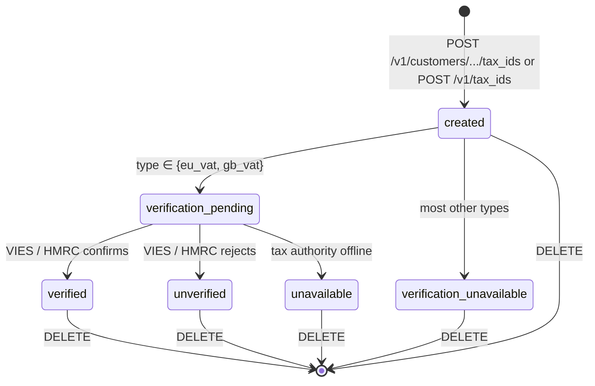
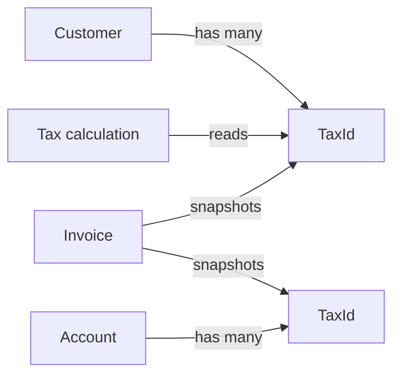

# Tax ID

> API resource: `tax_id` · API version: `2026-04-22.dahlia` · Category: [Billing](README.md)

## What it is

A `TaxId` represents a tax registration number — a VAT number, EIN, ABN, GST/HST number, etc. — attached to either a [Customer](../01-core-resources/customers.md) (the buyer's tax ID, used for B2B invoicing) or your own [Account](../07-connect/accounts.md) (the seller's tax IDs, snapshotted onto invoices you issue).

It is a small, mostly-static record: a `type` from a long enum of country/jurisdiction-specific tax-ID schemes, a `value` (the actual number the customer registered with), and — for a few schemes — verification metadata that Stripe populates by calling out to the relevant tax authority.

The TaxId itself doesn't compute tax. It feeds into Stripe Tax, the invoice PDF, and reverse-charge logic.

## Why it exists

In B2B sales, both sides of the transaction usually need each other's tax registration on the receipt. EU VAT in particular requires the seller to print the buyer's VAT number on the invoice, and — if the buyer is in another EU member state and verifiably VAT-registered — to *not* charge VAT (the customer self-accounts via reverse-charge).

Without a TaxId object, every integration would have to:

1. Store and validate VAT/EIN strings per-customer.
2. Call VIES/HMRC themselves to verify EU/UK numbers.
3. Branch their tax computation on registration status.
4. Render the right ID on every invoice PDF.

`TaxId` centralizes (1) and (4), and Stripe Tax + the invoice pipeline read from it for (2) and (3).

## Lifecycle & states

TaxIds have no `status` field of their own. Their lifecycle is just create → (optionally) delete. The interesting state lives on the nested `verification` object — and only for the handful of types Stripe actively verifies.



Notes:

- The TaxId is **immutable** once created. To "edit" a number, delete and recreate.
- `verification.status` is meaningful only for `eu_vat` and `gb_vat` (and possibly a small number of others — Stripe expands coverage over time). Everything else returns `unavailable` perpetually, meaning *Stripe didn't check*, not *the number is wrong*.
- For the verified types, Stripe runs the verification on creation and then re-runs it asynchronously. Listen for `customer.tax_id.updated` for state transitions.
- Format-only validation (length, checksum) happens synchronously on every type. A clearly-wrong format (e.g. 5-character `eu_vat`) is rejected at create time. A format-correct but unregistered number is accepted and surfaces as `unverified`.

## Anatomy of the object

### Identity

| Field | Notes |
|---|---|
| `id` | `txi_…` |
| `object` | `"tax_id"` |
| `livemode` | standard |
| `created` | unix seconds |

### Owner (one of two patterns)

| Field | Notes |
|---|---|
| `customer` | `cus_…`. Set when created via the legacy customer-scoped path. Mutually exclusive in spirit with the modern `owner` pattern, though Stripe populates both for backwards compatibility. |
| `owner.type` | `account` (your platform), `application`, `customer`, or `self`. The current/recommended way to express ownership. |
| `owner.account` | `acct_…` when `type=account`. |
| `owner.application` | `ca_…` when `type=application`. |
| `owner.customer` | `cus_…` when `type=customer`. Equivalent to top-level `customer`. |

When you create a TaxId via `POST /v1/customers/cus_…/tax_ids`, Stripe populates both `customer` and `owner.customer`. New code should reach for `POST /v1/tax_ids` with an explicit `owner[type]`.

### Type & value

| Field | Notes |
|---|---|
| `type` | The scheme. Long enum — the most common: `eu_vat`, `gb_vat`, `us_ein`, `ca_bn`, `ca_gst_hst`, `ca_pst_bc`, `au_abn`, `au_arn`, `nz_gst`, `in_gst`, `jp_cn`, `jp_rn`, `sg_uen`, `sg_gst`, `ch_vat`, `no_vat`, `za_vat`, `br_cnpj`, `br_cpf`, `mx_rfc`, `kr_brn`, `id_npwp`, `my_itn`, `my_sst`, `ph_tin`, `th_vat`, `tr_tin`, `tw_vat`, `ae_trn`, `sa_vat`, `ru_inn`, `ru_kpp`, `unknown` (catch-all when none of the above fit). New jurisdictions are added periodically — check the API reference for the live list. |
| `value` | The literal registration number as the customer entered it. Stripe normalizes whitespace/case for some types but not all. |
| `country` | ISO-3166-1 alpha-2. **Auto-populated from `type`** for region-locked types — you do not set it. For `unknown` you may pass `country` to help PDF rendering. |

### Verification

| Field | Notes |
|---|---|
| `verification.status` | `pending` (lookup in flight), `verified` (authority confirmed), `unverified` (authority rejected the number), `unavailable` (Stripe doesn't verify this type, or the authority's API was unreachable). |
| `verification.verified_address` | The registered address VIES/HMRC returned. May differ from your customer's address — useful for fraud checks. Null if not verified. |
| `verification.verified_name` | The registered legal name returned. Useful for matching against the customer's `name`. Null if not verified. |

## Relationships



- A Customer can have many TaxIds (one per jurisdiction they're registered in).
- Your Account can have many TaxIds (printed on every invoice you issue from that account).
- At invoice **finalization**, the customer's TaxIds and the account's TaxIds are *snapshotted* onto the Invoice (`customer_tax_ids`, `account_tax_ids`). Deleting a TaxId later does **not** retroactively change finalized invoices.
- Stripe Tax reads the customer's TaxIds at calculation time to decide reverse-charge behavior.

## Common workflows

### 1. Attach a customer's VAT number (modern path)

```http
POST /v1/tax_ids
  owner[type]=customer
  owner[customer]=cus_…
  type=eu_vat
  value=DE123456789
```

Returns the TaxId with `verification.status: pending`. Within a few seconds (sometimes minutes when VIES is slow), it transitions to `verified` or `unverified`. Listen for `customer.tax_id.updated`.

### 2. Attach via legacy customer path

```http
POST /v1/customers/cus_…/tax_ids
  type=eu_vat
  value=DE123456789
```

Equivalent. Most Stripe Dashboards and older SDKs still emit this form.

### 3. List a customer's TaxIds

```http
GET /v1/customers/cus_…/tax_ids
# or
GET /v1/tax_ids?owner[type]=customer&owner[customer]=cus_…
```

### 4. Record your own (seller) tax IDs

```http
POST /v1/tax_ids
  owner[type]=self
  type=us_ein
  value=12-3456789
```

These appear on every invoice you finalize, in `account_tax_ids`. There's a per-account cap (around 25 — check the live docs).

### 5. Delete

```http
DELETE /v1/tax_ids/txi_…
```

Idempotent. Already-finalized invoices keep their snapshot.

### 6. Replace (no in-place update)

Delete the old, create the new. There is no `POST /v1/tax_ids/txi_…` update endpoint.

### 7. Reverse-charge flow (EU B2B)

1. Seller is registered for VAT in Germany; buyer is a French company with a verified `eu_vat` of `FRxxxxxxxxxxx`.
2. Buyer's TaxId is attached to their Customer; `verification.status: verified`.
3. Customer has `address.country = "FR"`.
4. Invoice has `automatic_tax.enabled=true`.
5. Stripe Tax detects: cross-border B2B in EU, buyer is verified VAT-registered → applies reverse-charge → invoice has 0% VAT line plus a "VAT reverse-charged" note in the PDF.

If `verification.status` is anything but `verified`, Stripe Tax will likely charge VAT at the buyer's local rate.

## Webhook events

| Event | Fires when | Listener typically does |
|---|---|---|
| `customer.tax_id.created` | Tax ID attached. | Persist it on your customer record. |
| `customer.tax_id.updated` | Verification status changes (most common). | Re-render account UI; if `unverified`, prompt the user to correct. |
| `customer.tax_id.deleted` | Removed. | Drop from your record. |

> Account-owned TaxIds (`owner.type=account` or `self`) do **not** emit `customer.tax_id.*` events — they're managed via Dashboard and rarely change at runtime.

## Idempotency, retries & race conditions

- `POST /v1/tax_ids` accepts `Idempotency-Key`. Use it — duplicate-creating a customer's VAT number leaves two rows on the same value (Stripe doesn't dedupe by `value`).
- `verification.status` may flip from `pending` → terminal *after* the create response returned. Don't decide reverse-charge synchronously off the create response; wait for `customer.tax_id.updated` or re-fetch.
- VIES has periodic outages (often Mondays); during those windows new EU VAT numbers will sit in `pending` longer or end up `unavailable`. Stripe re-verifies `unavailable` numbers periodically.
- Deleting and recreating during invoice finalization is a known footgun: the snapshot is taken at finalize, so a delete that beats finalize means the old number doesn't appear on the PDF.

## Test-mode tips

- Stripe ships test VAT numbers per-jurisdiction that always verify successfully — see the docs page for "Stripe Tax test data." For EU VAT, formats like `DE111111111` typically resolve to verified test fixtures (exact values shift over time, so check the live docs).
- `stripe trigger customer.tax_id.created` for fixture flow.
- TestClock has no special behavior here — TaxIds aren't time-driven.

## Connect considerations

- A platform can manage TaxIds on a connected account by passing `Stripe-Account: acct_…`. The TaxId is owned by the connected account; it appears on invoices that account issues, not on platform invoices.
- For destination-charge billing where the platform issues the invoice but routes funds to the connected account: the platform's `account_tax_ids` are what get snapshotted, not the connected account's.
- If you operate a marketplace that wants buyer VAT collection per-merchant, attach TaxIds to the **Customer on the connected account**, not on the platform — Stripe Tax computes per-account.

## Common pitfalls

- **Trusting `verification.status: unavailable` as "valid."** It just means Stripe didn't check. Real validation might still be your responsibility (e.g. `us_ein` — Stripe never verifies these).
- **Treating `unverified` as a fatal error.** VIES returns `unverified` for legitimate numbers during temporary outages or for newly-registered businesses not yet propagated. Ask the customer to retry rather than blocking them.
- **Editing.** There is no edit. Old code that does "PATCH the value" silently fails (the endpoint doesn't exist).
- **Reverse-charge surprises.** A `pending` or `unverified` EU VAT means Stripe Tax will likely charge VAT — the customer will be unhappy. Wait for verification before finalizing the first invoice; or use [Customer Portal](customer-portal-sessions.md) which surfaces the verification status directly.
- **Country mismatch.** A French company with a `de_vat` (German VAT registration because they're also registered there) is fine — Stripe Tax uses the customer's `address.country` for the buyer-side jurisdiction, and the TaxId's country only as evidence of registration. Don't try to "fix" the mismatch.
- **Hitting the per-customer cap.** Customers can hold many TaxIds but there's a soft cap (around 25). Most have one. If you're hitting the limit you're probably duplicating.
- **Forgetting account-side TaxIds.** Many sellers add the customer's VAT but never set their own. Their invoices then ship without a seller-side ID — invalid in most VAT jurisdictions.

## Further reading

- [API reference: TaxId](https://docs.stripe.com/api/tax_ids/object)
- [Customer tax IDs guide](https://docs.stripe.com/billing/customer/tax-ids)
- [Stripe Tax](https://docs.stripe.com/tax)
- [Reverse-charge mechanism overview](https://docs.stripe.com/tax/reverse-charges)
