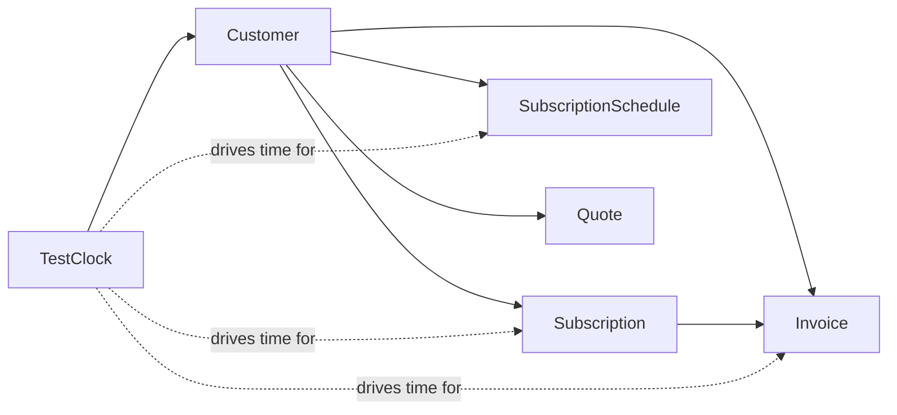

# Test Clock

> API resource: `test_helpers.test_clock` · API version: `2026-04-22.dahlia` · Category: [Billing](README.md)

## What it is

A `TestClock` is a **test-mode-only** virtual clock. Customers (and everything attached to them — subscriptions, invoices, schedules, quotes, meters) can be locked to a clock at creation, and Stripe will treat the clock's `frozen_time` as "now" for those objects rather than wall-clock time.

You then advance the clock forward — minutes, days, months, years — and Stripe deterministically replays everything that *would have happened* in real life: trial endings, renewal invoices, dunning retries, schedule phase rollovers, scheduled cancellations, billing-thresholds firing, the lot.

It is the only way to test multi-cycle Billing flows without waiting weeks of wall time.

## Why it exists

Subscriptions are time-driven. A monthly sub renews 30 days after creation. A 7-day trial ends in 7 days. A failed payment dunning sequence retries on a configurable schedule that spans days. Without a clock, your only options are:

1. Wait. Useless for development.
2. Mock Stripe entirely. Rebuilds half their billing engine and drifts.
3. Set very short trials/intervals in test (1-day trials, hourly intervals). Approximates but doesn't match production.

TestClock makes test-mode time *programmable*. Your CI can spin up a clock, create a subscription with a 30-day trial, fast-forward 31 days, and assert the trial-end webhook fired and the first invoice was paid — all in seconds.

## Lifecycle & states

```mermaid
stateDiagram-v2
    [*] --> ready: create with frozen_time=T0
    ready --> advancing: POST /advance frozen_time=T1
    advancing --> ready: all triggered events processed
    advancing --> internal_failure: Stripe-side error
    ready --> [*]: DELETE
    advancing --> [*]: DELETE (rare; cancels in-flight)
    internal_failure --> [*]: DELETE (only escape)
```

States:

- **`ready`** — clock is idle at `frozen_time`. You can attach new objects, advance it, or delete it.
- **`advancing`** — you called `/advance`. Stripe is replaying every event (invoice generation, dunning attempts, trial endings, schedule phases, webhooks) that should have fired between the old `frozen_time` and the new one. Cannot advance again until this completes. Webhooks fire as the simulation progresses.
- **`internal_failure`** — something on Stripe's side went wrong mid-advance. Rare. The clock is wedged; delete and start over.

Important: `advancing` is **not instant**. Simulating a year forward on a clock with 50 active subscriptions can take many seconds because Stripe is genuinely creating all the intermediate invoices, payment intents, charges, etc. Poll `status` or wait for `test_helpers.test_clock.ready`.

## Anatomy of the object

### Identity

| Field | Notes |
|---|---|
| `id` | `clock_…` |
| `object` | `"test_helpers.test_clock"` |
| `livemode` | Always `false`. TestClocks do not exist in live mode. |
| `created` | Wall-clock unix seconds when the clock was created. |
| `name` | Optional human-readable label (Dashboard list view shows it). |

### Time

| Field | Notes |
|---|---|
| `frozen_time` | Unix seconds. The "now" all attached objects see. Set at create; only changes via `/advance`. |
| `deletes_after` | Unix seconds. Stripe auto-deletes clocks after a retention window (commonly cited as ~30 days but exact value can vary — check this field). Look here to know when. |

### Status

| Field | Notes |
|---|---|
| `status` | `ready | advancing | internal_failure`. Drives whether you can advance again. |
| `status_details.advancing.target_frozen_time` | When `status=advancing`, the target time the simulation is racing toward. Useful for progress UI. (Field name may vary across API versions.) |

## Relationships



The link is **`Customer.test_clock`**. Everything else inherits via the customer:

- A Customer can be locked to a clock **only at creation** (`POST /v1/customers test_clock=clock_…`). It cannot be moved to another clock or detached.
- A Customer not locked to any clock uses wall-clock time for everything — even in test mode.
- Subscriptions, invoices, schedules, quotes, etc. inherit the clock from their Customer. Their `test_clock` field reflects this.
- Many Customers can share one clock. Advancing the clock progresses all of them in lockstep.
- **Deleting a clock deletes every object attached to it** — customers, subscriptions, invoices, charges, the lot. There is no way to "evacuate" objects to another clock or to wall-clock time.

## Common workflows

### 1. Smoke-test a monthly subscription's first renewal

```http
# Create the clock at "now"
POST /v1/test_helpers/test_clocks
  frozen_time=1735689600          # 2025-01-01 UTC
  name=monthly-renewal-test

# Returns clock_abc with status=ready

# Lock a customer to it
POST /v1/customers
  email=test@example.com
  test_clock=clock_abc
# Returns cus_xyz

# Attach a payment method (use 4242s)
POST /v1/payment_methods …
POST /v1/payment_methods/pm_…/attach customer=cus_xyz

# Create the subscription
POST /v1/subscriptions
  customer=cus_xyz
  items[0][price]=price_monthly
  default_payment_method=pm_…
# First invoice paid immediately. Sub status=active.

# Fast-forward 32 days
POST /v1/test_helpers/test_clocks/clock_abc/advance
  frozen_time=1738454400          # 2025-02-02 UTC
# Returns status=advancing

# Poll until status=ready (or wait for test_helpers.test_clock.ready webhook)
GET /v1/test_helpers/test_clocks/clock_abc

# Now: list invoices for the customer — there should be a second one.
```

### 2. Test trial-end behavior

```http
# Clock at T0
POST /v1/test_helpers/test_clocks frozen_time=<T0>

# Customer + sub with 7-day trial
POST /v1/subscriptions
  customer=cus_…              # locked to clock
  items[0][price]=price_…
  trial_period_days=7

# Advance to T0 + ~4 days → expect customer.subscription.trial_will_end (3-day warning)
# Advance to T0 + 7 days + 1h → expect trial_end transition + first invoice
```

### 3. Test dunning / failed-payment retries

```http
# Use card 4000 0000 0000 0341 (auths but capture fails)
# Create sub, pay first invoice with 4242 (so it activates), update default PM to the failing card
# Advance past current_period_end → renewal invoice fails → dunning starts
# Advance day by day to walk through Smart Retry attempts
```

### 4. Validate a SubscriptionSchedule's phase rollover

```http
# Schedule: phase 1 = $10/mo for 3 months, phase 2 = $20/mo forever
# Advance past month 3 → expect subscription_schedule.updated with current_phase shifting
```

### 5. Tear down

```http
DELETE /v1/test_helpers/test_clocks/clock_abc
```

Cascades to every object on the clock. Use this in test teardown to keep your test-mode account from filling up with cruft.

### 6. Find existing clocks

```http
GET /v1/test_helpers/test_clocks?limit=100
```

In CI, list and delete any clock older than your test session start to clean up leaks from killed jobs.

## Webhook events

| Event | Fires when | Listener typically does |
|---|---|---|
| `test_helpers.test_clock.created` | Clock created. | (rare) seed test fixtures. |
| `test_helpers.test_clock.advancing` | `/advance` started. | Begin polling or show progress in test UI. |
| `test_helpers.test_clock.ready` | Advance simulation complete. | Continue test assertions. **The reliable "done" signal.** |
| `test_helpers.test_clock.internal_failure` | Stripe-side failure mid-advance. | Fail the test, recreate the clock. |
| `test_helpers.test_clock.deleted` | Clock deleted (by you or auto-expiry). | Clean up local references. |

While advancing, the clock also drives every event the simulated time would normally cause (`invoice.created`, `invoice.paid`, `customer.subscription.updated`, etc.) for the customers attached to it. These arrive interleaved with the `advancing` event.

## Idempotency, retries & race conditions

- `POST /v1/test_helpers/test_clocks` accepts `Idempotency-Key`.
- `POST .../advance` is **not** idempotent across different `frozen_time` values — calling twice with different targets will error the second one (clock is `advancing`).
- Webhook ordering during an advance: events arrive roughly in simulated-time order but with no strict guarantee. Treat them like real webhooks — at-least-once, occasionally out of order.
- Race: if your test asserts on a counter (e.g. number of invoices) immediately after `/advance` returns 200, you may read state before all simulated events have committed. **Always wait for `status: ready` or the `test_helpers.test_clock.ready` webhook.**
- The advance call returns synchronously with `status: advancing` very quickly; the actual simulation runs server-side. Don't hold an HTTP connection waiting.

## Test-mode tips

- This object only exists in test mode. There is no live equivalent.
- Stripe enforces a maximum advance horizon — commonly cited as around **5 years from clock creation**. Don't try to advance to year 2099.
- Per-account limit on number of TestClocks (a small number — exact value varies; ask Stripe to raise if you need more for parallel CI).
- Pair with `stripe trigger` for non-time-based events you also want to fire during a test.
- `stripe listen --forward-to localhost:…` works fine; webhooks for clock-driven events forward like any other.

## Connect considerations

- TestClocks live on **whichever account you call them from**. Pass `Stripe-Account: acct_…` (test account) to create one on a connected account.
- A platform can create a clock on its own account, attach a Customer (also on the platform), and use it to test platform-side billing.
- For destination-charge testing, you need clocks on *both* the platform and the connected account if both have time-driven objects (rare; usually only one side has the Subscription).

## Common pitfalls

- **Forgetting to lock the customer at creation.** A Customer created without `test_clock=clock_…` runs on wall-clock time and is invisible to your clock advances. Easy to miss until you're debugging "why did the invoice never appear?"
- **Trying to move a customer between clocks.** Not allowed. Recreate the customer.
- **Advancing while still `advancing`.** API returns an error (typically `test_clock_advancing` or similar). Wait for `ready`.
- **Reading state before `ready`.** Your assertions race the simulation. Always poll or webhook.
- **Advancing too far in one shot.** Stripe is creating every intermediate invoice, attempt, retry. A 5-year jump on a complex sub can take a long time and may hit internal limits. Advance in reasonable hops (a few months) when validating long flows.
- **Deleting a clock you still need.** It cascades — customers, subs, invoices, all gone. There is no undo.
- **Letting clocks accumulate.** TestClocks count toward per-account limits and persist for a retention window. CI without teardown leaks them.
- **Using clock-attached customers in shared dev environments.** Two engineers advancing the same clock simultaneously will see each other's events. Use one clock per logical test run.
- **Asserting wall-clock fields are advanced.** `created` on objects is wall-clock; only billing-time fields (`current_period_end`, `trial_end`, etc.) honor the clock.
- **Mocking the clock's webhooks instead of waiting.** Cuts out the actual simulation, which is the whole point — you're now testing your mock, not Stripe.

## Further reading

- [API reference: TestClock](https://docs.stripe.com/api/test_clocks/object)
- [Test clocks guide](https://docs.stripe.com/billing/testing/test-clocks)
- [Subscription](subscriptions.md) — the primary object you'll exercise with clocks.
- [SubscriptionSchedule](subscription-schedules.md) — multi-phase flows are where clocks shine.
