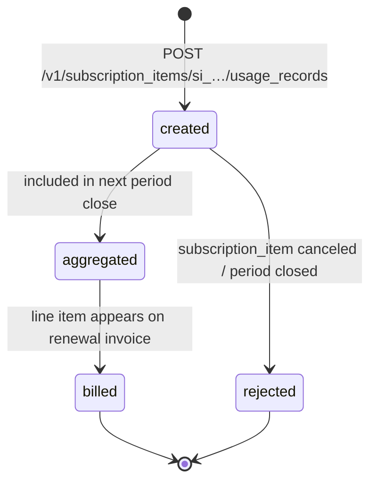
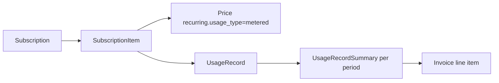

# Usage Record (legacy)

> API resource: `usage_record` · API version: `2026-04-22.dahlia` · Category: [Billing](README.md)

> **Status: legacy.** New metered billing should use [BillingMeter](billing-meters.md) + [BillingMeterEvent](billing-meter-events.md) — they decouple usage reporting from subscription_item lifecycles, support adjustments, and scale better. UsageRecord is preserved for existing integrations and continues to work.

## What it is

A `UsageRecord` is a single report of "the customer used N units of metered thing X by time T." It attaches to a [SubscriptionItem](subscription-items.md) whose [Price](../03-products/prices.md) (or [Plan](plans-legacy.md)) has `recurring.usage_type=metered`. At the close of each billing period, Stripe sums the records (per the Plan's `aggregate_usage` setting), multiplies by the unit price (or applies the tier rules), and adds a line to the renewal invoice.

It is the original metered-billing primitive: small, scoped, and tied 1:1 to a SubscriptionItem.

## Why it exists

Before BillingMeter, if you wanted to bill "API calls × $0.001" or "compute-seconds × $0.0001," your only option was:

1. Create a Subscription with a metered Price.
2. Each time a customer consumes a unit, `POST /v1/subscription_items/si_…/usage_records` with `quantity=1` (or batched with `quantity=N`).
3. Stripe aggregates into a quantity for the period and bills it on the next invoice.

This model works fine for simple, low-volume metering and the basic "record-and-forget" pattern. Its limitations — chiefly the tight coupling to a SubscriptionItem ID and the lack of an adjustment surface — are why BillingMeter superseded it.

## Lifecycle & states

UsageRecords have no `status` field. They're append-only logs.



There is no `delete` endpoint. There is no `update`. To "fix" a wrong record you typically post a compensating record (with `action=set` to overwrite, see below) or, in BillingMeter, use a [BillingMeterEventAdjustment](billing-meter-event-adjustments.md).

Notes:

- Records with a `timestamp` inside the **current open billing period** are aggregated normally.
- Records with a `timestamp` in a **closed (already invoiced) period** are typically rejected — the cycle's invoice is finalized and immutable.
- Records posted **after subscription cancellation** but with a timestamp before `canceled_at` may be accepted into the final invoice depending on timing; after the final invoice closes, they fail.

## Anatomy of the object

Tiny object.

| Field | Notes |
|---|---|
| `id` | `mbur_…` (older records may have other prefixes). |
| `object` | `"usage_record"` |
| `livemode` | standard. |
| `subscription_item` | `si_…`. The SubscriptionItem this record is reported against. **Determined by the URL path, not the body.** |
| `quantity` | Integer. Units consumed. With `action=increment`, added to the period's running total; with `action=set`, replaces the period's total at this timestamp. |
| `timestamp` | Unix seconds. Defaults to "now" if omitted. Must fall inside the current period for the record to be included. Some SDKs accept the literal `"now"`. |

That's it. There is no `customer` field — it's implied via `subscription_item → subscription → customer`. There is no `currency` or `amount` — pricing is on the Price; the record only reports quantity.

### Action semantics

The `action` parameter (sent on create; not stored on the resulting object) is critical:

- **`action=increment`** (default) — adds `quantity` to the period total at the given timestamp. Use for streaming reports ("we just consumed 5 more units"). Multiple increments in the same period sum together.
- **`action=set`** — overwrites the period total to `quantity` as of this timestamp. Use when you have an authoritative gauge ("the customer's seat count is currently 12"). The `aggregate_usage` setting on the Price/Plan still decides which `set` wins (last_during_period, max, etc.).

Mixing increment and set in the same period is allowed but confusing — a `set` followed by `increment`s adds to the new base; an `increment` followed by `set` discards the increments.

## Relationships



- A UsageRecord lives only via its SubscriptionItem URL: there is no top-level `GET /v1/usage_records`.
- Per-period aggregations are exposed as `usage_record_summaries` on the SubscriptionItem (`GET /v1/subscription_items/si_…/usage_record_summaries`).
- At period close, Stripe creates an invoice line item from the aggregated quantity × tier/per-unit math.
- If the SubscriptionItem is removed (sub canceled, item swapped), the UsageRecords for that item become inaccessible for new reporting; previously aggregated values still appear on past invoices.

## Common workflows

### 1. Stream incremental usage

```http
# Each time the customer consumes a unit (or batch)
POST /v1/subscription_items/si_…/usage_records
  quantity=42
  timestamp=1735689600
  action=increment
```

Idempotency-Key recommended — see below. With `aggregate_usage=sum`, the period total grows by 42 each call.

### 2. Report a gauge

```http
# At any point, set absolute current value (e.g. seat count)
POST /v1/subscription_items/si_…/usage_records
  quantity=12
  action=set
```

With `aggregate_usage=last_during_period` (typical for gauges), the most recent `set` value at period close becomes the billed quantity.

### 3. Inspect aggregates

```http
GET /v1/subscription_items/si_…/usage_record_summaries?limit=10
```

Returns one row per billing period with `total_usage` and `period.start/end`. Useful for showing "current period usage so far" in your customer-facing UI.

### 4. Preview the next invoice with current usage

```http
GET /v1/invoices/upcoming?subscription=sub_…
```

The metered line reflects current aggregated usage. Customers love this for in-app dashboards.

### 5. "Late" reporting at period boundary

If a customer's event hits your queue right as Stripe is closing the period, set `timestamp` to the actual event time. Stripe will accept it into the just-closing period **only if** the period close hasn't fully run. There's a small grace window — don't rely on it.

### 6. Migrate to BillingMeter

```http
# Define a meter (replaces the metered Price's implicit meter)
POST /v1/billing/meters
  display_name="API calls"
  event_name="api_call"
  default_aggregation[formula]=sum
  customer_mapping[type]=by_id
  customer_mapping[event_payload_key]=stripe_customer_id
  value_settings[event_payload_key]=value

# Create a recurring Price that references the Meter (via Product wiring)
POST /v1/prices
  unit_amount_decimal="0.001"
  currency=usd
  recurring[interval]=month
  recurring[meter]=mtr_…
  product=prod_…

# Subscription as usual; report usage by event, not by subscription_item
POST /v1/billing/meter_events
  event_name=api_call
  payload[stripe_customer_id]=cus_…
  payload[value]=42
```

Customer-keyed reporting (not item-keyed) is the central improvement: you no longer need to know `si_…` at the call site.

## Webhook events

UsageRecord itself does not emit dedicated `usage_record.*` events. Effects surface via downstream events:

| Event | Fires when | Listener typically does |
|---|---|---|
| `invoice.created` | Renewal draft created with the period's metered line. | (Optional) inspect `lines.data` to verify expected aggregate. |
| `invoice.upcoming` | Preview before next renewal. | Show running usage in customer UI. |
| `invoice.finalized` / `invoice.paid` | Period closed, billed. | Reconcile against your reported quantity. |

If you need a per-event audit trail, BillingMeter's `billing.meter.*` event family offers richer reporting; UsageRecord does not.

## Idempotency, retries & race conditions

- `POST /v1/subscription_items/si_…/usage_records` **strongly recommends** an `Idempotency-Key`. Without one, a retried POST after a flaky network double-counts (`action=increment`) — and there's no de-dupe key in the resource itself.
- Stripe **does not** dedupe by `(timestamp, quantity)`. Two records with identical body and timestamp will both be aggregated.
- Records arriving out-of-order are fine within a period — aggregation is commutative for `sum`. For `set` with `last_during_period`, the highest-`timestamp` value wins regardless of POST order.
- Period-boundary races: a record posted at `T=period_end - 1s` may or may not make it in. Build your reporting pipeline to flush *before* `current_period_end`, with a buffer (5 minutes is generous).
- Concurrent reporters: nothing prevents two services from incrementing the same item; if both retry without idempotency, you double-bill the customer.

## Test-mode tips

- Combine with [TestClock](test-clocks.md): create a metered sub on a clock, post some UsageRecords, advance the clock past `current_period_end`, observe the invoice line. This is the standard validation pattern.
- `stripe trigger` does not have a UsageRecord trigger; use the API directly.
- When testing aggregation modes, change the Price's `aggregate_usage` and recreate the subscription — the field is on the Price/Plan, not the record.

## Connect considerations

- UsageRecords live on the account that owns the SubscriptionItem. For Subscriptions on connected accounts, post with `Stripe-Account: acct_…`.
- For destination-charge platforms, the platform owns the Subscription, so usage reporting goes to the platform — it does *not* automatically forward to the connected account.
- BillingMeter has the same constraint; the migration is account-by-account.

## Common pitfalls

- **No idempotency on increments.** A retried POST double-bills. Always pass `Idempotency-Key`. The resource has no native dedup field.
- **Posting to a canceled or swapped SubscriptionItem.** Returns an `invalid_request_error`. Watch for sub state changes (`customer.subscription.updated`) and stop reporting.
- **Reporting after the period closed.** Records with stale timestamps are rejected; the customer is under-billed and you have no escape hatch except a manual InvoiceItem on the next invoice.
- **Mixing `set` and `increment` in the same period.** Reads cleanly in isolation; reads chaotically in combination. Pick one per Price.
- **Forgetting `aggregate_usage`.** The Plan/Price decides whether `set` keeps the last value, the max, the sum, etc. Misconfigure it and your `set`-style gauge gets summed across the period — order-of-magnitude bug.
- **Reporting from multiple instances without coordination.** No global de-dupe; pick a single writer or use idempotency keys derived from your event ID.
- **Skipping the migration.** New metered features (alerts, credit grants tied to usage, complex aggregations, event adjustments) only work with BillingMeter. UsageRecord is frozen.
- **Using `usage_record_summaries` as a real-time counter.** It updates only periodically; for live dashboards either keep your own counter or read the upcoming-invoice preview.
- **Confusing UsageRecord with [InvoiceItem](invoice-items.md).** UsageRecord aggregates into the metered line of a recurring invoice; InvoiceItem is a one-off line you push directly. Different objects, different uses.

## Further reading

- [API reference: UsageRecord](https://docs.stripe.com/api/usage_records/object)
- [API reference: UsageRecordSummary](https://docs.stripe.com/api/usage-record-summary)
- [Metered billing guide (legacy)](https://docs.stripe.com/products-prices/pricing-models#usage-based-pricing)
- [BillingMeter](billing-meters.md) and [BillingMeterEvent](billing-meter-events.md) — the modern replacement.
- [Migrate to Meters](https://docs.stripe.com/billing/subscriptions/usage-based/recording-usage) — Stripe's transition guide.
- [Subscription](subscriptions.md), [SubscriptionItem](subscription-items.md) — the parents.
