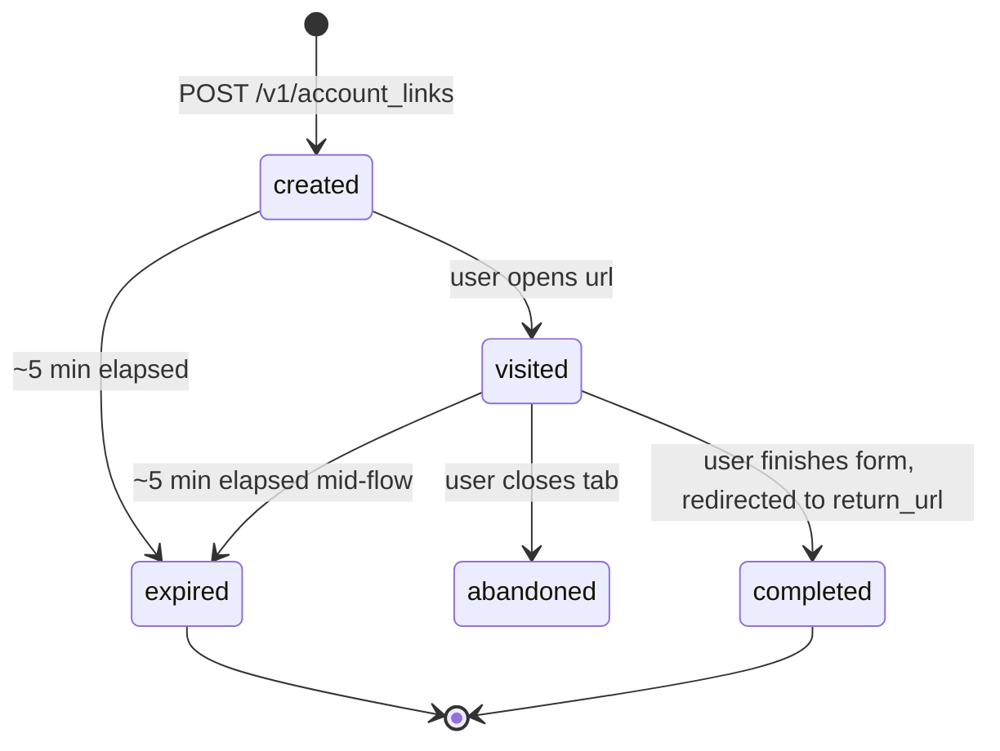
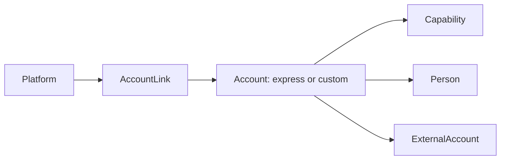

# Account Link

> API resource: `account_link` · API version: `2026-04-22.dahlia` · Category: [Connect](README.md)

## What it is

An `AccountLink` is a short-lived, single-use URL into Stripe-hosted onboarding for one connected [Account](accounts.md). The connected account's owner visits the URL, fills in identity / business / banking details on Stripe's UI, and is redirected back to your platform when they're done (or when the link expires).

It is the *handoff token* between your app and Stripe's hosted onboarding flow. You don't render any onboarding fields yourself — you mint a link, redirect, and Stripe collects everything.

> Only relevant for `type=express` and `type=custom` accounts. Standard accounts onboard themselves at stripe.com after OAuth and never need an AccountLink.

## Why it exists

You'd otherwise have to build a country-aware, capability-aware KYC form per account type — every regulated field, every document upload, every conditional sub-form — and keep it current as Stripe and regulators change requirements. AccountLink lets you outsource that entirely while keeping your platform branded around the redirect.

It also exists in two flavors so you can re-onboard an already-active account (`account_update`) without throwing the user back through initial onboarding.

## Lifecycle & states

There is no `status` field. The state is implicit from `expires_at` and whether the link has been visited.



- **TTL is roughly 5 minutes** from `created`. After `expires_at`, the URL serves a "this link expired" page and bounces to `refresh_url`.
- The link is **single-use**. Even within the TTL, after the user completes (or partially completes and bounces to `refresh_url`), don't try to reuse the same `url`.
- Stripe does not emit webhooks for AccountLink itself. Watch [`account.updated`](accounts.md) on the linked account to see what the user actually submitted.

## Anatomy of the object

### Identity

| Field | Notes |
|---|---|
| `object` | always `"account_link"` |
| `created` | unix seconds. |
| `expires_at` | unix seconds. ~5 minutes after `created`. After this, `url` redirects to `refresh_url`. |

> AccountLink has no `id` you can re-fetch. The response is the only time you get the `url`. Lose it, mint another.

### Target & destination

| Field | Notes |
|---|---|
| `account` | `acct_…` of the connected account being onboarded/updated. **Required.** |
| `url` | The Stripe-hosted URL to redirect the user to. Single-use, ~5 min TTL. |
| `return_url` | Where Stripe sends the user after they finish (or click "back to platform"). **Required.** |
| `refresh_url` | Where Stripe sends the user if the link has expired or they need a new one. **Required.** Your handler at this URL should mint a fresh AccountLink and redirect again. |

### Behavior

| Field | Notes |
|---|---|
| `type` | `account_onboarding` (initial KYC) or `account_update` (edit already-collected info). |
| `collect` | **Legacy.** `currently_due` (default — only ask for what's due before the next deadline) or `eventually_due` (ask for everything Stripe will eventually need). Superseded by `collection_options.fields`. |
| `collection_options.fields` | Modern equivalent of `collect`: `currently_due` or `eventually_due`. Prefer this on new code. |
| `collection_options.future_requirements` | `omit` (default — skip future requirement collection) or `include` (collect future-due fields too, useful when you're onboarding ahead of a known regulatory deadline). |

> If you set both `collect` and `collection_options.fields`, `collection_options.fields` wins. Don't mix them.

## Relationships



The link doesn't own anything; it just authorizes the account's owner to mutate the [Account](accounts.md), its [Persons](persons.md), [Capabilities](capabilities.md), and [ExternalAccounts](external-accounts.md) via Stripe's UI.

## Common workflows

### 1. First-time Express onboarding

```http
POST /v1/accounts
  type=express
  country=US
  email=seller@example.com
  capabilities[card_payments][requested]=true
  capabilities[transfers][requested]=true
```

Then mint the link:

```http
POST /v1/account_links
  account=acct_1Nxxx
  refresh_url=https://yourapp.com/connect/onboard/refresh?acct=acct_1Nxxx
  return_url=https://yourapp.com/connect/onboard/return?acct=acct_1Nxxx
  type=account_onboarding
  collection_options[fields]=currently_due
```

Redirect (HTTP 303) the user to `account_link.url`. When they hit `return_url`, fetch the [Account](accounts.md) and inspect `details_submitted`, `charges_enabled`, `payouts_enabled`, and the relevant capability statuses — *don't trust the redirect itself* as proof of completion. Watch `account.updated` for the authoritative state.

### 2. The `refresh_url` handler

The `refresh_url` should not show a "your link expired" page to the user. It should silently mint a new AccountLink and 303-redirect again:

```python
# pseudo Flask
@app.route("/connect/onboard/refresh")
def refresh():
    acct = request.args["acct"]
    link = stripe.AccountLink.create(
        account=acct,
        refresh_url=url_for("refresh", acct=acct, _external=True),
        return_url=url_for("return_", acct=acct, _external=True),
        type="account_onboarding",
    )
    return redirect(link.url, code=303)
```

That way, an expired link or a back-button click puts the user right back where they were.

### 3. Re-onboarding after a requirement lapse

Account flips to `requirements.currently_due` non-empty after, say, a regulation update. Mint an *update* link instead of an onboarding link:

```http
POST /v1/account_links
  account=acct_1Nxxx
  refresh_url=https://yourapp.com/connect/update/refresh?acct=acct_1Nxxx
  return_url=https://yourapp.com/connect/update/return?acct=acct_1Nxxx
  type=account_update
```

`account_update` skips the welcome / introduction screens that `account_onboarding` shows, so existing users aren't asked "ready to set up your business?" again.

### 4. Embedded alternative

If you want the onboarding UI *inside* your platform's app rather than via redirect, use [AccountSession](account-sessions.md) + the `<stripe-connect-account-onboarding>` component instead of AccountLink.

## Webhook events

AccountLink itself does not emit events. The events you actually care about live on the linked Account:

| Event | Fires when | Listener typically does |
|---|---|---|
| `account.updated` | User submitted any onboarding field, capability flipped, requirement changed | Re-sync the connected account's readiness state in your DB. |
| `capability.updated` | A specific capability (e.g. `card_payments`) changed status | Toggle features that depend on that capability. |
| `person.created` / `updated` / `deleted` | Owner / director added or edited during onboarding | Re-sync your KYC mirror. |
| `account.external_account.created` | Bank account or debit card added during onboarding | Surface "payouts enabled" UI. |

Treat the user landing on `return_url` as a UX signal *only*. The Account / Capability / Person events are the source of truth.

## Idempotency, retries & race conditions

- AccountLink creates are cheap and have no destructive side effects, so an `Idempotency-Key` is optional. If you do retry without one, you'll get a different `url` each time — usually fine because you only redirect with the latest one anyway.
- Two simultaneous AccountLink creates for the same account both succeed. The earlier `url` is still usable (until its own TTL); both URLs route to the same hosted flow.
- The `account.updated` event for "user just finished onboarding" can arrive *before*, *after*, or *concurrently with* the user's redirect to `return_url`. Always fetch the Account on `return_url` rather than relying on local state.

## Test-mode tips

- The hosted onboarding form has a **"Skip"** / **"Use test data"** button in test mode that auto-fills realistic data and submits each step. Use it instead of typing.
- For Custom accounts in test mode, use the magic SSNs from the [Account](accounts.md) doc (`000000000` auto-pass, `222222222` auto-fail) when prompted.
- Setting a custom `expires_at` is impossible — TTL is fixed at ~5 minutes. To test your `refresh_url` handler, mint a link, wait 5+ minutes, then click it.
- `stripe accounts create_link --account acct_… --refresh-url … --return-url … --type account_onboarding` via Stripe CLI.

## Connect considerations

- **Account type matters.**
  - `standard` — AccountLink is rejected. Standard accounts use OAuth + stripe.com onboarding.
  - `express` — AccountLink is the canonical onboarding tool.
  - `custom` — AccountLink works *if* you'd rather use Stripe's hosted UI than collect every field yourself via API.
- **Cross-domain auth.** The `url` includes a one-time auth token bound to the connected account. Don't proxy it through your own domain; just 303-redirect.
- **Mobile.** The hosted flow is mobile-responsive. For native apps, pop a system browser (SFSafariViewController / Custom Tabs) and let Stripe handle return via universal/app links.

## Common pitfalls

- **Caching the `url`.** Every redirect should mint a fresh link. The URL is single-use *and* short-lived; reusing it shows the user a "this link expired" page.
- **Showing your own "link expired, click here" page at `refresh_url`.** Don't. The `refresh_url` is meant to silently re-mint and re-redirect — that's the whole point of it being separate from `return_url`.
- **Trusting the `return_url` redirect as proof of activation.** A user can manually navigate to `return_url` without finishing. Always inspect `Account.charges_enabled` / `payouts_enabled` / capability state.
- **Missing `refresh_url` or `return_url`.** Both are required even though only one fires per session.
- **Using `type=account_onboarding` for re-onboarding.** It re-shows welcome screens and confuses users whose accounts are already partly onboarded. Use `account_update` after the first run.
- **Trying to mint AccountLink for a Standard account.** Returns `400`. Standard accounts have no platform-controlled onboarding entry point.
- **Setting `collect=eventually_due` on a brand-new account when you didn't need to.** It increases the field count in the form and drops conversion. Default to `currently_due` and only escalate when a deadline approaches.
- **Forgetting that `account_link` doesn't authenticate users.** Anyone with the URL can complete the form. Scope your `refresh_url` / `return_url` query params so a leaked link can't pivot to a different account in your system.

## Further reading

- [API reference: Account Link](https://docs.stripe.com/api/account_links/object)
- [Use Connect Onboarding](https://docs.stripe.com/connect/custom/hosted-onboarding)
- [Handle the user returning to your platform](https://docs.stripe.com/connect/custom/hosted-onboarding#handle-the-user-returning-to-your-platform)
- [Embedded onboarding (alternative)](account-sessions.md)
