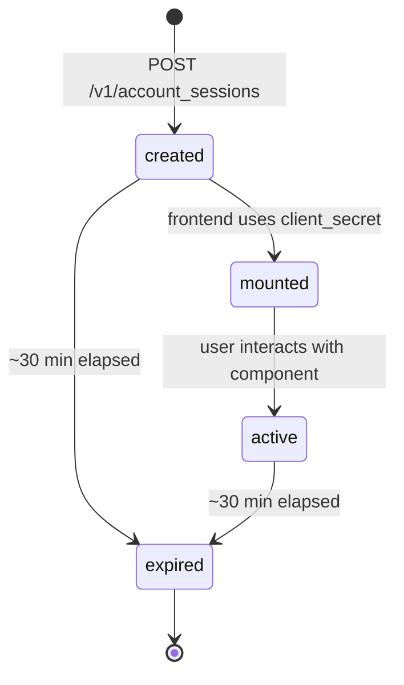
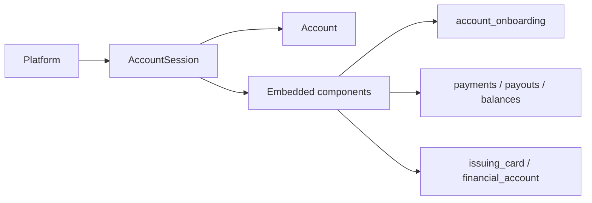

# Account Session

> API resource: `account_session` · API version: `2026-04-22.dahlia` · Category: [Connect](README.md)

## What it is

An `AccountSession` is a server-issued `client_secret` that authorizes one of Stripe's **Connect Embedded Components** — Stripe-hosted UI panels (onboarding, payouts, payment details, disputes, tax registrations, Issuing card UI, etc.) — to mount inside *your* platform's web app, scoped to **one specific connected [Account](accounts.md)**.

It is the inline counterpart to [AccountLink](account-links.md). With AccountLink you redirect off-domain to Stripe; with AccountSession you stay on your domain and embed Stripe's UI in an iframe-backed Web Component.

```
your-app.com  ──renders──>  <stripe-connect-account-onboarding>
                                  │
                                  └──auth (client_secret)──>  Stripe-hosted UI
                                                              for acct_xxx
```

## Why it exists

Embedded Components let platforms keep users in-app while still outsourcing the full Stripe UX (KYC forms, payout schedules, dispute evidence, balances, Issuing card details, document downloads, tax registration). Without it, you'd either redirect away (AccountLink), or rebuild a country-aware KYC form yourself against the [Account](accounts.md) / [Person](persons.md) / [Capability](capabilities.md) / [ExternalAccount](external-accounts.md) APIs.

The `client_secret` exists so the embedded component can talk to Stripe directly from the browser without holding your platform's secret key, while still being scoped to one connected account.

## Lifecycle & states



- **TTL ~30 minutes** from `created` (longer than AccountLink because users may sit on a single page for a while).
- **Single account scope.** A `client_secret` only authorizes the components for the `account` it was minted with. Switching accounts requires a new AccountSession.
- No `status` field. No `id` you can re-fetch. Treat the response as ephemeral.
- No webhooks for AccountSession itself. The downstream object events fire (e.g. `account.updated` when the user submits onboarding through the embedded component).

## Anatomy of the object

### Identity & auth

| Field | Notes |
|---|---|
| `object` | always `"account_session"` |
| `account` | `acct_…` this session is bound to. |
| `client_secret` | The token your frontend hands to `@stripe/connect-js`. **Treat as a credential** — don't log, don't ship to other tenants. |
| `expires_at` | unix seconds. ~30 min after creation. |
| `livemode` | true in live, false in test. Must match the connected account's livemode. |

### Components map

`components` is a nested object — one key per embedded component you want enabled — each with `enabled: true` plus an optional `features` object that toggles capabilities *within* that component. The set of available components evolves; current high-traffic ones include:

| Component key | Renders | Common `features` flags |
|---|---|---|
| `account_onboarding` | Hosted onboarding flow inline | `external_account_collection` |
| `account_management` | Self-serve account settings (business profile, branding, payout schedule) | `external_account_collection` |
| `payments` | List of charges + per-charge detail panel | `refund_management`, `dispute_management`, `capture_payments`, `destination_on_behalf_of_charge_management` |
| `payment_details` | Single-payment drilldown (often deep-linked from your own list) | same as `payments` |
| `payouts` | Payout history, manual payout button, schedule editor | `instant_payouts`, `standard_payouts`, `edit_payout_schedule`, `external_account_collection` |
| `payouts_list` | Compact list-only payouts view | (none) |
| `balances` | Available / pending balance breakdown by currency | `instant_payouts`, `standard_payouts`, `edit_payout_schedule` |
| `notification_banner` | Inline banner that surfaces required actions (KYC due, etc.) | `external_account_collection` |
| `documents` | 1099s, agreements, exported reports | (none) |
| `tax_settings` | Tax registration lookup / configuration | (none) |
| `tax_registrations` | Detailed tax registration management | (none) |
| `disputes_list` | List of open disputes | (none) |
| `instant_payouts_promotion` | Marketing CTA toggling instant payouts on | (none) |
| `app_install` / `app_viewport` | Stripe Apps surfaces inside the connected account context | (varies per app) |
| `issuing_card` | Single Issuing card details (PAN reveal, controls) | `card_management`, `cardholder_management`, `spend_controls` |
| `issuing_cards_list` | List of Issuing cards | same |
| `financial_account` | Treasury financial account dashboard | `external_account_collection`, `send_money`, `transfer_balance` |
| `financial_account_transactions` | Treasury transaction list | `card_spend_dispute_management` |

> The available component keys and their `features` change with new Connect releases. Treat anything not in your current API reference as "may not exist on the dahlia release" — don't enable it unconditionally.

### What `enabled` vs `features` does

- `components.<key>.enabled = true` — turns the component on at all. Required to mount it.
- `components.<key>.features.<feature> = true|false` — fine-grained switch. E.g. `payouts.features.instant_payouts = false` hides the instant-payout button while still showing the rest of the payouts UI.

Setting `enabled = false` (or omitting the key) means `@stripe/connect-js` will refuse to mount that component.

## Relationships



A session is one-to-one with an Account at issue time. The components mounted with it can read/write the same Account, its [Persons](persons.md), [Capabilities](capabilities.md), [ExternalAccounts](external-accounts.md), and (for issuing/treasury components) Issuing/Treasury sub-resources.

## Common workflows

### 1. Embed onboarding inline

Server:

```http
POST /v1/account_sessions
  account=acct_1Nxxx
  components[account_onboarding][enabled]=true
  components[account_onboarding][features][external_account_collection]=true
```

Browser:

```html
<script src="https://connect-js.stripe.com/v1.0/connect.js"></script>
<script>
  const stripeConnect = StripeConnect({
    publishableKey: 'pk_live_…',
    fetchClientSecret: async () => {
      const r = await fetch('/api/account_session', { method: 'POST' });
      const { client_secret } = await r.json();
      return client_secret;
    },
  });
  stripeConnect.create('account-onboarding')
    .mount('#onboarding-container');
</script>
```

The component renders the same forms a hosted AccountLink flow would, but inside your page. Watch `account.updated` for completion (same as AccountLink).

### 2. Embed a payouts dashboard

```http
POST /v1/account_sessions
  account=acct_1Nxxx
  components[payouts][enabled]=true
  components[payouts][features][instant_payouts]=true
  components[payouts][features][edit_payout_schedule]=true
  components[payouts][features][external_account_collection]=true
```

Mount `<stripe-connect-payouts>`. The connected account's owner can now view, schedule, and (if enabled) trigger instant payouts without leaving your app.

### 3. Bundle multiple components in one session

A single AccountSession can authorize many components at once. Cheaper than minting one per page:

```http
POST /v1/account_sessions
  account=acct_1Nxxx
  components[account_management][enabled]=true
  components[notification_banner][enabled]=true
  components[balances][enabled]=true
  components[payouts][enabled]=true
  components[disputes_list][enabled]=true
```

Cache the `client_secret` for ~25 minutes (slightly under the 30-minute TTL) and reuse across page loads for the same account.

### 4. Refresh on expiry

`@stripe/connect-js` will call your `fetchClientSecret` again when the current secret expires. Your backend handler should mint a new AccountSession for the same account.

## Webhook events

AccountSession itself does not emit events. Components that mutate state cause the normal webhooks to fire on the affected sub-resources:

| Source object | Event |
|---|---|
| Account | `account.updated`, `capability.updated` |
| ExternalAccount | `account.external_account.created/updated/deleted` |
| Person | `person.created/updated/deleted` |
| Payout | `payout.created/paid/failed/...` |
| Dispute | `charge.dispute.updated/closed` |

## Idempotency, retries & race conditions

- Sending an `Idempotency-Key` on `POST /v1/account_sessions` is fine but typically unnecessary — sessions are short-lived, and a duplicate just means an extra unused secret.
- The `client_secret` is single-tenant by design. Don't reuse one issued for `acct_A` to render `acct_B`'s components — `@stripe/connect-js` will reject it, but more importantly your server logic shouldn't be in a position to mix them up. Always derive `account` from the authenticated platform user, never from a request param.
- The components surface live state directly from Stripe; you generally don't need to reconcile against your own DB after a user interacts. Webhooks remain the source of truth for *your* backend.

## Test-mode tips

- Use a `pk_test_…` publishable key with a test-mode `account_session` against a test connected account. Mixing modes hard-fails the mount.
- Stripe ships a "Component Playground" in test mode at the Connect dashboard — useful for previewing what each `components.<key>.features` toggle hides/shows before wiring it in your app.
- Test card numbers and ACH details from [PaymentMethod](../02-payment-methods/payment-methods.md) work inside the embedded payments component the same way they do in Checkout.

## Connect considerations

- **Account types supported.** Embedded Components work for `express` and `custom`. Most components also work on accounts under the newer **`controller`** model regardless of legacy `type`. Some components (e.g. `account_onboarding`) explicitly do not work for Standard accounts — Standard accounts manage themselves at stripe.com.
- **CSP.** You'll need to allow `https://connect-js.stripe.com` and `https://js.stripe.com` plus `frame-src https://*.stripe.com`. The components are iframe-backed.
- **Branding.** Stripe pulls colors / fonts / logo from `Account.settings.branding` (or platform defaults) — the embedded component visually matches what AccountLink would show.
- **Per-component pricing / availability.** Issuing and Treasury components only render if those products are enabled on the platform and the relevant capabilities are active on the connected account.

## Common pitfalls

- **Holding the `client_secret` longer than its TTL** — the component silently dies. Implement `fetchClientSecret` to mint fresh on demand rather than caching forever.
- **Logging the `client_secret`** — it's a credential. Treat it like a session token: HTTPS only, no application logs, no client-side persistence beyond the in-memory mount.
- **Issuing one session per component on the same page** — wasteful and racy. One session, many `components[*]`.
- **Forgetting `features` flags default to `false`.** If you mount `payouts` without `features.instant_payouts=true`, the user won't see the instant-payout button even if their account supports it.
- **Mixing live and test keys.** Connect-js mount fails with a confusing error. Match livemode end-to-end.
- **Trying to mount `account_onboarding` for a Standard account.** Returns an error from `account_sessions.create`.
- **Assuming the embedded UI can do *more* than the API.** It can't — same backend, same restrictions. If the connected account can't do something via the regular API, the component will surface the same blocker (usually as an inline banner pointing at the failing requirement).

## Further reading

- [API reference: Account Session](https://docs.stripe.com/api/account_sessions/object)
- [Connect Embedded Components overview](https://docs.stripe.com/connect/get-started-connect-embedded-components)
- [Customize Connect embedded components](https://docs.stripe.com/connect/customize-connect-embedded-components)
- [`@stripe/connect-js` reference](https://docs.stripe.com/connect/supported-embedded-components)
- [AccountLink (redirect alternative)](account-links.md)
