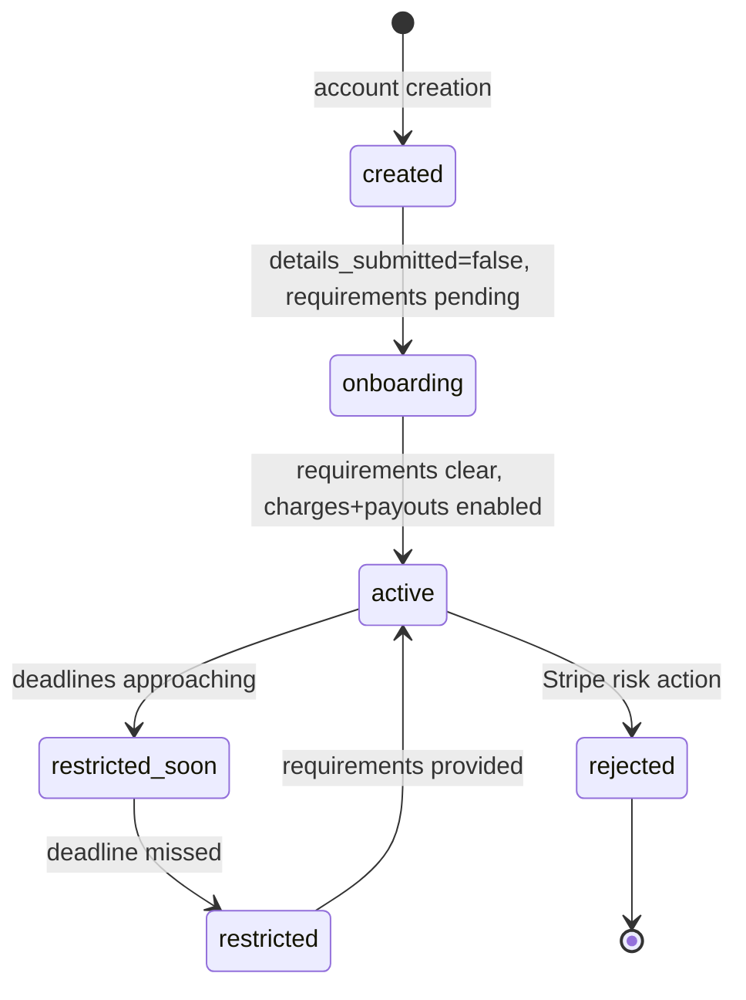
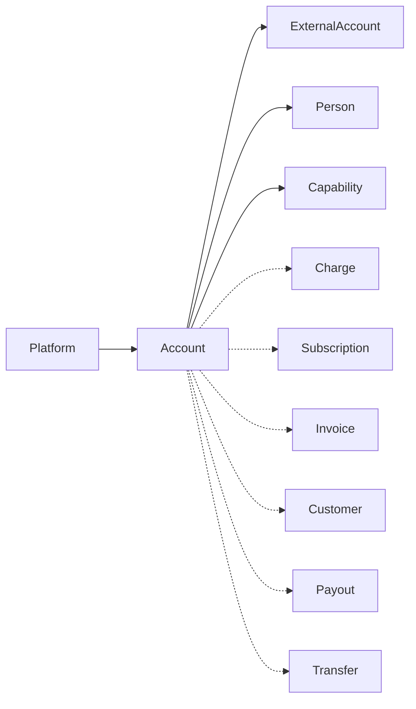

# Account (Connect)

> API resource: `account` · API version: `2026-04-22.dahlia` · Category: [Connect](README.md)

## What it is

In a Connect platform, an `Account` represents one of your *connected accounts* — a merchant, creator, or seller that uses your platform but transacts through your Stripe relationship. It is the central object of Connect: it carries identity (KYC), capabilities (what it's allowed to do), bank routing for payouts, and the requirement state machine that drives onboarding.

Note: there is also "*your* Stripe account" (the platform), but that one isn't accessed via the `Account` resource — that's the implicit account behind your API key. The `Account` resource is for the *connected* accounts you manage.

There are three account *types*, which behave very differently:

- **Standard** — the connected account is a full Stripe account; the merchant logs into Stripe directly to manage settings, see disputes, etc. Lightest integration; least platform control.
- **Express** — Stripe handles onboarding via a hosted flow and a slimmed-down Express Dashboard. Platform sets fees and disputes are routed to platform.
- **Custom** — platform handles every UI; Stripe is just the API. Most flexible, most work.

(There used to be a fourth, "Restricted." Modern term is just a *capability* state on Custom/Express.)

## Why it exists

Connect platforms move money between two parties (e.g. a marketplace between buyers and sellers, a SaaS that takes payments on behalf of its merchants). Each seller's identity, bank details, capability status, and risk profile must be tracked separately. Account is the per-seller container.

## Lifecycle & states

There is no single `status` field. The Account's "are they ready to transact?" state is a function of:

1. **`charges_enabled`** — can this account *take* payments?
2. **`payouts_enabled`** — can Stripe *pay out* to this account's bank?
3. **`details_submitted`** — has the account completed onboarding fields?
4. **`requirements`** — what's outstanding to satisfy Stripe / regulators.
5. **`capabilities`** — per-product permissions (e.g. `card_payments`, `transfers`, `treasury`).



The transitions above don't map to a single field; you derive them from the requirements/capabilities sub-objects.

### Requirements lifecycle

```
requirements.currently_due[]      → must provide before next deadline
requirements.eventually_due[]     → must provide eventually
requirements.past_due[]           → deadline passed; capabilities disabled
requirements.pending_verification[] → submitted, Stripe is checking
requirements.disabled_reason      → why charges/payouts are off, if so
requirements.current_deadline     → hard deadline, unix seconds
requirements.errors[]             → Stripe rejected something (bad ID photo, etc.)
```

Watch `account.updated` events to react when this state changes.

### Capability state machine

Each capability (`card_payments`, `transfers`, `legacy_payments`, `treasury`, `tax_reporting_us_1099_k`, `card_issuing`, `klarna_payments`, `afterpay_clearpay_payments`, `us_bank_account_ach_payments`, etc.) can be in:

- **`inactive`** — not requested.
- **`pending`** — requested, Stripe verifying.
- **`active`** — granted; usable.
- **`restricted`** — granted but disabled because requirements lapsed.
- **`unrequested`** — never asked for.

You request capabilities via `POST /v1/accounts/:id` with `capabilities[card_payments][requested]=true`.

## Anatomy of the object

### Identity

| Field | Notes |
|---|---|
| `id` | `acct_…` |
| `type` | `standard | express | custom` |
| `country` | ISO-2. **Immutable.** Determines which products are available. |
| `default_currency` | Settlement currency. Mostly determined by `country`. |
| `email` | Owner's email; receives Stripe communications (Standard). |
| `business_type` | `individual | company | non_profit | government_entity`. |
| `business_profile` | Shop name, support contact, MCC, URL, product description. Required for activating capabilities. |
| `details_submitted` | Boolean: hosted onboarding completed. |
| `created` | unix seconds. |

### Permissions / outcomes

| Field | Notes |
|---|---|
| `charges_enabled` | Can take payments today? |
| `payouts_enabled` | Can payouts run today? |
| `requirements` | The big requirement bag. **Watch this.** |
| `future_requirements` | What will be due *after* the current deadline. Helpful for UX warnings. |
| `capabilities` | Per-capability state. |

### Identity sub-objects

| Field | Notes |
|---|---|
| `individual` | Subobject for sole-prop / individual accounts: name, DOB, ID number, address, verification documents. |
| `company` | Subobject for entities: legal name, tax ID, registered address, structure, directors, owners. Owners are tracked as separate [Person](persons.md) objects. |
| `tos_acceptance` | `date`, `ip`, `user_agent` of when ToS was accepted. Required for activation. Standard accounts handle this themselves. |

### Banking

| Field | Notes |
|---|---|
| `external_accounts` | List of [ExternalAccount](external-accounts.md)s — bank accounts and debit cards used for payouts. |
| `default_currency` | What balance is paid out in. Multi-currency platforms have multiple available external accounts per currency. |
| `settings.payouts.schedule` | When payouts run: `manual | interval=daily/weekly/monthly | delay_days`. |

### Settings (account-wide)

| Field | Notes |
|---|---|
| `settings.branding` | Logo, icon, primary color — used on receipts, invoices, hosted pages. |
| `settings.card_payments` | Decline rules, statement descriptor prefix. |
| `settings.dashboard.display_name` | What customers see. |
| `settings.payments.statement_descriptor` | Default descriptor for charges. |
| `settings.payouts` | Cadence + descriptor. |
| `settings.bacs_debit_payments`, `settings.sepa_debit_payments`, `settings.treasury` | per-product settings. |
| `settings.invoices.default_account_tax_ids` | Tax IDs printed on invoices. |

### Connect-platform-only fields

| Field | Notes |
|---|---|
| `controller` | Subobject (newer model) describing who controls fees, disputes, requirement collection, losses. Replaces `type` for finer control. |
| `metadata` | Platform's bag. |

## Relationships



Persons, ExternalAccounts, and Capabilities are sub-resources scoped to one Account.

## Common workflows

### 1. Create an Express account and onboard

```http
POST /v1/accounts
  type=express
  country=US
  email=seller@example.com
  capabilities[card_payments][requested]=true
  capabilities[transfers][requested]=true
```

Then:

```http
POST /v1/account_links
  account=acct_…
  refresh_url=https://yourapp.com/connect/refresh
  return_url=https://yourapp.com/connect/return
  type=account_onboarding
```

Send the user to `account_link.url`. They complete Stripe-hosted onboarding. Watch `account.updated` for `details_submitted: true` and capabilities going `active`.

### 2. Embed onboarding inline (Connect Embedded Components)

```http
POST /v1/account_sessions
  account=acct_…
  components[account_onboarding][enabled]=true
```

Use the returned `client_secret` with `<stripe-connect-account-onboarding>` in your frontend. See [AccountSession](account-sessions.md).

### 3. Create a Custom account programmatically

```http
POST /v1/accounts
  type=custom
  country=US
  email=seller@example.com
  business_type=individual
  capabilities[card_payments][requested]=true
  capabilities[transfers][requested]=true
  individual[first_name]=Jane individual[last_name]=Doe
  individual[email]=jane@example.com
  individual[dob][year]=1990 individual[dob][month]=1 individual[dob][day]=1
  individual[address][line1]=…
  external_account=btok_…
  tos_acceptance[date]=…
  tos_acceptance[ip]=…
```

You're responsible for collecting every requirement. Inspect `requirements.currently_due` and provide each.

### 4. Request a new capability post-onboard

```http
POST /v1/accounts/acct_…/capabilities/treasury
  requested=true
```

New requirements may appear; watch `account.updated` for the additions to `requirements.currently_due`.

### 5. Update bank account / payout schedule

```http
POST /v1/accounts/acct_…/external_accounts
  external_account=btok_…
  default_for_currency=true
```

```http
POST /v1/accounts/acct_…
  settings[payouts][schedule][interval]=weekly
  settings[payouts][schedule][weekly_anchor]=friday
```

### 6. Reject (Stripe-side soft rejection by platform)

```http
POST /v1/accounts/acct_…/reject
  reason=fraud
```

Platform marks an account as rejected. Future charges/payouts blocked.

### 7. Delete

```http
DELETE /v1/accounts/acct_…
```

Allowed only for accounts created by the platform that have no outstanding balance. Standard accounts can't be deleted by the platform — the merchant must close their own account.

## Webhook events

| Event | Fires when |
|---|---|
| `account.updated` | **Almost any change**, including capability flips, requirement changes, charges/payouts enable/disable, branding edits. **Subscribe and process this carefully.** |
| `account.application.authorized` | A new account connected via OAuth (Standard). |
| `account.application.deauthorized` | Account disconnected from your platform. **Stop trying to operate on it.** |
| `account.external_account.created/updated/deleted` | Bank/card additions. |
| `capability.updated` | Per-capability change. Granular alternative to `account.updated` if you only care about one. |
| `person.created/updated/deleted` | Owners/directors changed. |

> Use `account.updated` as your primary signal — it's a superset.

## Idempotency, retries & race conditions

- Account create: send `Idempotency-Key`.
- `account.updated` fires constantly during onboarding (every requirement provided). Handlers must be idempotent and refetch on each event.
- A capability can flip `active → restricted → active` in under a minute as Stripe's verification queue processes; don't lock UI based on a stale snapshot.

## Test-mode tips

- Account onboarding has a "skip ahead" button in test mode that fills realistic test data.
- Use OnTest CLI: `stripe accounts create --type=express --country=US --email=test@example.com`.
- For Custom, special test SSNs:
  - `000000000` — auto-success on identity verification.
  - `111111111` — triggers manual review.
  - `222222222` — fails verification.
- Test bank tokens: `btok_us_verified` (always passes), `btok_us_verified_pending` (pending), `btok_us_unverified` (errors).

## Connect considerations (yes, even more on the Account itself)

- **Charges on a connected account**: see [Charge](../01-core-resources/charges.md) → "Connect considerations." Direct vs destination vs separate-charges-and-transfers.
- **Application fees**: every charge on a connected account that you took a cut from creates an [ApplicationFee](application-fees.md).
- **Loss liability**: by default, the connected account bears chargeback losses (Standard, Express). For Custom you can configure platform liability.
- **Embedded components** (`AccountSession`) let you put Stripe-hosted account UIs (onboarding, payouts, payment details) inside your platform's UI without rebuilding them.

## Common pitfalls

- **Watching only `details_submitted`** — that's "they finished hosted onboarding" but capabilities can still be `pending` or `restricted`. Always check `charges_enabled` + `payouts_enabled` + the specific capability you care about.
- **Polling `account` instead of subscribing to `account.updated`.** Polling is slow and rate-limited.
- **Not handling `account.application.deauthorized`.** A Standard account can disconnect from your platform any time. Continuing to call APIs against them returns `authentication_error`. Mark them disabled in your DB on this event.
- **Treating `requirements.eventually_due` as urgent.** It's not — `currently_due` is. The deadline you care about is `requirements.current_deadline`.
- **Forgetting that Standard accounts own their settings.** You can't change a Standard account's branding, statement descriptors, or payout schedule via API — only the merchant can, in their own Dashboard. Use Custom or Express if you need that control.
- **Mixing `country` with currency expectations.** A US account pays out in USD. A French account pays out in EUR. Plan multi-currency in your platform UX.
- **Using `account.business_profile.url` as a unique identifier.** It's not. Use `id`.
- **Creating Accounts before you know which type you need.** You can't change `type` after creation. Decide Standard / Express / Custom up front based on:
  - How much UI control you want.
  - Who eats chargeback losses.
  - Who handles requirement collection.

## Further reading

- [API reference: Account](https://docs.stripe.com/api/accounts/object)
- [Connect overview](https://docs.stripe.com/connect)
- [Choose your account type](https://docs.stripe.com/connect/accounts)
- [Capabilities](https://docs.stripe.com/connect/account-capabilities)
- [Required information by country](https://docs.stripe.com/connect/required-verification-information)
