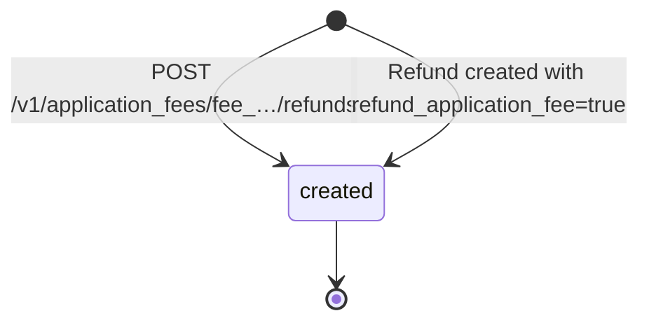
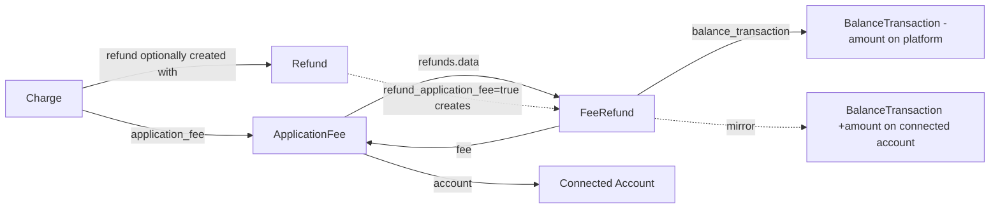

# Application Fee Refund

> API resource: `fee_refund` · API version: `2026-04-22.dahlia` · Category: [Connect](README.md)

## What it is

A `FeeRefund` (event-name: `application_fee.refund.*`) is a partial or full reversal of an [ApplicationFee](application-fees.md). Where the ApplicationFee credited your platform's balance, a FeeRefund debits it — moving the money back to the connected account whose Charge originally produced the fee.

It is the platform's tool for "give the merchant their cut back," typically because the originating Charge is being refunded. Unlike a [Refund](../01-core-resources/refunds.md), which moves money back to the *customer*, a FeeRefund moves money back to the *connected account*.

## Why it exists

When a Charge on a connected account is refunded, three parties may need to be made whole:

1. The customer — handled by [Refund](../01-core-resources/refunds.md).
2. The connected account — needs the original gross amount put back; this is the underlying refund.
3. The platform — needs to give back the cut it took, otherwise the connected account is paying twice (once for the customer refund, once for the platform's retained fee).

FeeRefund is part #3. Without it, refunding a charge while keeping the application fee silently transfers risk and money to the connected account in ways neither party expects.

## Lifecycle & states

FeeRefund has no `status` field. It is created → it exists. There is no failure state and no asynchronous settlement (the money is already inside Stripe's ledger; moving it between two Stripe balances is instantaneous).



The parent `ApplicationFee` tracks the running total: `amount_refunded` increments and `refunded` flips to `true` once cumulative refunds equal `fee.amount`.

## Anatomy of the object

### Identity

| Field | Notes |
|---|---|
| `id` | `fr_…` |
| `object` | `"fee_refund"` |
| `created` | unix seconds |

### Money

| Field | Notes |
|---|---|
| `amount` | Refunded amount, in the smallest unit. ≤ remaining (`fee.amount − fee.amount_refunded`) at create time. |
| `currency` | Three-letter ISO. Always equals the parent fee's currency. |

### Pointers

| Field | Notes |
|---|---|
| `fee` | `fee_…` of the parent [ApplicationFee](application-fees.md). |
| `balance_transaction` | `txn_…` — the platform-side ledger entry (a **debit** on your platform balance). The mirror credit on the connected account is also a `BalanceTransaction` of `type: application_fee_refund` on that account. |

### User-set

| Field | Notes |
|---|---|
| `metadata` | Up to 50 key/value pairs. Use this to tie the refund back to your own refund record, support ticket, etc. |

There is no `livemode` field on `fee_refund` — it inherits the parent fee's mode.

## Relationships



Every FeeRefund belongs to exactly one ApplicationFee. Multiple partials are allowed (up to `fee.amount`), so an ApplicationFee can have many FeeRefunds.

If created via `Refund.refund_application_fee=true`, the FeeRefund is *associated* with that Refund (and you can find it via the parent fee's `refunds` sub-list), but there is no formal `refund` field on the FeeRefund object itself in current API versions — match by timing and amount, or store the link in your own DB at create time.

## Common workflows

### 1. Refund the fee as part of refunding the charge (the common case)

```http
POST /v1/refunds
  charge=ch_…
  refund_application_fee=true
  -H "Idempotency-Key: refund-ch_…-1"
```

For a destination charge with both `application_fee_amount` and `transfer_data.destination`, you'll usually want all of:

```http
POST /v1/refunds
  charge=ch_…
  refund_application_fee=true
  reverse_transfer=true
  -H "Idempotency-Key: refund-ch_…-1"
```

This refunds the customer, reverses the Transfer to put the money back on the platform, and refunds the application fee — making the entire transaction "as if it never happened."

### 2. Refund the fee manually (without touching the customer)

Use this when the merchant deserves a fee credit but the customer keeps the goods. E.g. you're refunding *only* the platform fee as a goodwill credit to the connected account.

```http
POST /v1/application_fees/fee_…/refunds
  amount=100
  metadata[reason]=goodwill_credit
  -H "Idempotency-Key: fr-fee_…-goodwill-1"
```

### 3. Multiple partial fee refunds

```http
POST /v1/application_fees/fee_…/refunds amount=50
POST /v1/application_fees/fee_…/refunds amount=50
POST /v1/application_fees/fee_…/refunds amount=50   # 400 if remaining < 50
```

Each request must respect `remaining = fee.amount − fee.amount_refunded`. After the third call, `fee.amount_refunded == fee.amount` and `fee.refunded == true`; further calls 400.

### 4. List refunds on a fee

```http
GET /v1/application_fees/fee_…/refunds?limit=10
```

### 5. Update a FeeRefund

Only `metadata` is mutable.

```http
POST /v1/application_fees/fee_…/refunds/fr_…
  metadata[ticket]=ZD-12345
```

## Webhook events

| Event | Fires when | Listener typically does |
|---|---|---|
| `application_fee.refunded` | A FeeRefund was attached to an ApplicationFee. **Fires per refund**, even partial. The event payload is the parent ApplicationFee (with the new fr in `refunds.data`). | Reverse booked platform revenue; sync new state. |
| `application_fee.refund.updated` | A FeeRefund's metadata or other fields change. The event payload is the FeeRefund itself. | Resync local copy. |

> There is no `application_fee.refund.created` event — `application_fee.refunded` plays that role and re-emits the parent fee. Some integrations expect a `*.created` event by analogy with Refund; do not.

## Idempotency, retries & race conditions

- `POST /v1/application_fees/:id/refunds` **must** carry an `Idempotency-Key` — the same key returns the same FeeRefund.
- `POST /v1/refunds` with `refund_application_fee=true` is also idempotency-keyable; the same key returns the same Refund (and the FeeRefund created alongside is the same one).
- Race: refunding a fee, then a second user-initiated `POST /v1/refunds … refund_application_fee=true` arrives. The second request's fee refund will succeed only for the *remaining* amount on the fee. If the fee was already fully refunded, the Refund is created but no new FeeRefund is — and the API returns the Refund without warning. Read `application_fee.amount_refunded` to confirm.
- Webhook ordering: `charge.refunded`, `refund.created`, and `application_fee.refunded` for the same logical event can arrive in any order. Treat handlers as set-style ("refund X exists, fee refund Y exists"), not increment-style.

## Test-mode tips

- Same as ApplicationFee — any successful test charge with `application_fee_amount` produces a fee you can refund.
- `stripe trigger application_fee.refunded` emits a fixture event for handler tests.
- No magic test card path is needed — refunds in test mode succeed instantly.

## Connect considerations

FeeRefund is Connect-only. Notes:

- The connected account sees the inbound mirror as a `BalanceTransaction` of `type: application_fee_refund` on its ledger. It does **not** receive an `application_fee.refunded` webhook — that goes to the platform.
- For destination charges, `refund_application_fee=true` does **not** by itself reverse the underlying Transfer. To make the connected account whole-but-not-double-paid you also need `reverse_transfer=true` on the same Refund (which creates a [TransferReversal](transfer-reversals.md)).
- For direct charges, there is no Transfer to reverse — the funds were always on the connected account. `refund_application_fee=true` is the only Connect-specific knob.
- Permissions: only the **platform** can create FeeRefunds. The connected account cannot — even though the money lands on its balance.

## Common pitfalls

- **Refunding the fee but not the charge.** The connected account paid out goods *and* gets the platform's cut back without the customer being refunded — usually not what you want. Refund coordination should be: refund customer + refund fee + (for destination charges) reverse transfer, all in one operation.
- **Refunding the charge without `refund_application_fee=true`.** The mirror pitfall. Customer is refunded, connected account loses the gross, platform keeps its cut. The seller silently absorbs the platform's fee on a refund.
- **Forgetting `reverse_transfer=true` on destination-charge refunds.** Without it, the customer is refunded *from the platform's balance* but the connected account already received the Transfer. Result: platform is out the gross amount; connected account is up by the original net. Use `reverse_transfer=true` to claw the Transfer back.
- **Partial refunds that exceed remaining.** Calling for more than `fee.amount − fee.amount_refunded` 400s. Always read the live fee state before issuing a partial refund — don't trust a stale snapshot.
- **Tracking refund totals manually.** Trust `fee.amount_refunded`. If you sum local FeeRefund amounts and they don't match, it's almost always a missed webhook in your DB, not a Stripe bug.
- **Assuming `refunded: true` on the FeeRefund.** That field is on the parent `ApplicationFee`, not the FeeRefund itself.

## Further reading

- [API reference: FeeRefund](https://docs.stripe.com/api/fee_refunds/object)
- [Refund the application fee](https://docs.stripe.com/connect/destination-charges#issuing-refunds)
- [ApplicationFee](application-fees.md) — parent object.
- [Refund](../01-core-resources/refunds.md) — the customer-facing sibling.
- [TransferReversal](transfer-reversals.md) — what `reverse_transfer=true` creates.
