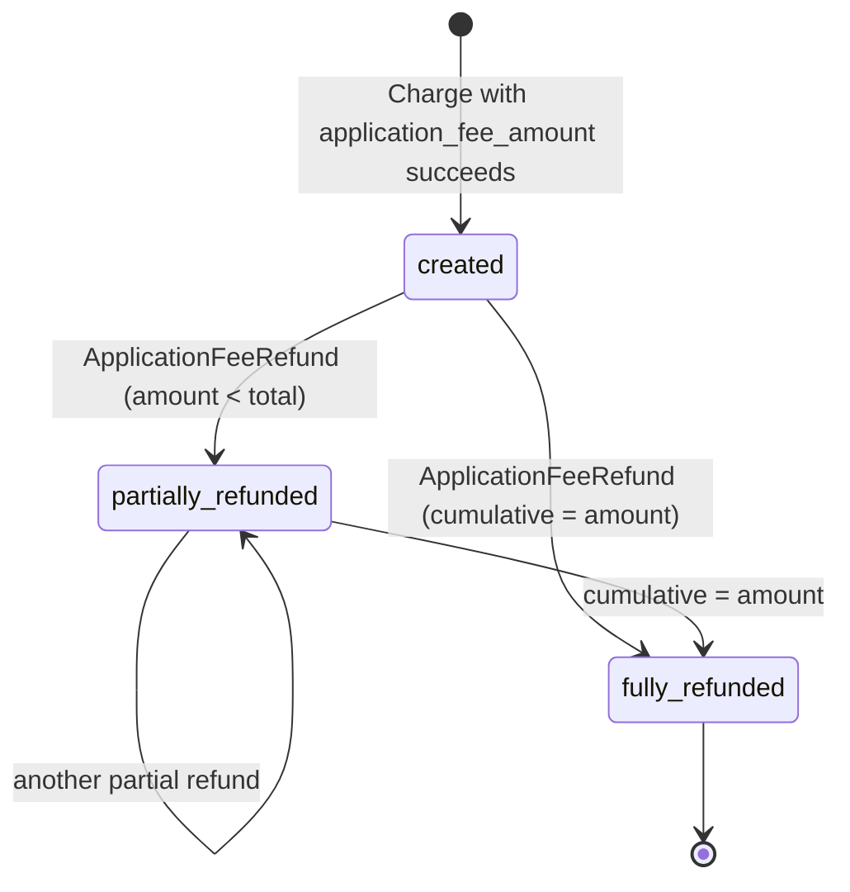
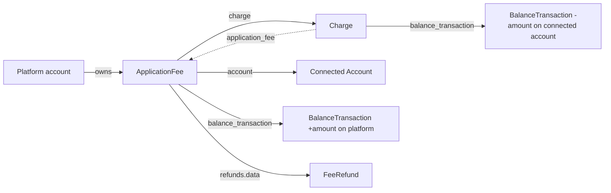

# Application Fee

> API resource: `application_fee` · API version: `2026-04-22.dahlia` · Category: [Connect](README.md)

## What it is

An `ApplicationFee` is the cut your Connect platform took out of a charge that was processed on a connected account. It is a *receipt of revenue* — proof, on Stripe's ledger, that a slice of one specific [Charge](../01-core-resources/charges.md) moved from the connected account's balance into your platform's balance.

You don't create ApplicationFees directly. Stripe creates one, automatically, every time a Charge succeeds with `application_fee_amount` set — whether that Charge was a *direct charge* on the connected account or a *destination charge* on the platform with `transfer_data.destination`. One Charge that triggered a fee → exactly one ApplicationFee.

## Why it exists

Without an ApplicationFee object, the platform's revenue from Connect would be invisible — buried inside whatever Charge it came from. With it:

- Reconciliation has a first-class object per fee, with its own `BalanceTransaction`.
- Refunds of the platform's cut (see [ApplicationFeeRefund](application-fee-refunds.md)) have something to attach to.
- Webhooks (`application_fee.created`, `application_fee.refunded`) let your platform book revenue independently of the underlying Charge.

If you reach for ApplicationFee directly, it's almost always to read or refund — the *creation* is implicit, set on the Charge / PaymentIntent.

## Lifecycle & states

ApplicationFee has no `status` field. Its lifecycle is binary: it exists, and it may or may not be (partially) refunded.



Decoding the state from fields:

| Field | Meaning |
|---|---|
| `refunded` | Boolean. **True only when fully refunded.** Do not use to detect *any* refund. |
| `amount_refunded` | Cumulative across all attached `FeeRefund`s. Use `amount_refunded > 0` for "any refund exists." |

There is no terminal "voided" — you can refund up to `amount` and that's it.

## Anatomy of the object

### Identity

| Field | Notes |
|---|---|
| `id` | `fee_…` |
| `object` | `"application_fee"` |
| `livemode` | mode flag |
| `created` | unix seconds |

### Money

| Field | Notes |
|---|---|
| `amount` | The fee amount, in the smallest unit of `currency`. Equals the `application_fee_amount` you set on the Charge / PI. |
| `currency` | Three-letter ISO. Matches the originating Charge's currency. |
| `amount_refunded` | Cumulative refunded amount across all `FeeRefund`s. |

### Pointers

| Field | Notes |
|---|---|
| `account` | `acct_…` of the **connected account** that processed the originating Charge. The fee is debited from this account's balance. |
| `application` | `ca_…` of your platform's OAuth application (the Connect platform). Identifies "who took the fee." |
| `charge` | `ch_…` — the originating Charge. **Always present.** |
| `originating_transaction` | For separate-charges-and-transfers: the platform-side Charge that funded the Transfer that produced this fee. May be null otherwise. |
| `balance_transaction` | `txn_…` — the platform-side ledger entry (a **credit** on your platform balance). Source of truth for "we earned this much net." |
| `fee_source` | Subobject indicating where the fee came from (charge vs payout). New-ish field; hedge: not present in older API versions. |

### Refund subresource

| Field | Notes |
|---|---|
| `refunded` | Boolean — true iff fully refunded. |
| `refunds` | `{ data: [FeeRefund, …], has_more, total_count, url }`. Up to 10 inline; paginate via `/v1/application_fees/fee_…/refunds` for the rest. |

## Relationships



Two ledgers, one fee:

- The connected account's `BalanceTransaction` shows the fee as a **deduction** (`type: application_fee`, negative).
- The platform's `BalanceTransaction` (the one on `application_fee.balance_transaction`) shows the same number as a **credit** (`type: application_fee`, positive).

These mirror each other — exactly the same `amount`, opposite signs, on different account ledgers. This is the dual-entry bookkeeping that makes Connect reconcilable.

## Common workflows

### 1. Take a fee on a direct charge

```http
POST /v1/payment_intents
  Stripe-Account: acct_CONNECTED
  amount=10000
  currency=usd
  payment_method_types[]=card
  application_fee_amount=200
```

When the PI succeeds, Stripe creates an `ApplicationFee` (`fee_…`) with `account=acct_CONNECTED`, `amount=200`, `charge=ch_…`. You receive `application_fee.created` on the **platform** webhook endpoint.

### 2. Take a fee on a destination charge

```http
POST /v1/payment_intents
  amount=10000
  currency=usd
  payment_method_types[]=card
  application_fee_amount=200
  transfer_data[destination]=acct_CONNECTED
```

Same outcome: an `ApplicationFee` is created when the PI succeeds. The Transfer to `acct_CONNECTED` is for `amount − application_fee_amount = 9800` (minus Stripe processing fees).

### 3. Read a fee's net effect

```http
GET /v1/application_fees/fee_…?expand[]=balance_transaction
```

`balance_transaction.net` is what your platform actually netted from this fee (it equals `amount` for an unfeed fee — Stripe doesn't charge a fee on the fee).

### 4. Refund a fee (manually)

```http
POST /v1/application_fees/fee_…/refunds
  amount=200
  -H "Idempotency-Key: refund-fee-fee_…-1"
```

Creates a [FeeRefund](application-fee-refunds.md). Multiple partials allowed up to `amount`.

### 5. Refund a fee as part of refunding the underlying charge

```http
POST /v1/refunds
  charge=ch_…
  refund_application_fee=true
```

Stripe creates the Refund **and** an associated FeeRefund for the entire fee. Without `refund_application_fee=true`, the Charge is refunded but the platform keeps its cut — see pitfalls.

### 6. List fees on the platform

```http
GET /v1/application_fees?charge=ch_…
GET /v1/application_fees?created[gte]=…&created[lt]=…
```

## Webhook events

Delivered to the **platform's** webhook endpoint (not the connected account's):

| Event | Fires when | Listener typically does |
|---|---|---|
| `application_fee.created` | A Charge with `application_fee_amount` succeeded; the fee object now exists. | Book platform revenue; reconcile against expected fee per Charge. |
| `application_fee.refunded` | An `ApplicationFeeRefund` was attached. **Fires per refund**, even partial. | Reverse booked revenue; update merchant statement. |
| `application_fee.refund.updated` | A FeeRefund's metadata or other fields change. | Resync local copy. |

> Note: there is no `application_fee.created` event sent to the connected account. The connected account sees the fee as a `BalanceTransaction` of `type: application_fee` instead.

## Idempotency, retries & race conditions

- ApplicationFee creation is implicit (driven by Charge success), so there's nothing for you to idempotency-key.
- Manual refund (`POST /v1/application_fees/:id/refunds`) **must** carry `Idempotency-Key`.
- `application_fee.created` may arrive **before** or **after** the matching `charge.succeeded` for the underlying Charge — order is not guaranteed across event types. If your handler needs both, key off the Charge ID and reconcile when both have arrived.
- Refunding a Charge with `refund_application_fee=true` produces both `charge.refunded` and `application_fee.refunded`. Don't double-book; treat one as the trigger and the other as confirmation.

## Test-mode tips

- Any successful test-mode Charge with `application_fee_amount` produces an ApplicationFee. No special card needed.
- `stripe trigger application_fee.created` and `stripe trigger application_fee.refunded` via the Stripe CLI emit fixture events (no real Charge required) — useful for handler unit tests.
- The connected account's test balance must have enough to cover the fee, but in test mode this is essentially never a constraint.

## Connect considerations

ApplicationFee **only** exists in Connect — it is a Connect-native object. A few subtleties:

- The connected account can see the fee as a `BalanceTransaction` of `type: application_fee` on its own ledger, but cannot list or modify the `ApplicationFee` object — that's platform-only.
- For *separate charges and transfers*, the fee model is different: the platform charges the customer to itself (no fee), then creates a Transfer with `application_fee_amount` (which produces a fee debited from the connected account when it receives the transfer). The `originating_transaction` field links back to the platform's Charge.
- For *direct charges*, fees are taken in the connected account's currency.
- For *destination charges*, fees are in the platform's currency (matches the Charge's currency).
- Across all three, the fee amount is your responsibility — Stripe takes its own processing fee separately, *out of the same pool*. Don't promise the connected account a fixed split without subtracting Stripe's processing fee from somebody's share first.

## Common pitfalls

- **Assuming Stripe auto-refunds the platform fee on charge refund.** It does not. `POST /v1/refunds charge=ch_…` returns the customer's money but leaves your fee untouched. The connected account is now down by the gross amount but you kept your cut — you've just turned a marketplace transaction into pure platform revenue at the seller's expense. Pass `refund_application_fee=true` on the Refund unless that's intentional.
- **Treating `refunded: true` as "a refund happened."** It's true only on *full* refund. Use `amount_refunded > 0` to detect partial activity.
- **Reading `application_fee.amount` as net revenue.** Net = `application_fee.balance_transaction.net`. They're equal today (Stripe doesn't fee-the-fee), but build the dependency on `balance_transaction.net` so future Stripe pricing changes don't silently break your books.
- **Subscribing to `application_fee.created` on the connected account's webhook endpoint.** Wrong endpoint. The platform receives this event; the connected account does not.
- **Building reconciliation off `Charge.application_fee_amount`.** That's the *requested* fee; the *actual* fee object (created at charge success) is the source of truth. They're equal in normal cases, but only the `ApplicationFee` has an authoritative `BalanceTransaction`.
- **Forgetting that fees track the connected account's currency on direct charges.** A platform that bills in USD but takes fees on EUR direct charges will accumulate EUR balances — plan FX or sweep them.

## Further reading

- [API reference: ApplicationFee](https://docs.stripe.com/api/application_fees/object)
- [Collect application fees](https://docs.stripe.com/connect/collect-then-transfer-guide)
- [Charge → Connect considerations](../01-core-resources/charges.md) — how fees attach to each Charge type.
- [Money flow](../_meta/money-flow.md) — where ApplicationFees fit in the ledger.
