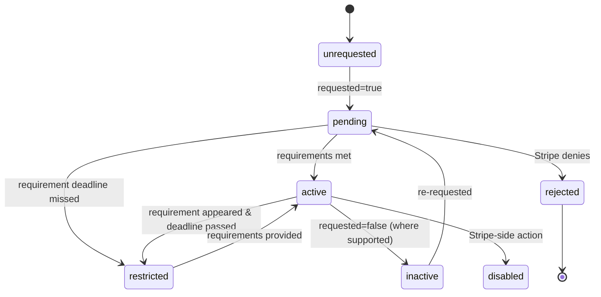
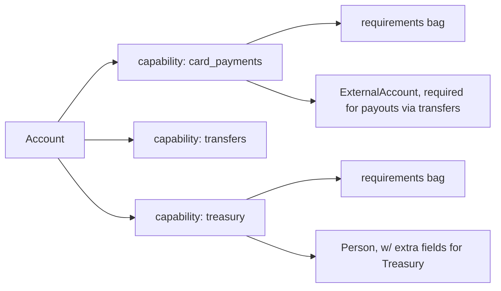

# Capability

> API resource: `capability` · API version: `2026-04-22.dahlia` · Category: [Connect](README.md)

## What it is

A `Capability` is a per-product permission grant on a connected [Account](accounts.md). Each capability is a separate object and answers one specific question: *"is this account allowed to do X?"* — where X is something like "accept card payments," "receive transfers from the platform," "issue cards," "hold a Treasury balance," or "be sent Klarna payments."

A connected account is a *bag of capabilities*. The Account itself is just an identity + KYC envelope. Whether it can *do anything* — take payments, get paid out, hold money, issue cards — is determined entirely by which capabilities are `active`.

```
Account acct_xxx
├── capability: card_payments       → active
├── capability: transfers           → active
├── capability: treasury            → pending
├── capability: card_issuing        → unrequested
└── capability: us_bank_account_ach_payments → restricted
```

## Why it exists

KYC is not all-or-nothing. The information Stripe must collect for `card_payments` is a small subset of what's required for `treasury` (which crosses into deposit-account regulation). The data needed to issue cards under your brand is different again. Modeling each product as its own capability lets Stripe (a) ask only for what's needed and (b) selectively disable a product if its requirements lapse without nuking the account.

It also lets you, the platform, *opt in* gradually: launch with `card_payments` + `transfers`, request `klarna_payments` later when you add Klarna support, request `treasury` only for accounts that ask.

## Lifecycle & states



Possible `status` values:

| Status | Meaning |
|---|---|
| `unrequested` | The platform never asked for this capability on this account. Default for everything. |
| `pending` | Requested; Stripe is collecting / verifying requirements. The product is **not** yet usable. |
| `active` | Granted. The product works for this account *right now*. |
| `restricted` | Was active, then a requirement deadline passed (or new requirement appeared and went `past_due`). The product is blocked until requirements are provided. |
| `inactive` | Withdrawn — the platform set `requested=false` (only allowed for some capabilities). |
| `disabled` | Stripe-side admin action (rare). |
| `rejected` | Stripe declined the request, usually after risk review. Terminal. |

> Account-level `charges_enabled` / `payouts_enabled` are *summary* booleans derived from the underlying capabilities. The capability is the granular truth.

## Anatomy of the object

### Identity

| Field | Notes |
|---|---|
| `id` | The capability *name* itself, e.g. `card_payments`. There is no separate ID — the `(account, id)` pair is the primary key. |
| `object` | always `"capability"` |
| `account` | `acct_…` this capability belongs to. |

### Request state

| Field | Notes |
|---|---|
| `requested` | Boolean. Has the platform asked for this capability? |
| `requested_at` | unix seconds; null if `requested` is false. |
| `status` | See state table above. |

### Requirements

`requirements` and `future_requirements` are the *per-capability* requirement bags. They mirror the structure of `Account.requirements` but are scoped to what *this capability* needs:

| Field | Notes |
|---|---|
| `requirements.currently_due` | Field IDs that must be provided before `current_deadline` to keep this capability active. |
| `requirements.eventually_due` | Will eventually be required. Not blocking right now. |
| `requirements.past_due` | Required and the deadline has passed. Capability is `restricted` until cleared. |
| `requirements.pending_verification` | Submitted; Stripe is verifying. |
| `requirements.disabled_reason` | Free-text reason the capability is `restricted` / `inactive` / `rejected`. E.g. `requirements.past_due`, `rejected.fraud`, `requirements.pending_verification`. |
| `requirements.errors[]` | Per-field rejection details — `code`, `reason`, `requirement` pointer. Render these to the user during onboarding. |
| `requirements.current_deadline` | Hard deadline (unix seconds) before `currently_due` items must be provided. |
| `future_requirements` | Same shape — what'll be due *after* the current deadline. Useful for proactive UX. |

> The `requirements.errors[]` entries are *the* feedback channel for "you uploaded a blurry passport, try again." Surface them prominently in your re-onboarding UI.

### Why each capability has its own requirements tree

Requesting `treasury` adds dozens of new fields (Patriot Act / KYC for deposit accounts) that `card_payments` never asked about. Requesting `card_issuing` adds yet another set. Each capability's requirements tree is independent, and a single missing field can block one capability while leaving another `active`.

## Which capabilities exist (selected)

Stripe ships dozens of capabilities; they grow with each new payment method or product. Common ones:

| Capability | Enables |
|---|---|
| `card_payments` | Accept card payments via PaymentIntent / Charge on the connected account. |
| `transfers` | Receive Transfers from the platform (separate-charges-and-transfers, destination charges). |
| `legacy_payments` | Old `Charge`-direct flows. Avoid for new integrations. |
| `treasury` | Hold a Stripe Treasury financial account (deposit balance, bank-issued ACH/wires). |
| `card_issuing` | Issue cards under the platform's program to this account. |
| `tax_reporting_us_1099_k` | Receive a 1099-K from Stripe. |
| `klarna_payments`, `afterpay_clearpay_payments`, `affirm_payments`, `link_payments`, `cashapp_payments` | Accept these specific payment methods. |
| `us_bank_account_ach_payments` | Accept US ACH debits. |
| `bank_transfer_payments` | Accept inbound bank-transfer-style payments (varies by region). |
| `acss_debit_payments`, `bacs_debit_payments`, `sepa_debit_payments`, `au_becs_debit_payments` | Region-specific direct-debit support. |

> The full set evolves; check the API reference for the current list. Hedge in your code: requesting an unknown capability returns `400`.

## Relationships



Capabilities live under one Account. They share the Account's [Persons](persons.md), [ExternalAccounts](external-accounts.md), and identity sub-objects, but each capability evaluates them against its own rule set.

## Common workflows

### 1. Request a capability at account creation

```http
POST /v1/accounts
  type=express
  country=US
  capabilities[card_payments][requested]=true
  capabilities[transfers][requested]=true
```

### 2. Request a capability later

```http
POST /v1/accounts/acct_1Nxxx/capabilities/treasury
  requested=true
```

The capability flips to `pending`. Inspect the response's `requirements.currently_due` immediately and present those fields to the user — Treasury usually adds new requirements that weren't needed for `card_payments` (e.g. additional ID details, beneficial owner attestations).

### 3. List all capabilities on an account

```http
GET /v1/accounts/acct_1Nxxx/capabilities
```

Returns one `capability` object per requested or potentially-requestable capability for that country. Filter by `status` client-side.

### 4. Retrieve one

```http
GET /v1/accounts/acct_1Nxxx/capabilities/card_payments
```

### 5. Withdraw a request (where supported)

```http
POST /v1/accounts/acct_1Nxxx/capabilities/klarna_payments
  requested=false
```

Some capabilities can't be withdrawn once granted — you'll get a `400` if not supported. `treasury` and `card_issuing` are typically irreversible.

### 6. React to status changes

Subscribe to `capability.updated` (granular) or `account.updated` (catch-all) and update your platform UI. When a capability flips to `restricted`, show a re-onboarding CTA pointing at an [AccountLink](account-links.md) of `type=account_update`.

## Webhook events

| Event | Fires when | Listener typically does |
|---|---|---|
| `capability.updated` | This capability's `status` or `requirements` changed | Re-fetch the capability, update product gating, push a re-onboarding banner if `restricted`/`past_due`. |
| `account.updated` | Any field on the parent account, including capability rollups | Useful as a catch-all if you don't want to multiplex by capability. |

`capability.updated` and `account.updated` often fire together — they're not mutually exclusive. Pick one as your primary signal; idempotency makes the duplicate harmless.

## Idempotency, retries & race conditions

- `POST /capabilities/<id>` with the same body is naturally idempotent (setting `requested=true` on a capability already requested is a no-op). An `Idempotency-Key` is harmless.
- Capability state can flip `pending → active → restricted → active` rapidly while Stripe processes a queue of verifications. Don't treat any single snapshot as durable; re-check on user-facing reads.
- `capability.updated` events can arrive out of order across capabilities (rare). Each event payload is self-contained; trust the event's own `data.object.status` rather than reconstructing from a sequence.

## Test-mode tips

- Capabilities behave the same in test mode but transition faster (no human review). Magic SSNs from the [Account](accounts.md) doc determine outcomes:
  - `000000000` → capability auto-activates.
  - `111111111` → goes to `pending` indefinitely (manual review).
  - `222222222` → `requirements.errors[]` populated, capability stuck.
- `stripe trigger capability.updated` doesn't help much — capabilities are tightly coupled to a real account's data. Use `stripe accounts create` + capability requests instead.
- Use the Stripe CLI's `stripe accounts capabilities update acct_… card_payments --requested` for quick iteration.

## Connect considerations

- **By account type.**
  - `standard` — capabilities are managed by the merchant via stripe.com; the platform can request but not unilaterally control. `card_payments` and `transfers` are typical.
  - `express` — the platform requests; Stripe collects requirements via hosted onboarding ([AccountLink](account-links.md) or [AccountSession](account-sessions.md) `account_onboarding`).
  - `custom` — the platform requests *and* must collect every requirement field via API or hosted UI.
- **Country gates.** Not every capability is available in every country. Check [CountrySpec](country-specs.md) before requesting.
- **Cross-capability requirements.** Some fields satisfy multiple capabilities (e.g. tax ID feeds both `card_payments` and `transfers`). Submitting once clears it across all dependent capabilities.
- **Liability.** Granting `card_payments` doesn't move chargeback liability onto the account; that's controlled separately by the Account `controller` / type.

## Common pitfalls

- **Reading only `Account.charges_enabled`.** That's the *summary*. The capability you actually care about (e.g. `klarna_payments`) might be `pending` even if `charges_enabled` is `true` because card payments work. Check the specific capability.
- **Ignoring `requirements.errors[]`.** That's where Stripe tells you *why* something failed (bad ID photo, mismatched name, unverifiable address). Surface it during re-onboarding or the user is stuck guessing.
- **Treating `restricted` as terminal.** It isn't. It's "go fix the requirements and I'll come back." `rejected` and (often) `disabled` are the terminal states.
- **Requesting `treasury` casually.** It adds substantial requirements and turns the account into a regulated deposit-holder. Don't do this without UX warning the user about what they'll be asked.
- **Not subscribing to `capability.updated`.** If you only listen to `account.updated`, you have to diff capability state yourself. `capability.updated` already tells you what changed.
- **Assuming you can withdraw any capability.** `treasury` and `card_issuing` typically can't be revoked once granted; if your product flow needs revocation, ask Stripe before designing around it.
- **Hardcoding the capability name list.** Stripe adds capabilities frequently. Treat unknown capability names as "ignore" rather than crashing.

## Further reading

- [API reference: Capability](https://docs.stripe.com/api/capabilities/object)
- [Account capabilities guide](https://docs.stripe.com/connect/account-capabilities)
- [Required information by country](https://docs.stripe.com/connect/required-verification-information)
- [Treasury capability prerequisites](https://docs.stripe.com/treasury)
