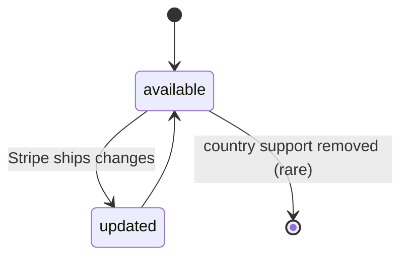
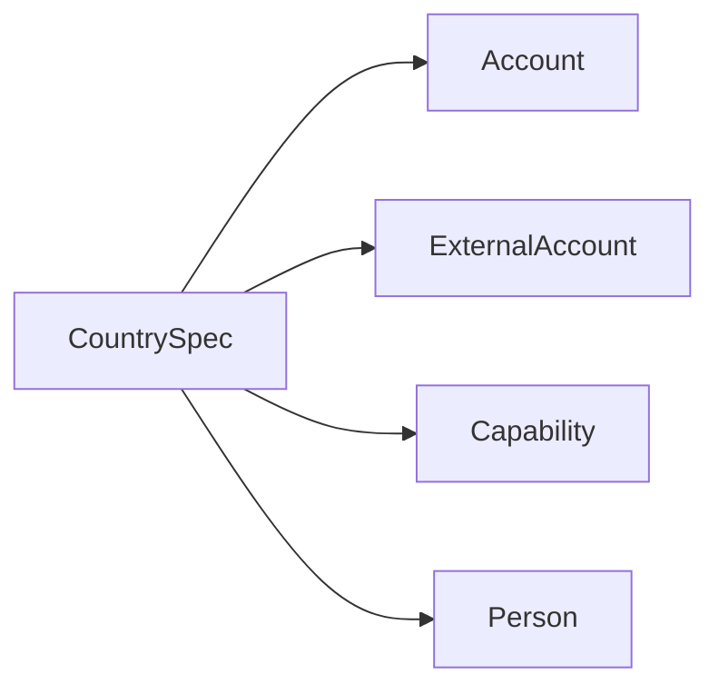

# Country Spec

> API resource: `country_spec` · API version: `2026-04-22.dahlia` · Category: [Connect](README.md)

## What it is

A `CountrySpec` is a read-only, country-keyed catalog of *what Stripe Connect supports and requires in this country*: the default settlement currency, which currencies Connect bank accounts can be denominated in, which payment methods you can accept, which countries you can transfer funds *to*, and the minimum / additional verification fields a connected [Account](accounts.md) in that country must provide for `individual` and `company` business types.

Think of it as Stripe's per-country onboarding manifest. You don't write to it; you read it to drive UI decisions like "what fields do I show a French Custom-account onboarding form?" or "can a Japanese seller accept SEPA?"

```
country_spec(US)
├── default_currency: usd
├── supported_payment_currencies: [usd, ...]
├── supported_payment_methods: [card, ach_debit, ...]
├── supported_transfer_countries: [US, ...]
└── verification_fields
    ├── individual: { minimum: [...], additional: [...] }
    └── company:    { minimum: [...], additional: [...] }
```

## Why it exists

Connect operates in dozens of countries and each has its own regulatory regime: which IDs to ask for, what currencies are settlable, which payment methods are licensed, where money may be sent. Hardcoding any of that in your platform is a maintenance trap — Stripe expands payment-method coverage and tightens KYC routinely. CountrySpec lets you fetch the current rules at runtime, drive your onboarding form off them, and skip releases when Stripe adds Lithuania.

It is also the only programmatic source of truth for "which countries can a US platform actually create connected accounts in" before you call `POST /v1/accounts` and get a country-not-supported error.

## Lifecycle & states

CountrySpec has no lifecycle — it's reference data. No `status`, no transitions, no `created`. Stripe updates it as countries gain/lose support and as regulations change; your handler should not cache it for very long.



There is no event when a CountrySpec changes. Re-fetch periodically (e.g. weekly) if you derive UI from it.

## Anatomy of the object

### Identity

| Field | Notes |
|---|---|
| `id` | The two-letter ISO country code, lower- or uppercased depending on context (`US`, `FR`, `JP`). The primary key — there is no opaque `cs_…` ID. |
| `object` | always `"country_spec"` |

### Currency support

| Field | Notes |
|---|---|
| `default_currency` | Three-letter ISO currency. The settlement currency for accounts created with this country. |
| `supported_payment_currencies[]` | Currencies in which charges can be created on accounts in this country. Often a long list (USD accounts can present USD, but also accept most other currencies and convert). |
| `supported_bank_account_currencies` | Map: `{ currency: [country_codes_of_bank_accounts_that_can_settle_this_currency] }`. Critical when configuring multi-currency [ExternalAccounts](external-accounts.md). |

### Payment methods & transfer reach

| Field | Notes |
|---|---|
| `supported_payment_methods[]` | The payment-method types accounts in this country can accept (`card`, `ach_debit`, `sepa_debit`, `klarna`, …). Drives which `capabilities[*]` requests will succeed. |
| `supported_transfer_countries[]` | ISO country codes a connected account here can `Transfer` funds to. For most accounts this just contains its own country; some support cross-border transfers. |

### Verification requirements

| Field | Notes |
|---|---|
| `verification_fields.individual.minimum[]` | Field IDs (e.g. `individual.first_name`, `individual.id_number`) required at account creation for `business_type=individual`. |
| `verification_fields.individual.additional[]` | Field IDs that may be requested later (often once a payment volume threshold is hit). |
| `verification_fields.company.minimum[]` | Same, for `business_type=company`. Includes structural fields (`company.name`, `company.tax_id`) plus director/owner attestations. |
| `verification_fields.company.additional[]` | E.g. extra documents over a threshold. |

> The field IDs are *dot paths* into the Account / Person object. `individual.id_number` means `Account.individual.id_number`; `relationship.representative` means a [Person](persons.md) with `relationship.representative=true` must exist. Use them to drive form generation.

## Relationships



CountrySpec is consulted *during the design and execution* of Account creation, capability requests, ExternalAccount attachment, and Person collection. It is not a foreign key from any other object — it's a lookup table.

## Common workflows

### 1. List the countries Connect supports

```http
GET /v1/country_specs?limit=100
```

Paginate to enumerate everything. Cache the IDs for your "where is your business based?" dropdown.

### 2. Retrieve one country's spec

```http
GET /v1/country_specs/US
```

### 3. Drive an onboarding form for a Custom account

When the user picks "United States" + "Sole proprietor", read `country_specs/US.verification_fields.individual.minimum`, render exactly those inputs, and submit them on `POST /v1/accounts`. Add anything from `additional[]` only if you've decided to proactively collect.

### 4. Validate a payout currency is supported

Before letting a user attach a CAD ExternalAccount to their US account, check `country_specs/US.supported_bank_account_currencies['cad']`. If it doesn't include `US` (or the bank's country), the attach will fail.

### 5. Gate which payment methods to offer

Before requesting `klarna_payments` capability on an account, check `country_specs/<country>.supported_payment_methods` includes `klarna`. If not, the capability request returns `400`.

### 6. Choose a transfer destination

Before issuing a Transfer to a connected account in country X from a platform in country P, verify `country_specs/P.supported_transfer_countries` contains X.

## Webhook events

None. CountrySpec emits no webhooks. Re-fetch on a schedule.

## Idempotency, retries & race conditions

- All operations are read-only `GET`s; idempotent by definition.
- The list endpoint is paginated like every other Stripe list — page through with `starting_after`. The total count is small (~50–60 countries) so it usually fits in one page at `limit=100`.
- Stale data is the only race: Stripe ships a country-spec update and your cached copy doesn't reflect it for a while. Defensive coding (handle `400 unsupported_country` from `POST /v1/accounts` even if your cache said it'd work) is cheap and correct.

## Test-mode tips

- CountrySpec content is identical between live and test mode. You can develop entirely against test.
- The Stripe CLI: `stripe country_specs list --limit 100` and `stripe country_specs retrieve US`.
- For a given country, also exercise the magic SSNs and bank tokens (`btok_us_verified`, etc.) from the [Account](accounts.md) doc — `country_specs` tells you *what* to collect, those test inputs tell you what verification result to simulate.

## Connect considerations

- **Platform country vs account country.** A US platform can typically create accounts in many countries, but not all. The complete answer is in [supported countries for platforms](https://docs.stripe.com/connect/cross-border-payouts), not directly in CountrySpec — CountrySpec describes what each country supports as an *account*, not which platform-account pairs are allowed.
- **`verification_fields` is a floor, not a ceiling.** Stripe may demand more (additional document, EDD review) once a particular account hits volume thresholds or risk signals. Don't treat the list as immutable for an account; watch `Account.requirements.currently_due` for the live truth.
- **Some payment methods listed as supported still need an explicit capability request.** Showing up in `supported_payment_methods` means "available in this country" — you still need the capability flipped to `active` on the specific account.

## Common pitfalls

- **Treating CountrySpec as static.** Cache it, sure, but invalidate. New payment methods land. New countries are added. Old support narrows.
- **Building a hand-maintained list of "countries we support" in your platform DB.** Drive it from `GET /v1/country_specs` and whichever subset your business has policies for.
- **Showing every `additional[]` field at first onboarding.** Those are *future or escalation* fields. Asking for all of them upfront tanks conversion. Show `minimum[]` first; collect `additional[]` reactively if Stripe later marks them due.
- **Confusing `supported_payment_currencies` with `supported_bank_account_currencies`.** The first is "what can you charge in"; the second is "what currency can the payout bank account hold". An account can charge in 135 currencies but settle to USD only.
- **Ignoring `supported_transfer_countries` when designing cross-border payouts.** A French account that you want to pay out to a US-domiciled bank might or might not be supported — check before promising it to your users.
- **Hardcoding required field paths.** They change. Generate forms from `verification_fields` instead.

## Further reading

- [API reference: Country Spec](https://docs.stripe.com/api/country_specs/object)
- [Required verification information](https://docs.stripe.com/connect/required-verification-information)
- [Supported countries (Connect)](https://docs.stripe.com/connect/cross-border-payouts)
- [Capability availability by country](https://docs.stripe.com/connect/account-capabilities)
