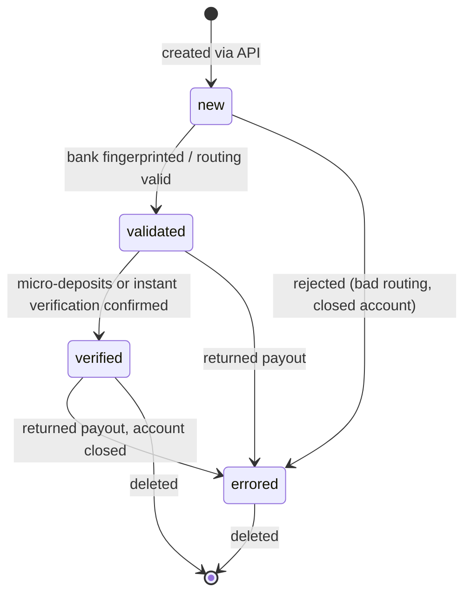
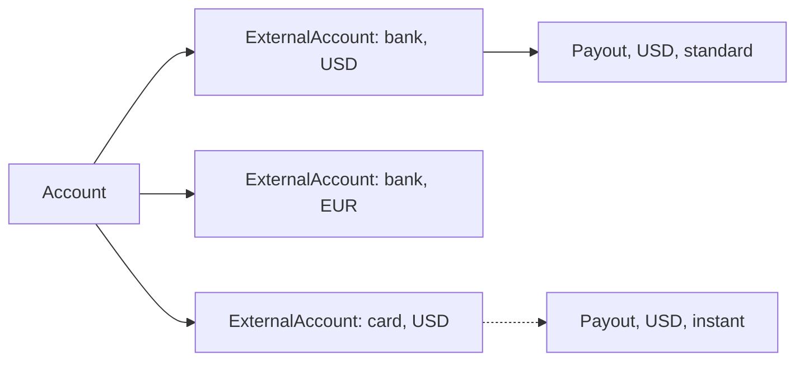

# External Account

> API resource: `external_account` · API version: `2026-04-22.dahlia` · Category: [Connect](README.md)

## What it is

An `ExternalAccount` is the destination Stripe pays out to from a connected [Account](accounts.md)'s balance. It is one of two concrete things:

- a **bank account** — `object: "bank_account"` — the most common; payouts ride ACH / SEPA / Faster Payments / etc.
- a **debit card** — `object: "card"` — used for instant payouts or as a fallback.

It is a *sub-resource* of Account: managed at `/v1/accounts/acct_…/external_accounts`. There is no top-level `/v1/external_accounts`.

> The sibling resource [Account](accounts.md) has `external_accounts` listed inline; that's a windowed view of these objects, not a duplicate.

## Why it exists

Connect platforms hold connected accounts' funds in their Stripe balance until payout. Each account needs *somewhere* for that money to actually land — its bank or debit card. ExternalAccount is the persistent record of that destination, plus per-currency defaults so multi-currency accounts can payout EUR to one bank and USD to another.

## Lifecycle & states



`status` values (bank accounts; cards have a separate but simpler model):

| Status | Meaning |
|---|---|
| `new` | Just attached. Stripe hasn't yet completed validation. |
| `validated` | Routing / sort code looks correct; payouts can be initiated. |
| `verified` | Bank confirmed via micro-deposits or instant-verification. Required in some countries before payout. |
| `verification_failed` | Verification attempt failed (e.g. wrong micro-deposit amounts entered). |
| `errored` | A real payout was rejected (closed account, frozen account, name mismatch). Future payouts will fail until replaced. |

Cards have neither a verification step nor a `verified` state — `available_payout_methods` tells you what cadence (`standard` / `instant`) is supported.

## Anatomy of the object

### Common fields

| Field | Notes |
|---|---|
| `id` | `ba_…` (bank account) or `card_…` (debit card). |
| `object` | `"bank_account"` or `"card"`. |
| `account` | `acct_…` this external account belongs to. |
| `currency` | The currency this destination settles. **One per currency, per account.** |
| `default_for_currency` | Boolean. The single ExternalAccount Stripe routes payouts of `currency` to. |
| `metadata` | Your bag. |

### Bank account-specific

| Field | Notes |
|---|---|
| `country` | ISO-2. Determines which payout rails are used. |
| `routing_number` | Localized routing ID. ABA in US, sort code in UK, BSB in AU, BLZ in DE, IFSC in IN, etc. |
| `account_number_last4` | Last 4 digits. Full number is never returned after creation. |
| `account_holder_type` | `individual | company`. Must match the Account's `business_type` in most countries. |
| `account_holder_name` | Holder of record. Some banks require this match exactly to accept payouts. |
| `bank_name` | Stripe's lookup result. Informational. |
| `fingerprint` | Hash of the account; same number across attaches yields same fingerprint. Useful for dedupe. |
| `status` | See lifecycle table. |
| `available_payout_methods[]` | `standard` and possibly `instant`. |
| `requirements` | Any outstanding verification fields (e.g. micro-deposit confirmation). |
| `future_requirements` | Pending field demands tied to upcoming Stripe / regulator changes. |

### Card-specific

| Field | Notes |
|---|---|
| `brand` | `visa | mastercard | …`. Must be a debit / prepaid debit. Credit cards are rejected. |
| `last4`, `exp_month`, `exp_year` | Standard card fields. |
| `country` | Card-issuing country. |
| `currency` | The single currency this card can receive. |
| `available_payout_methods[]` | Often includes `instant` if the card is enrolled. |
| `default_for_currency` | Only meaningful if no bank account exists for that currency. |

## Relationships



Each ExternalAccount is owned by one Account. Each currency has at most one `default_for_currency=true` ExternalAccount. Payouts pick the default for their currency and rail (`standard` vs `instant`).

## Common workflows

### 1. Attach a bank account at account creation

Tokenize on the client (recommended) and pass the token:

```http
POST /v1/accounts
  type=custom
  country=US
  …
  external_account=btok_us_verified
```

For a Custom account, `external_account` may also be a raw object literal — but server-side raw bank details require PCI/Connect-bank-data permission. Tokens are simpler.

### 2. Add another bank account to an existing account

```http
POST /v1/accounts/acct_1Nxxx/external_accounts
  external_account=btok_eu_verified
  default_for_currency=true
```

If `default_for_currency=true`, the prior default for that currency is automatically demoted.

### 3. Add a debit card for instant payouts

```http
POST /v1/accounts/acct_1Nxxx/external_accounts
  external_account=tok_visa_debit
```

Debit cards unlock `instant` payouts (subject to the `instant_payouts` capability).

### 4. List external accounts

```http
GET /v1/accounts/acct_1Nxxx/external_accounts?object=bank_account&limit=10
```

`object=bank_account` or `object=card` filters. Without it you get both intermixed.

### 5. Update (limited)

Most banking fields are immutable; you can't edit a routing number. You *can* edit:

```http
POST /v1/accounts/acct_1Nxxx/external_accounts/ba_…
  default_for_currency=true
  metadata[purpose]=primary
  account_holder_name=...
```

To "change" a bank account, attach the new one then delete the old one.

### 6. Delete

```http
DELETE /v1/accounts/acct_1Nxxx/external_accounts/ba_…
```

Stripe blocks deleting the only external account for a currency the account collects in (`payouts_enabled` would break). Delete a non-default first, or attach a replacement before removing the old one.

### 7. Verify a US bank account via micro-deposits

```http
POST /v1/accounts/acct_1Nxxx/external_accounts/ba_…/verify
  amounts[0]=32
  amounts[1]=45
```

Two micro-deposits arrive at the bank in 1-2 business days; the user reads them off their statement and you submit. Status flips `validated → verified`.

## Webhook events

| Event | Fires when | Listener typically does |
|---|---|---|
| `account.external_account.created` | New ExternalAccount attached | Refresh "payout destination" UI; surface `verified=false` if applicable. |
| `account.external_account.updated` | Status, `default_for_currency`, holder name, etc. changed | Re-sync; if `status=errored`, prompt user to add a new destination. |
| `account.external_account.deleted` | Detached | Update UI; warn if it was the default. |
| `payout.failed` | Indirectly relevant — often signals an upstream ExternalAccount issue | Inspect `failure_code` / `failure_message`; may need to re-verify. |
| `account.updated` | Per-account rollup | Catch-all if you don't multiplex per ExternalAccount. |

## Idempotency, retries & race conditions

- `POST` to attach: send an `Idempotency-Key`. Re-running otherwise creates duplicates with the same fingerprint, cluttering the account.
- The `default_for_currency=true` swap is atomic on Stripe's side, but two concurrent attaches with `default_for_currency=true` for the same currency are last-write-wins. The earlier one ends up demoted.
- An ExternalAccount can flip to `errored` independently of any API call from you — Stripe receives a return file from the bank a few days after a failed payout. Subscribe to `account.external_account.updated` instead of polling.
- Deleting and re-attaching the same bank account immediately is allowed and yields a new `ba_…` ID with the same `fingerprint`.

## Test-mode tips

- Use Stripe's test bank tokens to drive specific outcomes:
  - `btok_us_verified` — attaches as `verified` immediately.
  - `btok_us_verified_pending` — `validated`, eventually `verified`.
  - `btok_us_unverified` — stays `new` requiring micro-deposit verification.
  - `btok_us_account_closed` — payouts will fail with a closed-account return.
- Test debit cards: standard test PANs (e.g. `4000056655665556`) attach as cards eligible for payouts in test.
- Trigger micro-deposits in test: `stripe accounts external_accounts verify acct_… ba_… --amounts 32,45` — any two integers between 1 and 99 succeed in test.
- `stripe trigger payout.failed` exercises your error UI.

## Connect considerations

- **Account types.**
  - `standard` — the merchant manages external accounts in their stripe.com dashboard. Platforms can read but not always write.
  - `express` — platform can attach via API; merchant can also edit via [LoginLink](login-links.md) into the Express Dashboard or via the [`account_management` AccountSession component](account-sessions.md).
  - `custom` — platform owns external accounts entirely.
- **Multi-currency payouts.** Available in supported countries (UK, EU, etc.). Each currency needs its own bank account marked `default_for_currency=true`. See [CountrySpec](country-specs.md) for `supported_bank_account_currencies`.
- **Instant payouts.** Require a debit card *and* the `instant_payouts` capability on the account, plus eligible region. Standard ACH payouts work to bank accounts.
- **Capability gating.** ExternalAccounts can be attached before `payouts` capability is `active`, but no payouts will run until it is. Don't tie your "ready to receive money" UI to the existence of an ExternalAccount alone.

## Common pitfalls

- **Deleting the only ExternalAccount for a currency.** Returns a 400; if Stripe somehow lets it through (legacy behavior), payouts in that currency stop. Always replace-then-delete.
- **Setting `default_for_currency=true` on a new account "to be safe"** without realizing it demotes the prior default. If the prior default was correct, you've just rerouted real money.
- **Storing the full bank account number.** You only ever get `account_number_last4` back from the API. The full number is one-shot at attach time; don't try to redisplay it.
- **Submitting a credit card token.** Rejected; only debit / prepaid-debit cards are accepted as ExternalAccounts.
- **Mixing currencies on one account without thinking through `default_for_currency`.** Add a EUR bank to a US account and Stripe won't auto-convert payouts; the EUR balance just sits there until a EUR ExternalAccount exists and is the default.
- **Treating `verified` as required everywhere.** US ACH usually needs verification; many other countries don't. Trust `requirements.past_due` on the ExternalAccount, not your assumption.
- **Trying to edit `routing_number` / `account_number`.** Immutable. Attach a new ExternalAccount, mark it default, then delete the old one.
- **Not handling `account.external_account.updated` for `status=errored`.** Your user's payouts have silently been failing — surface a "fix your payout destination" CTA.

## Further reading

- [API reference: External Accounts (Bank)](https://docs.stripe.com/api/external_account_bank_accounts/object)
- [API reference: External Accounts (Card)](https://docs.stripe.com/api/external_account_cards/object)
- [Bank accounts and debit cards](https://docs.stripe.com/connect/bank-debit-card-payouts)
- [Payouts overview](../01-core-resources/payouts.md)
- [Cross-border payouts](https://docs.stripe.com/connect/cross-border-payouts)
