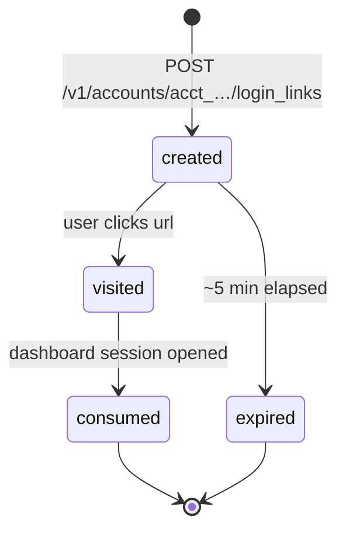
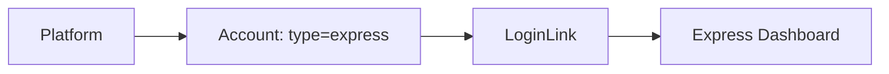

# Login Link

> API resource: `login_link` · API version: `2026-04-22.dahlia` · Category: [Connect](README.md)

## What it is

A `LoginLink` is a one-time, short-lived URL that drops the owner of an **Express** [Account](accounts.md) directly into the **Express Dashboard** — Stripe's slimmed-down hosted dashboard for Express connected accounts. Click it; you land logged-in.

It is the "View my Stripe Dashboard" button you put on a connected account's settings page in your platform.

> Strictly Express-only. Standard accounts log in to stripe.com themselves with their own credentials. Custom accounts have **no** Stripe-hosted dashboard at all — you build the UI yourself or embed components via [AccountSession](account-sessions.md).

## Why it exists

Express accounts don't have user-managed Stripe credentials. They never set a password on stripe.com. So they can't "log in" through the front door — your platform has to mint a session for them. LoginLink is that bearer-token-as-URL.

It's also the only first-class way to send an Express user to *their* dashboard for things like:

- Reviewing past payouts and the underlying balance transactions.
- Updating tax forms (1099s in the US).
- Downloading agreements / receipts.
- Viewing dispute details that haven't been embedded into your platform yet.

If you've embedded everything Express users need via [AccountSession](account-sessions.md), you may not need LoginLink at all.

## Lifecycle & states



- **TTL ~5 minutes** from `created`. Past that, the link 4xxs.
- **Single-use.** Once consumed, refreshing the dashboard URL works (the user has a real cookie session now), but the original `url` won't re-authenticate a different browser.
- **No `id`, no list endpoint, no GET.** The response from `POST` is the only thing you ever see.
- **Existing Express sessions are wiped.** Hitting the link logs the user *out* of any prior Express dashboard session in that browser before logging them in fresh.

## Anatomy of the object

| Field | Notes |
|---|---|
| `object` | always `"login_link"` |
| `url` | The dashboard URL. Bearer token; treat as a credential. |
| `created` | unix seconds. The ~5 min TTL is implicit from this. |

That's the whole object. There is no `expires_at`, no `account` echo, no `id`.

## Relationships



LoginLink is a sub-resource of [Account](accounts.md) — created at `POST /v1/accounts/acct_…/login_links`. There is no top-level `/v1/login_links` collection.

## Common workflows

### 1. "Open my Stripe Dashboard" button

User clicks a button in your platform UI; your handler:

```http
POST /v1/accounts/acct_1Nxxx/login_links
```

Response:

```json
{
  "object": "login_link",
  "created": 1714492800,
  "url": "https://connect.stripe.com/express/Ln1jHsbExAmpLeToken"
}
```

303-redirect to `url` immediately. **Don't email it. Don't render it as a copy-able link. Don't store it.** It's for *this* request, *this* user.

### 2. Server-side guard

Wrap the endpoint with your own auth so only the owner of `acct_…` can request it:

```python
@app.post("/dashboard/express")
@require_logged_in_user
def express_dashboard():
    user = current_user()
    if not user.connected_account_id:
        abort(404)
    if user.connect_account_type != "express":
        abort(400, "Login links only work for Express accounts")
    link = stripe.Account.create_login_link(user.connected_account_id)
    return redirect(link.url, code=303)
```

### 3. Parameterless creation

Older docs reference `redirect_url` and `where` parameters; on the dahlia API they are no longer accepted. Just call `POST` with no body. The dashboard lands the user on the home view.

## Webhook events

LoginLink itself does not emit events. The closest relevant signals (none of which fire on link creation):

| Event | Relevance |
|---|---|
| `account.application.deauthorized` | Express account disconnected from your platform — stop offering "open dashboard" for it. |
| `account.updated` | Account state changed — affects what the user will see when they land. |

If you need an audit trail of "who clicked into the dashboard when", record it in your own logs at the moment you call `Account.create_login_link`.

## Idempotency, retries & race conditions

- An `Idempotency-Key` is supported but rarely useful — duplicates just produce extra unused URLs. The link is so cheap that re-issuing on every click is the right pattern.
- The link only authenticates *one* browser session. If the user opens it on phone then desktop, only the first click works; the second sees an "already used" page. Mint per-device on demand.
- If you mint a link and the user takes >5 min to click it, they see an expired-link page in the dashboard. There's no `refresh_url` analog — your platform UI has to surface a "Try again" button that re-mints.

## Test-mode tips

- Login links work for test-mode Express accounts and drop the user into the test-mode Express Dashboard (banner reads "TEST MODE"). It's the same flow.
- `stripe accounts create_login_link --account acct_…` via the Stripe CLI prints a usable URL to stdout.
- When iterating locally, refresh-mint per click instead of saving the URL — the 5-minute TTL bites fast during debugging.
- Test-mode Express dashboards expose a "Skip" / "Use test data" affordance for unfinished onboarding state, useful when paired with [AccountLink](account-links.md).
- A test-mode login link cannot open a live-mode dashboard and vice versa. Match livemode end-to-end.

## Connect considerations

- **Account type matters.**
  - `standard` — `POST /login_links` returns a 400. Standard accounts log in at stripe.com directly.
  - `express` — supported. The whole reason LoginLink exists.
  - `custom` — returns a 400. There is no Stripe-hosted dashboard for Custom; embed UI via [AccountSession](account-sessions.md) or build it.
- **Embedded components vs. login link.** If you've embedded the panels Express users care about via [AccountSession](account-sessions.md) (`account_management`, `payouts`, `disputes_list`, `documents`, `tax_settings`, etc.), you can skip LoginLink entirely and never push users out of your app.
- **Platform branding.** The Express Dashboard renders your platform name and branding on the login chrome. Configure under `Account.settings.branding` on the *platform* account, not on each connected account.
- **What the user can do in the Express Dashboard.** View past payouts and balance, update bank account, download tax forms (1099-K in the US), see dispute details, edit business profile fields where allowed. Can **not** change account type, see your platform's revenue, or manipulate other connected accounts.
- **Permissioning is implicit.** A LoginLink grants "I am the owner of this connected account" to the dashboard session. Your platform must enforce that *your* user actually owns `acct_…` before minting.

## Common pitfalls

- **Storing the `url`.** Treat it as transient. Storing it in a session, DB row, or analytics event leaks a credential.
- **Returning the `url` in JSON to a logged-in user's frontend that *might* render it elsewhere.** Safer to 303-redirect server-side so the URL never lives in the DOM.
- **Trying to use it for Standard accounts.** Standard merchants have stripe.com accounts; send them to `https://dashboard.stripe.com` instead and let them log in normally.
- **Calling it for Custom accounts.** Hard 400. Custom platforms must build (or embed) all UI themselves.
- **Re-rendering a stale link.** Past 5 minutes it's dead. Always re-mint at click time.
- **Surfacing it on a public page.** Anyone with the URL becomes the connected account in the dashboard. The endpoint must be behind your platform's authn/authz.
- **Surprised that the user gets logged out of another Express session.** Express sessions are exclusive per browser; hitting a fresh login link kicks the previous one. Tell your users this if they manage multiple Express accounts.

## Further reading

- [API reference: Login Link](https://docs.stripe.com/api/account/login_link)
- [Express Dashboard overview](https://docs.stripe.com/connect/express-dashboard)
- [Embedded components for Express](account-sessions.md)
