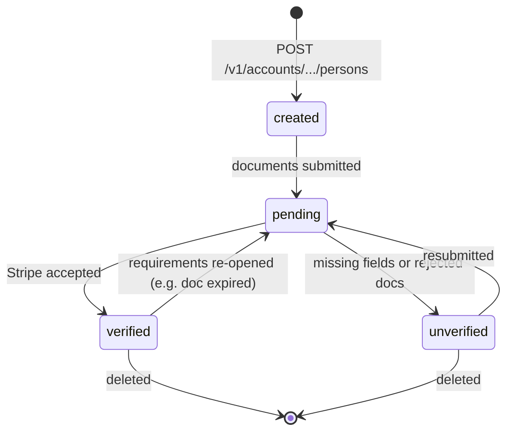
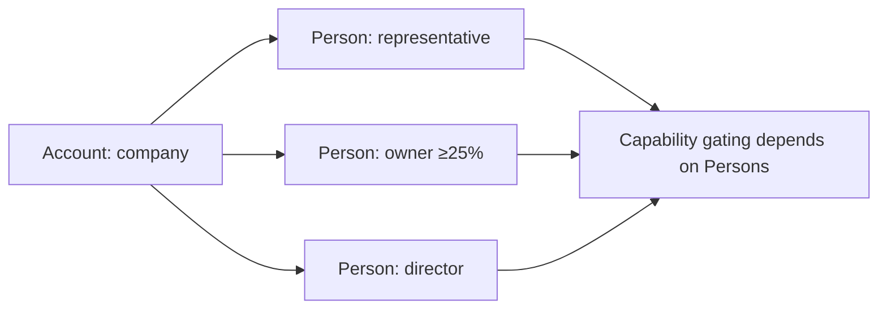

# Person

> API resource: `person` · API version: `2026-04-22.dahlia` · Category: [Connect](README.md)

## What it is

A `Person` is a human associated with a `business_type=company` connected [Account](accounts.md) — a beneficial owner, director, executive, or the legal representative who attests on behalf of the company. Each Person carries the KYC artifacts (name, DOB, address, ID document, SSN/tax ID, nationality) Stripe needs to satisfy regulators for that role.

It is a *sub-resource* of Account: managed at `/v1/accounts/acct_…/persons`. Sole-prop / `business_type=individual` accounts don't use Person — their KYC lives directly on `Account.individual`.

```
Account (business_type=company)
├── company.{name, tax_id, address, ...}
└── persons[]
    ├── representative   (must exist, exactly one)
    ├── owner            (each ≥25% beneficial owner)
    ├── director         (board members where applicable)
    └── executive        (officers where applicable)
```

## Why it exists

KYC for entities is not just "verify the company" — it requires verifying *the humans behind it*. Anti-money-laundering rules across jurisdictions demand Stripe identify beneficial owners (typically ≥25% ownership), the legal representative, and (often) directors and executives. Modeling each as its own object lets:

- Each person's verification state progress independently.
- Different roles have different field requirements.
- The platform reflect exactly which person is missing what.

## Lifecycle & states



Possible `verification.status` values:

| Status | Meaning |
|---|---|
| `unverified` | Stripe doesn't have what it needs to verify this person. The account's capabilities depending on this person are blocked. |
| `pending` | Documents/IDs submitted; Stripe (or its vendors) is verifying. |
| `verified` | All checks passed. Capabilities can clear. |

> A Person can be `verified` while the parent Account still has open requirements (other Persons, company info, banking). Don't read the Account's readiness off any single Person.

## Anatomy of the object

### Identity

| Field | Notes |
|---|---|
| `id` | `person_…` |
| `object` | always `"person"` |
| `account` | `acct_…` this person belongs to. |
| `created` | unix seconds. |
| `metadata` | Your bag — useful for linking to your own user record if a Person is also a user in your platform. |

### Personal details

| Field | Notes |
|---|---|
| `first_name`, `last_name` | Latin script. Some jurisdictions also expect `first_name_kana`, `first_name_kanji`, `last_name_kana`, `last_name_kanji` (Japan), or `maiden_name`. |
| `email`, `phone` | Contact details. Required for the representative; often required for owners. |
| `dob.year`, `dob.month`, `dob.day` | Birth date. Integer fields — `dob.day=1`, not `"01"`. |
| `nationality` | ISO-2 country code. Required in many EU jurisdictions. |
| `political_exposure` | `none | existing`. Self-attested PEP flag. Drives EDD when `existing`. |
| `gender` | Required only in a few jurisdictions (e.g. JP). |
| `id_number_provided` | Boolean. `true` once you've submitted `id_number` (full national ID). The actual number is never returned. |
| `ssn_last_4_provided` | Boolean. US-only — `true` once you've submitted `ssn_last_4`. |

### Address

| Field | Notes |
|---|---|
| `address.line1`, `line2`, `city`, `state`, `postal_code`, `country` | Roman-script address. Some countries demand `address_kana` and `address_kanji` variants. |

### Role & ownership

| Field | Notes |
|---|---|
| `relationship.title` | Free-text job title. Often required. |
| `relationship.representative` | Boolean. **Exactly one Person per company must be the representative.** They're the one whose attestation activates the account. |
| `relationship.owner` | Boolean. True for any beneficial owner ≥25% (some jurisdictions ≥10%). |
| `relationship.director` | Boolean. True for board members where applicable (companies in the EU, UK, etc.). |
| `relationship.executive` | Boolean. True for officers (CEO, CFO, …) — required in many jurisdictions. |
| `relationship.percent_ownership` | 0–100, required when `owner=true`. |
| `relationship.legal_guardian` | Less common; for minors. |

A single Person can hold multiple roles — the founder of a small company is often `representative`, `owner`, `director`, *and* `executive` all at once. That's normal and expected.

### Verification

| Field | Notes |
|---|---|
| `verification.status` | See lifecycle table. |
| `verification.document.front` / `back` | File IDs (`file_…`) of uploaded ID images. Get via `POST /v1/files` with `purpose=identity_document`. |
| `verification.additional_document.front` / `back` | Second document if Stripe requested one (e.g. proof of address). |
| `verification.details` | Stripe's reason text when `unverified`. |
| `verification.details_code` | Machine-readable code (e.g. `document_name_mismatch`, `document_unreadable`). |

### Per-Person requirements

| Field | Notes |
|---|---|
| `requirements.currently_due[]` | Field IDs (e.g. `dob.day`, `verification.document`, `address.line1`) needed before `current_deadline`. |
| `requirements.eventually_due[]` | Will be needed; not blocking now. |
| `requirements.past_due[]` | Required and overdue; the Person — and dependent capabilities — are blocked. |
| `requirements.pending_verification[]` | Submitted, awaiting Stripe. |
| `requirements.errors[]` | Per-field rejection details with `code`, `reason`, `requirement`. **Render these to the user** when re-collecting. |

## Relationships



Persons exist only under a `business_type=company` (or equivalent entity type) Account. Their collective verification state feeds into [Capability](capabilities.md) status — missing a required Person blocks `card_payments`, `transfers`, and so on.

## Common workflows

### 1. Add the legal representative

```http
POST /v1/accounts/acct_1Nxxx/persons
  first_name=Jane
  last_name=Doe
  email=jane@example.com
  phone=+15551234567
  dob[year]=1985 dob[month]=4 dob[day]=12
  address[line1]=350 Mission St
  address[city]=San Francisco
  address[state]=CA
  address[postal_code]=94105
  address[country]=US
  ssn_last_4=1234
  relationship[representative]=true
  relationship[title]=CEO
  relationship[executive]=true
```

You'll get back `id=person_…`. Store that against your user record.

### 2. Add a beneficial owner

```http
POST /v1/accounts/acct_1Nxxx/persons
  first_name=Mark
  last_name=Smith
  …
  relationship[owner]=true
  relationship[percent_ownership]=40
```

Repeat for every ≥25% owner. The country threshold can vary; check `Account.requirements.currently_due` for `person.<id>.relationship.percent_ownership` to know if Stripe wants more.

### 3. Upload an ID document

Two-step: upload the file, then attach by ID.

```http
POST https://files.stripe.com/v1/files
  file=@passport.jpg
  purpose=identity_document
```

Returns `file_xyz`. Then:

```http
POST /v1/accounts/acct_1Nxxx/persons/person_…
  verification[document][front]=file_xyz
```

### 4. List all persons on an account

```http
GET /v1/accounts/acct_1Nxxx/persons?relationship[representative]=true
```

Filter by role with `relationship[*]=true`. Without filters, all persons return.

### 5. Update / re-collect after rejection

When `verification.details_code=document_unreadable`, fetch the Person, surface the reason in your UI, get a new image, upload, and re-attach via `POST /persons/person_…`.

### 6. Delete

```http
DELETE /v1/accounts/acct_1Nxxx/persons/person_…
```

Allowed only if the Person is **not** the current `representative`. To remove the representative, first add a new one with `relationship[representative]=true` (which auto-demotes the prior representative), then delete.

## Webhook events

| Event | Fires when | Listener typically does |
|---|---|---|
| `person.created` | A Person was added to the account (via API or hosted onboarding) | Sync to your DB; if `requirements.currently_due` is non-empty, surface re-onboarding CTA. |
| `person.updated` | Verification status, requirements, or any field changed | Re-fetch; reflect new verification state and outstanding requirements. |
| `person.deleted` | Removed | Update your KYC mirror. |
| `account.updated` | Indirectly relevant — adding a Person bumps the account's overall requirements | Treat as catch-all if you don't want per-Person granularity. |
| `capability.updated` | A capability gating on Persons changed status | Toggle product gating in your UI. |

## Idempotency, retries & race conditions

- `POST /v1/accounts/.../persons`: send an `Idempotency-Key`. Otherwise a network retry duplicates the human in your account, which Stripe doesn't dedupe.
- File uploads are idempotent at the (file, purpose) level only on the same upload session — re-uploading the same image creates a new `file_…`. Cache the file ID and reuse it.
- `person.updated` fires on *every* field change, including when Stripe's verification queue toggles `pending → verified` asynchronously. Handlers must be idempotent.
- The Account's `requirements.currently_due` reflects the union across Persons; expect it to shift as soon as you add or update a Person.

## Test-mode tips

- Magic test data:
  - SSN `000000000` → auto-success; `verification.status` flips to `verified`.
  - SSN `111111111` → `pending` indefinitely (manual review).
  - SSN `222222222` → `unverified` with `requirements.errors[]` populated.
  - DOB `1900-01-01` → triggers OFAC mismatch in test mode.
- Test ID document files: upload any image with `purpose=identity_document`. Stripe's test-mode verifier accepts everything that's not deliberately bad. Use `file_identity_document_success`-style fixture file IDs documented in the Stripe docs to force outcomes without uploading.
- `stripe persons create acct_… --first-name … --relationship[representative]=true` via CLI for fast iteration.

## Connect considerations

- **Account types.**
  - `standard` — Persons are typically managed by the merchant via stripe.com. Read access from the platform; write access limited.
  - `express` — Stripe collects Persons via hosted onboarding ([AccountLink](account-links.md) / [AccountSession](account-sessions.md)). The platform can also write via API.
  - `custom` — the platform owns Person collection entirely.
- **Country variation matters.**
  - **US**: representative + every ≥25% owner.
  - **EU (varies by country)**: representative + ≥25% owners + at least one director + executives in some jurisdictions.
  - **UK**: representative + ≥25% owners + directors.
  - **JP**: additional Kana/Kanji name and address fields.
  - Read `Account.requirements.currently_due` to know exactly who Stripe wants — don't hard-code per-country rules.
- **The representative ↔ executive overlap.** A small business often has one person who is *all* roles. That's fine — set every relevant `relationship.*` field to true on a single Person rather than creating duplicates.

## Common pitfalls

- **Trying to delete the representative before assigning a new one.** Stripe rejects with a 400. Add the replacement first.
- **Treating `id_number_provided=false` as "the user can fix this without us"** — it just means *you* haven't submitted it. The user can't edit it directly via the Person API; you collect it (or hosted onboarding does).
- **Skipping owners under your own threshold.** Some jurisdictions require ≥10% (not ≥25%) declarations. Trust `Account.requirements`, not your assumption.
- **Re-creating a Person instead of updating.** Each Person ID represents one human; updating is fine and expected. Multiple Persons for the same human pollutes the KYC graph and confuses Stripe's verification queue.
- **Uploading low-quality ID images.** They come back with `verification.details_code=document_unreadable` and your user has to redo it. Validate dimensions / file size on the client first; encourage good lighting.
- **Ignoring `requirements.errors[]`.** That's where Stripe explains *why* a verification failed. Your UI should render it inline next to the field, not just show "verification failed."
- **Hardcoding director / executive requirements per country.** Stripe evolves these. Drive UI from the actual requirements bag.
- **Setting `political_exposure=none` blindly.** It's the user's self-attestation, not yours. Asking is part of the form for a reason.
- **Not deleting Persons who have left the company.** Stripe still expects the *current* set of owners and officers — leaving stale Persons risks rejected verifications and downstream capability restrictions.

## Further reading

- [API reference: Person](https://docs.stripe.com/api/persons/object)
- [Required verification information by country](https://docs.stripe.com/connect/required-verification-information)
- [Identity verification](https://docs.stripe.com/connect/identity-verification)
- [Files API](https://docs.stripe.com/api/files)
- [Account](accounts.md) (parent resource)
