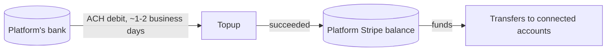
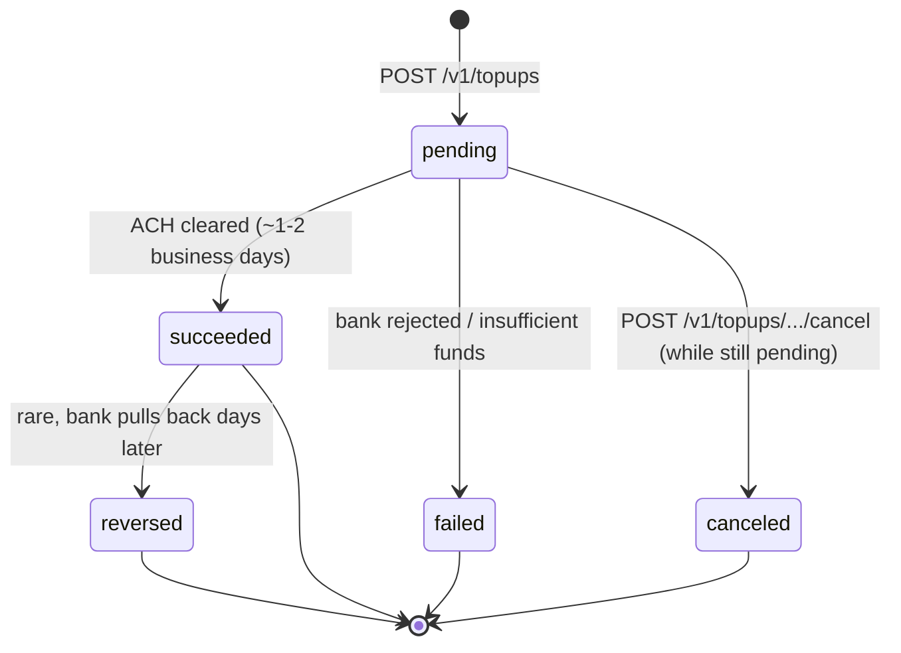
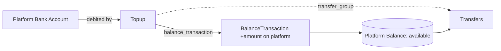

# Top-up

> API resource: `topup` · API version: `2026-04-22.dahlia` · Category: [Connect](README.md)

## What it is

A `Topup` is funds you actively *push into* your platform's Stripe balance from your own bank account, via ACH debit. It's the opposite of a [Payout](../01-core-resources/payouts.md): a Payout takes money out of Stripe to your bank; a Topup takes money out of your bank into Stripe.

In Connect, Topups exist almost exclusively to keep the platform balance positive enough to fund [Transfers](transfers.md) to connected accounts when the natural inflow from charges isn't enough.



Topups are platform-only: you cannot create a Topup on a connected account.

## Why it exists

Two scenarios drive the need:

1. **Separate-charges-and-transfers** flow — the platform charges customers to its own account, then later transfers funds to connected accounts. If the timing or volumes don't match (e.g. payouts already left, or transfers run on a different cadence), the platform balance can dip below the next batch of transfers. A Topup pulls funds in from the bank to cover them.
2. **Bootstrapping or backfilling** — paying bonuses, prefunding payouts to connected accounts before the underlying customer charges have settled, or correcting a negative-balance situation.

If your charges always exceed your transfers and Stripe processing fees, you'll never need Topups. If they don't, Topups are how you avoid `balance_insufficient` errors on `POST /v1/transfers`.

## Lifecycle & states



State semantics:

| State | What it means | What's allowed |
|---|---|---|
| `pending` | ACH debit submitted; waiting on settlement. | `cancel` (only while pending). Funds **not yet** available. |
| `succeeded` | Funds posted to platform's `available` balance. | Fund Transfers, payouts, etc. |
| `failed` | Bank rejected (insufficient funds, closed account, etc.). `failure_code` and `failure_message` populated. | Read; create a new Topup. |
| `canceled` | You canceled before settlement. | Read; create a new Topup. |
| `reversed` | Bank pulled funds back after settlement (rare). Platform balance is debited again. | Recover from negative balance; investigate with bank. |

Once `succeeded`, you cannot cancel — only `reversed` can undo, and that's bank-driven, not API-callable.

## Anatomy of the object

### Identity

| Field | Notes |
|---|---|
| `id` | `tu_…` |
| `object` | `"topup"` |
| `livemode` | mode flag |
| `created` | unix seconds |

### Money

| Field | Notes |
|---|---|
| `amount` | Smallest currency unit. |
| `currency` | Three-letter ISO. Must match a currency you can hold in your Stripe balance. Most platforms top up only their settlement currency. |

### Status & timing

| Field | Notes |
|---|---|
| `status` | `pending | succeeded | failed | canceled | reversed`. |
| `expected_availability_date` | Unix seconds; when Stripe expects the funds to land in `available`. ACH guess. |
| `failure_code` | Populated only when `status: failed`. E.g. `insufficient_funds`, `debit_not_authorized`. |
| `failure_message` | Human-ish. |

### Pointers

| Field | Notes |
|---|---|
| `source` | Bank account source (legacy `src_…` token, or in some flows a verified bank account ID). The bank you're pulling from. |
| `balance_transaction` | `txn_…` — the platform-side credit ledger entry. **Null while `pending`**, populated on `succeeded`. |
| `transfer_group` | Optional free-form string — lets you tie this Topup to the Transfers it was meant to fund, for reconciliation. |

### User-set

| Field | Notes |
|---|---|
| `description` | Free-form. |
| `statement_descriptor` | What appears on the bank statement when the ACH posts. ≤ 15 chars; rules apply. |
| `metadata` | Up to 50 key/value pairs. |

## Relationships



Topups touch only the platform's account. They do not appear on any connected account's ledger or webhooks.

## Common workflows

### 1. Create a Topup

```http
POST /v1/topups
  amount=1000000
  currency=usd
  description=Funding April transfers
  statement_descriptor=PLATFUND
  -H "Idempotency-Key: topup-2026-04-15-1"
```

Stripe initiates the ACH debit against your default platform bank account. You receive `topup.created` immediately, then `topup.succeeded` (or `failed`) ~1-2 business days later.

### 2. Cancel a pending Topup

```http
POST /v1/topups/tu_…/cancel
```

Only valid while `status: pending`.

### 3. List Topups by status

```http
GET /v1/topups?status=succeeded&created[gte]=…
```

### 4. Update metadata after success

```http
POST /v1/topups/tu_…
  metadata[reconciled]=true
  description="Funding April transfers (reconciled)"
```

Only `metadata` and `description` are mutable post-creation.

### 5. Tag a top-up for reconciliation against transfers

```http
POST /v1/topups
  amount=1000000 currency=usd
  transfer_group=batch_2026_04_15

POST /v1/transfers
  amount=500000 currency=usd
  destination=acct_…
  transfer_group=batch_2026_04_15
```

Then later: `GET /v1/balance_transactions?source=tu_…` and `?source=tr_…` and group by `transfer_group` to verify funding-vs-spend.

## Webhook events

| Event | Fires when | Listener typically does |
|---|---|---|
| `topup.created` | Topup initiated; status `pending`. | Mark "funding in flight" in your reconciliation system. |
| `topup.succeeded` | ACH cleared; status `succeeded`. Funds now in platform `available` balance. | Release any blocked transfers; update reconciliation. |
| `topup.failed` | Bank rejected. Status `failed`. | Alert finance; queue a retry from a different source. |
| `topup.canceled` | You canceled while pending. | Update local status. |
| `topup.reversed` | Bank pulled funds back post-settlement (rare). | **Page someone.** Negative balance possible; investigate with bank. |

All events fire on the platform's webhook endpoint only.

## Idempotency, retries & race conditions

- `POST /v1/topups` **must** carry `Idempotency-Key` — a duplicate Topup is a real bank debit you don't want.
- `POST /v1/topups/:id/cancel` is naturally idempotent: cancelling a canceled topup returns the same canceled object.
- Race: a Topup goes `pending → succeeded` ~1-2 business days later. Code that polls API instead of consuming `topup.succeeded` will see stale `pending` for a long time. Webhook-driven only.
- Race: a Transfer that depends on Topup funds may run *before* `topup.succeeded` arrives, returning `balance_insufficient`. Either gate transfers on the webhook, or maintain a buffer.
- A `topup.reversed` can arrive **days** after `topup.succeeded` — your reconciliation must handle late reversals (don't archive Topups too early).

## Test-mode tips

- Test mode supports topups via the CLI / API just like live, but funds are virtual.
- Use special test bank accounts (the standard test routing/account combos) — Stripe simulates ACH outcomes synchronously based on the source.
- `stripe trigger topup.succeeded` and `topup.failed` emit fixture events for handler tests.
- `expected_availability_date` in test mode may be a few minutes out, not days, to make iteration practical.

## Connect considerations

- **Top-ups are platform-only.** You cannot create a Topup with `Stripe-Account: acct_…`. To move money *to* a connected account, use [Transfer](transfers.md), not Topup.
- **Country availability.** Top-ups are primarily used by **US-based platforms**. Other countries have payment-method-specific funding mechanics or rely entirely on charge inflow.
- **Currency.** You must top up in a currency your platform can hold. For most platforms that's just the home currency. Multi-currency platforms top up per-currency separately.
- **Liability.** A `topup.reversed` debits your platform balance just like a chargeback would. If your balance goes negative as a result, Stripe may pull from your bank or block payouts. Treat reversals as P0.

## Common pitfalls

- **Confusing Topup with Transfer.** Topup pulls money *into* Stripe from your bank. Transfer moves money *between* Stripe accounts. They're orthogonal — you may need both for one logical operation.
- **Treating `topup.created` as "money is here."** It's not. `succeeded` is. `created` only means "we asked the bank."
- **Polling instead of webhooks.** ACH settlement is days. Polling is wasted API calls. Subscribe to `topup.succeeded`.
- **Ignoring `topup.reversed`.** Days-later reversals can silently make your balance negative. Always handle this event.
- **Hard-coding `expected_availability_date` into UX.** It's a guess. Bank holidays, weekends, and ACH return windows can extend it.
- **Topping up too much "just in case."** Funds in Stripe don't earn interest. Top up close to need; let payout cycles handle the rest.
- **Trying to create a Topup on a connected account.** Returns 400. Use Transfer instead.

## Further reading

- [API reference: Topup](https://docs.stripe.com/api/topups/object)
- [Top up your platform balance](https://docs.stripe.com/connect/top-ups)
- [Transfer](transfers.md) — what Topups exist to fund.
- [Money flow](../_meta/money-flow.md) — where Topups fit in the ledger.
