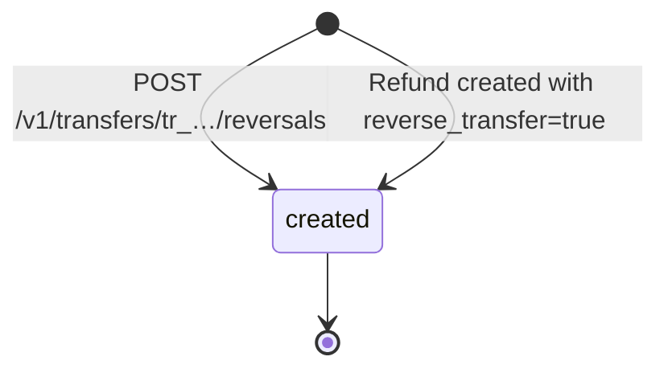
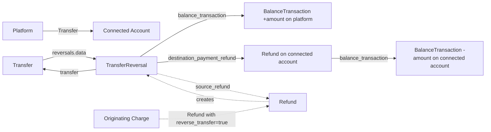

# Transfer Reversal

> API resource: `transfer_reversal` · API version: `2026-04-22.dahlia` · Category: [Connect](README.md)

## What it is

A `TransferReversal` is a partial or full claw-back of a [Transfer](transfers.md) — money moves from the connected account's balance back to the platform's balance, on Stripe's ledger.

It is the platform's tool to undo a Transfer when the underlying customer payment was refunded, when funds were sent to the wrong account, or when a marketplace order is canceled. Unlike a manual `POST /v1/transfers` in the opposite direction, a TransferReversal is **bound to the original Transfer**, capped at its remaining amount, and creates the right ledger entries on both accounts.

## Why it exists

Without TransferReversal, undoing a Connect transfer would require creating a new Transfer in the reverse direction — but that requires a credit on the destination account that the platform may not have permission to debit, and breaks the audit trail. TransferReversal provides:

- A first-class object tied to the parent Transfer (so reconciliation works).
- A guaranteed ledger debit on the destination + credit on the platform.
- For destination charges, optional automatic creation when refunding the underlying Charge with `reverse_transfer=true`.
- An optional refund of the destination's synthetic payment, so the connected account's books match.

## Lifecycle & states

TransferReversal has no `status` field. It is created → it exists. Like a FeeRefund, the move between two Stripe balances is synchronous; there is no async settlement.



The parent Transfer tracks the running total: `amount_reversed` increments and `reversed` flips to `true` once cumulative reversals equal `transfer.amount`.

The **only** way a TransferReversal can fail at create time is if the destination account doesn't have enough balance to give the money back — see pitfalls.

## Anatomy of the object

### Identity

| Field | Notes |
|---|---|
| `id` | `trr_…` |
| `object` | `"transfer_reversal"` |
| `created` | unix seconds |

### Money

| Field | Notes |
|---|---|
| `amount` | Reversed amount, in the smallest unit. ≤ remaining (`transfer.amount − transfer.amount_reversed`). |
| `currency` | Three-letter ISO. Always equals the parent Transfer's currency. |

### Pointers

| Field | Notes |
|---|---|
| `transfer` | `tr_…` of the parent [Transfer](transfers.md). |
| `balance_transaction` | `txn_…` — the platform-side **credit** ledger entry (the platform is getting money back). The mirror debit on the connected account is on `destination_payment_refund.balance_transaction`. |
| `destination_payment_refund` | `re_…` — the [Refund](../01-core-resources/refunds.md) created against the synthetic Charge that the original Transfer produced on the destination account. This is what removes the funds from the connected account's books. |
| `source_refund` | `re_…` — for destination charges, the Refund on the originating Charge that triggered this reversal (when reversal was created via `reverse_transfer=true`). May be null for manual reversals. |

### User-set

| Field | Notes |
|---|---|
| `metadata` | Up to 50 key/value pairs. |

There is no `livemode` field — inherits from the parent Transfer.

## Relationships



Multiple partial reversals are allowed (up to `transfer.amount`), so a Transfer can have many TransferReversals.

## Common workflows

### 1. Reverse a Transfer manually

```http
POST /v1/transfers/tr_…/reversals
  amount=1000
  metadata[reason]=order_canceled
  -H "Idempotency-Key: trr-tr_…-1"
```

The platform balance is credited 1000; the connected account balance is debited 1000 (via a synthesized Refund on its destination_payment).

### 2. Reverse a Transfer as part of refunding a destination charge

```http
POST /v1/refunds
  charge=ch_…
  reverse_transfer=true
  refund_application_fee=true
  -H "Idempotency-Key: refund-ch_…-1"
```

Stripe creates: Refund (customer is paid back from platform balance) + TransferReversal (platform claws funds back from connected account) + ApplicationFeeRefund (platform gives back its cut). The full triple-undo for a destination charge.

### 3. Partial reversal

```http
POST /v1/transfers/tr_…/reversals amount=500
POST /v1/transfers/tr_…/reversals amount=500
```

Each call must respect `remaining = transfer.amount − transfer.amount_reversed`. After cumulative reversals equal `transfer.amount`, `transfer.reversed = true` and further calls 400.

### 4. Reverse without refunding the destination_payment

By default a TransferReversal also creates `destination_payment_refund`. To **only** move the platform-side ledger and leave the destination_payment intact:

```http
POST /v1/transfers/tr_…/reversals
  amount=1000
  refund_application_fee=false
```

(Hedge: the exact set of opt-out parameters has shifted across API versions — check the current API reference.)

### 5. List reversals on a transfer

```http
GET /v1/transfers/tr_…/reversals?limit=10
```

### 6. Update metadata

```http
POST /v1/transfers/tr_…/reversals/trr_…
  metadata[reconciled]=true
```

Only `metadata` is mutable.

## Webhook events

There is **no** dedicated `transfer_reversal.*` event family. The signal is on the parent Transfer:

| Event | Fires when | Listener typically does |
|---|---|---|
| `transfer.reversed` | A reversal made the Transfer fully reversed (`reversed: true`). | Mark transfer as reversed in your DB; cascade to merchant statement. |
| `transfer.updated` | Field changes including a *partial* reversal (`amount_reversed` increased but `reversed` still false). | Resync; recalculate net transferred. |

> Important: partial reversals fire `transfer.updated`, **not** `transfer.reversed`. If you only listen to `transfer.reversed` you'll miss every partial.

The connected account's webhook endpoint receives `charge.refunded` (for the refund on the destination_payment) and corresponding balance movements.

## Idempotency, retries & race conditions

- `POST /v1/transfers/:id/reversals` **must** carry `Idempotency-Key`. Same key returns the same TransferReversal.
- Same for `POST /v1/refunds … reverse_transfer=true`.
- Race: a Transfer may go to a connected account that immediately runs a payout. If the funds leave the connected account's balance before you call reverse, the call returns `insufficient_funds_in_destination` (or similar). The reversal **fails** — the platform does not get the money back.
- Race: the connected account spends transferred funds on its own outgoing operations (Issuing, Treasury moves) — same outcome.
- Webhook ordering: `transfer.updated` (with new `amount_reversed`) and `charge.refunded` (on the destination's synthetic charge, on the connected account's endpoint) can arrive in any order. They describe the same event.

## Test-mode tips

- Test mode lets you reverse Transfers freely as long as the test connected account hasn't been drained.
- `stripe trigger transfer.reversed` emits a fixture event for handler tests.
- To exercise the "destination has insufficient balance" failure mode, transfer to a connected account, trigger a test payout to drain it, then attempt reversal.

## Connect considerations

TransferReversal is Connect-only. Notes:

- **Permissions.** Only the **platform** can create reversals. The connected account cannot — even though its balance is being debited.
- **Cross-account ledger entries.** A reversal makes two `BalanceTransaction`s: a credit on the platform (`type: transfer_reversal`) and a debit on the connected account (`type: payment_refund` or similar — it's the destination_payment_refund's BT, not a `transfer_reversal` BT). Reconciliation tooling should match by `transfer_reversal.id` and look up both legs.
- **Application-fee interaction.** `reverse_transfer=true` does **not** by itself reverse the application fee. Pair with `refund_application_fee=true` for the full undo.
- **Direct charges have no Transfer**, so they have no TransferReversal. To "claw back" from a direct charge, use [Refund](../01-core-resources/refunds.md) on the original Charge (which lives on the connected account).

## Common pitfalls

- **Assuming reversal is always possible.** It is not. If the connected account's balance is below the reversal amount (because they paid out, transferred, spent via Issuing, etc.), the API returns an insufficient-funds error and **the platform absorbs the loss**. This is the single biggest gotcha. Mitigation: hold transfers, set reserves on connected accounts (Custom only), or coordinate refunds before the connected account's payout cycle.
- **Listening only to `transfer.reversed` and missing partials.** Partial reversals fire `transfer.updated`. Subscribe to both, or read `transfer.amount_reversed` on every `transfer.updated`.
- **Reversing a Transfer without refunding the underlying Charge.** The platform claws back funds from the connected account, but the customer who paid is not refunded. Net effect: you took the merchant's money out of their balance for no apparent reason. Use `reverse_transfer=true` *on a Refund* instead of standalone reversal, unless you really mean to do this.
- **Forgetting `refund_application_fee=true` on destination-charge refunds.** Reverses the transfer but keeps the platform's fee. Connected account is now down by the gross *and* you kept your cut. The platform-friendly mistake.
- **Treating reversals as instant on partials.** Partial reversals are synchronous in Stripe's ledger (no settlement window), but downstream effects on connected-account payouts depend on payout cadence. The connected account may have already paid out funds; reversal still works as long as the *current* balance covers it, but the connected account's bank statement now shows a negative-looking flow.
- **Reversing into a connected account that's been deauthorized or rejected.** Deauthorized accounts are unreachable for new operations. Rejected accounts may be frozen. Plan for these — they happen.
- **Racing the connected account's payout schedule.** Connected accounts on `daily` payouts drain quickly. Reversals must be issued before the payout window or they will fail. Consider holding initial Transfers (manual payout schedule) for connected accounts where reversal is likely.

## Further reading

- [API reference: TransferReversal](https://docs.stripe.com/api/transfer_reversals/object)
- [Refund a destination charge](https://docs.stripe.com/connect/destination-charges#issuing-refunds)
- [Transfer](transfers.md) — parent object.
- [Refund](../01-core-resources/refunds.md) — what `reverse_transfer=true` is set on.
- [ApplicationFeeRefund](application-fee-refunds.md) — sibling cleanup for the platform's cut.
- [Money flow](../_meta/money-flow.md) — where reversals fit in the ledger.
