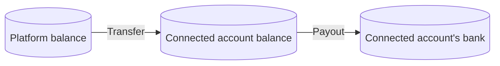
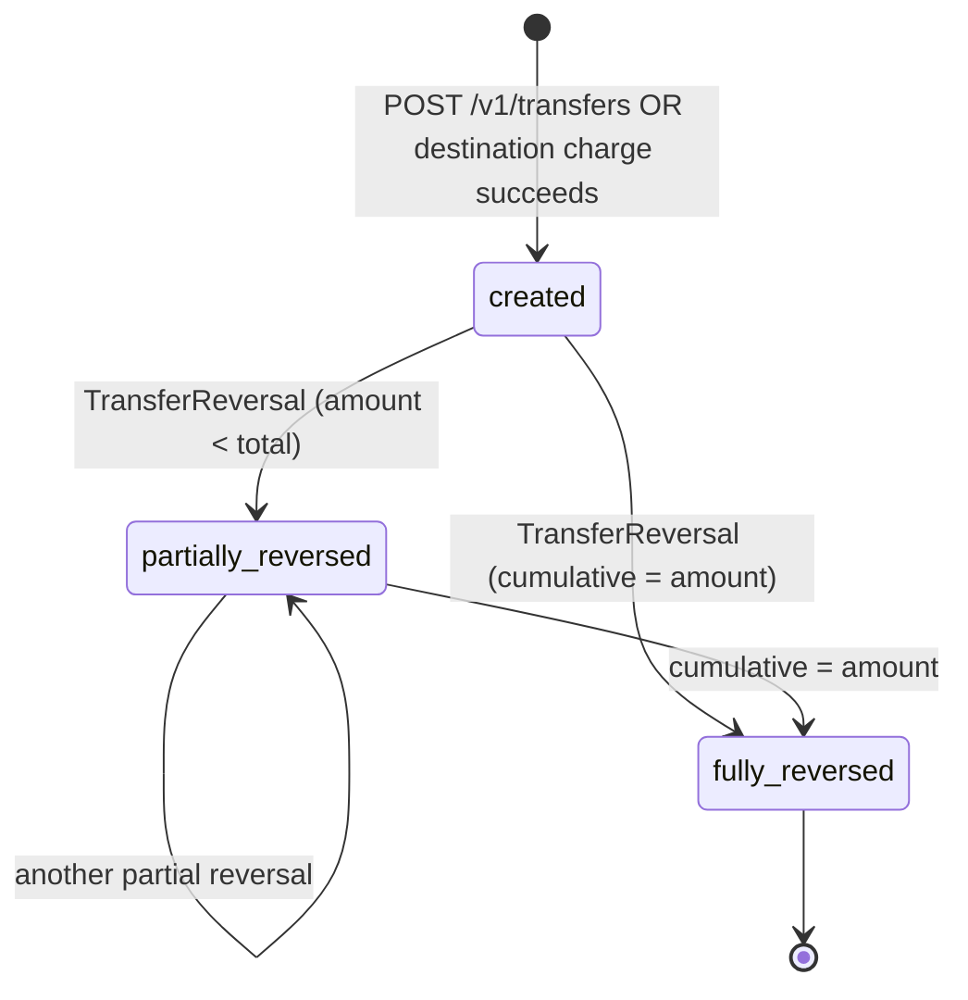
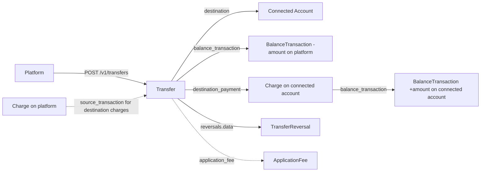

# Transfer

> API resource: `transfer` · API version: `2026-04-22.dahlia` · Category: [Connect](README.md)

## What it is

A `Transfer` is a movement of money **between two Stripe accounts** within the Stripe ledger. It is the Connect money-movement primitive — every dollar that ends up on a connected account's balance got there via a Transfer (explicit or auto-created), unless the money was earned by a direct charge on that account.

Two flavors:

1. **Platform → Connected account** (the common case). Either created manually (`POST /v1/transfers destination=acct_…`), or auto-created by Stripe when a destination charge succeeds (`transfer_data.destination` on the PI/Charge).
2. **Between two of your own balances** (rarer). E.g. moving funds between currency balances on a multi-currency platform, or other internal Stripe-account-to-Stripe-account moves.

Transfer is **not** how money leaves Stripe to a bank — that's [Payout](../01-core-resources/payouts.md). Transfer always lands in another Stripe balance.



## Why it exists

Connect's whole purpose is routing money to other parties. Transfer is the object that does it. Without Transfer:

- There's no atomic, reconcilable record of "the platform sent $X to merchant Y on date Z."
- There's no parent for [TransferReversal](transfer-reversals.md) to attach to when you need to claw funds back.
- Webhooks (`transfer.created`, `transfer.reversed`) have nothing to fire on.

Even when Stripe creates Transfers automatically (destination charges), the resulting object is what makes the flow auditable.

## Lifecycle & states

Transfer has no `status` enum in the modern API — it has booleans. The state machine is implied:



Decoding:

| Field | Meaning |
|---|---|
| `reversed` | Boolean. **True only when fully reversed.** Use `amount_reversed > 0` for "any reversal exists." |
| `amount_reversed` | Cumulative across all attached `TransferReversal`s. |

Transfers do not "fail" asynchronously the way charges or topups do — they are synchronous within Stripe's ledger. If `POST /v1/transfers` returns 200, the Transfer is settled inside Stripe. The only async aspect is what the connected account does with the funds afterward (payouts, etc.), which is its own ledger.

## Anatomy of the object

### Identity

| Field | Notes |
|---|---|
| `id` | `tr_…` |
| `object` | `"transfer"` |
| `livemode` | mode flag |
| `created` | unix seconds |

### Money

| Field | Notes |
|---|---|
| `amount` | The transferred amount, in the smallest unit. |
| `currency` | Three-letter ISO. Must match a balance the source has and the destination supports. |
| `amount_reversed` | Cumulative reversed amount across all `TransferReversal`s. |

### Pointers

| Field | Notes |
|---|---|
| `destination` | `acct_…` of the Stripe account receiving the funds. **Required.** |
| `destination_payment` | `py_…` — the synthetic Charge created on the destination account to represent the inbound funds. The connected account's view of "we received this money." |
| `source_transaction` | `ch_…` — for **destination charges** (auto-created Transfers), the Charge that funded this Transfer. Lets you trace customer payment → merchant settlement in one hop. **Null** for manually created Transfers. |
| `source_type` | `card | bank_account | fpx | …` — what underlying funding source covered this transfer from your balance. Mostly `card` since charge inflow is the dominant balance source. |
| `balance_transaction` | `txn_…` — the platform-side **debit** ledger entry. The mirror credit on the connected account is on `destination_payment.balance_transaction`. |
| `application_fee` | If this Transfer carried `application_fee_amount` (separate-charges-and-transfers flow), the resulting `fee_…`. |

### Reversal subresource

| Field | Notes |
|---|---|
| `reversed` | Boolean — true iff fully reversed. |
| `reversals` | `{ data: [TransferReversal, …], has_more, total_count, url }`. |

### User-set

| Field | Notes |
|---|---|
| `description` | Free-form. |
| `metadata` | Up to 50 key/value pairs. |
| `transfer_group` | Free-form string. Group multiple Transfers (and the originating Charges) for reconciliation. **Highly recommended** for separate-charges-and-transfers flows. |

## Relationships



Two ledgers, one transfer:

- Platform side: `transfer.balance_transaction` is a **debit** of `amount`.
- Connected account side: `transfer.destination_payment` is a synthetic Charge on that account, with its own `balance_transaction` as a **credit** of `amount`.

These mirror exactly. This is how Connect bookkeeping stays double-entry.

## How Transfer fits each Connect charge type

```mermaid
flowchart TB
    subgraph DC[Direct charge]
        DCcard[Customer card] -->|Charge on connected account| DCBAL[Connected balance]
        DCBAL -.->|application_fee| DCFEE[ApplicationFee → platform]
    end
    subgraph DEST[Destination charge]
        DESTcard[Customer card] -->|Charge on platform| DESTBAL[Platform balance]
        DESTBAL -->|auto-Transfer source_transaction=ch_…| DESTCONN[Connected balance]
        DESTBAL -.->|application_fee| DESTFEE[ApplicationFee → platform]
    end
    subgraph SCT[Separate charges and transfers]
        SCTcard[Customer card] -->|Charge on platform| SCTBAL[Platform balance]
        SCTBAL -->|manual POST /v1/transfers| SCTCONN[Connected balance]
    end
```



| Charge type | Transfer involved? | Where it comes from |
|---|---|---|
| **Direct charge** | **No.** Funds land directly on the connected account; no ledger move needed. | n/a |
| **Destination charge** | **Yes, auto-created.** When the Charge succeeds, Stripe synthesizes a Transfer for the net amount (gross − application_fee_amount). `Transfer.source_transaction = ch_…`. | Stripe |
| **Separate charges and transfers** | **Yes, manual.** Platform calls `POST /v1/transfers` later, often after computing per-merchant splits. Use `transfer_group` to tie back to the originating Charge(s). | You |

## Common workflows

### 1. Manually transfer to a connected account

```http
POST /v1/transfers
  amount=5000
  currency=usd
  destination=acct_CONNECTED
  description="April commission"
  transfer_group=batch_2026_04_15
  -H "Idempotency-Key: tr-2026-04-15-acct_CONNECTED"
```

Returns the Transfer immediately. Platform balance is debited; connected account balance is credited synchronously.

### 2. Transfer net of an application fee (separate-charges-and-transfers)

```http
POST /v1/transfers
  amount=5000
  currency=usd
  destination=acct_CONNECTED
  application_fee_amount=200
  transfer_group=order_12345
```

Platform debited 5000, connected account credited 5000, then 200 of that is moved to platform via an ApplicationFee. Net effect: connected account gets 4800; platform nets 200; Stripe's processing fee was paid earlier on the original Charge to the platform.

### 3. Trace funds for a destination charge

```http
GET /v1/transfers?source_transaction=ch_…
```

Returns the auto-Transfer that Stripe created to settle the destination charge.

### 4. Look up Transfers by group

```http
GET /v1/transfers?transfer_group=order_12345
```

Useful when one customer payment fans out to multiple connected accounts (marketplace order with multiple sellers).

### 5. Reverse a transfer

See [TransferReversal](transfer-reversals.md).

```http
POST /v1/transfers/tr_…/reversals
  amount=1000
```

### 6. Update metadata

```http
POST /v1/transfers/tr_…
  metadata[reconciled]=true
  description="April commission (reconciled)"
```

Only `metadata` and `description` are mutable.

## Webhook events

Delivered to the **platform's** webhook endpoint:

| Event | Fires when | Listener typically does |
|---|---|---|
| `transfer.created` | Transfer was created (manually or auto for destination charges). | Mark expected funds-out; reconcile against orders. |
| `transfer.updated` | Most field changes (metadata, description). | Resync local copy. |
| `transfer.reversed` | A TransferReversal made `reversed: true` (fully reversed). **Does not fire on partial reversals** — those surface as `transfer.updated` with new `amount_reversed`. | Mark transfer as reversed; cascade to merchant statement. |

The connected account also receives webhooks: `payment.created` (for the synthetic destination_payment) and corresponding `balance.available` movements. The two webhook streams are independent — handle each on its own endpoint.

## Idempotency, retries & race conditions

- `POST /v1/transfers` **must** carry `Idempotency-Key`. A duplicate Transfer is a real money movement out of your balance.
- `POST /v1/transfers/:id/reversals` is also idempotency-keyable.
- Auto-created Transfers (destination charges) are not directly idempotency-keyable — Stripe handles that internally as part of Charge creation.
- Race: `transfer.created` for a destination charge can arrive **before** the matching `charge.succeeded` on the platform endpoint. Use `transfer.source_transaction = ch_…` to correlate.
- Race: a Transfer to a connected account that subsequently runs a payout can leave the connected account with a balance lower than the Transfer amount, blocking later TransferReversal attempts. See [TransferReversal](transfer-reversals.md) pitfalls.
- `balance_insufficient` is the most common error: platform balance < transfer amount. Use [Topup](top-ups.md) to refill, or wait for charges to settle.

## Test-mode tips

- Any Connect account in test mode accepts Transfers; the platform's test balance is implicitly unlimited for trivial amounts.
- `stripe trigger transfer.created` and `transfer.reversed` emit fixture events.
- For destination-charge testing, use `4242 4242 4242 4242` against a PI with `transfer_data.destination=acct_…` and you'll see both `charge.succeeded` and the auto `transfer.created`.
- TestClock doesn't apply to Transfers (they're synchronous).

## Connect considerations

Transfer **is** the Connect money-movement primitive — there's not much "Connect-specific" to add beyond the core mechanics already covered. Notes:

- **Capability gating.** The destination account must have the `transfers` capability `active`. If not, `POST /v1/transfers` returns an error and Stripe will not auto-create Transfers for destination charges to that account.
- **Cross-currency Transfers** are supported on a limited basis depending on platform/destination country pairs. The Transfer's `currency` must be one the destination can hold; otherwise a settlement-currency Transfer + connected-account-side FX is needed. Hedge: rules vary; check API responses.
- **Stripe-Account header.** You **do not** set `Stripe-Account: acct_…` when creating a Transfer to that account — the Transfer is created on the platform; `destination` is the routing field. Setting the header instead would attempt a self-Transfer on the connected account, which is not what you want.
- **Loss handling.** If the destination account becomes restricted or rejected after a Transfer, the funds are stuck on its balance until Stripe risk resolves. The platform cannot reach in and grab them — only TransferReversal works, and only if the connected account still has the balance.

## Common pitfalls

- **Confusing Transfer with Payout.** Transfer = ledger move between Stripe accounts. Payout = money leaves Stripe to a bank. They are completely different objects with different lifecycles.
- **Treating `reversed: true` as "any reversal."** Only true for *full* reversals. Use `amount_reversed > 0`.
- **Not setting `transfer_group`.** Without it, separate-charges-and-transfers flows become impossible to reconcile after the fact. Always set a stable group ID at create time.
- **Assuming `source_transaction` is set on manual Transfers.** It's only populated for auto-Transfers from destination charges. For manual Transfers you must store the Charge↔Transfer link yourself (use `transfer_group` or metadata).
- **Trying to transfer more than the platform's available balance.** Returns `balance_insufficient`. Either Topup, or restructure timing so charges settle before Transfers run.
- **Trying to Transfer to an account without `transfers` capability.** Errors at create time. Check the destination's capability state.
- **Forgetting that destination charges create a Transfer automatically.** Subscribing to `transfer.created` then panicking when "unexpected" Transfers appear — they're the auto ones from your destination charges. Filter on `source_transaction == null` to find your *manual* Transfers.
- **Reversing a Transfer when you should have refunded the underlying Charge.** A standalone TransferReversal claws money back from the connected account to the platform but does *nothing* for the customer who paid. See [TransferReversal](transfer-reversals.md) for coordination.

## Further reading

- [API reference: Transfer](https://docs.stripe.com/api/transfers/object)
- [Separate charges and transfers](https://docs.stripe.com/connect/separate-charges-and-transfers)
- [Charge → Connect considerations](../01-core-resources/charges.md) — how Transfers relate to each Charge type.
- [TransferReversal](transfer-reversals.md) — how to claw back.
- [Topup](top-ups.md) — how to refill the platform balance to fund Transfers.
- [Money flow](../_meta/money-flow.md) — where Transfers fit in the ledger.
