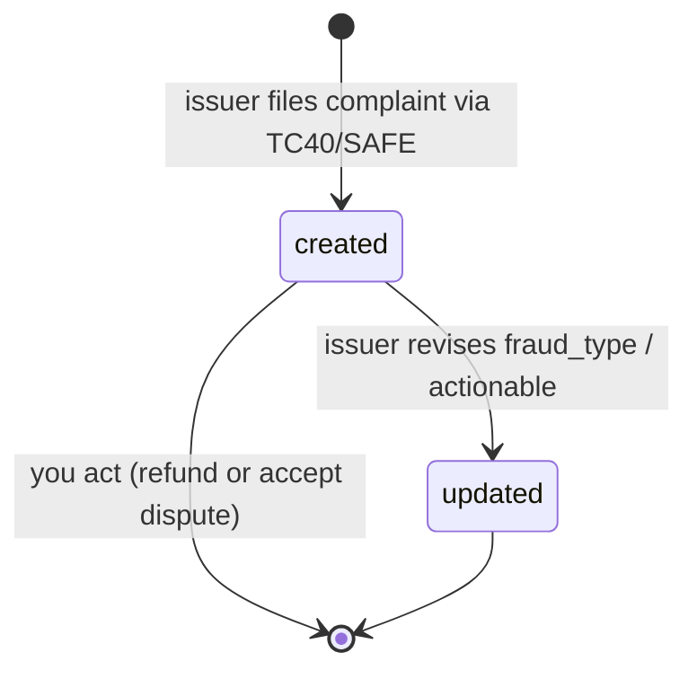
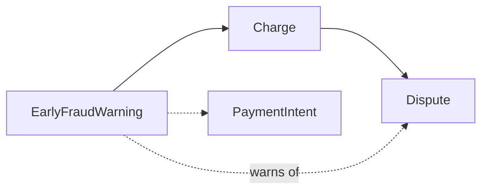

# Early Fraud Warning

> API resource: `radar.early_fraud_warning` · API version: `2026-04-22.dahlia` · Category: [Fraud & Radar](README.md)

## What it is

An `EarlyFraudWarning` (EFW) is a heads-up from the card issuer to Stripe — and from Stripe to you — that a charge **is likely to be disputed**. The cardholder has called their bank and said something is wrong (didn't recognize the merchant, claims fraud, never received the goods, etc.) and the issuer has logged that complaint into a fraud signal feed (Visa's TC40, Mastercard's SAFE) before opening a formal chargeback.

In other words: the customer has *complained*; the bank has *agreed it smells like fraud*; the chargeback paperwork hasn't started yet. You typically have a window of a few days — sometimes a week or two — to act before the dispute lands.

## Why it exists

Without EFWs you would only learn about a fraudulent charge when the chargeback hits, by which point you owe:

- The disputed amount (held immediately).
- The dispute fee (~$15 USD per dispute).
- A tick on your dispute-rate count toward Visa/Mastercard's monitoring programs (which, if breached, escalate to fines and processing surcharges).

If you refund proactively while an EFW is open, the customer's bank generally will *not* file the chargeback (the customer got their money back; there's nothing to dispute). You still lose the principal, but you avoid the dispute fee and — more importantly — you avoid that tick against your dispute ratio. The lower your ratio stays, the cheaper your processing fees and the safer your account.

## Lifecycle & states

EFWs don't have a `status` enum. They are a one-shot notification object that may be `updated` once or twice as the issuer adds/refines detail, then sit immutable forever.



There is no "closed" or "resolved" state on the EFW itself. Resolution is implicit:

- You refund the underlying Charge → the dispute almost certainly never lands.
- You do nothing → in most cases a `charge.dispute.created` event arrives days later. The EFW remains in the API, now serving as evidence-of-warning in your audit trail.

The `actionable` field is the single most important state hint: if `true`, refunding now is expected to prevent the dispute. If `false`, the issuer has signalled the dispute is already in motion and a refund won't stop it (you'll still owe the dispute fee even after refunding).

## Anatomy of the object

### Identity

| Field | Notes |
|---|---|
| `id` | `issfr_…` |
| `object` | `"radar.early_fraud_warning"` |
| `livemode` | mode flag |
| `created` | unix seconds — when Stripe received the warning, not when the cardholder called the bank. |

### Pointers

| Field | Notes |
|---|---|
| `charge` | `ch_…` — the Charge being warned about. **Always present.** |
| `payment_intent` | `pi_…` — convenience pointer when the Charge was created via PaymentIntent. May be `null` for legacy direct charges. |

### Signal

| Field | Notes |
|---|---|
| `actionable` | Boolean. `true` ⇒ a refund issued now is expected to prevent the dispute. `false` ⇒ the dispute is essentially already in flight; refunding won't avoid the chargeback fee. **Read this every time before deciding to refund.** |
| `fraud_type` | Enum, see below. The issuer's classification of *why* this is fraud. |

### `fraud_type` values

| Value | Meaning |
|---|---|
| `card_never_received` | A new card was issued to the cardholder but never arrived (intercepted in mail). Whoever has the PAN is using it. |
| `fraudulent_card_application` | The card itself was opened with stolen identity. |
| `made_with_counterfeit_card` | Card data was cloned (mag-stripe skimming, etc.). EMV/3DS should reduce these. |
| `made_with_lost_card` | Cardholder lost the physical card; someone found it. |
| `made_with_stolen_card` | Card was stolen from the cardholder. |
| `unauthorized_use_of_card` | Generic "I didn't authorize this" — often friendly fraud (family member, forgotten subscription). |
| `misc` | Doesn't fit the others. |

These aren't legally binding categorizations — the issuer's CSR picked one from a dropdown — but `unauthorized_use_of_card` is the one most commonly weaponised in friendly-fraud cases.

## Relationships



The EFW points at the Charge; the Dispute (when/if it lands) also points at the same Charge. There is **no direct foreign key** between EFW and Dispute — you correlate them via the shared `charge` ID. A single Charge can have at most one Dispute, but in rare cases can accumulate multiple EFWs (e.g. issuer revises and refiles).

## Common workflows

### 1. Triage on `radar.early_fraud_warning.created`

The canonical pipeline:

```http
# Webhook arrives
POST /your/webhook
  type=radar.early_fraud_warning.created
  data.object={ id: "issfr_…", charge: "ch_…", actionable: true, fraud_type: "fraudulent_card_application" }
```

Your handler:

1. Look up the order in your DB by `charge` (or via `payment_intent` → your order ID stored in metadata).
2. If `actionable: true`:
   - Refund the charge.
   - Mark the order as fraud-flagged in your system (block the customer, cancel fulfillment if not already shipped).
   - Optionally `POST /v1/charges/ch_…  fraud_details[user_report]=fraudulent` to feed Radar's model.
3. If `actionable: false`: log it, mark the order, *don't refund just for the EFW* — the dispute is coming either way and you'll want the funds available to fight it (or at least not lose the principal twice).

```http
POST /v1/refunds
  charge=ch_…
  reason=fraudulent
Idempotency-Key: efw-issfr_…-refund
```

### 2. Retrieve / list

```http
GET /v1/radar/early_fraud_warnings/issfr_…
GET /v1/radar/early_fraud_warnings?charge=ch_…
GET /v1/radar/early_fraud_warnings?payment_intent=pi_…
GET /v1/radar/early_fraud_warnings?created[gte]=…
```

There is **no POST** — EFWs are issuer-originated, you cannot create one.

### 3. Reconcile against disputes

Nightly job: for each EFW from the past 30 days, check whether a Dispute exists on `charge`. If yes and you didn't refund, decide whether the model worked (you correctly judged `actionable: false`) or you ate a fee you could have avoided.

## Webhook events

| Event | Fires when | Listener typically does |
|---|---|---|
| `radar.early_fraud_warning.created` | Stripe receives a new TC40/SAFE record from the issuer. | Triage immediately — your refund window is days, not weeks. |
| `radar.early_fraud_warning.updated` | Issuer revises fields (most often `actionable` flipping, or `fraud_type` re-classifying). | Re-evaluate the refund decision if `actionable` flipped to `true`. |

There is no `.deleted` event — EFWs are never deleted by Stripe.

## Idempotency, retries & race conditions

- The `created` webhook may be redelivered; your handler should be idempotent on the EFW `id` (don't refund twice). Use the EFW id in your refund's `Idempotency-Key`.
- A `charge.dispute.created` event can arrive **before** the EFW — issuers vary. Don't assume EFW is always the earlier signal; treat both as potential first notice.
- The `updated` event can fire **after** you've already refunded. Safe to ignore unless you care about the issuer's revised classification for analytics.
- Refund + dispute race: if you refund and the issuer files the dispute *anyway* in the same hour, the dispute will still be created. Stripe will usually auto-close it as `won` because evidence is the refund itself, but you'll see the dispute object in the meantime. Don't panic.

## Test-mode tips

- Trigger one with the CLI: `stripe trigger radar.early_fraud_warning.created`. Creates a fresh test Charge and an EFW pointing at it.
- The test card `4000 0000 0000 1976` is purpose-built to attract a synthetic EFW + dispute pair if you want to exercise both paths in sequence.
- EFWs only exist for card payments. Don't expect them on ACH, SEPA, or BNPL flows — those have their own dispute mechanics.

## Connect considerations

- For **direct charges** (charge lives on the connected account), the EFW lives on the connected account too. Your platform-level webhook endpoint won't receive it unless you've configured Connect-mode webhooks. Subscribe at the connected account level, or use a Connect-mode webhook endpoint with `account` in the event payload.
- For **destination charges** (charge lives on the platform), the EFW lives on the platform. Standard webhook subscription works.
- Refund decisions are still the merchant's to make, but on a platform you usually surface the EFW into the connected account's dashboard / your merchant UI rather than auto-refunding for them.

## Common pitfalls

- **Ignoring EFWs entirely.** The single most expensive fraud mistake. EFWs sit there in the API, you never wired the webhook, and three weeks later disputes start landing with the warning sitting unread.
- **Refunding when `actionable: false`.** You lose the principal *and* still pay the dispute fee. If actionable is false, the optimal play is usually to accept the dispute (or fight it if you have evidence) — refunding doesn't save the fee.
- **Treating `fraud_type` as ground truth.** It's the issuer's CSR's best guess. `unauthorized_use_of_card` is heavily over-applied. Don't auto-block customers based on `fraud_type` alone.
- **Refund without `reason=fraudulent`.** Setting the reason on the Refund (and `fraud_details[user_report]=fraudulent` on the Charge) feeds Radar's models. Plain refunds don't.
- **Counting on EFW arriving first.** It usually does, but not always. Build for either order.
- **Missing the connected-account webhook routing.** On Connect platforms with direct charges, EFW events go to the connected account by default; your platform listener never sees them.

## Further reading

- [API reference: EarlyFraudWarning](https://docs.stripe.com/api/radar/early_fraud_warnings/object)
- [Disputes & fraud guide](https://docs.stripe.com/disputes)
- [Charge.outcome / Radar risk fields](../01-core-resources/charges.md) for the upstream signal.
- [Dispute](../01-core-resources/disputes.md) for what comes next if you don't (or can't) prevent it.
