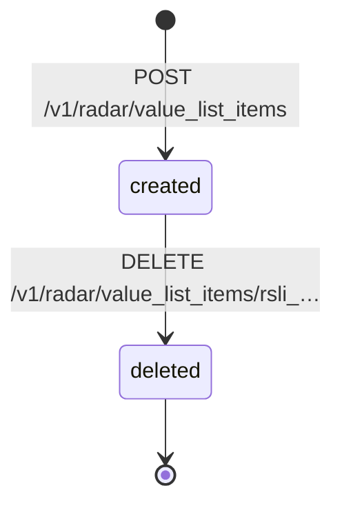
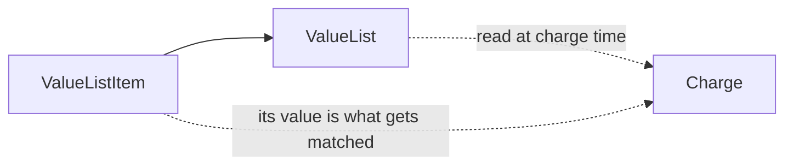

# Radar Value List Item

> API resource: `radar.value_list_item` · API version: `2026-04-22.dahlia` · Category: [Fraud & Radar](README.md)

## What it is

A `RadarValueListItem` is a single entry inside a [Radar Value List](radar-value-lists.md). One value (an email, an IP, a card BIN, a country code, …), bound to one parent list, identified by its own `rsli_…` ID. It's the row to the parent's table.

This is the object your fraud automation actually writes to most often. The parent list is created once and configured by humans; the items are added and removed continuously by code — every blocked email, every flagged IP, every BIN you've decided to stop accepting.

## Why it exists

Splitting items from lists is what makes value lists usable as a real-time signal pipeline:

- Items can be created and deleted with narrow API permissions (a restricted key that can write `radar.value_list_items` but not edit lists or rules).
- Each item has its own `created` timestamp and `created_by` audit field, so "who blocked this email and when" is queryable.
- Removing a single value (after a customer appeal, say) is one DELETE call, not a list rewrite.

## Lifecycle & states

Items are immutable once created. You don't update them — you delete and re-add.



There is no edit endpoint. To "change" a value, delete the old item and create a new one. If you need to move a value between lists, do the same: delete from list A, create in list B.

When the parent list is deleted, all its items are deleted with it (cascading). When the parent list cannot be deleted (because a rule references it), the items remain and can still be added/removed.

## Anatomy of the object

### Identity

| Field | Notes |
|---|---|
| `id` | `rsli_…` |
| `object` | `"radar.value_list_item"` |
| `livemode` | mode flag |
| `created` | unix seconds. |
| `created_by` | Dashboard user email or API key identifier that created the item. Useful for auditing automated additions. |

### Payload

| Field | Notes |
|---|---|
| `value` | The actual value being added — string form regardless of `item_type`. The parent list's `item_type` constrains what shape Stripe will accept. Validation is server-side: e.g. an `email` list rejects values without an `@`. |
| `value_list` | `rsl_…` — the parent list's ID. Required at creation; immutable thereafter. |

There is no `metadata` on items. If you need to attach context (why was this email blocked? by whom? linked to which support ticket?), keep that in your own database, keyed by `rsli_…`.

## Relationships



An item belongs to exactly one list. A list owns many items. There are no other relationships — items are not directly linked to Charges, Customers, or Rules. The link is *value equality*: at charge time Radar compares the relevant Charge field against every item's `value` in the referenced list.

## Common workflows

### 1. Add a value programmatically

```http
POST /v1/radar/value_list_items
  value_list=rsl_…
  value=fraudster@example.com
Idempotency-Key: block-email-fraudster@example.com-2026-05-06
```

Returns `rsli_…`. The block takes effect on the next charge attempt within seconds.

### 2. Remove a value (after appeal / false positive)

```http
DELETE /v1/radar/value_list_items/rsli_…
```

Or, if you only have the `value` and not the `id`:

```http
GET /v1/radar/value_list_items?value_list=rsl_…&value=fraudster@example.com
# → returns the item with rsli_…
DELETE /v1/radar/value_list_items/rsli_…
```

### 3. List items in a list

```http
GET /v1/radar/value_list_items?value_list=rsl_…&limit=100
GET /v1/radar/value_list_items?value_list=rsl_…&value=foo@bar.com
GET /v1/radar/value_list_items?value_list=rsl_…&created[gte]=…
```

Standard cursor pagination via `starting_after`. **The `value_list` query parameter is required** for listing — you cannot enumerate items across all lists in one call.

### 4. Sync from your own block table

If your application maintains a canonical block list (Postgres, etc.), a typical reconciliation job:

1. Query `GET /v1/radar/value_list_items?value_list=rsl_…` and fully paginate.
2. Diff against your own table.
3. POST any values present in your table but not in Stripe.
4. DELETE any items present in Stripe but not in your table (with care: don't delete items added directly via the dashboard if humans use it too).

### 5. Bulk-load a fresh list

There is no bulk endpoint. To load N items, you make N POST calls. Run them in parallel (Stripe's per-account rate limit is the constraint — typically 100 req/s in live, lower in test) with idempotency keys derived from `value_list + value` so retries are safe.

```python
# pseudocode
for value in csv_rows:
    POST /v1/radar/value_list_items
      value_list=rsl_…
      value={value}
    Idempotency-Key: f"bulk-load-{rsl_id}-{value}"
```

## Webhook events

**None.** Items don't emit webhook events. For audit/SIEM, log every POST/DELETE in your own service before calling Stripe.

## Idempotency, retries & race conditions

- **Stripe does not dedupe by value within a list.** Two `POST` calls with the same `value_list` and `value` (without `Idempotency-Key`) create two separate items, both with their own `rsli_…`. Both will match at rule-evaluation time (matching is "any item with this value exists"), so behavior is correct, but your list will look messy.
- **Always send `Idempotency-Key`.** Derive it from `value_list + value` (or your internal block-event ID) so network retries are no-ops.
- DELETE on an already-deleted `rsli_…` returns 404. Treat as success in your reconciliation code.
- The created → matched-by-rule pipeline has no observable delay in practice (sub-second). Don't build long polling loops expecting eventual consistency.

## Test-mode tips

- Items are scoped to their list, which is scoped to live/test mode. Test-mode items never affect live charges and vice versa.
- `stripe radar value_list_items create --value-list rsl_… --value foo@bar.com` works via CLI.
- For end-to-end test: create test list → add item with email `customer@test.com` → write Block rule referencing the list → attempt a test PaymentIntent confirm with `receipt_email=customer@test.com`. The PI should fail with `outcome.type=blocked` and `outcome.rule` pointing at your rule.

## Connect considerations

- Items inherit the scope of their parent list — per-account, not shared between platform and connected accounts.
- The `Stripe-Account` header on item operations addresses items on that specific account's lists. A platform managing fraud lists across many connected accounts has to either (a) replicate the same lists onto each connected account, or (b) use destination charges so all charges fall under the platform's lists.

## Common pitfalls

- **Choosing item_type without thinking about case.** `email` is case-insensitive; `string` is case-sensitive. If you store user-submitted strings in a `string` list, `Foo@Bar.com` won't match `foo@bar.com`. Use the `email` type for emails, full stop.
- **Forgetting the per-list size implications.** A single rule that references one giant list is fine up to tens of thousands of entries; combine multiple massive lists in one rule and you can hit per-rule limits. Partition large lists (alphabetic, by date, by source) and use multiple rules if needed.
- **No `metadata` field on items.** People reach for it constantly. There isn't one. Track context in your own DB.
- **Trying to update an item's value.** No update endpoint exists. Delete and re-create.
- **Adding items via parallel jobs without idempotency keys.** You end up with the same value duplicated multiple times across multiple `rsli_…` IDs. Cleanup is tedious.
- **Treating the dashboard list view as authoritative.** If both humans and code add/remove items, your reconciliation job needs to be careful — a destructive sync ("delete everything not in my DB") will wipe out human additions. Tag programmatically-added items by convention (e.g. shared `value_list` for automation, separate one for humans), or skip-deletes for items whose `created_by` is a dashboard user.

## Further reading

- [API reference: ValueListItem](https://docs.stripe.com/api/radar/value_list_items/object)
- [Radar Value List](radar-value-lists.md) — the parent object and rule-binding mechanics.
- [Radar rules guide](https://docs.stripe.com/radar/rules) — the syntax for referencing lists from rule expressions.
- [Reviews](reviews.md) and [Early Fraud Warnings](early-fraud-warnings.md) — what happens for matches that aren't blocked outright.
