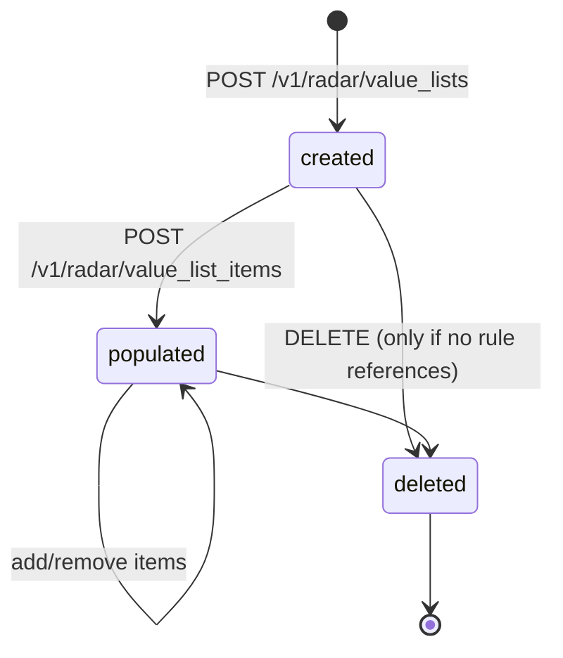
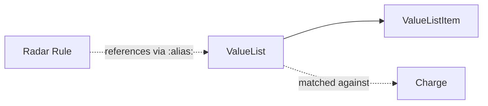

# Radar Value List

> API resource: `radar.value_list` · API version: `2026-04-22.dahlia` · Category: [Fraud & Radar](README.md)

## What it is

A `RadarValueList` is a **named lookup table** that Radar rules can reference. Instead of writing a rule like `Block if :email: == 'a@b.com' or :email: == 'c@d.com' or …` (and editing the rule every time you add a bad email), you create a value list `:blocked_emails:`, drop matching values into it, and write a single rule `Block if :email::in_list:blocked_emails:`. The rule never changes; the list contents do.

Each list has an `item_type` that constrains what kind of values it can hold (emails, IP addresses, card BINs, country codes, …) and an `alias` that's how you reference it in rule expressions.

## Why it exists

Radar rules are evaluated server-side at charge time and compiled internally — every edit to a rule is, in effect, a deploy. Value lists give you a separation of concerns:

- **Rules** are edited rarely, by people who understand fraud logic.
- **List items** are added/removed frequently, often programmatically by your fraud automation, customer support tooling, or batch jobs.

You also get type safety (the list rejects values of the wrong shape — a `country` list won't accept `"hello"`) and centralized auditability (one place to see "what's currently blocked").

## Lifecycle & states

Value lists are simple: created, optionally populated, optionally deleted. There is no `status`.



Notable rules:

- A list **cannot be deleted while any Radar rule references it**. The DELETE call returns an error pointing to the offending rule(s). Drop the rule first (or rewrite it) before deleting the list.
- Items can be added/removed at any time, including while rules are actively using the list. Changes take effect on subsequent charges within seconds (no deploy needed).
- The `item_type` is **fixed at creation**. You cannot convert an `email` list to `string` later — create a new list and migrate.

## Anatomy of the object

### Identity

| Field | Notes |
|---|---|
| `id` | `rsl_…` |
| `object` | `"radar.value_list"` |
| `livemode` | mode flag |
| `created` | unix seconds. |
| `created_by` | Email of the dashboard user (or `"system"` / API key id) that created it. Useful for audit trails. |

### Naming

| Field | Notes |
|---|---|
| `name` | Human-readable name shown in the dashboard. Free-form. |
| `alias` | The token used in Radar rule expressions: `:my_alias::in_list:`. Lowercase, alphanumeric + underscores, must be unique within your account. **Cannot be changed after creation** without copy-and-recreate. |
| `metadata` | Standard Stripe metadata bag — your bookkeeping. Doesn't influence rule evaluation. |

### Schema

| Field | Notes |
|---|---|
| `item_type` | The shape of values this list accepts. Fixed at creation. See the table below. |

### `item_type` values

| Value | Accepts | Match semantics |
|---|---|---|
| `card_bin` | First 6–8 digits of a PAN | Exact prefix match against the charged card. |
| `card_fingerprint` | Stripe card fingerprints | Exact match. Useful for blocking a specific card across users without storing the PAN. |
| `case_sensitive_string` | Arbitrary strings | Exact, case-sensitive match. |
| `country` | Two-letter ISO country codes | Exact match against IP / billing / card-issuer country, depending on which `:…_country:` field your rule reads. |
| `customer_id` | `cus_…` IDs | Exact match against the Charge's `customer` field. |
| `email` | Email addresses | **Case-insensitive**, normalised against the Charge's `receipt_email` / `billing_details.email`. |
| `ip_address` | IPv4/IPv6 literals | Exact match. CIDR ranges are *not* supported as of this writing — use multiple list entries or write the rule with `ip_address` arithmetic. (Hedge: subnet support has been on Stripe's roadmap; verify in current docs if you need it.) |
| `sepa_debit_fingerprint` | Fingerprints for SEPA bank accounts | Exact match. |
| `string` | Arbitrary strings | **Case-sensitive** exact match. |
| `us_bank_account_fingerprint` | Fingerprints for US bank accounts | Exact match. |

### Embedded items

| Field | Notes |
|---|---|
| `list_items` | Subobject `{ data: [Item, …], has_more, total_count, url }`. Inline data is **paginated and limited** (typically 10 items max in the embed). For anything beyond preview-display, query [`/v1/radar/value_list_items?value_list=rsl_…`](radar-value-list-items.md) directly. |

## Relationships



The relationship to Rules is by-name (the `alias` literal embedded in the rule expression), not by foreign key — there's no API to enumerate "which rules reference this list". The dashboard surfaces it; programmatically you'd have to grep the rule expressions yourself.

## Common workflows

### 1. Create a block list and wire a rule

```http
POST /v1/radar/value_lists
  name=Blocked emails
  alias=blocked_emails
  item_type=email
```

Returns `rsl_…`. Then in the dashboard (or via the Radar rules API in supported integrations), write the rule:

```
Block if :email::in_list:blocked_emails:
```

Now any new charge whose email matches an item in `blocked_emails` is blocked at authorization.

### 2. Programmatically add an entry from your fraud system

```http
POST /v1/radar/value_list_items
  value_list=rsl_…
  value=fraudster@example.com
Idempotency-Key: block-email-fraudster@example.com
```

(See [Radar Value List Item](radar-value-list-items.md) for the item-side details.)

### 3. Update the list's name / metadata

```http
POST /v1/radar/value_lists/rsl_…
  name=Blocked emails (managed by FraudOps)
  metadata[owner]=fraud-ops@example.com
```

You can update `name` and `metadata`. **You cannot update `alias` or `item_type`.**

### 4. Delete

```http
DELETE /v1/radar/value_lists/rsl_…
```

Fails with a clear error if any rule still references the alias. Drop the rule (in the dashboard or via API), then retry.

### 5. Multi-tier allow/block strategy

A common pattern: maintain three lists per identifier type — `:vip_emails:` (allow override), `:trusted_emails:` (skip 3DS), `:blocked_emails:` (hard block). Then a chained rule set:

```
Allow if :email::in_list:vip_emails:
Allow if :email::in_list:trusted_emails:
Block if :email::in_list:blocked_emails:
… (other rules)
```

Order matters in Radar — the first matching `Allow` or `Block` wins.

## Webhook events

**None.** Radar value lists do not emit webhook events. If you need change notifications for audit/SIEM, poll list contents on a schedule or wrap your own write API around the create/delete item calls.

## Idempotency, retries & race conditions

- `POST /v1/radar/value_lists` accepts `Idempotency-Key`. Use it — list creation is rare but expensive to undo (you'd have to delete and risk breaking rules in the meantime).
- Concurrent `POST /v1/radar/value_list_items` calls for the same value are race-safe in the sense that you'll end up with one or more items for that value (Stripe doesn't dedupe by value within a list). If you need uniqueness, dedupe in your own layer before posting, or query before insert — preferably with idempotency keys derived from the value.
- Rule evaluation reads list state at charge time; there's no caching delay you can observe in practice. A value added at T+0 will block a charge at T+1s.

## Test-mode tips

- Lists in test and live modes are completely separate. **You cannot copy a list from test to live**; recreate via API or use a migration script.
- `stripe radar value_lists create --name foo --alias foo --item-type email` works via CLI for quick scripting.
- To exercise a rule end-to-end in test mode: create a list with a single item containing the email you'll use on a test charge, write the rule, then run a test charge with that email and watch the Charge's `outcome.rule` field point at your rule.

## Connect considerations

- Value lists are **per-account**. The platform's lists don't apply to direct charges on connected accounts; each connected account would need its own lists if it has its own Radar config.
- For destination charges and separate charges-and-transfers, the Charge lives on the platform, so the platform's lists and rules apply. This is the simpler model when you want centralized fraud control across all merchants.
- Read access to a connected account's lists requires the appropriate Connect scope (`Stripe-Account` header on the read calls).

## Common pitfalls

- **Hardcoding values into rule expressions instead of using a list.** Works for one or two values, then becomes unmaintainable. Default to a list as soon as you have >2 entries.
- **Choosing the wrong `item_type`.** `string` is case-sensitive; `email` and `case_sensitive_string` make the case behavior explicit. Match what the Charge's data actually looks like — emails normalize but free-form strings don't.
- **Trying to delete a list with active rules.** The DELETE returns an error; you have to scrub references first. Plan deletions accordingly.
- **Treating the inline `list_items` array as complete.** It's a preview (small page). For real auditing, paginate `/v1/radar/value_list_items?value_list=…`.
- **Per-rule list-size limits.** Very large lists (Stripe documents soft limits in the high tens of thousands of items per rule's reachable lists) can hit performance ceilings. If you're loading hundreds of thousands of values, partition (e.g. `:blocked_emails_a_m:` and `:blocked_emails_n_z:`) or push the prefilter into your own application layer before the charge ever reaches Stripe.
- **Renaming via "edit alias".** There is no edit-alias. Create a new list with the new alias, copy items, swap rules, delete the old list.

## Further reading

- [API reference: ValueList](https://docs.stripe.com/api/radar/value_lists/object)
- [Radar value lists guide](https://docs.stripe.com/radar/lists)
- [Radar Value List Item](radar-value-list-items.md) — the entries inside a list.
- [Reviews](reviews.md) — what happens when a rule action is `review` instead of `block`.
