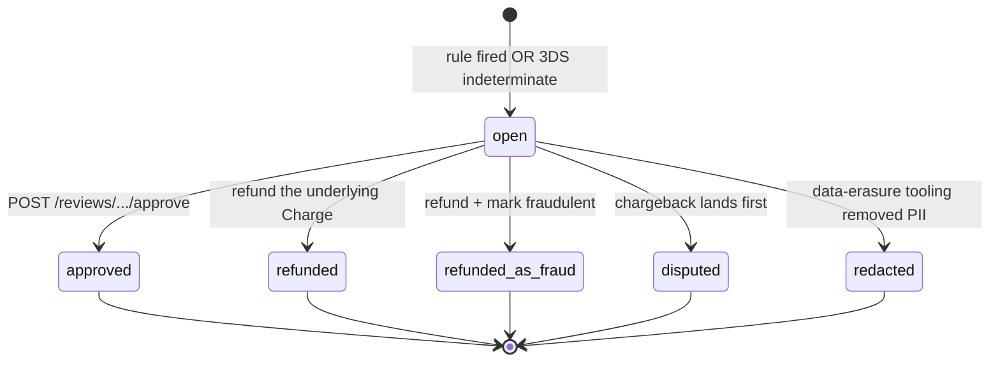
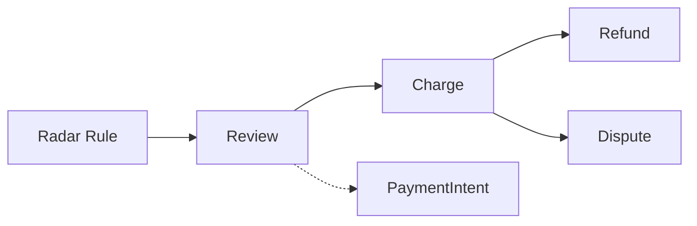

# Review

> API resource: `review` · API version: `2026-04-22.dahlia` · Category: [Fraud & Radar](README.md)

## What it is

A `Review` is a Charge that Radar has **set aside for human inspection** instead of letting it pass straight through. The funds are usually authorized (and often captured), but Radar — or a 3DS challenge that came back ambiguous — has flagged it as worth a second look. Until you (or someone on your fraud team) makes a call, the charge sits in a "pending Radar judgment" state in the dashboard.

It's the opt-in escape hatch between Radar's two extremes (`allow` and `block`): "this looks suspicious enough that I don't want to silently allow it, but not suspicious enough to block automatically — escalate."

## Why it exists

A pure block/allow Radar config either lets too much fraud through (false negatives) or rejects too many real customers (false positives). Reviews give you a third bucket: payments where Radar's confidence isn't high enough either way, so a human (or your fraud-team's automation) makes the final call. They're the natural pair to a Radar rule of the form `Review if :card_country: != :ip_country:` or `Review if amount > $1000`.

## Lifecycle & states

A Review is either `open` or `closed`. Closed Reviews are immutable.



State semantics:

- **`open: true`** — `closed_reason: null`. Radar is still waiting on you. The Charge itself may already be `succeeded` (funds captured) — the Review is an annotation on top, not a state of the Charge.
- **`open: false, closed_reason: approved`** — you (or someone) called the approve endpoint. Charge proceeds normally; this is the "false alarm, let it through" path.
- **`open: false, closed_reason: refunded`** — the Charge was refunded normally. Closing the Review is a side effect.
- **`open: false, closed_reason: refunded_as_fraud`** — the Charge was refunded *and* `fraud_details[user_report]=fraudulent` was set. **This is the one that teaches Radar.**
- **`open: false, closed_reason: disputed`** — a chargeback landed before you closed the Review. The dispute supersedes the review decision.
- **`open: false, closed_reason: redacted`** — Stripe's data redaction pipeline (right-to-be-forgotten) wiped the Review.

There is no "rejected" closed state. Refunding *is* the rejection — there's nothing to reject on a Charge that already authorized.

## Anatomy of the object

### Identity

| Field | Notes |
|---|---|
| `id` | `prv_…` |
| `object` | `"review"` |
| `livemode` | mode flag |
| `created` | unix seconds. |

### State

| Field | Notes |
|---|---|
| `open` | Boolean. The single source of truth for "needs attention". |
| `reason` | Why the review was opened *and* (when closed) why it was closed — Stripe collapses both into one field. Values: `rule | manual | refunded | refunded_as_fraud | disputed | redacted`. While `open: true`, this will be `rule` (a Radar rule fired) or `manual` (Dashboard user opened it). After closing it shifts to one of the closed_reason values. |
| `opened_reason` | The original opening reason, preserved even after close (`rule` or `manual`). Use this when you want the historical "why did Radar flag it". |
| `closed_reason` | `approved | refunded | refunded_as_fraud | disputed | redacted`, or `null` while open. The terminal verdict. |

### Pointers

| Field | Notes |
|---|---|
| `charge` | `ch_…` — the Charge under review. Always present. |
| `payment_intent` | `pi_…` if the Charge was created via PaymentIntent. |

### Signals (forensic data the reviewer cares about)

| Field | Notes |
|---|---|
| `billing_zip` | Postal code on the card-billing address. Often the cheapest fraud signal — mismatch with shipping is a flag. |
| `ip_address` | The customer's IP at confirm-time. |
| `ip_address_location.{city, country, region, latitude, longitude}` | Stripe's geolocation of the IP. May be `null` if the IP was missing or unresolvable. |
| `session.browser` / `session.device` / `session.platform` / `session.version` | Best-effort UA fingerprinting for the confirming session. May be `null` for server-side / API-only confirmations where no Stripe.js session existed. |

These are intentionally limited — Stripe doesn't expose its full Radar feature vector. If you want richer signals, you typically join your own data (account age, prior order count, etc.) against the Charge's customer in your fraud UI.

## Relationships



A Charge has at most **one** Review. The Review's lifecycle is loosely coupled to the Charge's: refunding the Charge auto-closes the Review; approving the Review is a no-op on the Charge (the funds were already captured or about to be).

## Common workflows

### 1. Approve a legitimate review

```http
POST /v1/reviews/prv_…/approve
```

That's it. The Review closes with `closed_reason: approved`, the Charge proceeds untouched, and a `review.closed` event fires.

### 2. Refuse a review (it's fraud)

There is no "refuse" endpoint. You refuse by refunding *and* marking the Charge as fraudulent so Radar learns:

```http
POST /v1/refunds
  charge=ch_…
  reason=fraudulent
Idempotency-Key: review-prv_…-refund

POST /v1/charges/ch_…
  fraud_details[user_report]=fraudulent
```

The Review will close with `closed_reason: refunded_as_fraud`. **Order matters slightly** — if you only refund without setting `fraud_details`, you'll get `closed_reason: refunded` instead, which doesn't teach Radar.

### 3. Refuse without flagging (just don't want the order)

If it's not fraud, just a customer/business reason to cancel:

```http
POST /v1/refunds
  charge=ch_…
  reason=requested_by_customer
```

Closes the Review with `closed_reason: refunded`.

### 4. Triage on `review.opened`

```http
# Webhook arrives
POST /your/webhook
  type=review.opened
  data.object={ id: "prv_…", charge: "ch_…", reason: "rule", ip_address_location: {…} }
```

Your handler should:

1. Pause downstream fulfillment for the order (don't ship until reviewed).
2. Surface the Review in your fraud-ops dashboard.
3. Set an SLA timer — Reviews left open for days mean orders sitting in limbo.
4. On approve/refund, resume / cancel fulfillment respectively.

### 5. List open reviews

```http
GET /v1/reviews?limit=100
```

(There's no `open=true` filter — you have to check `open` in the response. Cache aggressively in your fraud UI.)

## Webhook events

| Event | Fires when | Listener typically does |
|---|---|---|
| `review.opened` | A Radar rule with action `review` fires, OR Dashboard user manually opens, OR a 3DS challenge ends in an indeterminate state. | Pause fulfillment, surface in fraud UI, start SLA timer. |
| `review.closed` | Approve endpoint called, Charge refunded, Dispute opened on the underlying Charge, or the data was redacted. | Resume / cancel fulfillment based on `closed_reason`. |

## Idempotency, retries & race conditions

- `POST /reviews/:id/approve` is idempotent — calling twice on an already-approved Review returns the Review unchanged. No `Idempotency-Key` header required, though sending one is harmless.
- `review.closed` may be delivered out of order with `charge.refunded`. Don't assume Review closes before the Refund event lands; handle either order.
- A Charge can be **disputed while the Review is still open** (rare but possible if the cardholder filed a chargeback during the review window). The Review then auto-closes with `closed_reason: disputed`. Your fraud team's pending queue should reconcile.
- Approving a Review *after* you've already issued a refund is allowed but pointless — `closed_reason` will already be `refunded`; the approve call will return the closed Review.

## Test-mode tips

- Trigger one: `stripe trigger review.opened`. Creates a fresh Charge and Review.
- To force a Review path in your own test flow, either (a) write a Radar rule in test mode that always reviews (`Review if true`), or (b) use a 3DS test card that returns indeterminate (`4000 0000 0000 3220` initiates a challenge).
- Approving via CLI: `stripe reviews approve prv_…`.

## Connect considerations

- Reviews follow the Charge. **Direct charges** ⇒ Review on connected account; **destination charges** ⇒ Review on platform.
- Radar rules are configured per-account: the platform's rules don't apply to direct charges on connected accounts (the connected account has its own Radar settings, usually empty).
- For platforms that want centralized fraud review across all merchants, use *destination* charges or *separate charges and transfers* so all Charges (and their Reviews) live on the platform account where your rules and tooling live.

## Common pitfalls

- **Leaving Reviews open indefinitely.** Open Reviews are not "neutral" — Stripe surfaces them as actionable, your fraud-rate dashboards include them, and customer orders sit unfulfilled. Build SLA monitoring; auto-approve or auto-refund anything older than N days.
- **Refunding without `fraud_details[user_report]=fraudulent` for actual fraud.** You close the Review as `refunded` instead of `refunded_as_fraud`, and Radar's model never learns. Multiplied across thousands of orders, you're paying for fraud detection you're not feeding.
- **Auto-approving everything to clear the queue.** Defeats the point of Reviews — you might as well change the Radar rule to `allow` and skip the API round-trip.
- **Treating `reason` as immutable history.** It mutates from open-reason to close-reason on close. Use `opened_reason` if you need the original "why".
- **Assuming `session.*` is always populated.** Server-side confirms (mobile SDK, deferred-flow integrations) often have no UA / device data. Your fraud UI should degrade gracefully.
- **Forgetting that the Charge is already authorized.** A Review isn't a hold you can release — refusing means *refunding*, which costs you whatever interchange/fees the Refund eats.

## Further reading

- [API reference: Review](https://docs.stripe.com/api/radar/reviews/object)
- [Radar for Fraud Teams](https://docs.stripe.com/radar) — rule-writing and review-tuning guidance.
- [Charge.outcome](../01-core-resources/charges.md) for `risk_level` / `risk_score` upstream of the Review decision.
- [Radar Value Lists](radar-value-lists.md) for the lookup tables your rules reference.
