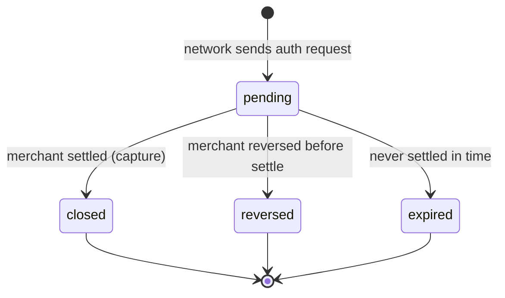
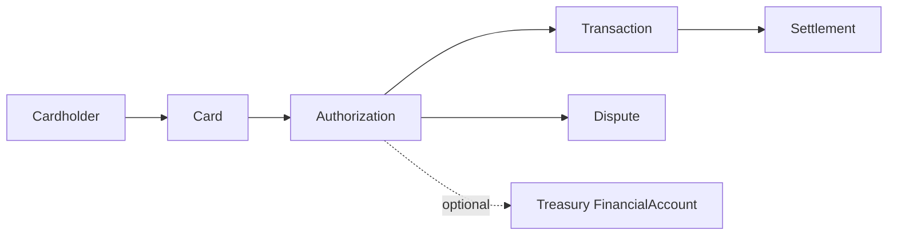

# Issuing Authorization

> API resource: `issuing.authorization` · API version: `2026-04-22.dahlia` · Category: [Issuing](README.md)

## What it is

An `issuing.authorization` is a real-time card-network request to spend money on a card *you* issued. When the cardholder swipes, taps, dips, or e-commerce-submits, the merchant's acquirer reaches the card network, the card network reaches Stripe, and Stripe reaches *you* — within a couple of seconds — asking "approve this $X at merchant Y or not?" The Authorization is the record of that conversation: the request, your decision, and (eventually) the settlement that drains funds from your Issuing balance.

It is the inverse of [Charge](../01-core-resources/charges.md). Charge is "merchant collected money from someone else's card." Authorization is "someone else's merchant tried to collect money from a card you issued." Most of Issuing's complexity lives here.

## Why it exists

Issuing exists so platforms can hand out spend (expense cards, payroll cards, marketplace seller cards, customer rebate cards) without standing up an issuing-bank stack. The Authorization object is what makes Stripe Issuing different from "just a prepaid card vendor": you, the platform, can decide *each transaction*, in real time, with arbitrary business logic, by replying to a webhook. Without Authorizations as an explicit object, you'd have only after-the-fact transactions and no chance to interpose policy.

## Lifecycle & states



| State | Trigger | What's mutable | Notes |
|---|---|---|---|
| `pending` | Network sent auth and Stripe accepted (or you approved via sync webhook). Funds held against your Issuing balance. | `metadata` only. | Can receive partial captures or incremental auths from the merchant. |
| `closed` | Merchant settled the auth — fully captured into one or more `issuing.transaction` records. | `metadata` only. | Terminal. Matched transactions show the actual amount(s). |
| `reversed` | Merchant explicitly reversed the auth without settling (e.g. void at terminal). Funds released back to Issuing balance. | `metadata` only. | Terminal. |
| `expired` | Auth aged out without settlement (window varies by network — typically 7–30 days). | `metadata` only. | Terminal. Funds released. |

`approved: false` authorizations skip `pending` and land directly in `closed` with no transactions.

### Synchronous decisioning (the load-bearing detail)

When `verification_method` indicates an online/network auth and you've enabled real-time decisioning, the `issuing_authorization.request` webhook is delivered **synchronously**: the network is holding the request open while Stripe waits for your reply. You have **~2 seconds** total budget. Reply with HTTP `200` and a JSON body:

```json
{ "approved": true,  "metadata": { "trip_id": "trip_42" } }
{ "approved": false, "decline_reason": "webhook_declined" }
```

Miss the deadline (or 5xx) and Stripe falls back to your account-level default (typically allow). After the decision, Stripe asynchronously fires `issuing_authorization.created`. For non-real-time flows (offline auths, force-posts), the `.created` event fires without a preceding `.request`.

## Anatomy of the object

### Identity

| Field | Notes |
|---|---|
| `id` | `iauth_…` |
| `object` | `"issuing.authorization"` |
| `livemode` | mode flag |
| `created` | unix seconds |

### Money

| Field | Notes |
|---|---|
| `amount` | Authorized amount in your card's `currency`, smallest unit. Can change via partial captures. |
| `currency` | Card's currency (settlement currency from your perspective). |
| `merchant_amount` | Amount in the *merchant's* currency. |
| `merchant_currency` | Merchant's billing currency (e.g. `eur` for a Berlin café). |
| `pending_request.amount` | Set only inside the `request` webhook payload — what's being asked for *right now*. |
| `pending_request.is_amount_controllable` | If `true`, you may approve a *smaller* amount than requested (partial approval). |

### Status

| Field | Notes |
|---|---|
| `status` | `pending | closed | reversed | expired`. |
| `approved` | Boolean. `false` means declined and `status: closed` immediately. |
| `authorization_method` | `keyed_in | swipe | chip | contactless | online`. |
| `verification_method` | Hedge: enum varies — check the API ref for live values. Tells you what the merchant submitted. |

### Relations

| Field | Type |
|---|---|
| `card` | `ic_…` — the issued card spent against. |
| `cardholder` | `ich_…` — convenience pointer to the card's cardholder. |
| `transactions` | Array of `issuing.transaction` settlements that closed (part of) this auth. |
| `treasury` | If your Issuing card is funded by a Treasury financial account, ledger pointers (`received_credits`, `received_debits`, `transaction`) live here. |
| `wallet` | `apple_pay | google_pay | samsung_pay | null` if tokenized. |

### Merchant data

| Field | Notes |
|---|---|
| `merchant_data.name` | Display name. |
| `merchant_data.category` | Human label (e.g. `restaurants`). |
| `merchant_data.category_code` | The MCC (4-digit). Use this for spending-control rules. |
| `merchant_data.network_id` | Network's merchant identifier. |
| `merchant_data.terminal_id`, `city`, `state`, `country`, `postal_code` | Geo / POS detail. Use for fraud heuristics. |

### Verification

`verification_data` reports CVV / AVS / expiry / 3DS results the network gave Stripe:

| Field | Values |
|---|---|
| `cvc_check` | `match | mismatch | not_provided` |
| `expiry_check` | `match | mismatch | not_provided` |
| `address_line1_check` | `match | mismatch | not_provided` |
| `address_postal_code_check` | `match | mismatch | not_provided` |
| `three_d_secure.result` | `attempt_acknowledged | authenticated | failed | required` (hedge — exact enum varies). |

Use these in your real-time decision: a CVC mismatch on a card-not-present auth is a strong decline signal.

### History

| Field | Notes |
|---|---|
| `request_history` | Array of every approve/decline decision Stripe recorded — including pre-decline-by-rule attempts and incremental auth bumps. Each entry has `amount`, `approved`, `created`, `reason`, `merchant_amount`. |
| `network_data` | Raw-ish network-supplied fields. Often includes `acquiring_institution_id`, `system_trace_audit_number`, `transaction_id`. |
| `metadata` | Your bag. Keys/values you set during the sync decision *or* later. |

## Relationships



- One Card has many Authorizations.
- One Authorization can produce zero, one, or many Transactions (partial captures).
- Disputes attach to a `Transaction`, not directly to the Authorization.

## Common workflows

### 1. Real-time approve/decline

Endpoint receives `issuing_authorization.request`:

```http
POST https://your.app/stripe/issuing
{ "type": "issuing_authorization.request",
  "data": { "object": { "id": "iauth_…",
    "pending_request": { "amount": 4200, "is_amount_controllable": true },
    "merchant_data": { "category_code": "5812", … } } } }
```

Reply within 2 s:

```http
HTTP/1.1 200 OK
Content-Type: application/json

{ "approved": true, "metadata": { "policy_version": "v3" } }
```

Programmatic equivalent (rare; for the async-decision fallback path):

```http
POST /v1/issuing/authorizations/iauth_…/approve
  amount=4200
  metadata[policy_version]=v3
```

```http
POST /v1/issuing/authorizations/iauth_…/decline
  metadata[reason]=over_budget
```

Programmatic approve/decline is only valid while `status: pending` and only useful for the rare async-decision path; sync reply is preferred.

### 2. Reconcile to settled transactions

Listen for `issuing_authorization.updated` (status moves to `closed`) and `issuing_transaction.created`. The Transaction's `authorization` field links back. Sum `transactions[].amount` for the actual money out.

### 3. Force-capture / offline / no-pending auth

Some auths arrive already-`closed` because the merchant force-posted (e.g. fuel pumps, in-flight). You'll see `issuing_authorization.created` with `pending_request: null` and an immediate `transactions[]`. There's no opportunity to decline these — you can only build post-hoc tooling.

## Webhook events

| Event | Fires when | Listener typically does |
|---|---|---|
| `issuing_authorization.request` | **Synchronous.** Real-time auth requested. | Decide & reply within 2 s. |
| `issuing_authorization.created` | After approve/decline, or for force-posted auths. | Persist, surface in UI. |
| `issuing_authorization.updated` | Status change (`closed`, `reversed`, `expired`), partial capture, incremental auth. | Reconcile balances. |

There is no `.closed` event distinct from `.updated` — closure is observed via `.updated` with `status: closed`.

## Idempotency, retries & race conditions

- The sync webhook is delivered exactly once per request, but Stripe may retry the *whole* auth if its initial reply attempt to the network fails — you may see two `iauth_…` for one shopper tap. Dedupe on `network_data.transaction_id` if available.
- Programmatic `/approve` and `/decline` accept `Idempotency-Key`; use them.
- `issuing_authorization.created` can arrive *after* you've already replied in the sync handler — your handler must be idempotent w.r.t. its own decision.
- Reversals can land before settlement events you'd expect, then `.created` for a transaction shows up later anyway as a fee record. Treat the `transactions[]` array as the source of truth, not a running counter.

## Test-mode tips

- `stripe trigger issuing_authorization.request` — fires a fake sync request you can reply to via CLI or your endpoint.
- `POST /v1/test_helpers/issuing/authorizations` — create an auth in any state for testing (`amount`, `card`, `merchant_data`).
- `POST /v1/test_helpers/issuing/authorizations/iauth_…/capture` — simulate merchant settlement, producing a Transaction.
- `POST /v1/test_helpers/issuing/authorizations/iauth_…/reverse` — simulate reversal.
- `POST /v1/test_helpers/issuing/authorizations/iauth_…/increment` — simulate the merchant bumping the auth (hotel incidentals).
- `POST /v1/test_helpers/issuing/authorizations/iauth_…/expire` — fast-forward to expired.

## Connect considerations

Issuing on a connected account: pass `Stripe-Account: acct_…`. The webhook endpoint must be on the *same* account that owns the cardholder/card. Platform-level webhook endpoints will not see Connect-account auth requests unless explicitly subscribed with `connect: true` — and even then the sync 2-second budget still applies, end-to-end. Most Issuing-on-Connect deployments keep the auth handler on the platform with low-latency lookups against per-merchant policies cached in memory.

## Common pitfalls

- **Slow handler.** A p99 of 1.8 s is not safe; the network round-trip eats hundreds of ms. Aim for p99 < 500 ms in your app code.
- **Returning 200 with no body.** Stripe interprets that as "no decision" → fallback. Return JSON.
- **Approving without reading `pending_request.amount`.** The amount on the parent object during the request webhook can lag the *current* request — always trust `pending_request`.
- **Not handling reversals.** Some merchants reverse instead of refunding. Your ledger must accept negative deltas.
- **Ignoring partial captures.** A $100 hotel auth can settle as $42 + $11 + $50 over three days. Don't assume one auth = one transaction.
- **Treating `approved: false` as a dispute path.** It isn't — it's a clean decline at the moment of swipe, no money moved.
- **Looking only at `amount` for spend.** For settled spend, sum `transactions[].amount`. The auth's `amount` is the *hold*, which can over- or under-state actual spend.

## Further reading

- [API reference: Issuing Authorization](https://docs.stripe.com/api/issuing/authorizations/object)
- [Real-time authorizations](https://docs.stripe.com/issuing/controls/real-time-authorizations)
- [Spending controls](https://docs.stripe.com/issuing/controls/spending-controls)
