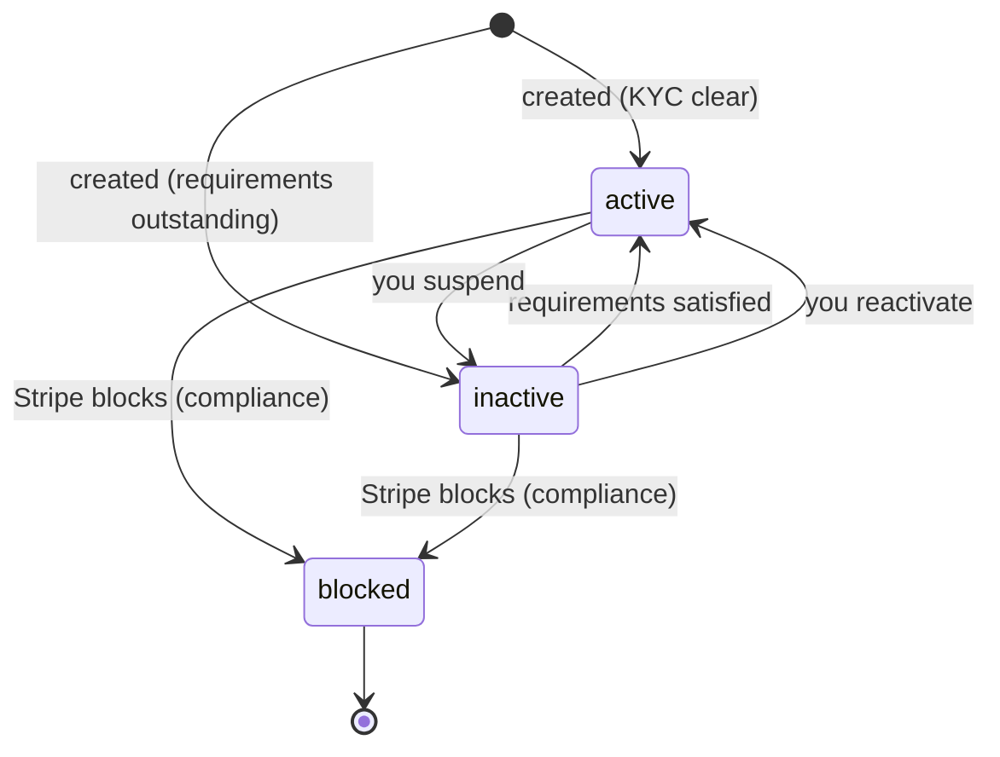
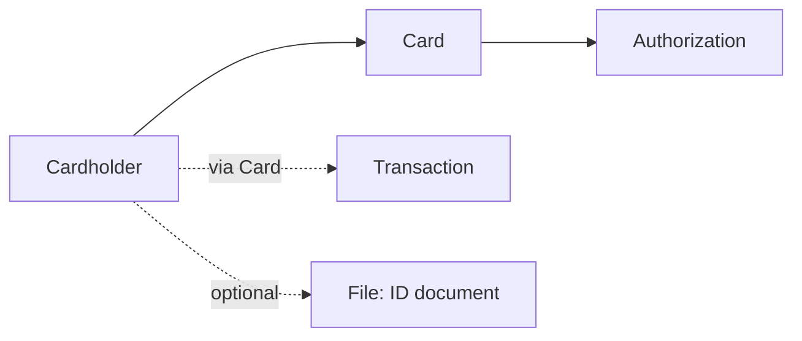

# Issuing Cardholder

> API resource: `issuing.cardholder` · API version: `2026-04-22.dahlia` · Category: [Issuing](README.md)

## What it is

A `Cardholder` is the person or business who holds one or more cards you've issued. It is the KYC'd party Stripe (and ultimately the regulator) treats as legally responsible for the card's use. Every [Card](cards.md) is attached to exactly one Cardholder; many Cards can share a Cardholder. Cardholder doubles as the AVS / statement address holder, the spending-control container, and the email/phone target for any cardholder-side notifications (e.g. wallet provisioning, fraud).

It is *not* the same as a Stripe [Customer](../01-core-resources/customers.md). A Customer pays you; a Cardholder spends with a card you issued.

## Why it exists

Issuing is regulated like any payment-card program: you can't hand out a Visa without identifying who's spending. Stripe needs name, address, and (for individuals in many jurisdictions) DOB and an acceptance of card-issuing terms before the network will let a card be issued. Cardholder is the place where all that identity data, plus per-person/per-company spending policy, plus locale preferences, lives. Without it you'd be smearing KYC across the Card object and re-collecting it every time you issued a replacement.

## Lifecycle & states



| State | Trigger | What's mutable | Cards usable? |
|---|---|---|---|
| `active` | KYC complete; nothing on `requirements.past_due`. | All identity fields, spending controls, metadata. | Yes (subject to card status). |
| `inactive` | You set `status: inactive`, or KYC info became insufficient. | Same as active. | No — auths decline with `card_inactive` or `cardholder_inactive`. |
| `blocked` | Stripe-side compliance block (sanctions hit, fraud). | Only `metadata`. | No. |

`blocked` is effectively terminal — you cannot self-serve unblock; it requires Stripe support intervention.

## Anatomy of the object

### Identity

| Field | Notes |
|---|---|
| `id` | `ich_…` |
| `object` | `"issuing.cardholder"` |
| `livemode` | mode flag |
| `created` | unix seconds |
| `type` | `individual | company`. Locks the shape of `individual`/`company` subobject. |
| `name` | Embossed/printed name. ≤24 chars — anything longer truncates on physical cards. |
| `email`, `phone_number` | Used for wallet provisioning OTP, fraud SMS, etc. **`phone_number` is required for digital wallet provisioning.** |
| `preferred_locales` | Array of BCP-47 codes. Stripe uses the first supported one for any cardholder-side comms. |

### Status & requirements

| Field | Notes |
|---|---|
| `status` | `active | inactive | blocked`. |
| `requirements.disabled_reason` | Why Stripe-side disabled (`requirements.past_due`, `under_review`, `listed`, `rejected.listed`, …). |
| `requirements.past_due` | Array of fields you still need to provide (e.g. `individual.dob.day`). Until empty, `status` may be `inactive`. |

### Billing / address

| Field | Notes |
|---|---|
| `billing.address.line1`, `line2`, `city`, `state`, `postal_code`, `country` | Statement + AVS address. Required at create. Changes propagate to AVS but not retroactively to issued physical cards' carrier copies. |

### Individual subobject (when `type=individual`)

| Field | Notes |
|---|---|
| `individual.first_name`, `last_name` | Required. |
| `individual.dob.day/month/year` | Required in most jurisdictions for KYC. |
| `individual.card_issuing.user_terms_acceptance.date`, `.ip` | **Required** — proof the cardholder accepted Stripe's card-issuing terms. Without this, no card can be issued. |
| `individual.verification.document.front`/`back` | Stripe `file_…` IDs of an ID document (when Stripe escalates KYC). |
| `individual.relationship` | (Hedge: shape varies by region.) |

### Company subobject (when `type=company`)

| Field | Notes |
|---|---|
| `company.tax_id` | EIN or local equivalent. Required for company cardholders in most regions. |

### Spending controls

| Field | Notes |
|---|---|
| `spending_controls.allowed_categories` | MCC categories allowed. If set, all others are denied. |
| `spending_controls.blocked_categories` | MCC categories denied. Use either allowed *or* blocked, not both. |
| `spending_controls.spending_limits` | Array of `{ amount, interval, categories }`. Intervals: `per_authorization | daily | weekly | monthly | yearly | all_time`. Per-category limits stack with the categoryless limit. |
| `spending_controls.spending_limits_currency` | Currency for the above amounts. |
| `spending_controls.allowed_merchant_countries`, `blocked_merchant_countries` | ISO-3166 lists. |

Cardholder controls cascade to all the cardholder's cards; a Card can override with stricter rules but not looser.

### Metadata

`metadata` — your bag, 50 keys × 500 chars.

## Relationships



- A Cardholder has many Cards (active simultaneously).
- A Card has exactly one Cardholder; reassignment is not supported — cancel and reissue under a new Cardholder.
- Deleting a Cardholder isn't a thing; you can only set `inactive`.

## Common workflows

### 1. Create an individual cardholder

```http
POST /v1/issuing/cardholders
  type=individual
  name=Avery Smith
  email=avery@example.com
  phone_number=+14155550133
  billing[address][line1]=350 Mission St
  billing[address][city]=San Francisco
  billing[address][state]=CA
  billing[address][postal_code]=94105
  billing[address][country]=US
  individual[first_name]=Avery
  individual[last_name]=Smith
  individual[dob][day]=14
  individual[dob][month]=7
  individual[dob][year]=1987
  individual[card_issuing][user_terms_acceptance][date]=1714694400
  individual[card_issuing][user_terms_acceptance][ip]=203.0.113.7
```

### 2. Apply spending controls

```http
POST /v1/issuing/cardholders/ich_…
  spending_controls[blocked_categories][]=gambling
  spending_controls[spending_limits][0][amount]=50000
  spending_controls[spending_limits][0][interval]=daily
  spending_controls[spending_limits_currency]=usd
```

### 3. Resolve `requirements.past_due`

When `requirements.past_due` is non-empty, fetch the cardholder, address each field listed, then re-check. The cardholder transitions to `active` automatically once requirements clear.

## Webhook events

| Event | Fires when | Listener typically does |
|---|---|---|
| `issuing_cardholder.created` | Created via API or Dashboard. | Persist locally. |
| `issuing_cardholder.updated` | Any field change, including `status` and `requirements`. | Re-evaluate "can I issue cards?" |

## Idempotency, retries & race conditions

- `POST /v1/issuing/cardholders` accepts `Idempotency-Key` — use one keyed off your internal user ID to avoid double-creation.
- Updates to `spending_controls` apply on the *next* auth request; in-flight auths use the rules at decision time.
- A cardholder going `blocked` does not retroactively reverse already-`pending` authorizations.

## Test-mode tips

- In test mode, KYC always passes — `requirements.past_due` stays empty and `status` is `active` immediately, regardless of the data you supply (you should still pass realistic data so your code paths exercise correctly).
- Use `name="Jenny Rosen"` and DOB `1901-01-01` if you want a deterministic test cardholder seed.

## Connect considerations

Cardholders are scoped to the connected account that owns them. On Connect, the **connected account is the legal cardholder issuer** for its own cardholders — so the connected account's KYC must be complete (capability `card_issuing`) before you can create cardholders there. Pass `Stripe-Account: acct_…` on the create call.

## Common pitfalls

- **Forgetting `card_issuing.user_terms_acceptance` on individuals.** Stripe will accept the cardholder create call, but card creation will fail with a confusing error.
- **Setting both `allowed_categories` and `blocked_categories`.** Allowed wins; blocked is silently ignored. Pick one model.
- **Treating `inactive` as a soft pause.** It blocks all spend instantly — including in-flight pending auths' subsequent partial captures may behave unexpectedly. Good for offboarding, bad as a "speed bump."
- **Re-collecting KYC for replacement cards.** Reuse the same Cardholder; only create a new Card with `replacement_for=ic_old`.
- **Not setting `phone_number`.** Apple/Google Pay provisioning will fail without an SMS-deliverable number.

## Further reading

- [API reference: Issuing Cardholder](https://docs.stripe.com/api/issuing/cardholders/object)
- [Issuing KYC requirements](https://docs.stripe.com/issuing/cards#cardholders)
- [Spending controls](https://docs.stripe.com/issuing/controls/spending-controls)
