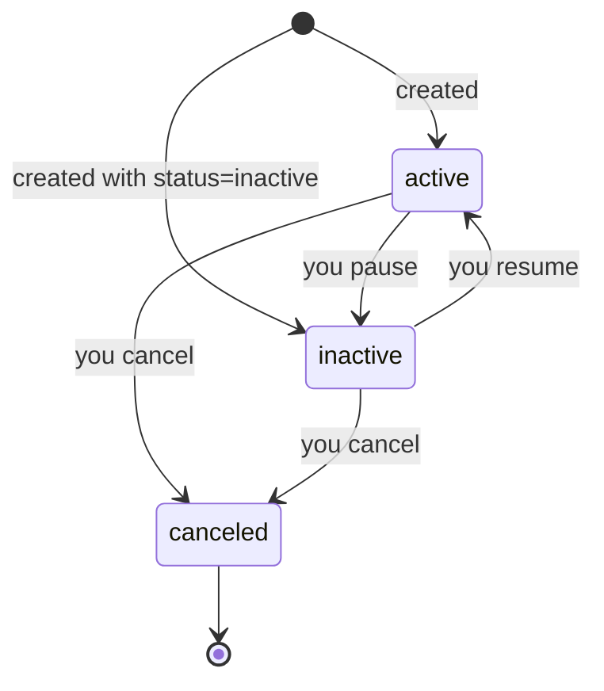
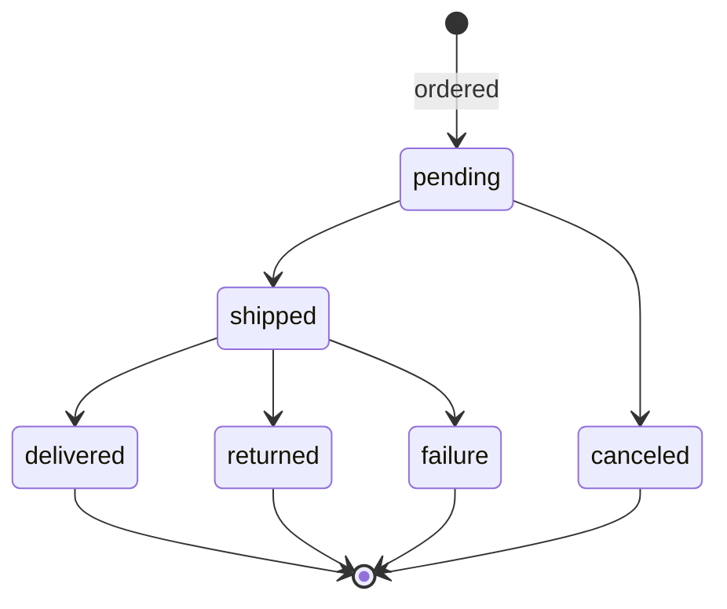
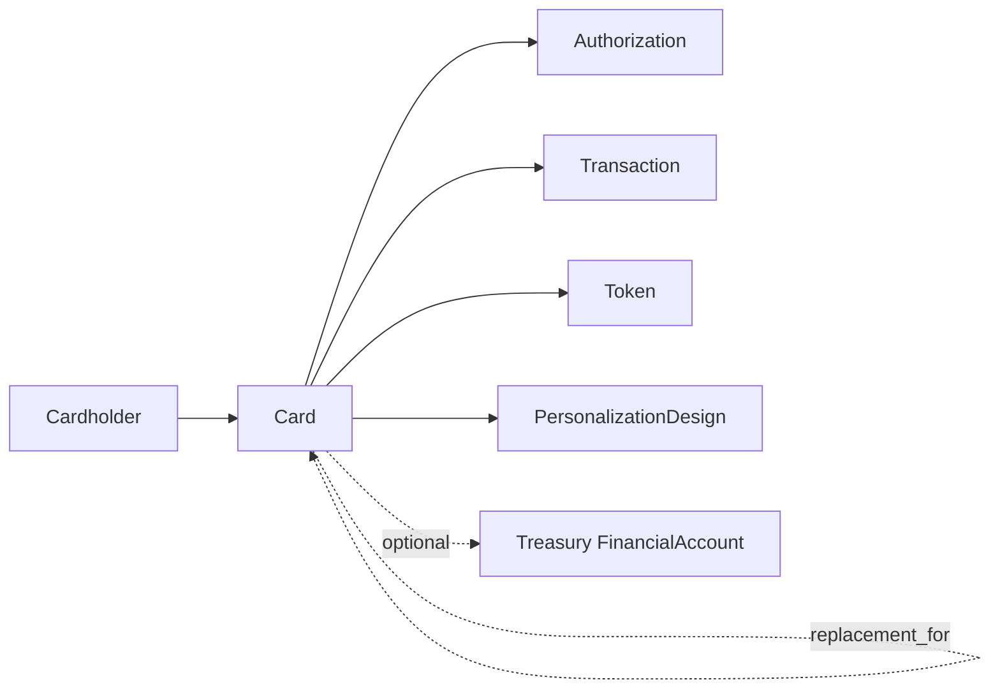

# Issuing Card

> API resource: `issuing.card` · API version: `2026-04-22.dahlia` · Category: [Issuing](README.md)

## What it is

An `issuing.card` is one card you've issued — a 16-digit PAN, a CVV, an expiry, a brand, and (optionally) a piece of plastic in a customer's mailbox. Cards are scoped to a [Cardholder](cardholders.md) and spend from your Issuing balance (or a [Treasury financial account](../11-treasury/financial-accounts.md) if you've wired Treasury underneath). Every [Authorization](authorizations.md) carries a pointer to the card it was attempted on.

Two flavors:

- `virtual` — exists only in Stripe / wallets / your UI. PAN can be revealed on demand. Instantly issued.
- `physical` — manufactured, shipped, returned/delivered/lost. Embodied in plastic via a [Personalization Design](personalization-designs.md) atop a [Physical Bundle](physical-bundles.md).

## Why it exists

It is the unit of "spending power you've handed someone." Authorizations, transactions, disputes, tokens, and spending controls all hang off the Card. Without it you couldn't model "this is the card we replaced after Avery dropped her phone in a lake."

## Lifecycle & states



| State | Trigger | What's mutable | Auths? |
|---|---|---|---|
| `active` | Default at create. | `metadata`, `spending_controls`, `status`, `personalization_design` (only before physical fulfillment), `cancellation_reason` (on cancel). | Allowed (subject to cardholder + spending controls). |
| `inactive` | You set it. | Same. | Declined with `card_inactive`. |
| `canceled` | You set `status: canceled` (with optional `cancellation_reason`). Or Stripe cancels (e.g. compromised). | `metadata` only. | Declined permanently. **Terminal.** |

A canceled card cannot be re-activated. Issue a replacement with `replacement_for=ic_old` and `replacement_reason=lost | damaged | stolen | expired`.

### Physical card sub-lifecycle (`shipping.status`)



The card itself can be `active` while `shipping.status: pending` — useful so the cardholder can immediately add it to a wallet via the digital PAN.

## Anatomy of the object

### Identity

| Field | Notes |
|---|---|
| `id` | `ic_…` |
| `object` | `"issuing.card"` |
| `livemode` | mode flag |
| `created` | unix seconds |
| `cardholder` | `ich_…` (or expanded). Cannot be changed after create. |
| `type` | `virtual | physical`. Cannot change. |
| `currency` | Card's settlement currency. Cannot change. |
| `brand` | `Visa | Mastercard` (varies by region). |

### PAN, CVC, expiry

| Field | Notes |
|---|---|
| `last4` | Always present. |
| `exp_month`, `exp_year` | Present. |
| `number` | **Not** in the standard object. Retrieve with `GET /v1/issuing/cards/ic_…?expand[]=number,cvc` from a server with `card-issuing` permission, or — better — render via Stripe.js Elements (`<IssuingCardNumberDisplay>`) so the PAN never touches your servers and stays out of PCI scope. |
| `cvc` | Same handling as `number`. |

### Status

| Field | Notes |
|---|---|
| `status` | `active | inactive | canceled`. |
| `cancellation_reason` | `lost | stolen | design_rejected | fraudulent | …` (set on cancel). |
| `replaced_by` | `ic_…` of the card that replaces this one. Set after replacement create. |
| `replacement_for` | `ic_…` of the card *this* one replaces. |
| `replacement_reason` | `damaged | expired | lost | stolen`. |

### Spending controls

Same shape as on [Cardholder](cardholders.md). Card-level controls **stack** with cardholder controls — both must allow for an auth to pass. Use card-level for stricter "this card is for travel only."

### Wallets

| Field | Notes |
|---|---|
| `wallets.apple_pay.eligible` | Boolean — true if Stripe + brand will accept push provisioning. |
| `wallets.apple_pay.ineligible_reason` | Set when not eligible. |
| `wallets.google_pay.eligible` / `ineligible_reason` | Same for Google. |
| `wallets.primary_account_identifier` | Network-token identifier — used by Apple/Google to associate provisioned tokens. |

### Physical-only fields

| Field | Notes |
|---|---|
| `personalization_design` | `ipd_…` — design template (logo, carrier copy). Required for personalized cards. |
| `shipping.name`, `address.*`, `service`, `type` | Where to send. `service` ∈ `standard | express | priority`. `type` ∈ `bulk | individual`. |
| `shipping.carrier`, `tracking_number`, `tracking_url`, `eta` | Populated as Stripe progresses fulfillment. |
| `shipping.status` | See sub-lifecycle above. |

### Other

| Field | Notes |
|---|---|
| `financial_account` | `fa_…` if this card spends from a Treasury financial account instead of your generic Issuing balance. |
| `metadata` | Your bag. |

## Relationships



## Common workflows

### 1. Issue a virtual card and reveal PAN

```http
POST /v1/issuing/cards
  cardholder=ich_…
  currency=usd
  type=virtual
  status=active
```

Reveal in-browser via Stripe.js — preferred, no PCI scope creep:

```js
const elements = stripe.elements({ mode: 'payment', currency: 'usd' });
elements.create('issuingCardNumberDisplay', { issuingCard: 'ic_…', nonce: '…' });
```

The `nonce` comes from a server endpoint that calls `POST /v1/ephemeral_keys` with `issuing_card=ic_…`.

### 2. Order a physical card

```http
POST /v1/issuing/cards
  cardholder=ich_…
  currency=usd
  type=physical
  personalization_design=ipd_…
  shipping[name]=Avery Smith
  shipping[address][line1]=350 Mission St
  shipping[address][city]=San Francisco
  shipping[address][state]=CA
  shipping[address][postal_code]=94105
  shipping[address][country]=US
  shipping[service]=standard
```

### 3. Replace a lost card

```http
POST /v1/issuing/cards/ic_old
  status=canceled
  cancellation_reason=lost
```

```http
POST /v1/issuing/cards
  cardholder=ich_…
  currency=usd
  type=physical
  replacement_for=ic_old
  replacement_reason=lost
  shipping[…]=…
```

The new card inherits brand and may inherit PAN-rotation behavior depending on `replacement_reason` (lost/stolen rotate; damaged/expired keep PAN where the network permits — hedge: behavior varies by brand).

### 4. Push to Apple/Google Wallet

Use Stripe's [push provisioning SDKs](https://docs.stripe.com/issuing/cards/digital-wallets) on iOS/Android. The provisioning result surfaces as an [issuing.token](tokens.md) object.

## Webhook events

| Event | Fires when | Listener typically does |
|---|---|---|
| `issuing_card.created` | New card. | Notify user, send PAN reveal link. |
| `issuing_card.updated` | Status, shipping status, spending control change. | Sync UI; trigger re-issue flow on `canceled`. |

Shipping status changes also flow as `issuing_card.updated` events with the `shipping` block diffed.

## Idempotency, retries & race conditions

- `POST /v1/issuing/cards` accepts `Idempotency-Key`. Set it from your internal request id to avoid double-issuance.
- A card switching to `canceled` does not invalidate already-`pending` authorizations on it; they will continue to settle/reverse normally. To prevent further auths *and* reverse pending ones, you must additionally `POST /v1/issuing/authorizations/iauth_…/decline` for any in-flight (rare path, usually unnecessary).
- `wallets.*.eligible` changes asynchronously after creation as Stripe completes brand handshakes — re-fetch after a few seconds before deciding to render the wallet button.

## Test-mode tips

- All cards are issued instantly in test mode — no shipping latency.
- Use the special test card numbers documented under Issuing testing (separate set from Payments testing). Hedge: exact values vary; check the docs.
- `POST /v1/test_helpers/issuing/cards/ic_…/shipping/ship` (and `deliver`, `return`, `fail`) advance physical-card shipping status without waiting on a real fulfillment center.

## Connect considerations

Cards live on the connected account that owns the cardholder. On Connect, the connected account must have the `card_issuing` capability active. Platforms can list/inspect cards across accounts via `Stripe-Account` headers but cannot move a card between accounts — re-issue under the destination account instead.

## Common pitfalls

- **Calling `GET /v1/issuing/cards/ic_…?expand[]=number` from your backend without considering PCI.** This pulls the full PAN into your environment and brings you in-scope. Prefer Stripe.js display elements.
- **Treating `status: inactive` as immediate kill switch for in-flight auths.** It only stops *new* auths; pending captures still settle.
- **Setting both card-level and cardholder-level spending controls and expecting the card-level to *loosen* the cardholder.** It can only tighten.
- **Forgetting `personalization_design` for physical cards in regions that require it.** The card create call may succeed but get stuck pre-fulfillment.
- **Not handling `shipping.status: returned`.** Cards that bounce sit in your fulfillment queue silently. Listen and re-mail.
- **Reusing a `Cardholder` of the wrong country for a card whose merchant base is elsewhere.** Card currency must align with cardholder country support; not all combinations are allowed.

## Further reading

- [API reference: Issuing Card](https://docs.stripe.com/api/issuing/cards/object)
- [Reveal card details](https://docs.stripe.com/issuing/cards/virtual#showing-card-details)
- [Push provisioning](https://docs.stripe.com/issuing/cards/digital-wallets)
- [Replacement cards](https://docs.stripe.com/issuing/cards/replacement-cards)
