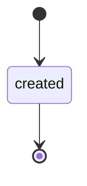
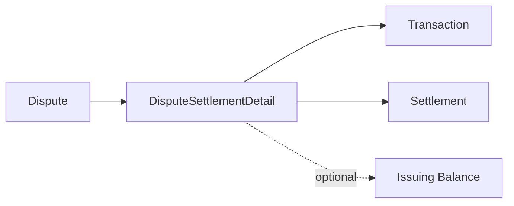

# Issuing Dispute Settlement Detail

> API resource: `issuing.dispute_settlement_detail` · API version: `2026-04-22.dahlia` · Category: [Issuing](README.md)

## What it is

An `issuing.dispute_settlement_detail` is a per-dispute, per-event line that records exactly how a [Dispute](disputes.md) moved (or didn't move) money on the network's settlement file. Where a Dispute is "we filed a chargeback" and a [Settlement](settlements.md) is "the network's daily roll-up," a Dispute Settlement Detail is the granular middle layer: "on this day, this dispute caused $X to flow with this network reason code."

Forensic, finance-focused, niche — but indispensable when a dispute outcome doesn't match what you expected and you need to trace exactly when and why the network moved funds.

## Why it exists

Dispute outcomes (`won`, `lost`) and Stripe's `funds_reinstated` / `funds_rescinded` events tell you *what* happened to your balance. But the network operates on its own schedule, often crediting provisionally on submission, then debiting on a loss days later, sometimes splitting a dispute across multiple settlement events (re-presentment, second chargeback, arbitration). Dispute Settlement Detail is where each of those network-side micro-events is recorded so your treasury team can match line-by-line against the network statement.

Hedge: this resource is relatively new and primarily consumed by sophisticated finance integrations. Most products do not need to surface or even ingest it.

## Lifecycle & states



Immutable on creation. No `status`. Each entry is a single accounting event observed by Stripe from the network's settlement stream. A given Dispute may accumulate multiple Dispute Settlement Detail records over its lifetime (initial chargeback hold, representment debit, arbitration credit, …).

## Anatomy of the object

### Identity

| Field | Notes |
|---|---|
| `id` | (Hedge: id prefix not strongly publicized — likely `idsd_…` or similar; check live API ref.) |
| `object` | `"issuing.dispute_settlement_detail"` |
| `livemode` | mode flag |
| `created` | unix seconds when Stripe recorded the event. |

### Money

| Field | Notes |
|---|---|
| `amount` | Amount moved on this event in `currency`, smallest unit. Sign indicates direction (positive = credit to your Issuing balance, negative = debit). |
| `currency` | Settlement currency. |

### Relations

| Field | Type |
|---|---|
| `dispute` | `idp_…` — the [Dispute](disputes.md) this event belongs to. |
| `transaction` | `ipi_…` — the underlying [Transaction](transactions.md) being disputed. |

### Network detail

| Field | Notes |
|---|---|
| `network_reason_code` | The network's reason-for-this-event code (e.g. `4837`, `10.4`, depending on Visa/Mastercard taxonomy). Useful for treasury audits and for understanding network-driven loss reasons more granularly than `Dispute.loss_reason`. |
| `event_type` | The kind of event (provisional credit, representment debit, arbitration credit, etc.). Hedge: enum varies; refer to live API ref for current values. |

### Metadata

`metadata` — your bag.

## Relationships



- A Dispute may have many Dispute Settlement Details across its lifecycle.
- Each Detail references one Transaction.
- Details map into the daily [Settlement](settlements.md) for the matching network + clearing date.

## Common workflows

### 1. Audit unexpected funds movement

When `issuing_dispute.funds_rescinded` arrives unexpectedly:

```http
GET /v1/issuing/dispute_settlement_details?dispute=idp_…
```

Walk the entries chronologically. Each one tells you (via `event_type` and `network_reason_code`) why the network moved money at that point. This is the primary tool for understanding "why was I debited even though I won."

### 2. Tie out network statements

Pair Dispute Settlement Details with [Settlement](settlements.md) records on matching `clearing_date` + network. The sum of dispute-related entries within a Settlement should match the network statement's "chargeback adjustments" line.

### 3. Loss-rate analytics

Aggregate `network_reason_code` distributions across `lost` disputes to identify patterns — e.g. "we lose every fraud dispute with code X because we're missing 3DS evidence" — and feed back into your dispute-evidence pipeline.

## Webhook events

There are no dedicated webhook events on this object. New Detail records are created as a side effect of dispute lifecycle (`issuing_dispute.funds_reinstated`, `funds_rescinded`, `closed`) and as a side effect of settlement processing. Pull via list endpoint when those events arrive, rather than expecting a `*.created`.

## Idempotency, retries & race conditions

- Read-only — no idempotency surface.
- A Dispute may accrue Dispute Settlement Details across many days, especially in arbitration. Don't snapshot once — re-poll for each dispute periodically until terminal.
- Detail records can arrive *after* the parent Dispute has reached terminal `won`/`lost` (e.g. arbitration adjustments). Don't unsubscribe from a dispute after terminal.

## Test-mode tips

- Test mode produces minimal Dispute Settlement Detail data — primarily useful for code-shape testing rather than realistic flows.
- To exercise downstream logic, mock the object shape.

## Connect considerations

Scoped to the connected account that owns the dispute. Use `Stripe-Account: acct_…` on list/retrieve. As with [Settlement](settlements.md), platforms typically aggregate via Sigma/Reporting rather than per-account API pulls.

## Common pitfalls

- **Treating one Detail as the full story.** A dispute lifecycle may produce 3+ Details. Always list-by-dispute, not single-fetch.
- **Confusing this with `Dispute.balance_transactions[]`.** That's the Issuing-balance side; Dispute Settlement Detail is the *network-side* view. They typically agree but can differ during in-flight provisional adjustments.
- **Building UI on `network_reason_code` strings.** They're network-vendor jargon and cryptic to non-finance staff. Map to human labels server-side before display.
- **Polling more often than daily.** New Details only land when the network sends settlement; sub-daily polling is wasted load.
- **Assuming Stripe normalizes Visa and Mastercard codes.** They share a slot in `network_reason_code` but the values are different namespaces. Disambiguate via the parent Dispute → Transaction → settlement network.

## Further reading

- [API reference: Issuing Dispute Settlement Detail](https://docs.stripe.com/api/issuing/dispute_settlement_detail/object) (hedge: official path may be slightly different — check live ref).
- [Issuing reports](https://docs.stripe.com/issuing/reports)
- [Dispute](disputes.md) — the parent object.
- [Settlement](settlements.md) — the daily aggregate this object decomposes.
