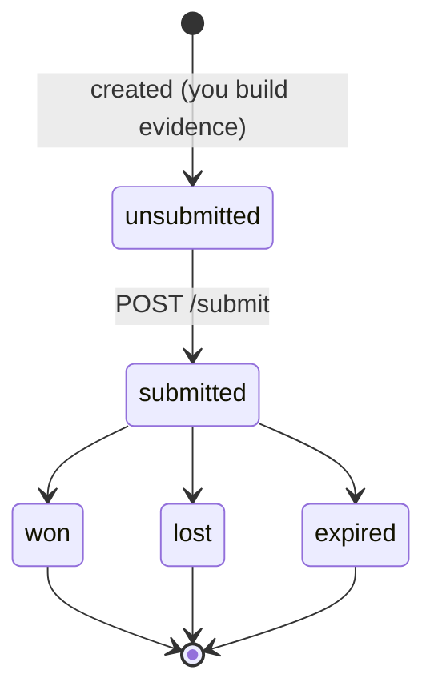
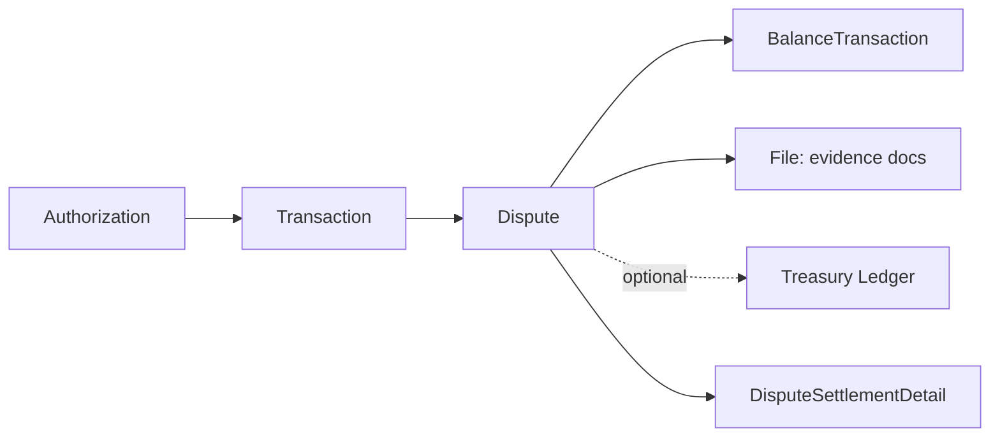

# Issuing Dispute

> API resource: `issuing.dispute` · API version: `2026-04-22.dahlia` · Category: [Issuing](README.md)

## What it is

An `issuing.dispute` is a chargeback *you* file (as the card issuer, on behalf of your cardholder) against a transaction the cardholder claims was fraudulent, wrong, or undelivered. It's the inverse of a payments-side [Dispute](../01-core-resources/disputes.md): in payments, a chargeback is filed *against* you and you defend; in issuing, you *initiate* it and the merchant's acquirer defends.

Disputes attach to an [issuing.transaction](transactions.md) (the settled record), not to the [Authorization](authorizations.md). When the network rules in your favor, funds re-credit your Issuing balance; when it rules against, the credit is rescinded.

## Why it exists

Cardholders expect to dispute charges — that's the whole reason the card-network rails carry dispute-rights flow. As issuer, you must collect the cardholder's claim, package it into a network-shaped submission, and ride out the network's adjudication. The Dispute object is the structured wrapper over that messy multi-week process.

## Lifecycle & states



| State | Trigger | What's mutable | Notes |
|---|---|---|---|
| `unsubmitted` | Created via API. | All evidence fields, `metadata`, `evidence.reason`. | Funds **not** moved yet. |
| `submitted` | `POST /v1/issuing/disputes/idp_…/submit`. | `metadata` only. **Evidence is frozen.** Provisional credit may post. |
| `won` | Network upheld your case. | `metadata`. | Funds reinstated permanently → `issuing_dispute.funds_reinstated`. |
| `lost` | Network sided with merchant. | `metadata`. | Provisional credit (if any) is rescinded → `issuing_dispute.funds_rescinded`. `loss_reason` populated. |
| `expired` | Network deadline passed without adjudication and case closed without resolution. | `metadata`. | Rare. |

Once `submitted`, you cannot edit evidence. You also cannot re-submit a disputed transaction in a *new* dispute — one transaction, one dispute attempt.

## Anatomy of the object

### Identity

| Field | Notes |
|---|---|
| `id` | `idp_…` |
| `object` | `"issuing.dispute"` |
| `livemode` | mode flag |
| `created` | unix seconds |

### Money

| Field | Notes |
|---|---|
| `amount` | Disputed amount in `currency`, smallest unit. May be < transaction amount (partial disputes for "I got 3 of 5 items"). |
| `currency` | Always matches the underlying transaction. |

### Status

| Field | Notes |
|---|---|
| `status` | `unsubmitted | submitted | won | lost | expired`. |
| `loss_reason` | Set on `lost`. Hedge: enum varies — `cardholder_authentication_issuer_liability`, `eci5_token_transaction_with_no_liability_shift`, etc. Useful for triage. |

### Relations

| Field | Type |
|---|---|
| `transaction` | `ipi_…` — the settled transaction being disputed. |
| `balance_transactions` | Array of `txn_…` — ledger entries for hold, reinstatement, rescission. |
| `treasury` | If the underlying transaction was Treasury-funded, ledger pointers (`debit_reversal`, `received_debit`) live here. |

### Evidence

`evidence.reason` selects which sub-object Stripe expects:

| Reason | Sub-object |
|---|---|
| `fraudulent` | `evidence.fraudulent.explanation` (+ optional `additional_documentation` file). |
| `merchandise_not_as_described` | `evidence.merchandise_not_as_described.{explanation, received_at, return_status, returned_at, additional_documentation}`. |
| `not_received` | `evidence.not_received.{expected_at, explanation, product_description, product_type, additional_documentation}`. |
| `service_not_as_described` | `evidence.service_not_as_described.{explanation, received_at, canceled_at, cancellation_reason, additional_documentation}`. |
| `duplicate` | `evidence.duplicate.{original_transaction, explanation, card_statement, cash_receipt, check_image, additional_documentation}`. |
| `canceled` | `evidence.canceled.{canceled_at, cancellation_policy_provided, cancellation_reason, expected_at, explanation, product_description, product_type, return_status, returned_at, additional_documentation}`. |
| `other` | `evidence.other.{explanation, product_description, product_type, additional_documentation}`. |

`additional_documentation` is a `file_…` ID (uploaded with `purpose=dispute_evidence`).

### Metadata

`metadata` — your bag.

## Relationships



- A Transaction has at most one Dispute.
- Each Dispute may attach multiple `file_…` IDs as evidence.
- Funds movement is recorded in `balance_transactions[]` (issuing-balance side) and, where applicable, [Dispute Settlement Detail](dispute-settlement-details.md) (network side).

## Common workflows

### 1. Cardholder reports unauthorized charge

```http
POST /v1/files
  purpose=dispute_evidence
  file=@statement_screenshot.png
```

```http
POST /v1/issuing/disputes
  transaction=ipi_…
  evidence[reason]=fraudulent
  evidence[fraudulent][explanation]=Card was in cardholder's possession; cardholder did not initiate this transaction.
  evidence[fraudulent][additional_documentation]=file_…
```

Then submit:

```http
POST /v1/issuing/disputes/idp_…/submit
```

### 2. Merchandise issue (received but wrong)

```http
POST /v1/issuing/disputes
  transaction=ipi_…
  amount=5000
  evidence[reason]=merchandise_not_as_described
  evidence[merchandise_not_as_described][explanation]=Cardholder received counterfeit goods.
  evidence[merchandise_not_as_described][received_at]=1714694400
  evidence[merchandise_not_as_described][return_status]=successful
  evidence[merchandise_not_as_described][returned_at]=1715040000
  evidence[merchandise_not_as_described][additional_documentation]=file_…
```

### 3. Listen for resolution

`issuing_dispute.closed` fires with terminal `status`. On `won`, expect `issuing_dispute.funds_reinstated` (often same time). On `lost`, expect `issuing_dispute.funds_rescinded` *if* a provisional credit had been issued earlier.

## Webhook events

| Event | Fires when | Listener typically does |
|---|---|---|
| `issuing_dispute.created` | Dispute created. | Persist; show "in progress" in UI. |
| `issuing_dispute.submitted` | You called `/submit`. | Lock evidence in your UI. |
| `issuing_dispute.updated` | Field change while in progress (rare). | Refresh local state. |
| `issuing_dispute.closed` | Terminal state reached. | Notify cardholder of outcome. |
| `issuing_dispute.funds_reinstated` | Stripe credited Issuing balance for a won dispute (or post-submit provisional credit). | Update ledger. |
| `issuing_dispute.funds_rescinded` | Stripe clawed back a provisional credit on loss. | Update ledger; possibly notify cardholder. |

## Idempotency, retries & race conditions

- `POST /v1/issuing/disputes` and `/submit` accept `Idempotency-Key`. Always set one — accidental double-submit can violate network deadline rules.
- `funds_reinstated` and `funds_rescinded` can interleave (Stripe issues provisional credit, then rescinds on loss). Reconcile on `balance_transactions[]`, not on event order.
- `issuing_dispute.closed` may arrive *before* the corresponding `funds_*` event. Don't assume the ledger is final until both have landed.

## Test-mode tips

- `POST /v1/issuing/disputes` works against a test transaction. Submit and Stripe simulates network adjudication.
- `POST /v1/test_helpers/issuing/transactions/refund` creates a refund-type transaction useful for exercising the "duplicate" reason.
- `stripe trigger issuing_dispute.created` fires a synthetic event for handler wiring.
- Hedge: there isn't a public test helper to *force* `won` vs `lost`; outcomes follow simulated network logic.

## Connect considerations

Disputes are scoped to the connected account that owns the underlying transaction. The connected account's `card_issuing` capability must be active to file. Funds move on the connected account's Issuing balance.

## Common pitfalls

- **Submitting too early.** Missing evidence after submit is non-recoverable. Build a checklist per `evidence.reason` before calling `/submit`.
- **Filing for the same transaction twice.** Stripe rejects the second attempt; you only get one shot per transaction.
- **Missing the network deadline.** Most networks give the cardholder 60-120 days from settlement to dispute. Build a "dispute window expires in N days" UI.
- **Ignoring `funds_rescinded`.** A provisional credit can be clawed back weeks later. If you've already credited the cardholder's app balance, you'll be out of pocket.
- **Treating `loss_reason` as merchant fault.** Many losses are technical (e.g. 3DS-authenticated transactions shift liability to issuer). Read it carefully before retrying with the cardholder.
- **Disputing fraud without first canceling the card.** If the card is still active, more fraud can post — and may not be coverable by the same dispute.

## Further reading

- [API reference: Issuing Dispute](https://docs.stripe.com/api/issuing/disputes/object)
- [Manage disputes](https://docs.stripe.com/issuing/purchases/disputes)
- [Network dispute reasons](https://docs.stripe.com/issuing/purchases/disputes#reasons)
