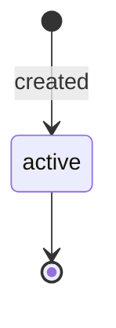

# Issuing Funding Instructions

> API resource: `issuing.funding_instructions` · API version: `2026-04-22.dahlia` · Category: [Issuing](README.md)

## What it is

`issuing.funding_instructions` is a static set of bank-transfer details — routing number, account number, address, currency — that you (or your finance team) wire money *to* in order to top up your Issuing balance. It's the on-ramp for the [Issuing balance](../01-core-resources/balance.md) on accounts that fund issuing via bank transfer rather than via [Treasury](../11-treasury/README.md) or via cross-balance transfers from your Payments balance.

It is the issuing-side analog of [PaymentMethod customer balance funding instructions](../06-billing/customer-balance-transactions.md) — same idea (we give you a virtual bank account, you wire money in, the money lands here), different destination balance.

## Why it exists

Cards spend money. That money has to come from somewhere. For platforms that don't run [Treasury](../11-treasury/README.md) — i.e. don't hold a Stripe-managed bank account — the funding model is "wire money to a virtual bank account Stripe assigns you, and Stripe credits your Issuing balance when it arrives." Funding Instructions is the object that holds those wire details persistently so your finance team can save them and re-use them month after month.

Hedge: this resource is specific to certain Issuing funding configurations. If you fund Issuing via a Treasury [FinancialAccount](../11-treasury/financial-accounts.md) underneath your cards, you don't need Funding Instructions — Treasury OutboundTransfer / inbound credits handle it. Check your account's funding model in the Dashboard before integrating against this object.

## Lifecycle & states



There is no real lifecycle. Funding Instructions are created once per `currency` × `bank_transfer.type` and persist. Stripe doesn't expire them. There's no `status` field of consequence.

## Anatomy of the object

### Identity

| Field | Notes |
|---|---|
| `object` | `"issuing.funding_instructions"` |
| `livemode` | mode flag |
| `currency` | The currency these instructions accept. One set per currency. |

### Bank-transfer details

| Field | Notes |
|---|---|
| `bank_transfer.type` | `us_bank_transfer | jp_bank_transfer | …`. Selects which network the wire travels on. Determines the shape of `financial_addresses[]`. |
| `bank_transfer.financial_addresses` | Array of payable addresses. Each entry has `type` (`aba | iban | sort_code | spei | swift | zengin | …`) and a sub-object whose fields depend on `type`. |

For a US bank transfer (`type=us_bank_transfer`), expect a `financial_addresses[].aba` block:

```json
{
  "type": "aba",
  "aba": {
    "account_number": "1234567890",
    "bank_name": "STRIPE TEST BANK",
    "routing_number": "110000000"
  }
}
```

For SEPA (Eurozone), expect an `iban` block; for UK Faster Payments, a `sort_code` block; for Japan, a `zengin` block. The shape is the field name; rely on `type` to dispatch.

### Routing instructions for the wire

The receiving bank may also need a beneficiary name and address — Stripe surfaces those at the top level (or inside the address sub-block) so you can paste them into your bank's UI. Hedge: exact placement varies by region.

## Relationships


Funding Instructions is upstream of every Authorization: without funded balance, auths decline.

## Common workflows

### 1. Get instructions for a new currency

```http
POST /v1/issuing/funding_instructions
  currency=usd
  bank_transfer[type]=us_bank_transfer
```

Response includes the ABA routing/account. Save the IDs in your finance system; they're stable for re-use.

### 2. Top up the Issuing balance

Off-API: your finance team sends a wire to the address shown above. Stripe detects the inbound, credits Issuing balance, and emits a `balance.available` event when funds become available. There is no `funding_instructions.received` event — observe the balance transaction (`type=topup`) or the `balance.available` event instead.

### 3. Multi-currency

Repeat the create call once per currency you operate in. There is no global "all currencies" set — Stripe issues separate addresses per currency × rail.

## Webhook events

| Event | Fires when | Listener typically does |
|---|---|---|
| (none directly on this object) | — | — |
| `balance.available` | Issuing balance bucket changed. | Reconcile against expected wire amount. |

To track inbound credits to your Issuing balance, listen for `balance.available` and reconcile via `BalanceTransaction.list(type=topup, …)`.

## Idempotency, retries & race conditions

- `POST /v1/issuing/funding_instructions` with the same currency + bank_transfer.type returns the same instructions (Stripe deduplicates). Use `Idempotency-Key` regardless to avoid edge-case dupes during partial failures.
- Wires are not real-time. Same-day for domestic ACH/wires; 1-2 days cross-border. Don't issue cards for the equivalent of an unfunded check.
- `balance.available` may lag the wire arrival by minutes (or hours during bank cutoffs).

## Test-mode tips

- In test mode, `POST /v1/issuing/funding_instructions` returns plausible-but-fake routing/account values you cannot actually wire to.
- Simulate inbound funding with `POST /v1/test_helpers/issuing/fund_balance` (hedge — exact endpoint name varies; check current API ref). Or use the Dashboard's "Add funds" button in test mode.

## Connect considerations

On Connect, funding instructions are scoped to the connected account. The connected account is the legal recipient of the wire — pass `Stripe-Account: acct_…`. Platform-level instructions don't exist for a connected-account Issuing balance; each connected account has its own.

## Common pitfalls

- **Assuming Treasury-backed cards need this.** They don't — Treasury financial accounts have their own routing/account on the FinancialAccount object. Funding Instructions is for the *generic* Issuing balance.
- **Hard-coding ABA routing numbers in your finance pipeline.** Stripe may rotate the underlying virtual account in rare cases. Re-fetch quarterly.
- **Wiring in the wrong currency.** Cross-currency wires get rejected or auto-converted at unfavorable rates. Match `currency` to your wire-send instructions.
- **Forgetting Connect-account scoping.** Wiring to a platform-level address when you have connected-account cards lands the money on the wrong balance.
- **Not reconciling.** Without a webhook for "wire received," it's easy to lose visibility. Build a job that diffs `BalanceTransaction.list(type=topup)` against expected wires.

## Further reading

- [API reference: Issuing Funding Instructions](https://docs.stripe.com/api/issuing/funding_instructions/object)
- [Fund your Issuing balance](https://docs.stripe.com/issuing/funding)
- [Treasury funding alternative](../11-treasury/financial-accounts.md)
