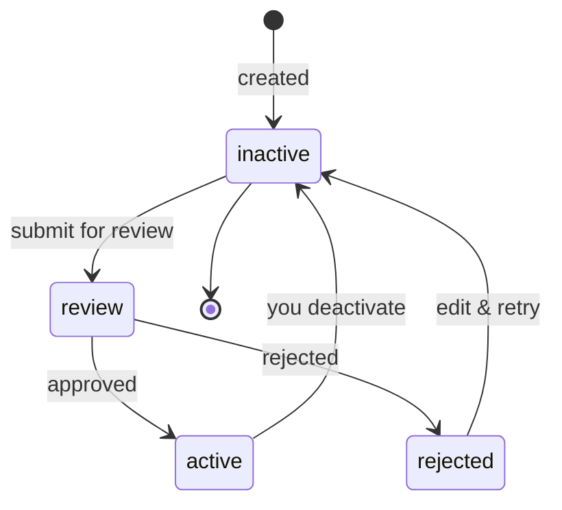
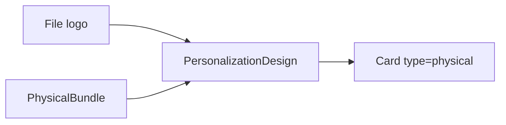

# Issuing Personalization Design

> API resource: `issuing.personalization_design` · API version: `2026-04-22.dahlia` · Category: [Issuing](README.md)

## What it is

A `personalization_design` is a reusable visual template for physical cards: which logo prints on the plastic, what copy appears on the carrier sheet, which [Physical Bundle](physical-bundles.md) (card stock + envelope) wraps it. You upload artwork once, Stripe and the network review it once, and then every physical [Card](cards.md) you create can reference the approved design via its `ipd_…` id.

Without designs, every physical card would either be a default Stripe-branded plastic or require ad-hoc per-card artwork submission — expensive and slow.

## Why it exists

Physical-card programs need brand consistency, regulatory copy on the carrier (terms, contact info), and (for many networks) explicit network approval of any custom artwork. Personalization Design centralizes that artwork → review → approval flow into one object, decoupled from individual card creation. You design once; you ship thousands.

## Lifecycle & states



| State | Trigger | What's mutable | Cards using it? |
|---|---|---|---|
| `inactive` | Created, deactivated, or returned from rejection. | Everything (artwork, carrier copy, name). | Cannot reference for new cards. |
| `review` | You submitted via Dashboard or `POST .../activate` (hedge — exact endpoint may vary). | `metadata` only. | Cannot reference for new cards. |
| `active` | Stripe + network approved. | `metadata`, `preferences`, `name`, `lookup_key`. | **Usable.** New physical cards may set `personalization_design=ipd_…`. |
| `rejected` | Reviewer found a problem. | `rejection_reasons` populated, otherwise inactive-like. | Cannot reference. |

The state machine is driven by Stripe's review queue plus your activate/deactivate calls.

## Anatomy of the object

### Identity

| Field | Notes |
|---|---|
| `id` | `ipd_…` |
| `object` | `"issuing.personalization_design"` |
| `livemode` | mode flag |
| `created` | unix seconds |
| `name` | Internal label (Dashboard-visible). Not printed on card. |
| `lookup_key` | Stable string you can use to fetch instead of by id. Useful for "give me the design called `corporate-2025`." |

### Status

| Field | Notes |
|---|---|
| `status` | `inactive | review | active | rejected`. |
| `rejection_reasons.card_logo` | Array of network-supplied codes explaining logo issues (e.g. `geographic_location`, `network_or_issuer_logo`). |
| `rejection_reasons.carrier_text` | Same shape, for carrier copy. |

### Artwork

| Field | Notes |
|---|---|
| `card_logo` | `file_…` ID — the logo image. Upload via `POST /v1/files purpose=issuing_logo`. PNG, transparent background, sized per Stripe's guidelines (hedge: exact dims in the docs; commonly 100×100 mm at print resolution). |
| `physical_bundle` | `ipb_…` — which [Physical Bundle](physical-bundles.md) (stock + envelope) this design uses. Bundle dictates which features (logo, carrier text, second line) are even available. |

### Carrier text

| Field | Notes |
|---|---|
| `carrier_text.header_title` | Top-of-carrier headline. |
| `carrier_text.header_body` | Body under the header. |
| `carrier_text.footer_title` | Bottom headline. |
| `carrier_text.footer_body` | Body under the footer (often legal/contact). |

Each field has a max length the bundle enforces. Submitted carrier text is reviewed alongside the logo.

### Preferences

| Field | Notes |
|---|---|
| `preferences.is_default` | If `true`, used when a card create call omits `personalization_design`. |
| `preferences.is_platform_default` | (Connect) Used as default by all your platform's connected accounts that haven't set their own. |

### Metadata

`metadata` — your bag.

## Relationships



- A Design references one File (logo) and one Physical Bundle.
- Many Cards can share one Design.
- A Card's `personalization_design` is set at create time and effectively immutable after fulfillment begins.

## Common workflows

### 1. Upload a logo and create a design

```http
POST /v1/files
  purpose=issuing_logo
  file=@logo.png
```

```http
POST /v1/issuing/personalization_designs
  name=Corporate 2025
  lookup_key=corporate-2025
  card_logo=file_…
  physical_bundle=ipb_…
  carrier_text[header_title]=Welcome
  carrier_text[header_body]=Your corporate card has arrived.
  carrier_text[footer_title]=Need help?
  carrier_text[footer_body]=Visit support.example.com or call +1 555 0100.
```

### 2. Submit for review and activate

Designs typically begin in `inactive`. Submit for review via Dashboard or:

```http
POST /v1/test_helpers/issuing/personalization_designs/ipd_…/activate
```

(Hedge: in production, activation is gated behind Stripe + network review; in test mode the test helper short-circuits to `active`.)

### 3. Handle rejection

On `issuing_personalization_design.rejected`, fetch the object, read `rejection_reasons.card_logo[]` / `rejection_reasons.carrier_text[]`, fix the artwork or copy, then re-submit. Common rejection codes include logo too small, network-or-issuer-logo conflict, or carrier text containing prohibited language.

### 4. Use in a card create

```http
POST /v1/issuing/cards
  cardholder=ich_…
  type=physical
  currency=usd
  personalization_design=ipd_…
  shipping[…]=…
```

## Webhook events

| Event | Fires when | Listener typically does |
|---|---|---|
| `issuing_personalization_design.activated` | Status moves to `active`. | Mark design as usable in your card-creation UI. |
| `issuing_personalization_design.deactivated` | Status moves back to `inactive`. | Remove from selectable list. |
| `issuing_personalization_design.rejected` | Reviewer rejected. | Surface `rejection_reasons` to your designer. |
| `issuing_personalization_design.updated` | Field change. | Refresh local cache. |

## Idempotency, retries & race conditions

- `POST /v1/issuing/personalization_designs` accepts `Idempotency-Key`.
- Approval is async — could be hours or days. Don't block your card-create flow on it; queue card-create requests until the design is `active`.
- A design transitioning from `active` → `inactive` does **not** affect cards already manufactured against it.

## Test-mode tips

- In test mode, you can fast-forward review via test helpers: `POST /v1/test_helpers/issuing/personalization_designs/ipd_…/activate`, `.../deactivate`, `.../reject`.
- `stripe trigger issuing_personalization_design.rejected` exercises the rejection-handling path.
- Test-mode logos accept any PNG; live-mode requires production-quality artwork.

## Connect considerations

- On Connect, personalization designs are owned by the platform *or* by individual connected accounts depending on your Issuing setup.
- `preferences.is_platform_default` only applies to platform-owned designs and acts as the fallback design across all connected accounts that don't override.
- The connected account must have `card_issuing` capability to use a design (whether its own or platform-default).

## Common pitfalls

- **Submitting a logo with the network's brand mark embedded.** Visa/Mastercard reject any user logo that overlaps their brand area. The rejection reason is often vague — re-read network design specs.
- **Carrier text in the wrong language for the cardholder's locale.** Network reviewers reject obviously mismatched copy. Maintain one design per locale.
- **Picking a Physical Bundle that doesn't support carrier text.** The `features` flags on [Physical Bundle](physical-bundles.md) tell you which design fields are honored — set carrier text on a bundle without `carrier_text=true` and the print just drops it.
- **Using an `inactive` design in a card create.** The card create call fails with a clear error, but newcomers often miss the activation gate.
- **Treating `is_default: true` as "applies retroactively."** It only affects new card creates that omit a design.

## Further reading

- [API reference: Issuing Personalization Design](https://docs.stripe.com/api/issuing/personalization_designs/object)
- [Physical card design guide](https://docs.stripe.com/issuing/cards/physical/personalization-designs)
- [Logo and artwork specs](https://docs.stripe.com/issuing/cards/physical/personalization-designs#design-requirements)
