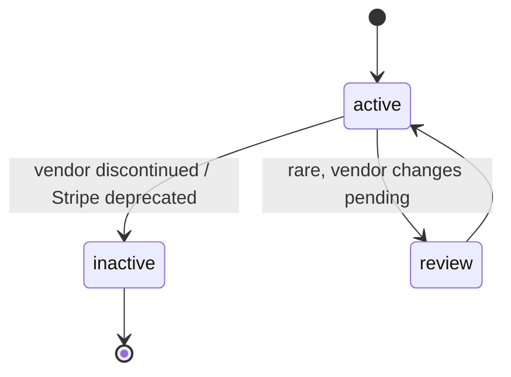

# Issuing Physical Bundle

> API resource: `issuing.physical_bundle` · API version: `2026-04-22.dahlia` · Category: [Issuing](README.md)

## What it is

A `physical_bundle` is the catalog entry for a *kit* of physical card components: the card stock (color, finish, magstripe vs. dual-interface chip), the carrier sheet (paper grade, fold), and the envelope. Stripe maintains a list of bundles you can pick from when creating a [Personalization Design](personalization-designs.md); the design then gets stamped onto that bundle when a [Card](cards.md) is manufactured.

It is essentially a read-only product catalog. You don't *create* bundles via API in the typical case — you `list` them and reference one by `ipb_…` from your design.

## Why it exists

Card programs need a finite, manufacturer-supported set of physical inputs. You can't ask the print house for 10,000 cards in custom-Pantone teal next Tuesday — you pick from what they stock. Bundles are the abstraction over "what the fulfillment vendor supports right now," with feature flags telling you which design embellishments (logo, carrier text, second line of embossing) the bundle is even capable of carrying.

Hedge: custom physical bundles (truly bespoke stock or packaging) require Stripe coordination and account-specific provisioning. Most users only ever consume the standard bundles.

## Lifecycle & states



| State | Trigger | What's mutable | Designs can use? |
|---|---|---|---|
| `active` | Default for stocked bundles. | n/a (read-only) | Yes. |
| `inactive` | Stripe or vendor discontinued the bundle. | n/a | No new designs; existing designs become un-usable for new cards. |
| `review` | Bundle changing (e.g. new card stock vendor). | n/a | Hedge: behavior during `review` may permit existing designs but block new ones. |

There's no per-account lifecycle — bundles are global Stripe catalog objects (with the exception of custom bundles created for your account).

## Anatomy of the object

### Identity

| Field | Notes |
|---|---|
| `id` | `ipb_…` |
| `object` | `"issuing.physical_bundle"` |
| `livemode` | mode flag |
| `name` | Human label (e.g. "Standard Black", "Premium Metal Gold"). |

### Type & status

| Field | Notes |
|---|---|
| `type` | `standard | custom`. `standard` = available to anyone; `custom` = provisioned to your account specifically. |
| `status` | `active | inactive | review`. |

### Features

The `features` block is what your design code must read to know which fields are honored:

| Field | Notes |
|---|---|
| `features.card_logo` | `eligible | unsupported | …`. If unsupported, your design's `card_logo` is ignored at print. |
| `features.carrier_text` | Same enum, for carrier sheet copy. |
| `features.second_line` | Whether the second embossed line on the card front is allowed (often used for company name beneath cardholder name). |

Hedge: enum values may be presented as booleans in some SDK versions; the most reliable read is "truthy means honored."

## Relationships


- A bundle has no parents (it's a catalog entry).
- Many designs can reference the same bundle.
- A design can reference exactly one bundle.

## Common workflows

### 1. List available bundles

```http
GET /v1/issuing/physical_bundles?status=active
```

Response is paginated; expect a small handful of standard bundles plus any custom ones provisioned for you.

### 2. Pick one for a design

```http
POST /v1/issuing/personalization_designs
  name=Corporate 2025
  card_logo=file_…
  physical_bundle=ipb_…
```

### 3. Audit feature compatibility

Before creating a design with rich carrier text + custom logo, fetch the bundle and assert `features.card_logo` and `features.carrier_text` are both honored. Otherwise the print will silently drop those elements.

```http
GET /v1/issuing/physical_bundles/ipb_…
```

## Webhook events

There are no public events emitted on `issuing.physical_bundle` itself. Bundle changes (active ↔ inactive) propagate silently into the catalog. If a bundle a design depends on becomes `inactive`, you'll discover it via card-create failures, not a webhook. Build a periodic audit of "designs whose bundle is no longer active."

## Idempotency, retries & race conditions

- The list endpoint is read-only and cacheable; refresh weekly.
- A bundle going `inactive` mid-month does not break existing manufactured cards. It only blocks new card production through that design.
- There is no create/update/delete API surface on bundles — race conditions don't apply.

## Test-mode tips

- Test-mode lists a representative subset of standard bundles. Use the same `ipb_…` ids in test and live where present, but verify with `GET /v1/issuing/physical_bundles` against each environment.
- Custom bundles provisioned for your account in live mode have no test-mode mirror.

## Connect considerations

Bundles are global Stripe catalog entries; both platform and connected accounts see the same standard set. Custom bundles are scoped to the account they were provisioned for — a connected account cannot use the platform's custom bundle unless Stripe explicitly cross-grants it. When in doubt, list bundles via `Stripe-Account: acct_…` to see exactly what's available to that connected account.

## Common pitfalls

- **Hard-coding `ipb_…` values.** They're stable but not contractually so — Stripe may add or retire bundles. List once, cache, surface the cached set in your design UI.
- **Picking a bundle whose `features.carrier_text` is unsupported, then writing carrier copy.** The copy is silently ignored at fulfillment. Customers see a blank carrier.
- **Assuming all bundles support all currencies / regions.** Some bundles are only available in certain countries (regional vendor capabilities). Cross-reference with your cardholder country before selecting.
- **Switching a design's `physical_bundle` on the fly.** A design references exactly one bundle; switching effectively means re-submitting the design for review.
- **Treating `custom` bundles as cosmetic.** Custom bundles often imply higher unit cost, longer fulfillment SLA, and a separate Stripe contract. Confirm pricing before going live.

## Further reading

- [API reference: Issuing Physical Bundle](https://docs.stripe.com/api/issuing/physical_bundles/object)
- [Choosing a physical card](https://docs.stripe.com/issuing/cards/physical)
- [Personalization Design](personalization-designs.md) — the consumer of this object.
