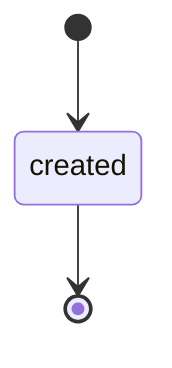
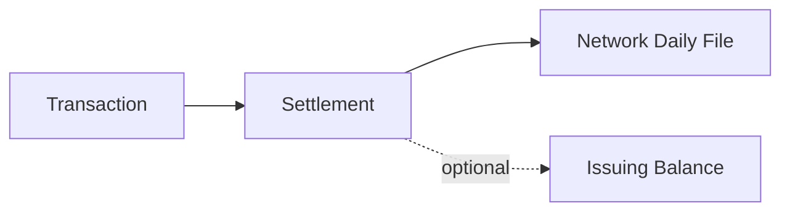

# Issuing Settlement

> API resource: `issuing.settlement` · API version: `2026-04-22.dahlia` · Category: [Issuing](README.md)

## What it is

An `issuing.settlement` is a daily roll-up of network settlement activity — one row per BIN (the issuing-bank identifier prefix on the card), per network, per clearing date, per currency. It tells your finance team: "On this day, across this network, this many transactions cleared, totaling this much, with this much in interchange fees, leaving this net amount." It is the bridge between Stripe's per-Transaction view and the network's daily settlement reports your treasury team reconciles against.

It is *not* tied to any individual cardholder — it's an aggregate, intended for finance, not for product UX.

## Why it exists

Card networks settle on a daily-net basis with each issuer. As the issuer (Stripe, on your behalf), Stripe receives one big settlement file per network per day. Your accounting needs to match Stripe's per-Transaction records to those network statements, accounting for interchange fees, network assessments, and cross-currency conversion. Settlement is the object that mirrors what the network sent, so reconciliation is one-to-one against the network's reports rather than a fragile sum over thousands of Transactions.

## Lifecycle & states



Settlements are immutable once created. There is no `status` field. They appear when the network's daily file lands and Stripe processes it (usually 1-2 business days after the clearing date).

## Anatomy of the object

### Identity

| Field | Notes |
|---|---|
| `id` | `ise_…` |
| `object` | `"issuing.settlement"` |
| `livemode` | mode flag |
| `created` | unix seconds when Stripe recorded the settlement (≠ clearing date). |

### Aggregation keys

| Field | Notes |
|---|---|
| `bin` | The 6 (or 8) leading digits of the card PAN — identifies the issuing program. |
| `network` | `visa | mastercard` (occasionally regional). |
| `clearing_date` | unix seconds (date only) — the network's settlement date. |
| `currency` | The settlement currency. |

### Money

| Field | Notes |
|---|---|
| `transaction_count` | Number of [Transactions](transactions.md) that rolled into this settlement. |
| `transaction_volume` | Gross amount across those transactions (negative for net debit, depending on direction). |
| `interchange_fees` | Fees the network kept (interchange paid to acquirers). |
| `net_total` | What actually moved between Stripe and the network on the clearing date. |

### Network detail

| Field | Notes |
|---|---|
| `network_settlement_identifier` | The network's own reference (matches what shows on their daily file). Use this to join to the bank statement. |

### Metadata

`metadata` — your bag.

## Relationships



- Many Transactions roll into one Settlement (per network, per BIN, per day, per currency).
- A Transaction is referenced by exactly one Settlement (or none, if it's not yet cleared).

There is no API call that lists the Transactions belonging to a given Settlement directly; instead, query Transactions by `created` window aligned to the `clearing_date` and filter by network. Hedge: Stripe may add a settlement filter on the Transactions list endpoint in future API versions — check the live API ref.

## Common workflows

### 1. Daily reconciliation against the network statement

```http
GET /v1/issuing/settlements?created[gte]=1714521600&created[lt]=1714608000
```

For each settlement, match `network_settlement_identifier` to the corresponding line on the network's daily settlement file your treasury team receives. Compare `net_total` against the bank credit/debit. Discrepancies are typically off-cycle adjustments or FX timing.

### 2. Interchange fee analysis

Sum `interchange_fees` per `network` per month to compare against your assumed fee model in pricing. A spike in interchange suggests merchant-mix change (more international, more cross-border) or cardholder-behavior change (more debit-routing).

### 3. Period-close attestation

Aggregate `transaction_volume` per currency for a fiscal period; assert it matches your `BalanceTransaction.list(type=issuing_*, …)` totals on the Issuing balance for the same window.

## Webhook events

There are no public events on `issuing.settlement`. Settlements arrive on Stripe's daily processing schedule and are observed via list/poll, not webhook. If your reconciliation pipeline depends on freshness, run a daily cron pulling settlements created in the last 48h.

## Idempotency, retries & race conditions

- Read-only object — no idempotency surface.
- Settlements may arrive late (network delay, holiday). Build your reconciliation window with a 5-day grace, not 1-day.
- A Settlement's `transaction_count` is final at create — but new Transactions for the same `clearing_date` that arrive *after* the Settlement was finalized roll into a *new* Settlement record (typically marked with the same clearing_date but a later `created`). Check for "delta settlements" with the same key.

## Test-mode tips

- Settlements are not commonly produced in test mode at any meaningful volume. To exercise reconciliation code, mock the object shape rather than rely on test-mode emission. Hedge: behavior may differ — confirm with your account.
- `stripe trigger` does not have a native trigger for settlements as of writing.

## Connect considerations

Settlements are scoped to the connected account that holds the cards. On Connect, each connected account has its own settlement stream — no aggregate platform-level view via this object. Use Sigma/Reporting for cross-account roll-ups.

## Common pitfalls

- **Reconciling Transactions to bank deposits without going through Settlements.** Bank deposits are net-of-interchange and net-of-cross-day; Transactions are gross and per-event. Settlement bridges the two.
- **Assuming `clearing_date` matches Transaction `created`.** Auths from late on day N often clear on day N+1 or N+2.
- **Ignoring delta settlements.** A second `ise_…` for the same BIN + network + clearing_date isn't a duplicate — it's catch-up. Handle additively.
- **Joining settlements to user-facing UI.** Settlements are finance-internal; don't expose `interchange_fees` or `net_total` to cardholders.
- **Treating `transaction_volume` as your revenue.** It's gross spend on cards you issued — your business cost (assuming you fund cards from your own balance), not income.

## Further reading

- [API reference: Issuing Settlement](https://docs.stripe.com/api/issuing/settlements/object)
- [Issuing reports](https://docs.stripe.com/issuing/reports)
- [Interchange fundamentals](https://docs.stripe.com/issuing/programs#card-economics)
