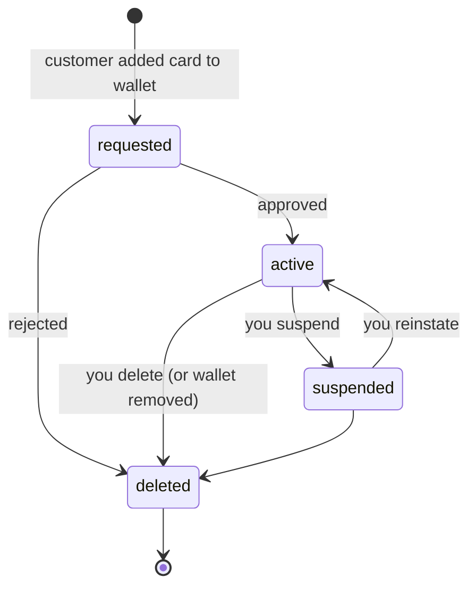
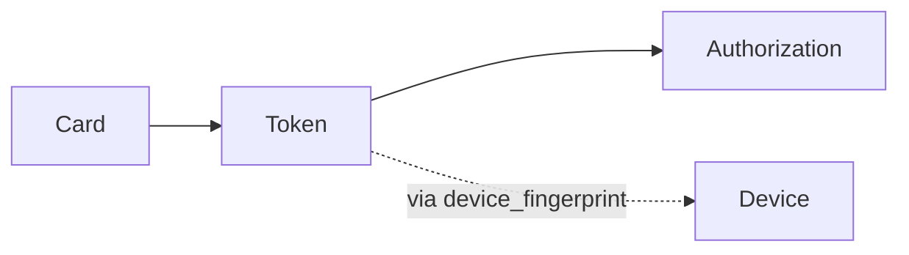

# Issuing Token

> API resource: `issuing.token` · API version: `2026-04-22.dahlia` · Category: [Issuing](README.md)

## What it is

An `issuing.token` is a network token (Apple Pay, Google Pay, Samsung Pay, merchant-provisioned card-on-file) representing a single provisioning of an issued [Card](cards.md) into a wallet or merchant credential vault. Each provisioning produces a distinct token with its own `last4` (the device account number, *not* the card's PAN) and its own lifecycle. One physical card on a customer's iPhone, Watch, and Pixel = three tokens.

When the token is used to pay, the resulting [Authorization](authorizations.md) carries `wallet=apple_pay | google_pay | samsung_pay` and references back to the Card; you typically see the token via the auth's `network_data` rather than the token id directly, but the [Authorization](authorizations.md)'s associations let you join.

## Why it exists

Network tokens are the core of modern card security: they let cardholders pay without ever exposing the PAN. As issuer, you have lifecycle responsibility for each token — approving its provisioning, suspending it if the card is lost, deleting it on a request to remove. Without an explicit token object, you couldn't distinguish "card is fine but suspend the iPhone provisioning" from "card is dead."

## Lifecycle & states



| State | Trigger | What's mutable | Spend allowed? |
|---|---|---|---|
| `requested` | Customer initiated provisioning. | `metadata`. | No — spend not yet possible. |
| `active` | Stripe + network approved provisioning. | `metadata`, `status`. | Yes. |
| `suspended` | You suspended (or network suspended for fraud). | `metadata`, `status`. | No — auths decline. |
| `deleted` | You deleted, or wallet removed (user removes card from Wallet app). **Terminal and irreversible.** | `metadata`. | No. |

`deleted` is permanent — you cannot reinstate. Customer must re-provision (which creates a new token).

## Anatomy of the object

### Identity

| Field | Notes |
|---|---|
| `id` | `itok_…` |
| `object` | `"issuing.token"` |
| `livemode` | mode flag |
| `created` | unix seconds |

### Card pointer

| Field | Notes |
|---|---|
| `card` | `ic_…` — the issued card this token was provisioned for. |

### Wallet / device

| Field | Notes |
|---|---|
| `wallet_provider` | `apple_pay | google_pay | samsung_pay`. (Hedge: merchant card-on-file tokens may use other values.) |
| `device_fingerprint` | Stable hash identifying the device the token was provisioned to. Same device + same card = same fingerprint across re-provisionings. Useful for "find all tokens on Avery's old iPhone" before deleting them. |
| `last4` | Last four of the *Device Account Number*, not the card PAN. This is what shows on the cardholder's wallet UI. |
| `network` | `visa | mastercard`. Inherited from the card's brand. |

### Status

| Field | Notes |
|---|---|
| `status` | `requested | active | suspended | deleted`. |

### Network detail

| Field | Notes |
|---|---|
| `network_data` | Network-supplied metadata about the provisioning: device type, wallet account email (hashed), provisioning method, fraud score. Useful for risk decisions on the `created` event. |

### Metadata

`metadata` — your bag.

## Relationships



- A Card has many Tokens (one per device per wallet).
- An Authorization that came in via wallet has `wallet` set; you can correlate to a token via `card` + `wallet_provider` + timing.

## Common workflows

### 1. Approve / reject a new provisioning

When `issuing_token.created` fires with `status: requested`:

```http
GET /v1/issuing/tokens/itok_…
```

Read `network_data` for fraud signals. If acceptable, no action — Stripe + network approve automatically and emit `issuing_token.updated` with `status: active`. To proactively decline:

```http
POST /v1/issuing/tokens/itok_…
  status=deleted
```

Hedge: not all wallet providers support pre-approval rejection — for some, you must accept the provisioning then immediately delete.

### 2. Suspend tokens when card is reported lost

```http
GET /v1/issuing/tokens?card=ic_…&status=active
```

For each `itok_…`:

```http
POST /v1/issuing/tokens/itok_…
  status=suspended
```

Then cancel the card itself. (Suspending the card alone does not always immediately cascade to tokens; explicit suspend-then-cancel is safer.)

### 3. Delete on cardholder request

```http
POST /v1/issuing/tokens/itok_…
  status=deleted
```

Stripe notifies the wallet provider; the entry disappears from the customer's Wallet app within minutes. **Irreversible** — re-provisioning creates a new `itok_…`.

## Webhook events

| Event | Fires when | Listener typically does |
|---|---|---|
| `issuing_token.created` | Customer provisioned card to a wallet (or merchant created a token). | Risk-check, optionally suspend/delete. |
| `issuing_token.updated` | Status change: `requested → active`, `active → suspended`, `suspended → active`, `* → deleted`. | Sync status to UI; on `deleted`, don't try to re-activate. |

## Idempotency, retries & race conditions

- Token mutation calls accept `Idempotency-Key`. Use one when batch-suspending tokens after a lost-card report.
- `created` and `updated` can arrive in quick succession (provisioning often completes in seconds). Order events by `created`/`event.created` and apply in sequence.
- A `deleted` token will not transition back via API. Attempts to PATCH `status` on a deleted token return an error.

## Test-mode tips

- `stripe trigger issuing_token.created` simulates a wallet provisioning.
- In test mode, `card.wallets.apple_pay.eligible` is typically `true` for all virtual cards, regardless of brand restrictions in live mode.
- There's no real wallet integration in test mode — you can't actually add the card to your iPhone with test-mode credentials.

## Connect considerations

Tokens are scoped to the connected account that owns the card. Push provisioning SDKs require the connected account's `card_issuing` capability. Webhook subscriptions on the platform must opt into Connect events to see tokens on connected-account cards.

## Common pitfalls

- **Deleting a token to "test" the flow.** Deletion is irreversible and the customer must re-add the card to their wallet. Use `suspended` for reversible testing.
- **Treating `last4` as the card's PAN last4.** It's the device account number — different across the same card on different devices. Cardholders sometimes confuse it.
- **Failing to suspend tokens on lost-card flow.** Card cancellation alone may leave tokens active for in-flight transactions; cancel + suspend tokens explicitly.
- **Over-relying on `device_fingerprint` for identity.** It's stable across re-provisionings on the same device, but a factory reset rotates it.
- **Auto-rejecting `requested` tokens with `network_data` fraud score above some threshold without ever testing.** False-positive provisioning rejections frustrate customers — most provisioning attempts are legitimate.

## Further reading

- [API reference: Issuing Token](https://docs.stripe.com/api/issuing/tokens/object)
- [Digital wallet provisioning](https://docs.stripe.com/issuing/cards/digital-wallets)
- [Push provisioning iOS / Android SDKs](https://docs.stripe.com/issuing/cards/digital-wallets/push-provisioning)
