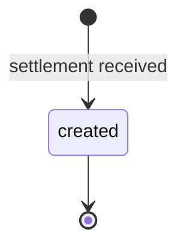
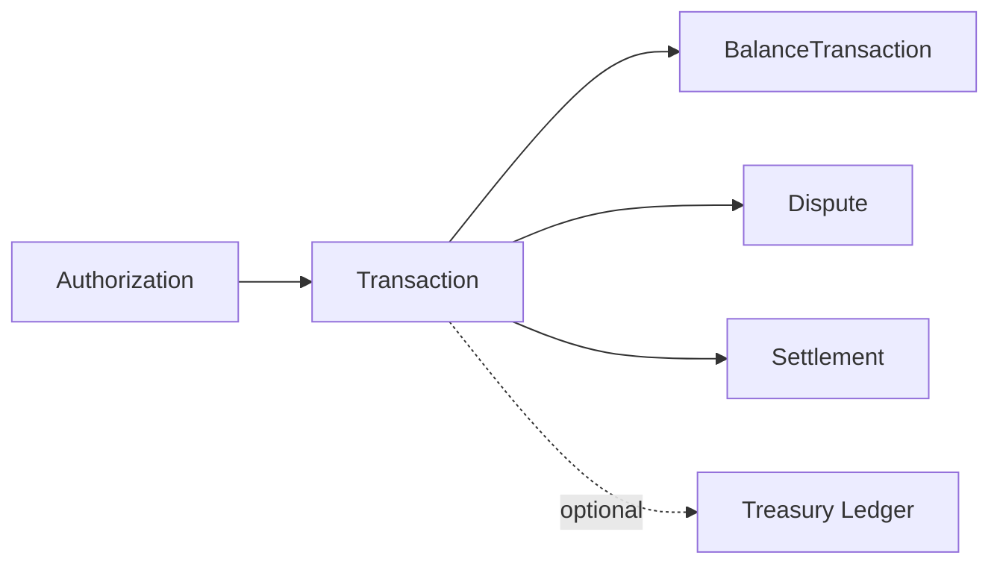

# Issuing Transaction

> API resource: `issuing.transaction` · API version: `2026-04-22.dahlia` · Category: [Issuing](README.md)

## What it is

An `issuing.transaction` is the *settled* record of money actually moving on an issued card. It's created when the merchant's acquirer presents a captured (or refunded) entry to the network and the network passes it to Stripe — typically hours to days after the underlying [Authorization](authorizations.md). Where Authorization is "merchant asked, you said yes," Transaction is "money actually changed hands."

It is the issuing-side mirror of [BalanceTransaction](../01-core-resources/balance-transactions.md). Every Transaction has a corresponding `BalanceTransaction` on your Issuing balance.

## Why it exists

Authorizations are *holds* — they over- or under-state actual spend, get reversed, expire. For accounting, expense reports, and reconciliation you need the immutable ledger of "this $42.13 left the building." Transactions are that ledger. They also carry rich `purchase_details` (line items, fuel grades, hotel folios, flight legs) for select MCCs — invaluable for expense automation.

## Lifecycle & states



Transactions are **immutable** once created. There's no `status` field — Transaction either exists (it happened) or doesn't. The `type` field distinguishes:

| `type` | Meaning | `amount` sign |
|---|---|---|
| `capture` | Merchant captured (in full or in part) — money out. | Negative (debit your Issuing balance). |
| `refund` | Merchant refunded — money in. | Positive. |

A merchant void of an unsettled auth produces no Transaction (the Authorization just goes `reversed`). A refund after settlement produces a fresh Transaction with `type=refund` and `authorization` either pointing back to the original auth or `null` (some refunds arrive disconnected from any earlier auth — "force credits").

## Anatomy of the object

### Identity

| Field | Notes |
|---|---|
| `id` | `ipi_…` |
| `object` | `"issuing.transaction"` |
| `livemode` | mode flag |
| `created` | unix seconds when Stripe recorded settlement (≠ when the swipe happened). |

### Money

| Field | Notes |
|---|---|
| `amount` | In `currency`, smallest unit. **Negative for `capture` (purchase), positive for `refund`.** |
| `currency` | Card's settlement currency. |
| `merchant_amount` | Amount in merchant's currency. |
| `merchant_currency` | Merchant's currency. |
| `amount_details.atm_fee` | ATM withdrawal fee, when applicable. |
| `amount_details.cashback_amount` | Cashback at POS, when applicable. |

### Type

| Field | Values |
|---|---|
| `type` | `capture | refund`. |

### Relations

| Field | Type |
|---|---|
| `card` | `ic_…` |
| `cardholder` | `ich_…` |
| `authorization` | `iauth_…` (or `null` for force credits / standalone refunds). |
| `dispute` | `idp_…` if a dispute was filed against this transaction. |
| `balance_transaction` | `txn_…` — the Issuing-balance ledger entry. **Source of truth for net effect.** |
| `treasury` | If Treasury-funded, links to `received_credit` / `received_debit`. |

### Merchant data

| Field | Notes |
|---|---|
| `merchant_data.*` | Same shape as on Authorization: `name`, `category`, `category_code` (MCC), `city`, `country`, `network_id`, `postal_code`, `state`, `terminal_id`. |
| `network_data.*` | Network identifiers — useful for cross-referencing with merchant statements. |

### Purchase details (the rich bit)

For select MCCs, networks transmit Level-2/Level-3 data:

| Field | When populated |
|---|---|
| `purchase_details.flight.passengers[]`, `segments[]`, `refundable`, `travel_agency` | Airline tickets. |
| `purchase_details.fuel.type`, `unit`, `unit_cost_decimal`, `volume_decimal` | Gas station purchases. |
| `purchase_details.lodging.check_in_at`, `nights` | Hotel folios. |
| `purchase_details.receipt[]` | Generic line items (description, quantity, total, unit cost). |
| `purchase_details.reference` | Merchant's invoice/order number. |

These fields are *gold* for automated expense reports. Hedge: not all merchants transmit them; even within a category many auths arrive with `purchase_details: null`.

### Metadata

`metadata` — your bag.

## Relationships



- An Authorization can have many Transactions (partial captures + refunds).
- A Transaction belongs to at most one Authorization.
- A Transaction has at most one Dispute.
- Multiple Transactions roll up into one daily [Settlement](settlements.md) record.

## Common workflows

### 1. Daily reconciliation

Pull the day's transactions:

```http
GET /v1/issuing/transactions?created[gte]=1714521600&created[lt]=1714608000&limit=100
```

Sum `amount` per card / cardholder for spend reports. Cross-check `balance_transaction.net` for fees (Stripe charges per-transaction fees on Issuing).

### 2. Expense-report enrichment

For each `ipi_…`:

```http
GET /v1/issuing/transactions/ipi_…?expand[]=authorization,card.cardholder
```

Pull `purchase_details` (when present) into your expense system. For flights/hotels, you have line-item granularity; for everything else, fall back on `merchant_data.name` + MCC.

### 3. Find disputes

```http
GET /v1/issuing/transactions?dispute=true
```

Hedge: filtering on dispute presence may require a list filter or post-filter; check current API ref. Otherwise list all and filter client-side on `dispute != null`.

## Webhook events

| Event | Fires when | Listener typically does |
|---|---|---|
| `issuing_transaction.created` | New settlement entry. | Persist; trigger expense-report ingestion; debit user's app balance. |
| `issuing_transaction.updated` | Rare — typically `metadata` changes. | Refresh local copy. |

There is no `.deleted` event because transactions are immutable.

## Idempotency, retries & race conditions

- Settlements arrive in batches; an Authorization that closed at 9pm may produce its Transaction at 11pm next day. Don't expect symmetry in event timing.
- Stripe deduplicates on the network's settlement identifier — you won't see the same settlement twice with two different `ipi_…`.
- A Transaction's `balance_transaction` is created atomically with the Transaction itself — both visible in the same API response.
- If you observe an `issuing_transaction.created` *without* an `authorization` value, it's a force credit (refund without traceable auth) — not an error.

## Test-mode tips

- `POST /v1/test_helpers/issuing/authorizations/iauth_…/capture` produces a `capture` Transaction.
- `POST /v1/test_helpers/issuing/transactions/refund` (hedge — exact path varies) produces a standalone refund Transaction.
- `POST /v1/test_helpers/issuing/transactions/create_force_capture` simulates a force-posted entry for testing the no-authorization path.
- `purchase_details` in test mode is sparse; you may need to construct synthetic data for downstream code testing.

## Connect considerations

Transactions live on the connected account that owns the card. Use `Stripe-Account: acct_…` on list/retrieve. Platforms typically aggregate via Sigma/Reporting rather than per-account API pulls.

## Common pitfalls

- **Treating `amount` as positive for spend.** It's negative on `capture`. Use `Math.abs(amount)` or pivot on `type` when displaying.
- **Joining only on `authorization`.** Force credits and standalone refunds have no `authorization` — your reconciliation logic must handle `null`.
- **Computing fees from `amount`.** Stripe's per-transaction Issuing fees are in `balance_transaction.fee`, not on the Transaction itself. Fetch the BalanceTransaction.
- **Assuming `purchase_details` for all hotel transactions.** Many small hotels and OTAs omit it. Always null-check.
- **Reconciling against authorization timestamps.** Settlement timing diverges from auth timing by hours-to-days. Use `created` on the Transaction, not on the Authorization, for "when did money move."
- **Ignoring `merchant_amount` / `merchant_currency`.** For cross-border purchases, your statement says one thing and the cardholder remembers another. Surface both in expense UIs.

## Further reading

- [API reference: Issuing Transaction](https://docs.stripe.com/api/issuing/transactions/object)
- [Purchase details](https://docs.stripe.com/issuing/purchases/transactions#purchase-details)
- [Daily reconciliation](https://docs.stripe.com/issuing/reports)
