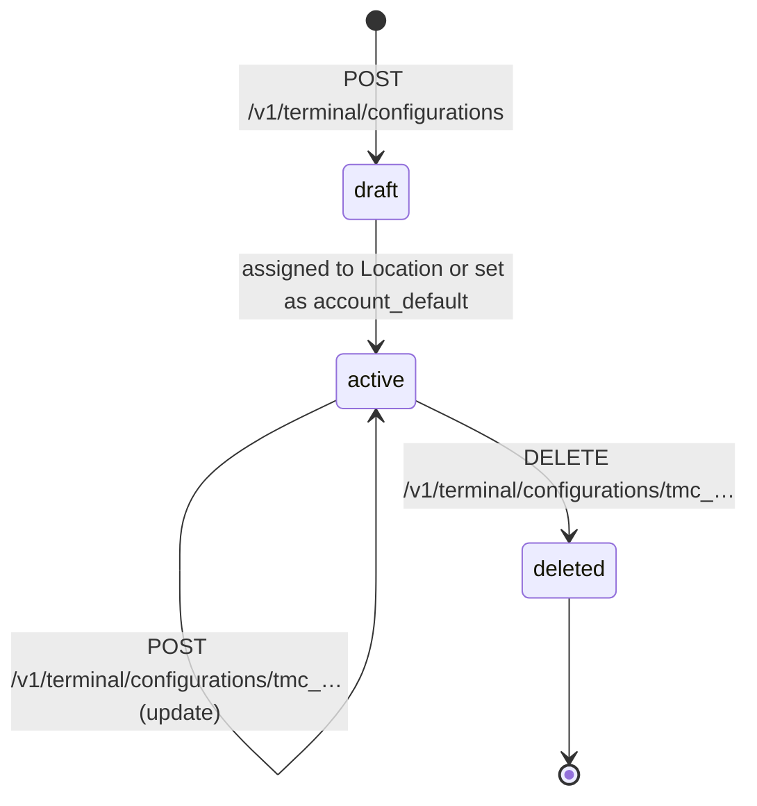
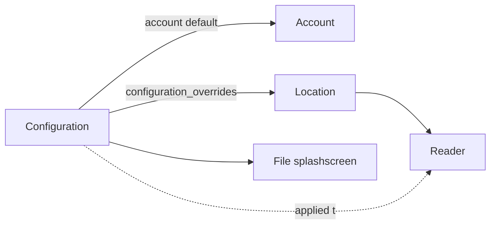

# Configuration

> API resource: `terminal.configuration` · API version: `2026-04-22.dahlia` · Category: [Terminal](README.md)

## What it is

A `terminal.configuration` is **the policy and customization bundle a Reader applies** when it boots and on each connection: tipping rules per currency, splash-screen image per device family, language, network/Wi-Fi credentials, offline-mode allowance, and a nightly reboot window. One Configuration can govern many Readers.

Configurations resolve in priority order: **per-Reader override → Location override (`configuration_overrides`) → account default (`is_account_default: true`)**. The Reader picks up changes on its next connection or after a reboot.

## Why it exists

Without Configuration, every Reader-level setting (tipping percentages, language, splash, Wi-Fi network) would have to be flashed device by device — operationally untenable for a fleet of dozens or hundreds.

Configuration solves three problems at once:

1. **Policy** — tipping rules, offline allowance, language defaults.
2. **Branding** — your logo on the idle splash screen.
3. **Operations** — Wi-Fi credentials so a freshly-unboxed device joins the right network, reboot windows that don't interrupt business hours.

## Lifecycle & states



There is **no `status` field**. Lifecycle is implicit:

- **Created** — a Configuration exists but has no effect until something references it.
- **Active** — referenced by `Location.configuration_overrides` or by being the account's `is_account_default: true`.
- **Deleted** — removed. The API may block deletion if Locations still reference it; detach references first.

Updates take effect on Readers at next connection. Some changes (splash screen, firmware-affecting settings) require a reboot — schedule via the configured reboot window for minimal disruption.

## Anatomy of the object

### Identity

| Field | Notes |
|---|---|
| `id` | `tmc_…` |
| `object` | `"terminal.configuration"` |
| `name` | Operator-facing label ("US default", "Berlin storefront"). |
| `is_account_default` | Boolean. When `true`, this Configuration applies wherever no override is set. Exactly one Configuration per account can hold this flag. |
| `livemode`, `metadata` | Standard. |

### Tipping

`tipping.<currency>` (e.g. `tipping.usd`):

| Field | Notes |
|---|---|
| `fixed_amounts` | Array of integer minor-unit values for the "$1, $2, $3" prompt buttons. |
| `percentages` | Array of integer percent values (e.g. `[15, 18, 20]`). |
| `smart_tip_threshold` | Integer minor-unit. Below this transaction amount, show `fixed_amounts`; at or above, show `percentages`. Lets the prompt feel right whether the bill is $4 or $400. |

You can configure multiple currencies in one Configuration; the Reader picks the matching key based on the PaymentIntent currency.

### Splash screens (per device family)

| Field | Notes |
|---|---|
| `bbpos_wisepos_e.splashscreen` | `file_…` ID of an uploaded [File](../01-core-resources/files.md). PNG/JPG, dimensions per device spec. |
| `verifone_p400.splashscreen` | Same, for Verifone P400. |
| `stripe_s700.splashscreen` | Same, for Stripe S700. |

Hedge: the exact set of device-specific splash fields tracks the device lineup; new device families generally add their own field. Render whatever Stripe returns.

### Offline mode

| Field | Notes |
|---|---|
| `offline.enabled` | Boolean. When `true`, the Reader will accept payments while disconnected from Stripe and queue them for later settlement. **Settlement is not guaranteed** — see Pitfalls. |

### Reboot window

| Field | Notes |
|---|---|
| `reboot_window.start_hour` | Integer 0–23, local time. |
| `reboot_window.end_hour` | Integer 0–23, local time. Must be after `start_hour`. |

Reader chooses any moment in the window to apply pending firmware/config updates that need a reboot. Set this for the dead of night.

### Wi-Fi

`wifi.<network>` sub-objects (shape varies by auth type):

| Field | Notes |
|---|---|
| `ssid` | Network name. |
| `password` (or PSK fields) | Pre-shared key for WPA2-Personal. |
| Enterprise fields | Username/cert for WPA2-Enterprise where supported. |

Hedge: not all Reader hardware supports all Wi-Fi auth modes. Check device docs before assuming Enterprise auth works with, say, BBPOS Chipper.

### Other

Additional sub-objects exist (e.g. for accessibility, language defaults, allowed payment-method overrides). Read whatever the API returns; treat unknown sub-keys as forward-compatible.

## Relationships



- **Configuration → Account default**: at most one per account holds `is_account_default: true`.
- **Configuration → Location**: many Locations can reference one Configuration via `configuration_overrides`.
- **Configuration → Reader**: indirect — Readers don't store a `configuration` FK; they resolve at runtime from the chain (Reader → Location → account default).
- **Configuration → File**: splash-screen fields point at uploaded [File](../01-core-resources/files.md) IDs in the `terminal_reader_splashscreen` purpose.

## Common workflows

### 1. Create the account-default Configuration

```http
POST /v1/terminal/configurations
  name=US default
  tipping[usd][percentages][]=15
  tipping[usd][percentages][]=18
  tipping[usd][percentages][]=20
  tipping[usd][fixed_amounts][]=100
  tipping[usd][fixed_amounts][]=200
  tipping[usd][smart_tip_threshold]=1000
  reboot_window[start_hour]=2
  reboot_window[end_hour]=4
  is_account_default=true
```

This applies to every Reader unless overridden.

### 2. Per-Location override (regional tipping)

Create a config with EU tipping rules and attach to your Berlin Locations:

```http
POST /v1/terminal/configurations
  name=DE config
  tipping[eur][percentages][]=5
  tipping[eur][percentages][]=10
  tipping[eur][fixed_amounts][]=100
  tipping[eur][smart_tip_threshold]=1500

POST /v1/terminal/locations/tml_berlin
  configuration_overrides=tmc_de
```

### 3. Upload and assign a splash screen

```http
POST /v1/files
  purpose=terminal_reader_splashscreen
  file=@logo.png

POST /v1/terminal/configurations/tmc_…
  bbpos_wisepos_e[splashscreen]=file_…
```

Reader displays new splash after its next reboot — schedule within the configured `reboot_window`.

### 4. Enable offline mode (with care)

```http
POST /v1/terminal/configurations/tmc_…
  offline[enabled]=true
```

Train staff: a payment shown as approved on the Reader screen while offline is **not yet final**. It settles later when the device reconnects, and a small fraction may decline at settlement. Configure your POS to flag offline transactions as "tentative".

### 5. Update Wi-Fi credentials before a store opens

```http
POST /v1/terminal/configurations/tmc_…
  wifi[network_a][ssid]=AcmeCafe-Brooklyn
  wifi[network_a][password]=…
```

Readers at Locations referencing this config pick up the new credentials on next reboot. Rotate the password? Re-issue and reboot the fleet during the reboot window.

### 6. List configurations

```http
GET /v1/terminal/configurations?limit=100
```

Filter client-side by `name` or `metadata` to navigate large fleets.

## Webhook events

Hedge: Stripe does not currently publish a rich set of `terminal.configuration.*` webhook events. Configuration changes are typically observed only via API/Dashboard. If your integration needs an audit trail, log on your own backend at the call site.

## Idempotency, retries & race conditions

- **`POST /v1/terminal/configurations`**: send `Idempotency-Key` to avoid duplicate near-identical configs cluttering the Dashboard.
- **Updates** are PATCH-style; only fields you send change. Safe to retry.
- **Race**: setting `is_account_default: true` on a new config while another holds the flag is resolved by Stripe (the new one wins, the old one's flag clears). Don't rely on ordering across simultaneous calls.
- **Race**: deleting a Configuration while a Location still references it is rejected. Detach (`POST /v1/terminal/locations/tml_…  configuration_overrides=` empty) first, then delete.

## Test-mode tips

- Configurations work identically in test and live mode. Splash screens require uploaded `file_…` of the same purpose in the matching mode.
- Simulated Readers (`device_type: simulated_wisepos_e`) honor most config fields but skip hardware-specific bits (Wi-Fi, splash). Test offline-mode flows using the simulator's offline toggle in the SDK.
- `stripe trigger` for Configuration-related events is limited; verify changes by re-`GET`ting the config and observing Reader behavior.

## Connect considerations

- Configurations live on the same account as the Locations and Readers they govern. Platform-owned Readers → platform-owned Configurations.
- For platforms with one connected account per merchant, each merchant manages their own Configurations independently. Standardizing tipping rules across the fleet requires you to apply the same Configuration JSON to each connected account programmatically.
- `is_account_default: true` is per-account — setting it on the platform does not propagate to connected accounts.

## Common pitfalls

- **Enabling `offline.enabled` without a reconciliation strategy.** Offline-collected payments can fail at settlement (declined card, expired auth window). You'll have a charge on the receipt but no funds. Build POS UX that flags offline charges and reconciles after settlement.
- **Multiple `is_account_default: true` configs (race).** Stripe enforces a single default; the most recent wins. Don't toggle from concurrent jobs.
- **Splash screen at wrong dimensions.** Looks distorted on the Reader. Follow the per-device size specs strictly.
- **Setting `reboot_window` to business hours.** Reader may reboot during peak — losing a sale. Pick true overnight hours in **local** time of the Reader's Location.
- **Storing Wi-Fi passwords in source-controlled config files.** Treat them as secrets — rotate via Stripe API, not by committing to git.
- **Forgetting that updates require reboot for some fields.** Splash and Wi-Fi changes don't take effect until the Reader reboots. Plan around the configured window or trigger an out-of-band reboot for urgent rollouts.
- **Mixing `tipping.fixed_amounts` and `percentages` without `smart_tip_threshold`.** Reader may default to one mode and ignore the other. Set the threshold explicitly.
- **Deleting a Configuration referenced by Locations.** API rejects. Detach first.
- **Assuming all device families respect every field.** A `verifone_p400.splashscreen` has no effect on a WisePOS E. Set device-family fields only for devices in your fleet to keep the config small and clear.

## Further reading

- [API reference: Terminal Configuration](https://docs.stripe.com/api/terminal/configuration/object)
- [Terminal Configurations guide](https://docs.stripe.com/terminal/fleet/configurations)
- [Offline payments with Terminal](https://docs.stripe.com/terminal/features/operate-offline/overview)
- [Reader](readers.md) · [Location](locations.md) · [File](../01-core-resources/files.md)
