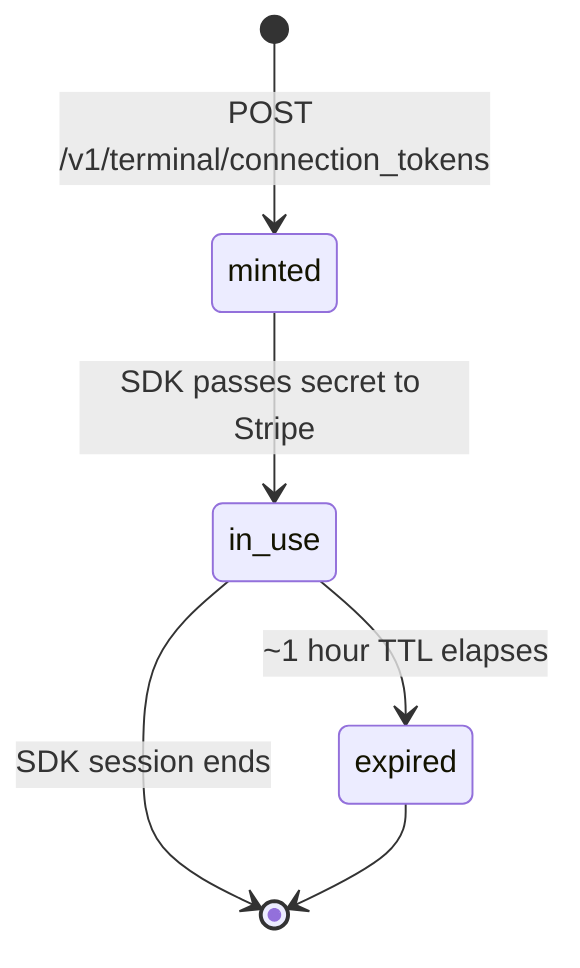
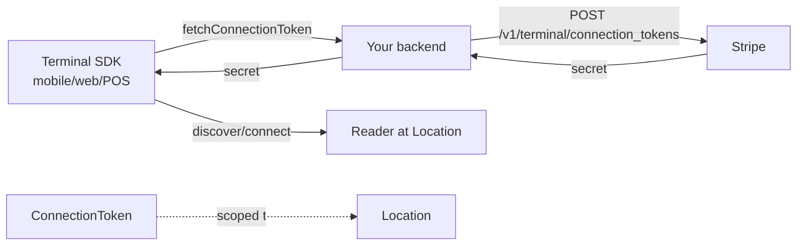

# Connection Token

> API resource: `terminal.connection_token` · API version: `2026-04-22.dahlia` · Category: [Terminal](README.md)

## What it is

A `terminal.connection_token` is a **short-lived, single-use credential** your client (mobile app, web app, or SDK in a kiosk) exchanges with Stripe to discover and pair with a [Reader](readers.md). It is the bridge between a publishable-key-only client and the Reader-control endpoints, which would otherwise require a secret key.

The shape is trivial — `{ object, secret, location? }` — but the operational rules around it are strict.

## Why it exists

The Terminal SDK runs on devices you don't trust with your `sk_live_…`. But the SDK *does* need to call backend Reader-management endpoints (discover, connect, send commands). A connection token solves that: your server, holding the secret key, mints the token and hands its `secret` to the client. The SDK then passes that secret to Stripe on every subsequent Terminal call.

Think of it as a **scoped, ephemeral API key for one Terminal session**.

Without it, you'd either ship your secret key to mobile devices (catastrophic) or proxy every Reader command through your backend (slow, brittle for real-time payment flows).

## Lifecycle & states



Connection tokens have **no `status` field** and you can't list, retrieve, or revoke them. Once minted, the `secret` is yours to hand off, and Stripe tracks expiry server-side. The SDK is responsible for requesting a fresh token whenever its current one nears expiry — the SDK will call your backend with `fetchConnectionToken()` (or equivalent) automatically.

- **TTL**: approximately 1 hour from issuance. The SDK refreshes proactively before this.
- **Single-use is best practice**: although a token can be reused within its TTL by the same SDK instance, treat each request as fresh — never persist or share across devices/sessions.

## Anatomy of the object

| Field | Notes |
|---|---|
| `object` | Always `"terminal.connection_token"`. |
| `secret` | The opaque string the SDK uses. **Treat as a credential.** Do not log, store, or transmit anywhere except direct response to the requesting SDK. |
| `location` | Optional `tml_…` ID. If set, the token is **scoped** to a single Location — only Readers at that Location can be discovered/controlled. Highly recommended in multi-store deployments. |

That's the whole object on the wire. There is no `id`, no `created`, no `livemode` field returned — its existence is purely transactional.

## Relationships



- A connection token is **not** persisted as a queryable Stripe resource. It exists only at the moment of issuance and inside the SDK's memory.
- The optional `location` ties it to one [Location](locations.md). Readers outside that location are invisible to a session using this token.

## Common workflows

### 1. Backend endpoint that the SDK calls

Your server exposes an authenticated endpoint, e.g. `POST /api/terminal/connection_token`, that the SDK hits on demand:

```http
POST /v1/terminal/connection_tokens
```

Response:

```json
{
  "object": "terminal.connection_token",
  "secret": "pst_test_YWNjdF8…"
}
```

Return `{ secret }` to the SDK. Don't add caching, don't reuse — mint fresh on every SDK call.

### 2. Location-scoped token (multi-store deployment)

A franchisee's POS should only be able to drive Readers in *their* store:

```http
POST /v1/terminal/connection_tokens
  location=tml_1Nx…
```

Look up the caller's home Location from your auth context (do **not** accept `location` as a client parameter — that defeats the scoping).

### 3. SDK refresh callback (iOS / Android / JS)

The SDK invokes your token-fetcher whenever it needs a new secret:

```swift
Terminal.shared.connectionTokenProvider = { (completion) in
  fetchConnectionTokenFromBackend { token, error in
    completion(token, error)
  }
}
```

Implement the network call, return the `secret`. The SDK manages all caching/refresh internally.

## Webhook events

**None.** Connection tokens emit no events. They are operational, not auditable.

If you need to detect Terminal session activity, watch the [Reader](readers.md) `terminal.reader.action_*` events and Reader status transitions.

## Idempotency, retries & race conditions

- `POST /v1/terminal/connection_tokens` is **safe to retry** — each call mints a new independent token. There is no idempotency-key benefit, but also no harm.
- The SDK handles its own retry/refresh logic. Do not pre-cache tokens server-side; latency from a single mint call is small.
- **Race**: the SDK may briefly hold an expired token across the refresh boundary. The SDK's transport will retry once with a fresh token; your backend just needs to respond promptly when asked.

## Test-mode tips

- Use `sk_test_…` to mint test-mode tokens. Test-mode tokens only work with simulated Readers (`device_type: simulated_wisepos_e`) and the test Tap to Pay simulator.
- The Stripe CLI doesn't have a dedicated `trigger` for connection tokens (no events to fire), but `stripe terminal connection_tokens create` works for one-off testing.
- Never mix test and live tokens — a live SDK with a test secret will fail to discover live Readers.

## Connect considerations

- Mint connection tokens **on the account that owns the Reader**.
  - Reader on platform → mint with platform key, no `Stripe-Account` header.
  - Reader on a connected account → mint with `Stripe-Account: acct_…` header (Standard, Express, or Custom — same rule).
- The token's scope follows the account header. Scoping to `location=tml_…` further narrows it.
- Some Connect models (e.g. third-party platforms reselling Terminal to merchants) require the merchant to have completed the Terminal terms of service on their connected account before tokens will mint. Hedge: exact gating depends on your Connect configuration.

## Common pitfalls

- **Shipping `sk_live_…` to a mobile app instead of using a connection token.** Catastrophic — full account compromise.
- **Caching the `secret` in localStorage / shared prefs.** Treats a credential like a cookie. Don't. Mint per request.
- **Returning the entire connection-token response object to the client unchecked.** Fine today (only `secret` and `location` fields), but if Stripe ever adds an internal field, you've leaked it. Return `{ secret }` explicitly.
- **Accepting `location` as a request body parameter from the client.** Lets a malicious client request tokens for *other* stores' Readers. Always derive `location` from your server-side authorization context.
- **Reusing the same token across multiple devices.** The SDK assumes one token per SDK instance. Sharing causes weird discovery behavior and unattributable command failures.
- **No backend rate limiting on the mint endpoint.** A misbehaving SDK or compromised client can hammer it. Apply per-user/device rate limits.
- **Forgetting Connect scoping.** Calling `POST /v1/terminal/connection_tokens` without `Stripe-Account` when the Reader lives on a connected account silently mints a token that can't see the Reader.

## Further reading

- [API reference: Terminal Connection Token](https://docs.stripe.com/api/terminal/connection_tokens/object)
- [Terminal SDK quickstart](https://docs.stripe.com/terminal/quickstart)
- [Designing the Terminal backend](https://docs.stripe.com/terminal/payments/setup-integration)
- [Reader](readers.md) · [Location](locations.md)
