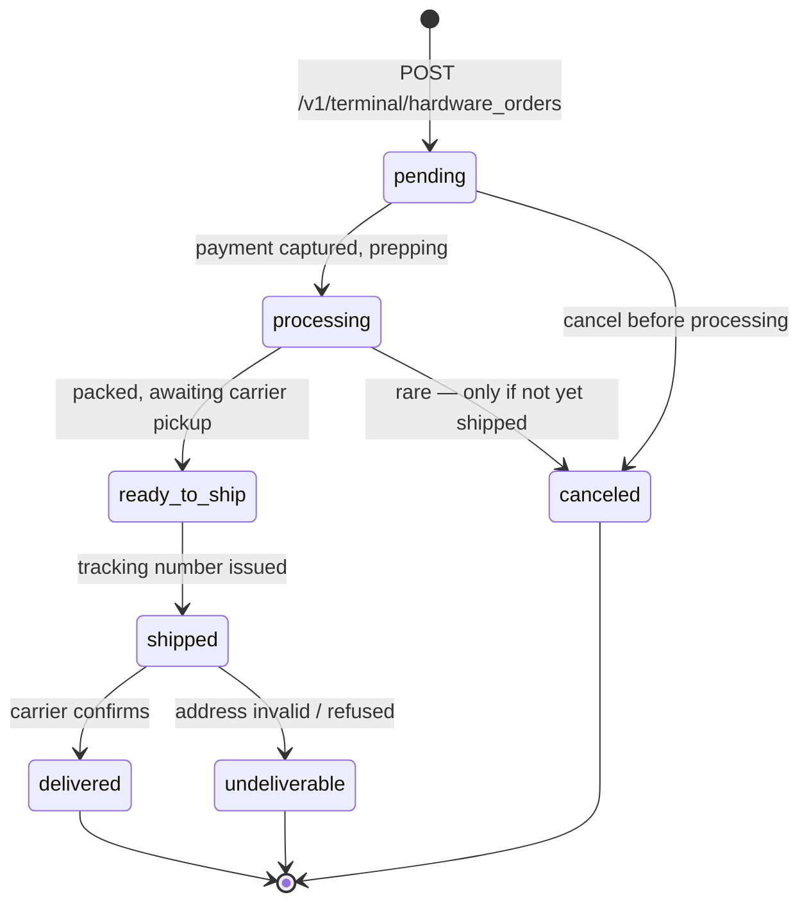
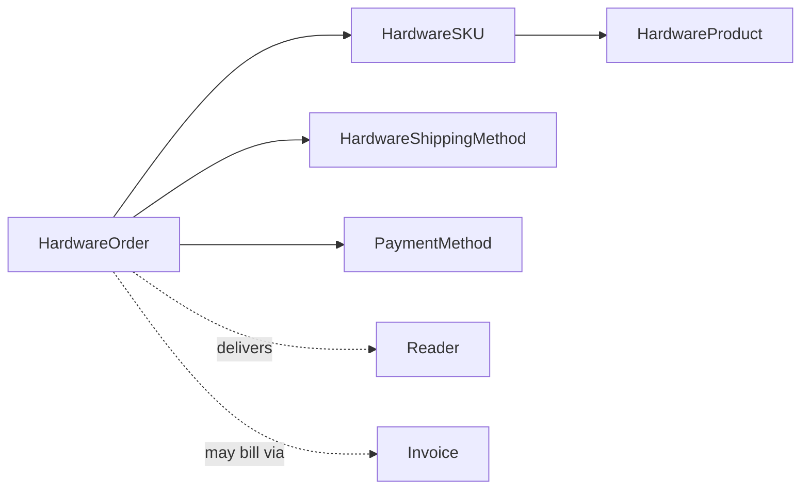

# Hardware Order

> API resource: `terminal.hardware_order` · API version: `2026-04-22.dahlia` · Category: [Terminal](README.md)

## What it is

A `terminal.hardware_order` is **your purchase order with Stripe for physical Terminal devices** — readers, charging docks, peripheral kits. You select [HardwareSKU](hardware-skus.md)s, pick a [HardwareShippingMethod](hardware-shipping-methods.md), provide a shipping address and payment method, and Stripe ships the boxes to you. The order's `status` is the lifecycle from "we got your order" through "delivered".

It is **not** a billing-only object — it represents a real-world fulfillment with carriers, tracking numbers, and (sometimes) customs paperwork.

## Why it exists

Before this API, Terminal hardware procurement was a sales-team interaction: emails, invoices, manual fulfillment. The Hardware Order API turns it into a self-serve, automatable flow:

- Spin up new locations programmatically and ship them gear.
- Reorder consumables (charging cables, etc.) without touching Dashboard.
- Reconcile hardware spend in your accounting via the order/invoice trail.

It also lets Connect platforms order on behalf of merchants without having to be the merchant of record.

## Lifecycle & states



States:

- **`pending`** — order created. Stripe is validating payment, address, and inventory. Cancellable.
- **`processing`** — accepted, being picked/packed. Cancellation increasingly limited.
- **`ready_to_ship`** — boxed, awaiting carrier handoff. Tracking may not be live yet.
- **`shipped`** — `shipping.tracking_number` populated. In transit.
- **`delivered`** — carrier marked delivered. Terminal.
- **`canceled`** — explicitly canceled (by you or Stripe ops). Terminal. Refund processed automatically if payment was captured.
- **`undeliverable`** — carrier could not deliver (bad address, refused, lost). Terminal. Stripe-side resolution path.

Hedge: precise allowed transitions and the exact set of `status` values may evolve. Treat the enum as forward-compatible — render unknown values gracefully.

## Anatomy of the object

### Identity

| Field | Notes |
|---|---|
| `id` | `thor_…` |
| `object` | `"terminal.hardware_order"` |
| `livemode` | Note: hardware orders generally only operate in live mode for real fulfillment. Test-mode equivalents may exist for sandboxing UI without actual shipment. |
| `created`, `updated` | unix seconds. |
| `metadata` | standard. |

### Status

| Field | Notes |
|---|---|
| `status` | enum, see lifecycle. |

### Money

| Field | Notes |
|---|---|
| `currency` | ISO. |
| `amount` | Total of items only (subtotal). |
| `subtotal` | Often duplicates `amount`; pre-tax, pre-shipping. |
| `tax_amount` | Computed by Stripe at order time. |
| `shipping[amount]` | Shipping cost. |
| `total` | Final charged amount. |

Always compute and store the breakdown locally — if a partial shipment or refund happens, you'll need it.

### Items

`items[]` — array of:

| Field | Notes |
|---|---|
| `terminal_hardware_sku` | `thsku_…` of the SKU ordered. |
| `terminal_hardware_product` | `thp_…` denormalized from the SKU. |
| `quantity` | int. |
| `amount` | per-line total (unit price × quantity). |
| `currency` | matches order currency. |

### Shipping

| Field | Notes |
|---|---|
| `shipping[name]`, `shipping[phone]` | Recipient. |
| `shipping[address][line1/2, city, state, postal_code, country]` | Drop-off address. |
| `shipping[tracking_number]` | Set when `status: shipped`. |
| `shipping[tracking_url]` | Carrier deep link. |
| `shipping_method` | `thsm_…` chosen at order time (carrier + speed). |

### Payment

| Field | Notes |
|---|---|
| `payment_method` | `pm_…` Stripe charged for the order. Typically a card on the account. |

## Relationships



- **HardwareOrder → SKUs**: 1-to-many through `items[]`.
- **HardwareOrder → ShippingMethod**: 1-to-1, frozen at creation.
- **HardwareOrder → PaymentMethod**: charged at acceptance. Not a Stripe-managed [PaymentIntent](../01-core-resources/payment-intents.md) you can manipulate; the order owns the payment lifecycle.
- **HardwareOrder ↛ Reader**: no automatic linkage. After delivery you manually register each device as a [Reader](readers.md) using the registration code shown on its screen.

## Common workflows

### 1. Browse the catalog

```http
GET /v1/terminal/hardware_products
GET /v1/terminal/hardware_skus?country=US
GET /v1/terminal/hardware_shipping_methods?country=US
```

Render product → SKU → shipping option choices in your ops UI.

### 2. Place an order

```http
POST /v1/terminal/hardware_orders
  payment_method=pm_…
  shipping_method=thsm_…
  shipping[name]=Acme Cafe — Brooklyn
  shipping[phone]=+15555550199
  shipping[address][line1]=200 Bedford Ave
  shipping[address][city]=Brooklyn
  shipping[address][state]=NY
  shipping[address][postal_code]=11211
  shipping[address][country]=US
  items[0][terminal_hardware_sku]=thsku_…
  items[0][quantity]=2
  metadata[store_id]=store_042
```

Always pass `Idempotency-Key` — duplicate orders cost real money.

### 3. Track an order

```http
GET /v1/terminal/hardware_orders/thor_…
```

Poll lightly or rely on Dashboard alerts. Stripe does not (currently) emit detailed shipment webhooks — see Webhook events below.

### 4. Cancel a pending order

```http
POST /v1/terminal/hardware_orders/thor_…/cancel
```

Allowed only while `status` is `pending` (and sometimes early `processing`). Errors otherwise.

### 5. Receive + register hardware

When the box arrives:

1. Power on each device. Each shows a registration code.
2. For each, `POST /v1/terminal/readers` with the code, the destination [Location](locations.md), and a `label`.
3. Tag the resulting `tmr_…` with `metadata.hardware_order=thor_…` for asset tracking.

## Webhook events

Hardware Orders emit limited or no webhook events in the current API. Status transitions are typically polled or observed via Dashboard email notifications.

Hedge: if your account has access to `terminal.hardware_order.*` events (they may be added or expanded in newer API versions), subscribe to them and treat them as informational — confirm transitions with a `GET` before taking action. Always rely on the API, not the event payload, for the authoritative `status`.

## Idempotency, retries & race conditions

- **`Idempotency-Key` is mandatory in practice** for `POST /v1/terminal/hardware_orders`. A retried request without one ships you double the boxes.
- Cancellation is racy with state advancement — a `cancel` call against an order that just transitioned to `shipped` will return an error. Catch and re-fetch.
- Inventory is finite. A SKU listed `available: true` can flip to `false` between catalog browse and order submission; surface "out of stock" cleanly.

## Test-mode tips

- Hardware ordering primarily exists in live mode (it ships physical goods). Test-mode access to the catalog APIs is generally available for UI development without placing real orders. Verify against your account's allowed operations.
- For end-to-end testing without spending money, Stripe occasionally provides developer hardware programs — check the Terminal Dashboard.
- The simulated Reader does not require any HardwareOrder; it's available immediately in test mode.

## Connect considerations

- Hardware ordering is generally **enabled per account** and may be restricted to the platform itself in some Connect models (the platform orders, then re-distributes physically).
- When orders are placed on behalf of a connected account (via `Stripe-Account: acct_…`), the connected account is billed and ships-to is on their address book. Verify the account has Terminal enabled and a valid payment method on file.
- 1099 / sales-tax implications: the order invoice is a transaction *between Stripe and the ordering account*; it is not part of your customer-facing payments ledger.

## Common pitfalls

- **No idempotency key.** The single most expensive mistake — duplicate orders.
- **Hard-coding `status` values in switch statements.** New states (e.g. `ready_to_ship` was added relatively recently) break logic. Use a default branch.
- **Assuming worldwide availability.** Terminal hardware ships to a limited set of countries and the SKU list varies by `country`. A SKU available in `US` may not exist in `DE`. Always pre-filter SKUs by recipient country.
- **Confusing `subtotal`/`amount`/`total`.** They differ by tax + shipping. Display all three when surfacing to a finance team.
- **Letting users free-text shipping addresses.** Carriers are picky; validate via an address-verification service before submission to avoid `undeliverable`.
- **Forgetting to register the hardware after delivery.** A delivered order does not auto-create Readers — they sit unused until someone enters the registration code.
- **Cancelling too aggressively.** Once `status: processing`, cancellation may not be honored. Treat it as best-effort.
- **Bypassing Stripe's hardware ordering** to source devices from third parties. Many third-party units are not Stripe-certified and won't activate.

## Further reading

- [API reference: Terminal Hardware Order](https://docs.stripe.com/api/terminal/hardware_orders/object)
- [Order Terminal hardware](https://docs.stripe.com/terminal/fleet/order-and-return)
- [HardwareSKU](hardware-skus.md) · [HardwareProduct](hardware-products.md) · [HardwareShippingMethod](hardware-shipping-methods.md) · [Reader](readers.md)
