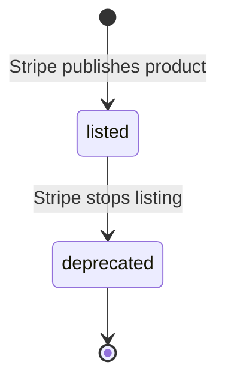
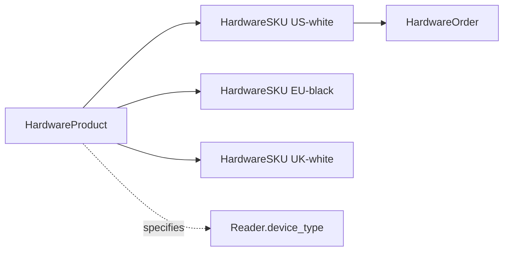

# Hardware Product

> API resource: `terminal.hardware_product` · API version: `2026-04-22.dahlia` · Category: [Terminal](README.md)

## What it is

A `terminal.hardware_product` is **a catalog entry for a model of Terminal hardware** — "BBPOS WisePOS E", "Stripe Reader S700", "Verifone P400". It's the conceptual product (the model line) without specifying region, color, or price. Concrete orderable variants are [HardwareSKU](hardware-skus.md)s tied to a Product.

Read-only. You don't create products; Stripe maintains the catalog.

## Why it exists

When you build an in-app hardware catalog ("Order more Readers for store #042"), you need a clean two-level taxonomy:

1. **Product** — what the device *is* ("WisePOS E").
2. **SKU** — how to actually buy it ("WisePOS E, US-charging, white, $349 USD").

Without a Product layer, you'd repeat product-name and product-type metadata across many SKUs, and grouping in your UI ("All WisePOS E variants") would require fragile string matching.

## Lifecycle & states



There is **no `status` field** on Hardware Product. From your integration's perspective:

- A product is **listed** if it appears in `GET /v1/terminal/hardware_products`.
- A product is effectively **deprecated** when it stops appearing or all its SKUs become `available: false`.

You cannot create, update, or delete Hardware Products via the API.

## Anatomy of the object

| Field | Notes |
|---|---|
| `id` | `thp_…` |
| `object` | `"terminal.hardware_product"` |
| `name` | Human-readable model name ("BBPOS WisePOS E"). Use directly in UI. |
| `type` | Category discriminator. Examples (non-exhaustive): `reader`, `accessory`, `case`. Hedge: exact enum may differ — read whatever Stripe returns and group by it. |
| `metadata` | Standard 40-key bag. Read-only on this resource. |
| `livemode` | Standard. |

The Hardware Product object is intentionally minimal — pricing and orderability live on the SKU, marketing copy/photos live in Stripe Dashboard or your own CMS.

## Relationships



- **HardwareProduct → HardwareSKUs**: 1-to-many. SKUs back-reference the product via `terminal_hardware_product`.
- **HardwareProduct → HardwareOrder.items[].terminal_hardware_product**: each line item denormalizes the product ID for convenience.
- **HardwareProduct → Reader.device_type**: indirect mapping — once a Reader is registered, its `device_type` (e.g. `bbpos_wisepos_e`) corresponds to the originating Product. The mapping is implicit; there's no FK from Reader back to `thp_…`.

## Common workflows

### 1. Render a product catalog

```http
GET /v1/terminal/hardware_products?limit=100
```

Group SKUs by `terminal_hardware_product` to show a "model → variants" picker:

```js
const products = await stripe.terminal.hardwareProducts.list({ limit: 100 });
const skus = await stripe.terminal.hardwareSkus.list({ limit: 100, country: 'US' });
const grouped = products.data.map(p => ({
  ...p,
  variants: skus.data.filter(s => s.terminal_hardware_product === p.id),
}));
```

### 2. Inspect a single product

```http
GET /v1/terminal/hardware_products/thp_…
```

Useful if your UI links deeply to a product detail page from a SKU.

### 3. Refresh local cache

Cache the catalog for a short window (hours, not days) to avoid hammering the API on every catalog page render. Invalidate on a periodic job or via a manual ops button.

## Webhook events

**None.** Stripe does not emit webhooks for Hardware Product additions, removals, or metadata changes. New products appear silently when listed; deprecated ones drop off. Refresh your cache on a schedule.

## Idempotency, retries & race conditions

- All endpoints are idempotent reads — `GET` only. Retries are free.
- No race conditions of consequence; the catalog is effectively read-mostly with infrequent Stripe-side updates.

## Test-mode tips

- Hardware Products list in test mode for UI development. Test-mode listings should match live-mode in shape; treat any difference as a Stripe quirk to verify against the [API reference](https://docs.stripe.com/api/terminal/hardware_products).
- No `stripe trigger` exists for this resource (no events).

## Connect considerations

- The product catalog is generally **shared across accounts** — there's no per-account customization of which Products exist. The visible *SKUs* may differ by `country` filter, but Products are global.
- When listing on behalf of a connected account (`Stripe-Account: acct_…`), you'll get the same set of products. Differences emerge at the SKU/availability layer.

## Common pitfalls

- **Hard-coding product IDs (`thp_…`).** They are stable, but Stripe occasionally adds new ones (e.g. when launching a new device). Discover dynamically via `GET /v1/terminal/hardware_products`, don't hard-code.
- **Treating `name` as machine-parseable.** It's marketing copy and may change wording (e.g. "BBPOS WisePOS E" vs. "WisePOS E"). For logic, use `id` or `type`.
- **Confusing Product with SKU.** A Product is not orderable — only SKUs go into `HardwareOrder.items[]`. Easy mistake when first integrating.
- **Forgetting to refresh the cache.** Stale catalogs hide newly-launched devices from your operators.
- **Filtering products by country.** Not supported on this endpoint — country filtering happens on SKUs. To know "what's available in DE", list SKUs with `country=DE` and group up to their Products.

## Further reading

- [API reference: Terminal Hardware Product](https://docs.stripe.com/api/terminal/hardware_products/object)
- [HardwareSKU](hardware-skus.md) · [HardwareOrder](hardware-orders.md) · [Reader](readers.md)
