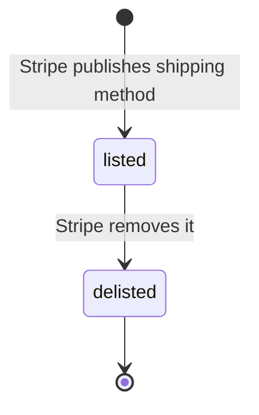
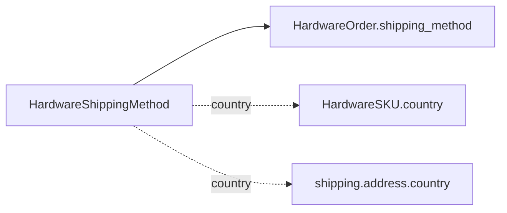

# Hardware Shipping Method

> API resource: `terminal.hardware_shipping_method` · API version: `2026-04-22.dahlia` · Category: [Terminal](README.md)

## What it is

A `terminal.hardware_shipping_method` is **a carrier + speed option** for fulfilling a [HardwareOrder](hardware-orders.md) — "Standard ground (US, 5–7 business days, $9 USD)", "Express (DE, 1–2 business days, €25 EUR)", and so on. Read-only catalog data, scoped per country, with a fixed price.

You pick exactly one shipping method per order via the order's `shipping_method` field.

## Why it exists

Shipping options are country-specific (carriers, customs, prices) and change over time. Modeling them as their own resource means:

- Your "place an order" UI can render real, current carrier choices without hard-coding them.
- Pricing surfaces accurately at the line-item level on the resulting [HardwareOrder](hardware-orders.md).
- Stripe can add new options (e.g. a new courier in a new country) without an SDK release.

## Lifecycle & states



No `status` field. A method is either present in `GET /v1/terminal/hardware_shipping_methods` or it is not. Pricing can change between listings.

## Anatomy of the object

| Field | Notes |
|---|---|
| `id` | `thsm_…` |
| `object` | `"terminal.hardware_shipping_method"` |
| `name` | Human-readable carrier + speed ("Express", "Standard ground"). |
| `country` | ISO-3166-1 alpha-2. The shipping method is valid only for orders shipping **within** this country. |
| `currency` | ISO. Matches the country. |
| `amount` | Cost in the smallest currency unit. Integer. |
| `livemode` | Standard. |

There is no `metadata` field on this object — it's purely a Stripe-managed catalog entry.

## Relationships



- **HardwareShippingMethod → HardwareOrder**: 1-to-many. Each order references exactly one method.
- **HardwareShippingMethod ↔ HardwareSKU country**: must match — you cannot ship a US-plug Reader using a DE shipping method.
- **HardwareShippingMethod ↔ shipping address country**: must match the ship-to country of the order.

## Common workflows

### 1. List options for a country

```http
GET /v1/terminal/hardware_shipping_methods?country=US
```

Render in a `<select>` with `name` as label and `amount`/`currency` as the price.

### 2. Inspect a single method

```http
GET /v1/terminal/hardware_shipping_methods/thsm_…
```

Useful for re-confirming price right before order submission.

### 3. Use a method in an order

```http
POST /v1/terminal/hardware_orders
  …
  shipping_method=thsm_…
  shipping[address][country]=US   # must match the method's country
```

If country mismatch occurs, the API rejects with a clear error.

### 4. Refresh local cache

Like Products and SKUs, cache for minutes to hours, not days. Carriers and prices change.

## Webhook events

**None.** No webhooks for shipping method additions, removals, or price updates. Refresh on a schedule.

## Idempotency, retries & race conditions

- All endpoints are `GET`-only and idempotent.
- **Race**: a method can be removed between listing and order submission. The order call returns an error; surface a retry with a fresh shipping-method list.
- **Race**: pricing can change. Re-fetch immediately before final order confirmation if your UX shows a "review your order" step.

## Test-mode tips

- Shipping methods list in test mode for UI development. Test-mode listings may not exactly mirror live (Stripe is free to keep separate test catalogs); verify against live before relying on a specific `thsm_…`.
- No `stripe trigger` exists for this resource.

## Connect considerations

- The set of shipping methods visible can vary by **the account placing the order** in some Connect setups (negotiated rates, etc.). Always list under the same `Stripe-Account` you'll use for the order.
- When ordering on behalf of a connected account whose business address is in a different country than the platform's, list methods using the **destination** country, not the platform's country.

## Common pitfalls

- **Hard-coding `thsm_…` IDs.** Stripe replaces methods periodically. Always discover dynamically.
- **Caching prices for too long.** Operators get angry when shipping cost ≠ what they saw at checkout.
- **Cross-country mismatches.** SKU country, shipping method country, and shipping address country must all align. The API errors are clear but easy to hit if you let users mix and match.
- **Treating `amount` as a float.** Integer minor units only.
- **Surfacing internal `id`s in your UI.** `name` is the user-facing label; `id` is for the order submission.
- **Assuming worldwide availability.** Many countries have a single method; some have none. If the list is empty for a country, hardware ordering isn't available there yet.

## Further reading

- [API reference: Terminal Hardware Shipping Method](https://docs.stripe.com/api/terminal/hardware_shipping_methods/object)
- [HardwareOrder](hardware-orders.md) · [HardwareSKU](hardware-skus.md) · [HardwareProduct](hardware-products.md)
