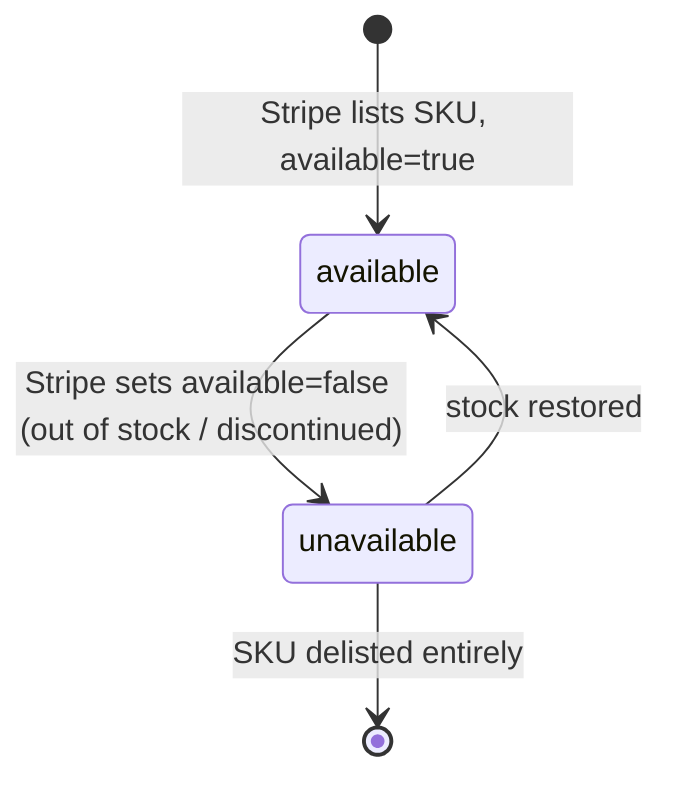
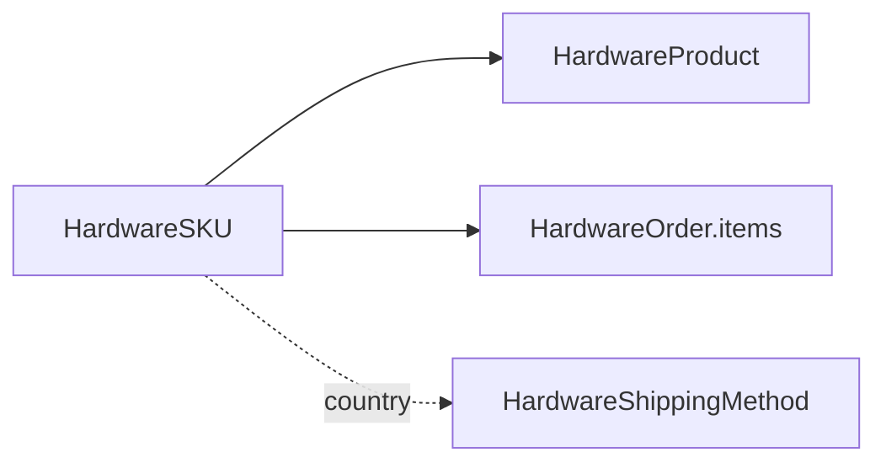

# Hardware SKU

> API resource: `terminal.hardware_sku` · API version: `2026-04-22.dahlia` · Category: [Terminal](README.md)

## What it is

A `terminal.hardware_sku` is **a specific orderable variant of a [HardwareProduct](hardware-products.md)** — "WisePOS E, US (US charging plug), white, $349 USD" or "Stripe Reader S700, EU power, black, €329 EUR". It carries the price, the availability flag, and the country/currency it's listed in. You put SKUs (not Products) into `HardwareOrder.items[]`.

Read-only catalog data, like Products.

## Why it exists

A Reader model ships in many physical variants — region-specific power plugs, color, keyboard layout, regulatory certification. Pricing and stock differ per variant per country. Modeling each as its own SKU lets:

- Country-aware UIs ("show me what I can order in Germany") via simple `country=` filtering.
- Accurate per-line pricing that matches what your accounting team will see on the order invoice.
- Inventory awareness via `available` so you don't dangle out-of-stock options in your catalog.

## Lifecycle & states



No formal `status` field. Lifecycle is observable through:

- **Listed** — appears in `GET /v1/terminal/hardware_skus`.
- **`available: true`** — orderable now.
- **`available: false`** — temporarily out of stock or being phased out. Still visible, but `POST /v1/terminal/hardware_orders` rejects items referencing it.
- **Delisted** — removed from listings entirely.

## Anatomy of the object

| Field | Notes |
|---|---|
| `id` | `thsku_…` |
| `object` | `"terminal.hardware_sku"` |
| `name` | Human-readable variant name ("WisePOS E (US plug, white)"). |
| `terminal_hardware_product` | `thp_…` of the parent [HardwareProduct](hardware-products.md). |
| `country` | ISO-3166-1 alpha-2. The SKU is orderable for shipping addresses in this country. |
| `currency` | ISO. Matches the country's primary billing currency. |
| `amount` | Unit price in the smallest currency unit (e.g. cents). |
| `available` | Boolean. `false` means cannot order today. |
| `metadata` | Standard. Read-only here. |
| `livemode` | Standard. |

Pricing is **per-SKU and final** — there is no separate tax rate or discount on the SKU object. Tax is computed at order time on the [HardwareOrder](hardware-orders.md).

## Relationships



- **SKU → Product**: required pointer. Used to group variants.
- **SKU → HardwareOrder.items[]**: SKUs are the line-item primitive in an order.
- **SKU.country ↔ ShippingMethod.country**: the order's SKU country and shipping method country must match — you can't combine US-plug Readers with an EU shipping method.

## Common workflows

### 1. List orderable SKUs for a country

```http
GET /v1/terminal/hardware_skus?country=US&limit=100
```

Filter client-side by `available: true` to hide out-of-stock items, or surface them as "notify me" placeholders.

### 2. Build a "buy more" picker grouped by product

```js
const [products, skus] = await Promise.all([
  stripe.terminal.hardwareProducts.list({ limit: 100 }),
  stripe.terminal.hardwareSkus.list({ country: 'US', limit: 100 }),
]);

const catalog = products.data.map(p => ({
  product: p,
  variants: skus.data
    .filter(s => s.terminal_hardware_product === p.id && s.available)
    .map(s => ({ id: s.id, name: s.name, price: s.amount / 100 })),
}));
```

### 3. Inspect a single SKU before ordering

```http
GET /v1/terminal/hardware_skus/thsku_…
```

Re-fetch immediately before submitting the order to catch a price change or availability flip.

### 4. Use a SKU in an order

```http
POST /v1/terminal/hardware_orders
  …
  items[0][terminal_hardware_sku]=thsku_…
  items[0][quantity]=3
```

Quantity caps may apply per SKU per order; treat any rejection as a need to split the order.

## Webhook events

**None.** No webhooks for SKU price changes or availability flips. Re-list periodically.

## Idempotency, retries & race conditions

- `GET` endpoints are idempotent. Retries are safe and free.
- **Race**: a SKU's `available` can flip between catalog list and order submission. Always be ready to handle "SKU unavailable" errors at order time and surface a retry-with-different-variant flow.
- **Race**: prices can change. Re-fetch the SKU just before order submission and confirm the displayed price matches before charging the operator's confirmation.

## Test-mode tips

- SKUs list in test mode. Prices in test mode should mirror live mode but treat them as advisory — only live-mode SKUs back real fulfillment.
- Use a short cache TTL in dev (minutes) so you see catalog updates promptly when iterating.

## Connect considerations

- SKU availability and pricing can vary by the **account placing the order**, not just by country. Some Connect platforms have negotiated catalogs. Hedge: assume per-account variability and always list SKUs under the same `Stripe-Account` header you'll use for the order.
- For platforms that order on behalf of merchants, the merchant's billing currency dictates which SKUs (which `currency`) you should display.

## Common pitfalls

- **Hard-coding SKU IDs.** They change when Stripe updates packaging/pricing. Discover dynamically.
- **Caching prices for too long.** Operators get angry when checkout total ≠ catalog total. Cache for minutes, not days.
- **Mismatching `country` between SKU and shipping method.** API rejects. Always filter both by the same country in your UI.
- **Ignoring `available: false`.** Submitting an order with an unavailable SKU returns an error. Either hide unavailable SKUs or visibly disable them.
- **Treating `amount` as a float.** It's an integer in the smallest currency unit. Divide for display only.
- **Mixing currencies in one order.** A single `HardwareOrder` is one currency; all SKU line items must share the same `currency`. Stripe rejects mixed-currency orders.

## Further reading

- [API reference: Terminal Hardware SKU](https://docs.stripe.com/api/terminal/hardware_skus/object)
- [HardwareProduct](hardware-products.md) · [HardwareOrder](hardware-orders.md) · [HardwareShippingMethod](hardware-shipping-methods.md)
