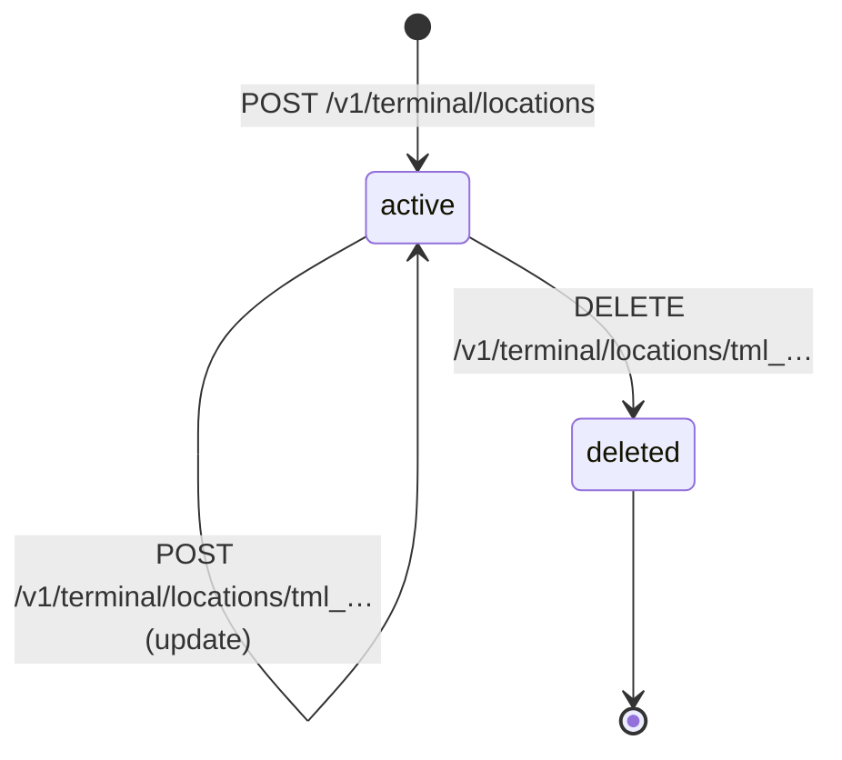
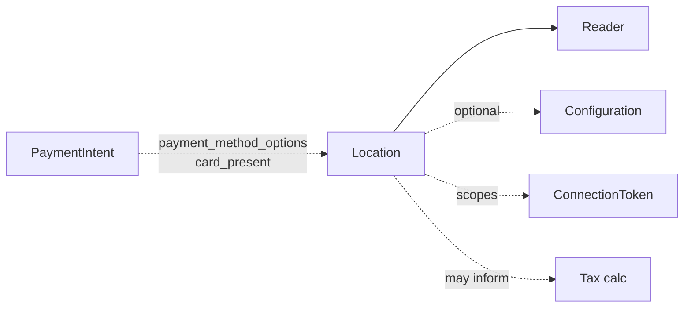

# Location

> API resource: `terminal.location` · API version: `2026-04-22.dahlia` · Category: [Terminal](README.md)

## What it is

A `terminal.location` is a **physical site** where Terminal Readers operate — a store, restaurant, kiosk, mobile food truck base, hotel front desk. It carries an address and a display name, and every [Reader](readers.md) is scoped to exactly one Location at registration time.

It's a small object with outsized operational importance: tax engines, Reader discovery, Connect scoping, and per-location configuration overrides all hinge on it.

## Why it exists

Three jobs:

1. **Address of record** for the physical point-of-sale. Some payment networks (and tax law) need to know where the card was presented.
2. **Discovery scope** — when a [ConnectionToken](connection-tokens.md) is location-scoped, only Readers at that Location are visible to the SDK. This stops cashier A in store 1 from accidentally driving a Reader in store 2.
3. **Configuration anchor** — Locations can carry [Configuration](configurations.md) overrides (tipping, splash screen, language) so each store can deviate from the account default without per-Reader micromanagement.

Without Locations, you'd have one undifferentiated pool of Readers and no clean way to scope SDK access or apply store-by-store policy.

## Lifecycle & states



Locations have **no `status` field** — they are either present or deleted. Lifecycle moments:

- **Created**: address + display name required at creation. Becomes immediately usable for Reader registration.
- **Updated**: `display_name`, `address` (full or partial), `metadata`, `configuration_overrides` are mutable. Updating the address does not retroactively recompute tax on past payments.
- **Deleted**: hard delete. Allowed only if **no Readers are currently assigned**. Move or unregister Readers first, otherwise the API errors.

## Anatomy of the object

### Identity

| Field | Notes |
|---|---|
| `id` | `tml_…` |
| `object` | `"terminal.location"` |
| `livemode` | Test vs. live. |
| `display_name` | Human-readable name shown in Dashboard and (optionally) in your POS UI. Pick something cashiers recognize ("Store #042 — Brooklyn"). |
| `metadata` | 40-key bag for your IDs / tags. |

### Address

| Field | Notes |
|---|---|
| `address.line1` | Required. |
| `address.line2` | Optional (suite, floor). |
| `address.city` | Required. |
| `address.state` | Required for countries that have states/provinces. |
| `address.postal_code` | Required for countries with postal codes. |
| `address.country` | ISO-3166-1 alpha-2. **Immutable after creation** in practice — Stripe blocks cross-country moves; create a new Location instead. |

### Configuration linkage

| Field | Notes |
|---|---|
| `configuration_overrides` | `tmc_…` ID of a [Configuration](configurations.md) that overrides the account-default config for any Reader at this Location. Optional. |

## Relationships



- **Location → Readers**: 1-to-many. A Reader's `location` is set at registration and changing it requires re-registering against the new Location.
- **Location → Configuration**: optional override pointer. If unset, Readers fall back to the account-default Configuration.
- **Location ↔ ConnectionToken**: connection tokens may carry `location=tml_…` to limit SDK visibility.
- **Location → Tax**: when calling `tax.calculations.create` for in-person sales, you typically pass the Location address as the `customer_details.address` so Stripe Tax computes the correct rate.

## Common workflows

### 1. Bootstrapping a new physical store

```http
POST /v1/terminal/locations
  display_name=Store #042 — Brooklyn
  address[line1]=200 Bedford Ave
  address[city]=Brooklyn
  address[state]=NY
  address[postal_code]=11211
  address[country]=US
  metadata[internal_store_id]=store_042
```

Persist the returned `tml_…` against your store record. Use it for subsequent Reader registrations and connection-token scoping.

### 2. List all Locations (operations dashboard)

```http
GET /v1/terminal/locations?limit=100
```

Paginate via `starting_after`. Locations don't have many filters — typically you list them all and filter client-side by `metadata.region` or similar.

### 3. Move a Reader to a different store

There is no "transfer" call. You must:

1. `DELETE /v1/terminal/readers/tmr_…` (unregister).
2. `POST /v1/terminal/readers` with the new `location=tml_new`. The Reader generates a fresh registration code on its screen.

### 4. Apply a custom tipping policy per location

Create a [Configuration](configurations.md) with the desired tipping config, then:

```http
POST /v1/terminal/locations/tml_…
  configuration_overrides=tmc_…
```

Readers at this Location pick up the override on their next connection or reboot.

### 5. Delete a closed store

```http
DELETE /v1/terminal/readers/tmr_…   # for each Reader at the location
DELETE /v1/terminal/locations/tml_…
```

Order matters — deleting the Location with Readers attached returns an error.

## Webhook events

**None.** `terminal.location` does not emit webhook events. Mutations are observed only via API or Dashboard. If you need an audit log, instrument your own backend at the call sites.

## Idempotency, retries & race conditions

- `POST /v1/terminal/locations` should always carry an `Idempotency-Key` if invoked from a job that may retry — duplicate stores in your Dashboard are annoying to clean up because of the no-Readers delete constraint.
- Updates are PATCH-style; only fields you send are changed. Safe to retry.
- **Race**: deleting a Location and registering a Reader to it from another process at the same moment can race. The Reader registration call returns an error if the Location was just deleted; surface this clearly.

## Test-mode tips

- Test-mode and live-mode Locations are separate. Don't reference a `tml_test_…` from a live Reader registration.
- Dashboard supports creating Locations interactively — convenient for first-run setup.
- Reader simulator: any Location works for the `simulated_wisepos_e` device type. Address values are not validated against any external system in test mode.

## Connect considerations

- Locations live on the account that owns the Readers. Platform-owned Readers → platform-owned Locations. Connected-account Readers → Locations on the connected account (use `Stripe-Account: acct_…` on the create call).
- Some Connect platforms scope Terminal entirely under each connected merchant — each merchant manages their own Locations. Others (rare) keep Readers on the platform account and use Locations as the per-merchant boundary; this works but adds complexity in tax and reconciliation.
- The `Stripe-Account` header that mints a connection token must match the account that owns the Location used for scoping.

## Common pitfalls

- **Trying to delete a Location with active Readers.** API errors. Unregister Readers first.
- **Creating a Location per Reader.** Locations are per *site*, not per *device*. One Location with five Readers is normal.
- **Forgetting to set `configuration_overrides`** when you intended a per-store tipping policy. Readers silently use account-default config and cashiers wonder why tips don't show.
- **Mutating `address.country`.** Effectively impossible — country changes need a fresh Location. Plan store-by-store.
- **Missing `state` for US/CA addresses.** API rejects. Validate addresses upstream.
- **Passing an unsanitized `display_name` from end-user input.** Shows on the Reader screen during pairing — XSS-style content is harmless but confusing. Restrict to printable ASCII.
- **Assuming Location address drives all tax.** It informs tax decisions for `card_present` PIs, but you may still need to set `customer_details.address` explicitly on a Tax Calculation. Hedge: verify against your tax integration's docs.

## Further reading

- [API reference: Terminal Location](https://docs.stripe.com/api/terminal/locations/object)
- [Terminal Locations guide](https://docs.stripe.com/terminal/fleet/locations)
- [Reader](readers.md) · [Configuration](configurations.md) · [ConnectionToken](connection-tokens.md)
