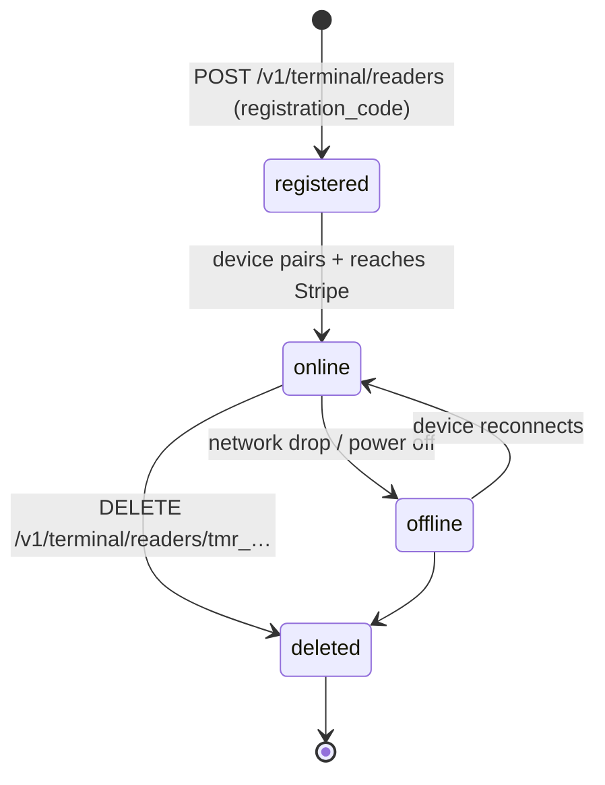
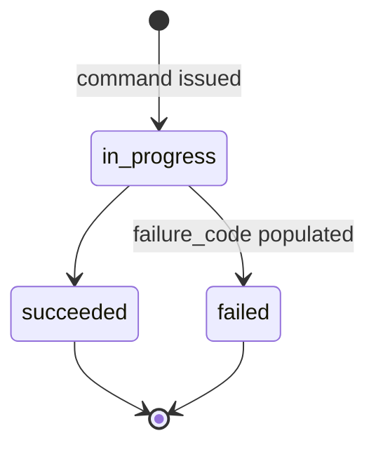
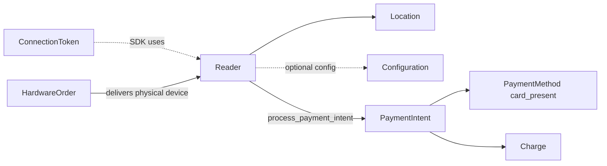

# Reader

> API resource: `terminal.reader` · API version: `2026-04-22.dahlia` · Category: [Terminal](README.md)

## What it is

A `terminal.reader` is a **registered card-acceptance device** under your Stripe account: a BBPOS WisePOS E sitting on a counter, a Verifone P400 wired to a register, a Stripe S700 handheld, an iPhone running Tap to Pay, or a simulated reader in test mode. The object holds device identity, its current online/offline status, and an `action` sub-object describing whatever in-flight operation the Reader is currently performing (collecting a payment, displaying a cart, refunding, etc.).

The reader hardware does the EMV / contactless / chip-and-PIN dance under the hood and produces a `card_present` [PaymentMethod](../02-payment-methods/payment-methods.md) that confirms a regular [PaymentIntent](../01-core-resources/payment-intents.md).

## Why it exists

Card-present payments need a registered, addressable device. The Reader object exposes that device to your backend so you can:

- Send it commands without the SDK (server-driven flow): "process this PaymentIntent", "show this cart", "collect this customer's email".
- Track which physical units exist, where they live, and whether they're online.
- Configure them en masse via [Configuration](configurations.md).
- Audit their activity via the `action` sub-object and webhook events.

Without it, every command would have to flow through a connected SDK on a phone — fine for some flows, impossible for unattended kiosks or fully-server-driven POS systems.

## Lifecycle & states



States the Reader presents:

- **`status: online`** — Reader has reached Stripe in the last few minutes. Eligible to receive `process_payment_intent`, `set_reader_display`, etc.
- **`status: offline`** — last seen too long ago. Server-driven commands will fail until it's back online (some SDK-driven flows still work locally).
- **Deleted (no status)** — unregistered. The Reader screen falls back to "register me" mode and a new registration_code can be entered.

The independent `action` sub-object has its own mini state machine for the current command:



Only one `action` runs at a time. Issuing a new command on a Reader whose `action.status: in_progress` errors with `terminal_reader_busy`. Cancel in-flight work via `POST /v1/terminal/readers/tmr_…/cancel_action`.

## Anatomy of the object

### Identity

| Field | Notes |
|---|---|
| `id` | `tmr_…` |
| `object` | `"terminal.reader"` |
| `livemode` | test vs. live. |
| `label` | Operator-set nickname ("Front register"). Mutable. |
| `serial_number` | Hardware serial. Read-only. |
| `device_type` | One of `bbpos_chipper2x`, `bbpos_wisepad3`, `bbpos_wisepos_e`, `verifone_p400`, `simulated_wisepos_e`, `stripe_m2`, `stripe_s700`, `mobile_phone_reader` (Tap to Pay). |
| `device_sw_version` | Firmware version. Updates managed by Stripe. |
| `metadata` | standard 40-key bag. |

### Networking & status

| Field | Notes |
|---|---|
| `status` | `online` or `offline`. |
| `ip_address` | Reader's local IP (for some device types). |
| `last_seen_ip` | Most recent public IP Stripe saw it from. |
| `location` | `tml_…` of the [Location](locations.md) the Reader is registered to. Immutable — to move, unregister and re-register. |

### Action sub-object

`action` describes the **current or most recent** server-driven command. Shape varies by command type:

| `action.type` | Trigger |
|---|---|
| `process_payment_intent` | `POST /v1/terminal/readers/tmr_…/process_payment_intent` — Reader prompts customer, collects card, confirms PI. |
| `process_setup_intent` | `POST /v1/terminal/readers/tmr_…/process_setup_intent` — saves a `card_present` PM. |
| `confirm_payment_intent` | Two-step flow: collect first, then confirm. |
| `collect_payment_method` | Collects PM without confirming (for pre-auth UX). |
| `refund_payment` | `POST /v1/terminal/readers/tmr_…/refund_payment` — interac/in-person refund flow. |
| `set_reader_display` | Show cart contents/line items on the Reader screen. |
| `collect_inputs` | Show a custom form (signature, selection, email) to the cardholder. |

Common action fields:

| Field | Notes |
|---|---|
| `action.status` | `in_progress`, `succeeded`, or `failed`. |
| `action.failure_code` | Set when `failed`. Examples: `canceled_by_customer`, `network_error`, `reader_timeout`. |
| `action.failure_message` | Human-readable explanation. |
| `action.<type>` | Type-specific payload (e.g. `action.process_payment_intent.payment_intent`). |

## Relationships



- **Reader → Location**: required, immutable.
- **Reader → Configuration**: indirect — Reader inherits the account-default unless the Location has `configuration_overrides`.
- **Reader → PaymentIntent**: ephemeral, via the `action` sub-object during a command.
- **Reader ← HardwareOrder**: a delivered HardwareOrder produces physical devices that you then register as Readers.

## Common workflows

### 1. Register a new Reader

The Reader displays a 16-character registration code on its screen. Your operations app calls:

```http
POST /v1/terminal/readers
  registration_code=puppies-plug-could
  location=tml_…
  label=Front register
  metadata[asset_tag]=AT-1234
```

Returns `tmr_…`. Reader transitions to `online` once it phones home (typically within seconds).

### 2. Server-driven payment (recommended for kiosks / unattended)

```http
POST /v1/payment_intents
  amount=2599 currency=usd
  payment_method_types[]=card_present
  capture_method=automatic

POST /v1/terminal/readers/tmr_…/process_payment_intent
  payment_intent=pi_…
```

Reader prompts the customer, collects the card, and confirms the PI. Watch for `terminal.reader.action_succeeded` (or `…_failed`) and the corresponding `payment_intent.succeeded` to fulfill.

### 3. SDK-driven payment (mobile cashier app)

The SDK on the cashier's phone:

1. Fetches a [ConnectionToken](connection-tokens.md) from your backend.
2. Discovers/connects to the Reader.
3. Calls `collectPaymentMethod(clientSecret)` then `confirmPaymentIntent()`.

Server creates the PI normally; the SDK does the Reader I/O. The `action` sub-object stays empty in this mode — Stripe only populates it for the `/process_payment_intent` server-driven call.

### 4. Cancel an in-flight action

If the cashier voided the sale or the customer walked away:

```http
POST /v1/terminal/readers/tmr_…/cancel_action
```

The Reader's screen returns to its idle splash. The associated PI stays in `requires_payment_method` (you can retry on a different Reader or cancel the PI).

### 5. Display cart contents

```http
POST /v1/terminal/readers/tmr_…/set_reader_display
  type=cart
  cart[currency]=usd
  cart[total]=2599
  cart[tax]=200
  cart[line_items][0][description]=Latte
  cart[line_items][0][amount]=599
  cart[line_items][0][quantity]=1
```

Useful for transparency before the payment prompt. Clear with the same endpoint and an empty cart, or by issuing the next payment command.

### 6. In-person refund (Interac)

```http
POST /v1/terminal/readers/tmr_…/refund_payment
  payment_intent=pi_…
  amount=599
```

Cardholder taps the same card to receive the refund (required for some networks like Interac).

## Webhook events

| Event | Fires when | Listener typically does |
|---|---|---|
| `terminal.reader.action_succeeded` | An `action` finished successfully (PI confirmed, refund issued, display set). | Reconcile against your local order; rely on the matching `payment_intent.succeeded` for fulfillment. |
| `terminal.reader.action_failed` | An `action` failed. `failure_code` and `failure_message` are populated. | Surface to the cashier; possibly retry or void the PI. |
| `terminal.reader.action_updated` | Intermediate state change on an action (e.g. PM collected but not yet confirmed). | Optional UX hook. |

Hedge: exact event names and presence of `action_updated` may vary slightly by API version — verify against your account's webhook activity.

## Idempotency, retries & race conditions

- **`POST /v1/terminal/readers`** (register): always send `Idempotency-Key`. A retried call without one will fail with "registration code already used".
- **`/process_payment_intent`**: the Reader rejects a second call while an action is in-progress. Use `cancel_action` first if you need to interrupt.
- **Cancel races**: a `cancel_action` and the PI succeeding can race. The webhook ordering is the source of truth — if `payment_intent.succeeded` fired, the payment went through regardless of what your client thinks.
- **Stale `status`**: `online`/`offline` updates with a small delay. Don't gate UX on it being instantaneous; the next command attempt will give you ground truth.

## Test-mode tips

- `device_type: simulated_wisepos_e` is the workhorse. Register it with code `simulated-wpe`.
- The simulator accepts magic test cards via the SDK (`stripe.terminal.testCardNumber('4242…')`).
- `stripe trigger terminal.reader.action_succeeded` exercises your webhook handler.
- Tap to Pay test mode on iOS requires the Apple developer entitlement and a real device (no simulator support).
- For S700 / WisePOS E in test mode: order zero-cost test units via Hardware Orders, or use only the simulated reader.

## Connect considerations

- Readers can be registered **on the platform** or **on a connected account**. The `Stripe-Account` header on the registration call decides.
- Connection tokens, PaymentIntents, and Reader commands must all be issued against the **same account** that owns the Reader. Cross-account Reader control is not supported.
- For platforms reselling Terminal: the recommended pattern is one connected account per merchant, with that merchant's Readers, Locations, and Configurations all on their own account. Reader-level disputes, payouts, and 1099-Ks attribute correctly that way.
- `Stripe-Account` mismatch on `process_payment_intent` returns "no such reader" — debug by listing Readers on each candidate account.

## Common pitfalls

- **Trying to use a Reader without registering it first.** A device flashing a registration code is *not* a Reader yet — it has no `tmr_…`.
- **Reusing a registration_code.** Codes are single-use. Re-pairing requires generating a fresh code on the device (typically by power-cycling or hitting "Pair").
- **Issuing two commands back-to-back.** Wait for `action.status` to leave `in_progress` (or call `cancel_action`).
- **Polling `GET /v1/terminal/readers/tmr_…` instead of using webhooks.** Wastes rate limit and adds latency. Use `terminal.reader.action_succeeded`.
- **Confusing `action` failure with PI failure.** A PI can succeed even if the Reader's action ended up `failed` due to a post-confirm display glitch — always treat `payment_intent.succeeded` as the authoritative fulfillment signal.
- **Hard-coding `device_type` filters in dashboards.** New device types (e.g. `mobile_phone_reader`, `stripe_s700` arrived in recent releases). Render unknown types gracefully.
- **Forgetting that simulated Readers are test-mode only.** Live keys + simulated reader = error.
- **Letting `action` linger in `failed` and assuming the PI is dead.** PIs are independent — they often need an explicit cancel.

## Further reading

- [API reference: Terminal Reader](https://docs.stripe.com/api/terminal/readers/object)
- [Server-driven payments with Reader](https://docs.stripe.com/terminal/payments/collect-card-payment?reader=true)
- [Tap to Pay on iPhone](https://docs.stripe.com/terminal/payments/setup-reader/tap-to-pay)
- [PaymentIntent](../01-core-resources/payment-intents.md) · [Location](locations.md) · [Configuration](configurations.md)
