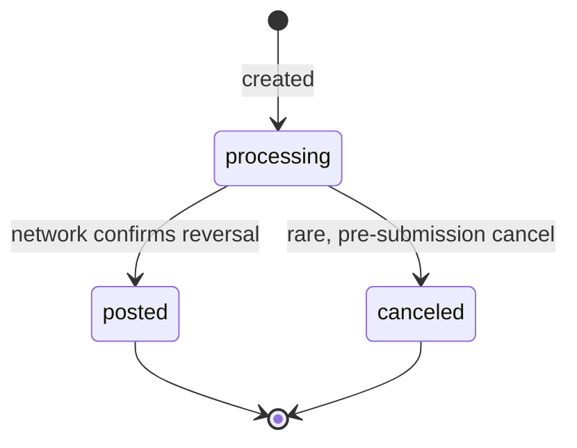
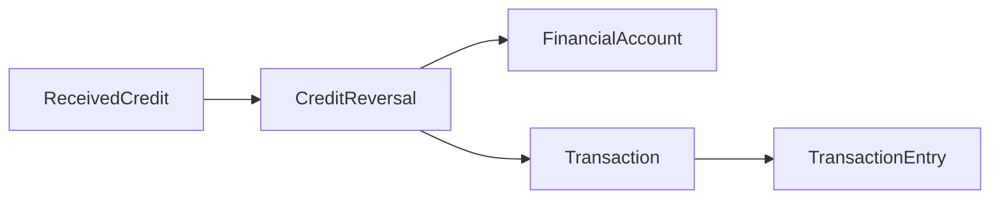

# Credit Reversal

> API resource: `treasury.credit_reversal` · API version: `2026-04-22.dahlia` · Category: [Treasury](README.md)

## What it is

A `CreditReversal` reverses a previously-received credit on a [FinancialAccount](financial-accounts.md). When money arrives at your FA via ACH or intra-Stripe flow ([ReceivedCredit](received-credits.md)) and you want to send it back — wrong account, fraud, misrouted payroll, customer-requested return — you create a CreditReversal pointing at that ReceivedCredit. Stripe debits the FA and pushes the funds back along the same rail to the originator.

It is the only programmatic mechanism to refuse an inbound credit. ReceivedCredits cannot be pre-declined; they're already in your balance by the time you see them.

## Why it exists

Banking rails (ACH especially) require a structured "return" mechanism for misrouted or unwanted credits, with strict deadlines and reason codes. CreditReversal is Stripe's API surface for that mechanism. Without it, your only recourse for an unwanted credit would be to send a fresh OBP/OBT to the original sender — clumsy, slower, and not equivalent for accounting/audit purposes.

## Lifecycle & states



| Status | Meaning |
|---|---|
| `processing` | Reversal submitted to network. FA's `cash` decreased; funds in flight back. |
| `posted` | Reversal confirmed at the originator's bank. Terminal success. |
| `canceled` | Canceled before submission. Rare in practice. |

`status_transitions.posted_at` records the posting time. There is no `failed` status today — Stripe reattempts at the network layer and surfaces an alternative reconciliation path if the reversal can't post (typically a manual support escalation).

### Time-bound

CreditReversals are **deadline-gated**. The originating ReceivedCredit's `reversal_details.deadline` (unix seconds) is the last moment you can create a reversal. After that:

- ACH credits: deadline is roughly 2–3 business days for most return reasons; longer (~60 days) for `unauthorized` returns.
- Wire credits: typically not reversible via this API — the deadline is often `null` or in the past, and `reversal_details.restricted_reason` is set.
- Intra-Stripe credits: short deadline; varies by feature.

Always read `reversal_details.restricted_reason` on the ReceivedCredit *before* attempting a reversal.

## Anatomy of the object

### Identity

| Field | Notes |
|---|---|
| `id` | `credrev_…` |
| `object` | `"treasury.credit_reversal"` |
| `livemode` | mode flag |
| `created` | unix seconds |
| `metadata` | Your bag. |

### Money

| Field | Notes |
|---|---|
| `amount` | Positive integer cents. **Must equal the original credit's `amount`** — partial reversals are not supported. |
| `currency` | `"usd"`. |

### Source

| Field | Notes |
|---|---|
| `received_credit` | `rec_…` — the credit being reversed. **Required.** |
| `financial_account` | `fa_…` — derived from the ReceivedCredit; not user-settable. |
| `network` | `ach | stripe`. Derived from the ReceivedCredit's network. |

### Status

| Field | Notes |
|---|---|
| `status` | `processing | posted | canceled`. |
| `status_transitions.posted_at` | unix seconds. |

### Pointers

| Field | Notes |
|---|---|
| `transaction` | `trxn_…` — the FA ledger Transaction this reversal created (debit on your FA). |

## Relationships



- One ReceivedCredit can have at most one CreditReversal. Once a reversal exists (in any status), `reversal_details.restricted_reason` on the credit is set to `already_reversed`.
- The reversal does not mutate the original ReceivedCredit's `status` field.

## Common workflows

### 1. Reverse a misrouted ACH credit

Pre-check on the credit:

```python
rc = stripe.treasury.ReceivedCredit.retrieve("rec_…", stripe_account=acct)
assert rc.reversal_details.restricted_reason is None
assert rc.reversal_details.deadline > time.time()
```

Then reverse:

```http
POST /v1/treasury/credit_reversals
  Stripe-Account: acct_…
  Idempotency-Key: <uuid>
  received_credit=rec_…
  metadata[reason]=wrong_account
```

Returns `status: processing`. Watch for `treasury.credit_reversal.posted`.

### 2. Verify a reversal landed

On `treasury.credit_reversal.posted`:
- The originator's bank has been re-credited.
- Your FA balance reflects the debit.
- Read `transaction` to see the ledger entry, suitable for accounting export.

### 3. List reversals for a FA

```http
GET /v1/treasury/credit_reversals?financial_account=fa_…&limit=50
  Stripe-Account: acct_…
```

Filter by `received_credit=rec_…` to find the reversal of a specific credit.

### 4. Handle "deadline_passed"

If `reversal_details.restricted_reason == "deadline_passed"`, you must:
1. Reach out to the originator off-platform.
2. Ask them to submit a request to their bank to recall (success not guaranteed).
3. Or, send the funds back via a fresh [OutboundTransfer](outbound-transfers.md) or [OutboundPayment](outbound-payments.md) — recording your own metadata to tie it to the original credit.

## Webhook events

| Event | Fires when | Listener typically does |
|---|---|---|
| `treasury.credit_reversal.created` | Reversal submitted. | Persist; mark in-flight. |
| `treasury.credit_reversal.posted` | Reversal confirmed at network. | Confirm in your accounting; release any user-facing UI. |

There is no `failed` event today. If a reversal can't post, it remains `processing` and Stripe support resolves it manually; track stuck `processing` reversals on a long alarm.

## Idempotency, retries & race conditions

- **Always send `Idempotency-Key`.** Stripe will reject a second reversal of the same `received_credit` with `already_reversed`, but the idempotency key protects against your own retry creating a duplicate before that signal arrives.
- The synchronous response returns `processing`; trust the webhook for `posted`.
- Reading `reversal_details.restricted_reason` on the credit is a hint, not a lock. Two parallel reversal attempts may both pre-check `null` then race; only one will succeed (the second returns `already_reversed`).
- `posted` is terminal. There is no "reversal-of-reversal" — if you reverse a credit and then change your mind, you must send the funds back as a fresh OBP/OBT.

## Test-mode tips

- `stripe trigger treasury.credit_reversal.posted`.
- To exercise the deadline path, use the dashboard test helpers to create a ReceivedCredit with a past deadline.
- Test-mode reversals post within seconds; live mode can take hours to a day depending on rail.

## Connect considerations

- Always include `Stripe-Account: acct_…`. The reversal is owned by the connected account.
- Required FA features: same as the originating credit's network. ACH credits require `inbound_transfers.ach`-adjacent features; intra-Stripe credits require `intra_stripe_flows`.
- Wire credits are essentially non-reversible via this API; the platform must coordinate with Stripe support and the partner bank.

## Common pitfalls

- **Trying to partial-reverse.** Not supported. The reversal `amount` must equal the credit `amount`.
- **Skipping the deadline check.** Many credits are non-reversible by the time your handler runs. Always inspect `reversal_details` first; surface a "can't auto-reverse, contact support" UX otherwise.
- **Treating reversal as a chargeback.** It isn't. There is no dispute, no evidence, no win/lose. It's a network return, not an adversarial process.
- **Skipping `Idempotency-Key`.** A retry creates a `already_reversed` error, not a second reversal — but on the very first attempt, idempotency saves you from a duplicated POST during network flakes.
- **Expecting `received_credit.status` to flip.** It doesn't; reconciliation must walk both objects.
- **Using CreditReversal for funds you simply don't want anymore.** If you want to give the money back to the *user* who sent it (who is *not* the original sender — e.g. a refund for a service), use OBP, not CreditReversal. Reversal goes back to the original payer.

## Further reading

- [API reference: CreditReversal](https://docs.stripe.com/api/treasury/credit_reversals/object)
- [Reverse a ReceivedCredit](https://docs.stripe.com/treasury/moving-money/financial-accounts/out-of-financial-accounts/credit-reversals)
- [ReceivedCredit](received-credits.md) — the credit being reversed.
- [DebitReversal](debit-reversals.md) — the inverse for ReceivedDebits.
