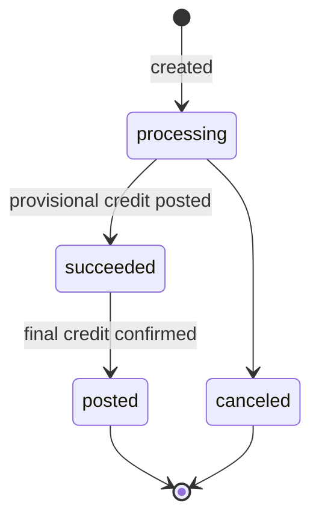
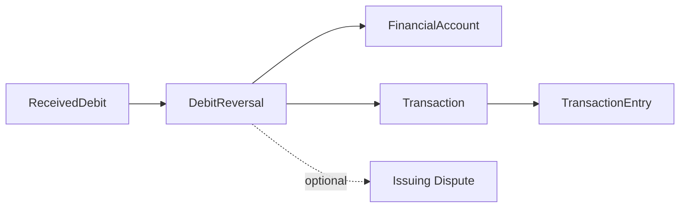

# Debit Reversal

> API resource: `treasury.debit_reversal` · API version: `2026-04-22.dahlia` · Category: [Treasury](README.md)

## What it is

A `DebitReversal` reverses a previously-received debit on a [FinancialAccount](financial-accounts.md). When a third party debits your FA via ACH ([ReceivedDebit](received-debits.md)) and the debit was unauthorized, in error, or otherwise should be unwound, you create a DebitReversal pointing at the ReceivedDebit. Stripe credits the FA back from the puller's bank along the same rail.

It is the inverse of [CreditReversal](credit-reversals.md) and the closest Treasury analog to "I want my money back from that ACH debit."

## Why it exists

ACH debits are pull transactions: a third party can take money from your account if they have your routing/account numbers and you've given them an authorization. Sometimes that authorization is forged, expired, exceeded, or just wrong. NACHA's rules (R10 unauthorized, R07 authorization revoked, etc.) define a return mechanism with strict deadlines. DebitReversal is Stripe's API surface for that mechanism.

It is also the path for unwinding errored intra-Stripe debits in some cases.

## Lifecycle & states

DebitReversals have a slightly richer lifecycle than CreditReversals because the network can grant the credit back in stages — provisional first, then final.



| Status | Meaning |
|---|---|
| `processing` | Reversal submitted; FA balance not yet credited back. |
| `succeeded` | Provisional credit applied to FA — funds usable. May still be revoked if the puller's bank disputes the return. |
| `posted` | Final settlement of the reversal. Terminal success. |
| `canceled` | Pre-submission cancel. Rare. |

(Some Stripe documentation collapses `succeeded` and `posted` into one `posted` step; the events `treasury.debit_reversal.initial_credit_granted` and `.completed` distinguish them precisely.)

### Time-bound

DebitReversals are deadline-gated by `reversal_details.deadline` on the originating ReceivedDebit:

- ACH debits with `unauthorized` reason: ~60 days.
- ACH debits with administrative reason: shorter (~2–3 business days for some return codes).
- Intra-Stripe / wire-related debits: typically not reversible via this API.

Always inspect `reversal_details.restricted_reason` first.

## Anatomy of the object

### Identity

| Field | Notes |
|---|---|
| `id` | `debrev_…` |
| `object` | `"treasury.debit_reversal"` |
| `livemode` | mode flag |
| `created` | unix seconds |
| `metadata` | Your bag. |

### Money

| Field | Notes |
|---|---|
| `amount` | Positive integer cents. **Must equal the original debit's `amount`** — partial reversals not supported. |
| `currency` | `"usd"`. |

### Source

| Field | Notes |
|---|---|
| `received_debit` | `recd_…` — the debit being reversed. **Required.** |
| `financial_account` | `fa_…` — derived from the ReceivedDebit. |
| `network` | `ach | stripe`. Derived from the ReceivedDebit. |

### Status

| Field | Notes |
|---|---|
| `status` | `processing | succeeded | posted | canceled`. |
| `status_transitions.posted_at` | unix seconds for the final post. |
| `status_transitions.completed_at` | unix seconds when the reversal fully completed. |

### Linked flows

| Field | Notes |
|---|---|
| `linked_flows.issuing_dispute` | `idp_…` if the debit reversal is paired with an Issuing dispute (rare cross-product flow). |

### Pointers

| Field | Notes |
|---|---|
| `transaction` | `trxn_…` — the FA ledger Transaction this reversal created (credit on your FA). |

## Relationships



- One ReceivedDebit can have at most one DebitReversal. After creation, the ReceivedDebit's `reversal_details.restricted_reason` becomes `already_reversed`.
- The reversal does not mutate the ReceivedDebit's `status`.

## Common workflows

### 1. Reverse an unauthorized ACH debit

Pre-check on the debit:

```python
rd = stripe.treasury.ReceivedDebit.retrieve("recd_…", stripe_account=acct)
assert rd.reversal_details.restricted_reason is None
assert rd.reversal_details.deadline > time.time()
```

Then reverse:

```http
POST /v1/treasury/debit_reversals
  Stripe-Account: acct_…
  Idempotency-Key: <uuid>
  received_debit=recd_…
  metadata[reason]=unauthorized
```

Returns `status: processing`. Watch for `treasury.debit_reversal.initial_credit_granted` (provisional credit) and `.completed` (final).

### 2. Treat the provisional credit carefully

When `treasury.debit_reversal.initial_credit_granted` fires (status `succeeded`), the FA balance is credited back. The user can spend the funds. **But** the puller's bank can dispute the return; in pathological cases the credit is revoked before `completed`.

- For low-risk users, surface as "Reversal succeeded."
- For higher-risk users or large amounts, hold the in-app credit until `completed` to avoid a clawback fight.

### 3. List reversals for an FA

```http
GET /v1/treasury/debit_reversals?financial_account=fa_…&limit=50
  Stripe-Account: acct_…
```

Filter by `received_debit=recd_…` to find the reversal of a specific debit.

### 4. Handle "deadline_passed"

If the reversal window has closed:

1. The user's only recourse is direct dispute with the puller (out-of-platform).
2. If applicable, contact Stripe support with evidence of unauthorized debit; some flows can be reopened manually.
3. Update FA `platform_restrictions.inbound_flows` if the puller is repeatedly abusing the authorization.

## Webhook events

| Event | Fires when | Listener typically does |
|---|---|---|
| `treasury.debit_reversal.created` | Reversal submitted. | Persist; mark in-flight. |
| `treasury.debit_reversal.initial_credit_granted` | Provisional credit posted (status → `succeeded`). | Optionally credit user balance (with risk model). |
| `treasury.debit_reversal.posted` | Reversal `posted` step. | Confirm in accounting. |
| `treasury.debit_reversal.completed` | Reversal fully completed; no further clawback risk. | Final-credit user balance, surface "complete" UX. |

The exact set and ordering depends on the network — for intra-Stripe debits, `initial_credit_granted` and `completed` may fire near-simultaneously.

## Idempotency, retries & race conditions

- **Always send `Idempotency-Key`.** A duplicate reversal returns `already_reversed`, but idempotency protects the very first attempt against retries.
- Pre-check on the debit's `reversal_details` is racy; two parallel attempts will both pre-check `null` and only one will win.
- Provisional credit (`succeeded`) is **not** terminal — it can be clawed back if the puller's bank disputes. Final state is `completed`.
- Refetch the ReceivedDebit before reversing; deadlines and restricted reasons can change as Stripe re-evaluates.

## Test-mode tips

- `stripe trigger treasury.debit_reversal.completed`.
- Sequence test: create a test ReceivedDebit via dashboard helpers, then `POST /v1/treasury/debit_reversals` against it.
- Test mode collapses the provisional/final stages into near-instant `completed`; live mode takes hours to days.

## Connect considerations

- Always include `Stripe-Account: acct_…`.
- Required FA features: aligned with the original debit's rail. ACH debits require the inbound-debit-related features.
- Cross-FA / cross-account reversals are not supported — the reversal is scoped to the FA the debit hit.
- Some return reason codes (R10 unauthorized, R29 corporate not authorized) carry partner-bank obligations Stripe handles automatically; you do not need to specify a reason in the API.

## Common pitfalls

- **Treating `succeeded` as final.** Provisional credit can be clawed back. For large/risky reversals, hold in-app credit until `completed`.
- **Trying partial reversal.** Not supported.
- **Reversing a posted-and-old debit without checking deadline.** Will fail with `deadline_passed`. Always pre-check.
- **Confusing reversal with a credit to the user.** The reversal puts money back in the *FA*, not into your end customer's wallet. If the user paid for something via that debit and you're refunding them too, that's a separate flow (an OBP back to them, or reversing your in-app charge).
- **Skipping `Idempotency-Key`.** Same risk as CreditReversal: duplicated POST during network flakes.
- **Not handling `initial_credit_granted` and `completed` separately.** Listening only to `completed` means you're slow to surface the reversal; listening only to `initial_credit_granted` exposes you to clawback. Handle both.

## Further reading

- [API reference: DebitReversal](https://docs.stripe.com/api/treasury/debit_reversals/object)
- [Reverse a ReceivedDebit](https://docs.stripe.com/treasury/moving-money/financial-accounts/into-financial-accounts/debit-reversals)
- [ReceivedDebit](received-debits.md) — the debit being reversed.
- [CreditReversal](credit-reversals.md) — the inverse for ReceivedCredits.
