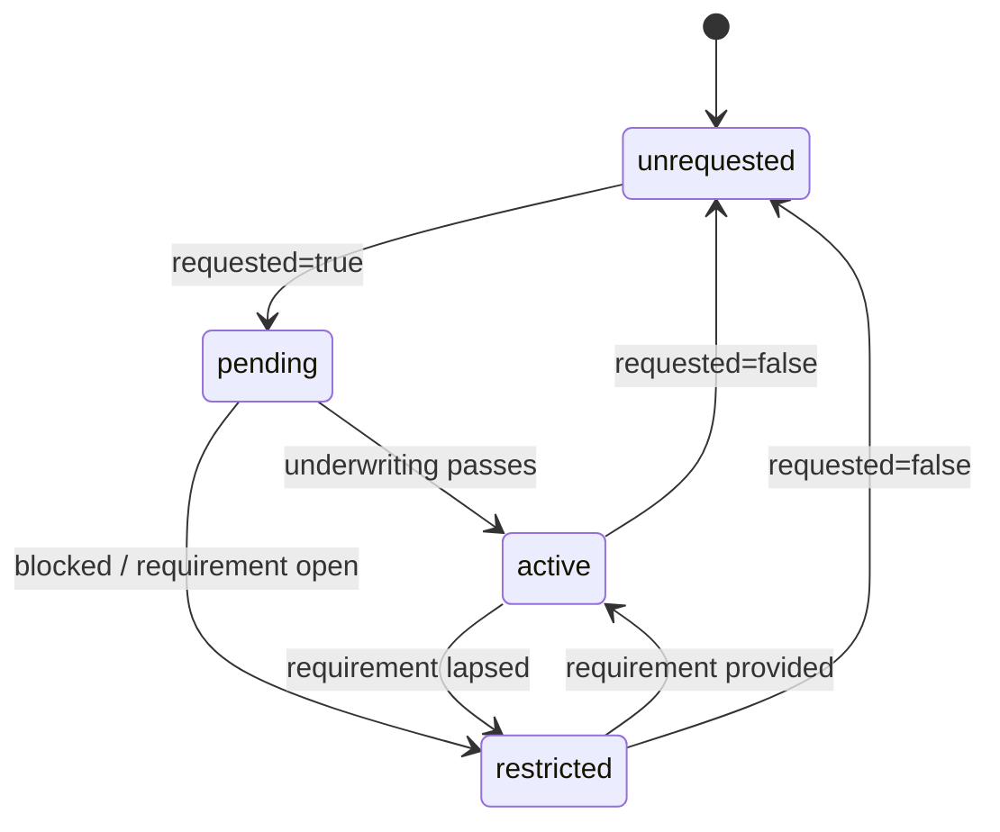
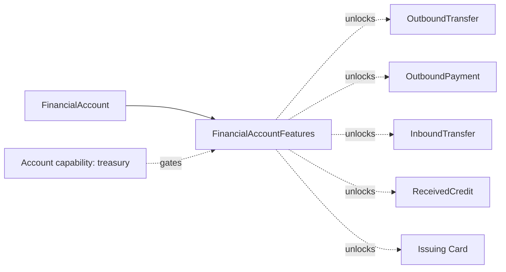

# Financial Account Features

> API resource: `treasury.financial_account_features` · API version: `2026-04-22.dahlia` · Category: [Treasury](README.md)

## What it is

`FinancialAccountFeatures` is the per-feature enablement state of a single [FinancialAccount](financial-accounts.md). It is a sub-resource — not a top-level object — addressed at `/v1/treasury/financial_accounts/fa_…/features`. Every Treasury capability the FA can use (ACH in, ACH out, US wires out, ABA address, deposit insurance, card issuing, intra-Stripe flows) is represented here as a `{requested, status, status_details}` triple.

You read it to find out *why* a feature is pending or restricted, and you write it to ask Stripe to enable or disable a feature.

## Why it exists

The parent FinancialAccount object only surfaces collapsed lists (`active_features[]`, `pending_features[]`, …). Those tell you which features are in which bucket but not *what is blocking activation*. FinancialAccountFeatures is the structured detail layer that exposes the underlying requirements (compliance, KYC, agreement acceptance, partner-bank approval) so the platform can act — collect more data, accept a Treasury services agreement, retry, etc.

## Lifecycle & states

Each feature flag has its own state machine. They activate and restrict independently.



Per-feature `status`:

| Value | Meaning |
|---|---|
| `active` | Feature is usable right now. |
| `pending` | Stripe is reviewing / waiting on partner bank or platform-supplied data. |
| `restricted` | Granted but disabled. `status_details[]` explains why. |

The triple `{requested, status, status_details}` exists for *every* feature toggle below. A feature can be `requested: true, status: restricted` (you asked, but something is blocking).

## Anatomy of the object

There is no `id` — the resource is identified by the parent FA's id. Each top-level key is a feature group; many have nested toggles per network.

### Card issuing & deposit insurance

| Field | Notes |
|---|---|
| `card_issuing.requested` / `.status` / `.status_details[]` | Lets the FA fund [Issuing Cards](../09-issuing/cards.md). |
| `deposit_insurance.requested` / `.status` / `.status_details[]` | FDIC pass-through insurance via the partner bank. Generally enabled on every FA. |

### ABA address

| Field | Notes |
|---|---|
| `financial_addresses.aba.requested` / `.status` / `.status_details[]` | Whether the FA exposes a routing+account number. Required for inbound ACH/wire and most outbound flows. |

### Inbound transfers

| Field | Notes |
|---|---|
| `inbound_transfers.ach.requested` / `.status` / `.status_details[]` | Lets the platform initiate ACH debits *into* this FA from external bank accounts. |

### Intra-Stripe

| Field | Notes |
|---|---|
| `intra_stripe_flows.requested` / `.status` / `.status_details[]` | Allows Stripe-internal credits/debits — e.g. moving from the Payments balance to the FA, or between two FAs on the same connected account. |

### Outbound payments

| Field | Notes |
|---|---|
| `outbound_payments.ach.requested` / `.status` / `.status_details[]` | Lets the connected account send ACH to third parties (end-customer-initiated; KYC required). |
| `outbound_payments.us_domestic_wire.requested` / `.status` / `.status_details[]` | Same, for US wires. |

### Outbound transfers

| Field | Notes |
|---|---|
| `outbound_transfers.ach.requested` / `.status` / `.status_details[]` | Lets the platform send ACH out (platform-controlled; no end-user identity). |
| `outbound_transfers.us_domestic_wire.requested` / `.status` / `.status_details[]` | Same, for US wires. |

### `status_details[]`

Each entry is `{code, resolution}`:

| `code` example | Meaning |
|---|---|
| `activating` | Stripe is still standing up the feature. Wait. |
| `capability_not_requested` | The connected account never requested the underlying [Account](../07-connect/accounts.md) capability. |
| `financial_account_closed` | Parent FA is closed. |
| `rejected_other` / `rejected_unsupported_business` | Underwriting declined the feature. |
| `requirements_past_due` | Onboarding requirements lapsed; restore them on the Account. |
| `requirements_pending_verification` | Stripe is verifying recently submitted info. |
| `restricted_by_platform` | The platform itself disabled the feature (rare). |
| `restricted_other` | Generic restriction; check Dashboard. |

`resolution` is one of `contact_stripe`, `provide_information`, `remove_restriction`, `none`. It tells the *platform* what to do.

## Relationships



Features are gated by — and downstream of — the connected account's `capabilities.treasury`. A capability dropping out of `active` cascades into many features going `restricted`.

## Common workflows

### 1. Read current feature state

```http
GET /v1/treasury/financial_accounts/fa_…/features
  Stripe-Account: acct_…
```

Returns the full triple-per-feature shape. Use this to power a "what's enabled" UI.

### 2. Request enabling a feature

```http
POST /v1/treasury/financial_accounts/fa_…/features
  Stripe-Account: acct_…
  outbound_payments[us_domestic_wire][requested]=true
```

Response is synchronous and reflects the new `requested: true`, but `status` will typically read `pending` for several seconds to days.

### 3. Disable a feature

```http
POST /v1/treasury/financial_accounts/fa_…/features
  Stripe-Account: acct_…
  outbound_transfers[ach][requested]=false
```

If there are pending OBT flows on that rail, the API may return an error or hold the change until they clear.

### 4. Resolve a `restricted` feature

1. Fetch features and inspect `status_details[]`.
2. If `code: requirements_past_due`, refetch the [Account](../07-connect/accounts.md) — its `requirements.currently_due[]` will list what to collect.
3. Submit the missing data via `POST /v1/accounts/acct_…`.
4. Watch `treasury.financial_account.features_status_updated` for the feature to flip back to `active`.

### 5. Bulk request at FA creation time

You don't need a separate call — the same `features[…]` map can be set on the initial `POST /v1/treasury/financial_accounts`. See [FinancialAccount workflows](financial-accounts.md#1-provision-a-treasury-account-for-a-connected-account).

## Webhook events

| Event | Fires when | Listener typically does |
|---|---|---|
| `treasury.financial_account.features_status_updated` | Any feature's `status` or `status_details` changes. | Refetch `/features`, recompute UI gates, alert on restrictions. |

There is no event scoped to a single feature. The handler must diff against the previous snapshot to know which feature changed.

## Idempotency, retries & race conditions

- Feature writes are idempotent on `requested` (writing the same value is a no-op) but you should still send `Idempotency-Key` for safety on the *first* enable.
- A `requested: true` write does not synchronously activate. Polling immediately after will still show `pending`.
- The webhook is debounced — multiple feature changes within seconds may collapse into one event. Always refetch the full features object on receipt; never trust event payload deltas alone.
- A feature can flip `active → restricted → active` within minutes during partner-bank reverification. Don't block UX permanently on a single transient `restricted`.

## Test-mode tips

- In test mode, requested features usually move to `active` within a few seconds.
- `stripe trigger treasury.financial_account.features_status_updated` simulates the webhook.
- To exercise restriction handling, manually set a connected-account requirement to `past_due` in the Dashboard and watch features cascade.

## Connect considerations

- Always include `Stripe-Account: acct_…`.
- Some features depend on Account-level capabilities the platform must request first. For example, `card_issuing` on the FA requires the `card_issuing` capability `active` on the Account.
- Restricting a feature here does *not* restrict the analogous Connect-side capability; they are independent gates.
- Custom-controller accounts may have additional platform-imposed restrictions. Check `controller` on the parent Account if features behave unexpectedly.

## Common pitfalls

- **Treating the parent FA's `active_features[]` as authoritative for *why*.** It only tells you the bucket; for `status_details` you must read this resource.
- **Sending `requested=true` repeatedly while pending.** No effect; trips risk monitoring at scale.
- **Disabling a feature with in-flight flows.** The change may be deferred or fail. Cancel/await pending flows first.
- **Forgetting that `intra_stripe_flows` is its own feature.** Without it, you cannot Top-up the FA from the Payments balance even if every other feature is active.
- **Reading `requested` to mean "live".** It only means "asked for". Read `status: active`.
- **Diffing event payload instead of refetching.** The event body intentionally omits the full feature map; always GET `/features`.

## Further reading

- [API reference: FinancialAccountFeatures](https://docs.stripe.com/api/treasury/financial_account_features/object)
- [Treasury features](https://docs.stripe.com/treasury/account-management/financial-account-features)
- [Treasury capability lifecycle](https://docs.stripe.com/treasury/account-management/onboarding)
