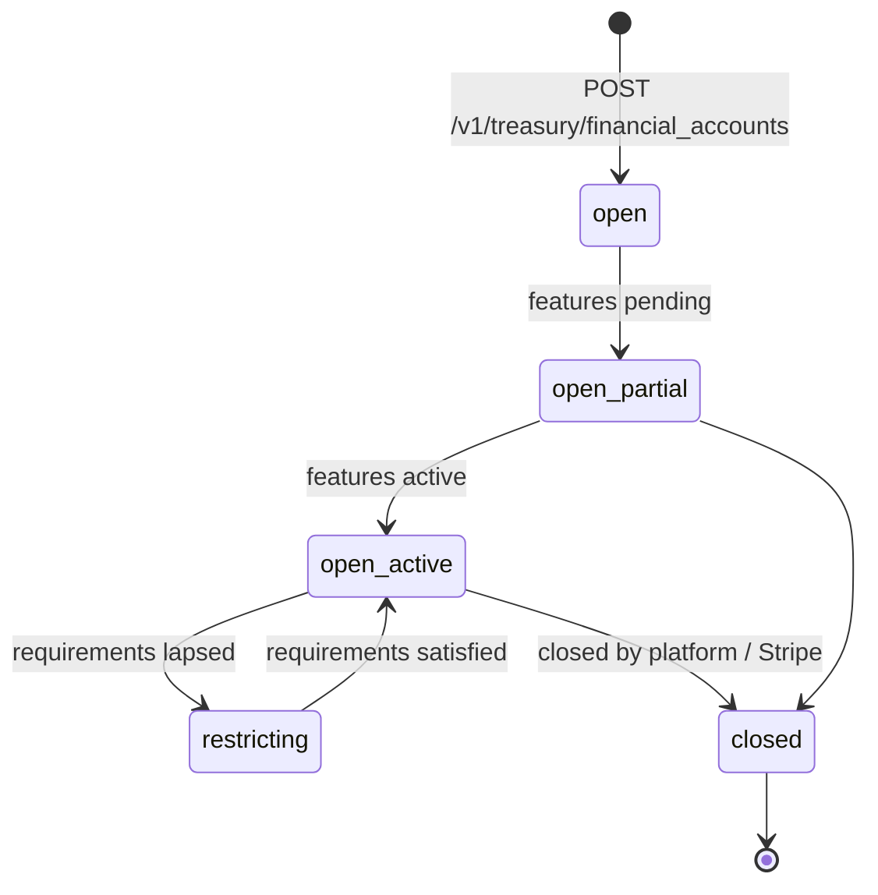
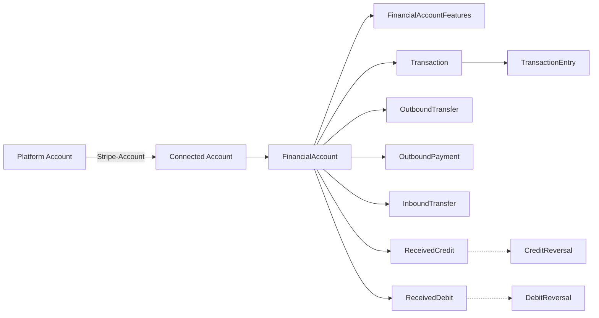

# Financial Account

> API resource: `treasury.financial_account` · API version: `2026-04-22.dahlia` · Category: [Treasury](README.md)

## What it is

A `FinancialAccount` is a Stripe-issued bank account that a Connect platform provisions for one of its US connected accounts. It has a real ABA routing number and an account number, holds a real cash balance, and can send and receive ACH and US domestic wires. Behind the scenes the account is held at one of Stripe's partner banks (e.g. Evolve Bank & Trust); from your code's perspective it is a Stripe object.

It is the root of the Treasury world. Almost every other Treasury object — Outbound Transfers, Inbound Transfers, Received Credits/Debits, Transactions, Transaction Entries — is scoped to one FinancialAccount.

## Why it exists

Treasury exists so that platforms can offer banking-as-a-service to their connected accounts: hold balance, accept incoming ACH/wires, send payouts to anywhere. Without `FinancialAccount`, a connected account's only "balance" is the Payments-side balance, which is short-lived (it gets paid out automatically) and can't receive arbitrary inbound transfers from third parties. The FA is the long-lived, addressable bank account that makes the rest of Treasury meaningful.

## Lifecycle & states

A FinancialAccount has a simple top-level `status` (`open` or `closed`) but its *useful* lifecycle is the cascade of feature activations that gate what it can actually do.



| State | What it means |
|---|---|
| `status: open` | Account exists. Whether it can transact depends on `active_features`. |
| `status: closed` | Terminal. No new flows; existing pending flows resolve. Cannot be reopened. |

The functional state lives in three list fields and one sub-object:

- `active_features[]` — features that are currently usable.
- `pending_features[]` — features the platform requested; underwriting in progress.
- `restricted_features[]` — granted but currently disabled (e.g. requirements lapsed).
- `restricting_features[]` — features whose disablement is *causing* the account to be restricted.

Treat `active_features` as the source of truth for "can I send a wire today?" — not `status`.

## Anatomy of the object

### Identity

| Field | Notes |
|---|---|
| `id` | `fa_…` |
| `object` | `"treasury.financial_account"` |
| `livemode` | mode flag |
| `created` | unix seconds |
| `country` | `"US"` — Treasury is US-only as of `2026-04-22.dahlia`. |
| `nickname` | Free-text label for your UI. Nullable. |
| `metadata` | Your bag. |

### Money

| Field | Notes |
|---|---|
| `currency` | Always `"usd"` today. |
| `supported_currencies` | List, currently `["usd"]`. |
| `balance.cash` | Map of currency → integer cents currently spendable. |
| `balance.inbound_pending` | Cents queued to land (e.g. ACH credit not settled). |
| `balance.outbound_pending` | Cents queued to leave (e.g. ACH debit you initiated, not yet posted). |

`balance.cash - balance.outbound_pending` is roughly your "available" balance. `balance.cash + balance.inbound_pending` is roughly your eventual balance once everything settles.

### Routing / addressing

| Field | Notes |
|---|---|
| `financial_addresses[]` | Each entry has `type` (currently `aba`) and a typed sub-object. |
| `financial_addresses[].aba.account_number` | The account number a third party uses to send you ACH/wire. |
| `financial_addresses[].aba.routing_number` | The ABA. |
| `financial_addresses[].aba.account_holder_name` | Name on the account (your connected account's legal name). |
| `financial_addresses[].aba.bank_name` | Stripe's partner bank, e.g. `"Evolve Bank & Trust"`. |

The address only exists once the `financial_addresses.aba` feature is in `active_features`.

### Feature state

| Field | Notes |
|---|---|
| `features` | Sub-resource pointer to [FinancialAccountFeatures](financial-account-features.md). |
| `active_features[]` | Strings like `card_issuing`, `deposit_insurance`, `financial_addresses.aba`, `inbound_transfers.ach`, `intra_stripe_flows`, `outbound_payments.ach`, `outbound_payments.us_domestic_wire`, `outbound_transfers.ach`, `outbound_transfers.us_domestic_wire`. |
| `pending_features[]` | Same enum; requested but not yet active. |
| `restricted_features[]` | Same enum; granted but disabled. |
| `restricting_features[]` | Features causing account-level restriction. |

### Platform controls

| Field | Notes |
|---|---|
| `is_default` | Whether this is the connected account's default FA. |
| `platform_restrictions.inbound_flows` | `restricted | unrestricted`. Lets the platform freeze inbound. |
| `platform_restrictions.outbound_flows` | `restricted | unrestricted`. Lets the platform freeze outbound. |

Platform restrictions are independent of Stripe-imposed feature restrictions; both must be permissive for a flow to succeed.

### Status

| Field | Notes |
|---|---|
| `status` | `open | closed`. |
| `status_details` | Sub-object explaining a non-`open` state. May contain `closed.reasons[]` with codes such as `account_rejected`, `closed_by_platform`. |

## Relationships



- A connected account can have multiple FinancialAccounts but typically has one (`is_default: true`).
- The connected account must already have the `treasury` capability `active` before a FA can be created on it.
- Issuing Cards can be funded from a FA — the link is set on the [Issuing Card](../09-issuing/cards.md) via `financial_account`.

## Common workflows

### 1. Provision a Treasury account for a connected account

Prerequisite: the connected account exists and has `capabilities.treasury` requested + `active`. See [Account](../07-connect/accounts.md).

```http
POST /v1/treasury/financial_accounts
  Stripe-Account: acct_…
  supported_currencies[]=usd
  features[card_issuing][requested]=true
  features[deposit_insurance][requested]=true
  features[financial_addresses][aba][requested]=true
  features[inbound_transfers][ach][requested]=true
  features[intra_stripe_flows][requested]=true
  features[outbound_payments][ach][requested]=true
  features[outbound_payments][us_domestic_wire][requested]=true
  features[outbound_transfers][ach][requested]=true
  features[outbound_transfers][us_domestic_wire][requested]=true
```

Use an `Idempotency-Key` — duplicate FA creation is hard to undo.

The response returns immediately with `pending_features` populated. Activation is asynchronous; subscribe to `treasury.financial_account.features_status_updated`.

### 2. Wait for ABA address to be live

You can't share routing/account numbers with users until `financial_addresses.aba` is in `active_features`. After the features-updated event fires, refetch:

```http
GET /v1/treasury/financial_accounts/fa_…?expand[]=financial_addresses
  Stripe-Account: acct_…
```

Then surface `financial_addresses[0].aba.routing_number` / `account_number` in your UI.

### 3. Add or modify features later

```http
POST /v1/treasury/financial_accounts/fa_…/features
  Stripe-Account: acct_…
  outbound_transfers[us_domestic_wire][requested]=true
```

See [FinancialAccountFeatures](financial-account-features.md) for the full shape. The same call can also un-request a feature (`requested=false`), subject to outstanding-flow restrictions.

### 4. Freeze the account

To temporarily block inbound or outbound flows without closing:

```http
POST /v1/treasury/financial_accounts/fa_…
  Stripe-Account: acct_…
  platform_restrictions[inbound_flows]=restricted
  platform_restrictions[outbound_flows]=restricted
```

In-flight flows are not retroactively canceled — they continue per their own state machines. Restrictions only block *new* flows.

### 5. Close the account

There is no public `DELETE` endpoint. Closure is initiated via Dashboard or support workflow once the balance is zero and no flows are pending. Once closed, `status` flips to `closed` and `status_details.closed.reasons[]` is populated.

## Webhook events

| Event | Fires when | Listener typically does |
|---|---|---|
| `treasury.financial_account.created` | A new FA is provisioned for a connected account. | Persist `id`, kick off feature-activation polling/wait UI. |
| `treasury.financial_account.features_status_updated` | Any feature transitions (`requested`, `pending`, `active`, `restricted`). | Refetch the FA, refresh the user's "what you can do" UI. |

There is no dedicated `closed` event today — listen for `features_status_updated` and inspect `status` defensively, or poll on a slow cadence for closure detection.

## Idempotency, retries & race conditions

- Creation should always carry `Idempotency-Key`. There is no good way to dedupe two FAs after the fact.
- Feature activation is asynchronous and can take minutes to days depending on KYC. Don't block UX on it; show pending state.
- The synchronous response to creation will not yet contain `financial_addresses` — those appear after the address feature activates.
- `platform_restrictions` writes are not transactional with in-flight flow creation. Setting `outbound_flows: restricted` *now* does not cancel an OBT created 50ms ago.

## Test-mode tips

- Test-mode FAs activate features almost immediately (no real underwriting).
- Use the Stripe CLI: `stripe trigger treasury.financial_account.features_status_updated`.
- Test ABA addresses use Stripe's sandbox routing/account numbers; do not attempt to wire real money to them.
- To simulate inbound credits, use `stripe testmode treasury inbound_transfers create` or the dashboard test helpers to fire `treasury.received_credit.created`.

## Connect considerations

- Every Treasury API call MUST include `Stripe-Account: acct_…`. There is no platform-level FinancialAccount.
- The connected account must have `capabilities.treasury: active` before FA creation — not just `requested`.
- A platform reads its connected accounts' FAs by listing per-account; there is no flat cross-account list endpoint.
- Closing the connected account does not automatically close its FAs; do that first or coordinate with Stripe support.
- Issuing on top of Treasury: an Issuing Card can have `financial_account: fa_…` so authorizations debit the FA cash balance directly (no separate funding loop).

## Common pitfalls

- **Trusting `status: open` to mean "usable".** Open with no `active_features` does nothing. Always gate features off `active_features`.
- **Surfacing routing/account numbers before `financial_addresses.aba` is active.** They simply won't be in the response yet; your UI will render `undefined`.
- **Assuming `balance.cash` is "available to send".** Subtract `balance.outbound_pending` to get a real ceiling.
- **Confusing the Treasury balance with the Payments balance.** A connected account using both has two ledgers; a Charge on the Payments side does *not* land in the FA. To move funds across, use Outbound Transfers or Top-ups.
- **Re-requesting the same feature in a tight loop.** If a feature is `pending`, leave it pending — re-POSTing won't speed up underwriting and may trip risk heuristics.
- **Calling Treasury endpoints without `Stripe-Account`.** They return `resource_missing` or 404, not an obvious "you forgot the header" error.

## Further reading

- [API reference: FinancialAccount](https://docs.stripe.com/api/treasury/financial_accounts/object)
- [Treasury overview](https://docs.stripe.com/treasury)
- [Treasury features](https://docs.stripe.com/treasury/account-management/financial-account-features)
- [Treasury onboarding](https://docs.stripe.com/treasury/onboard-and-verify-customers)
