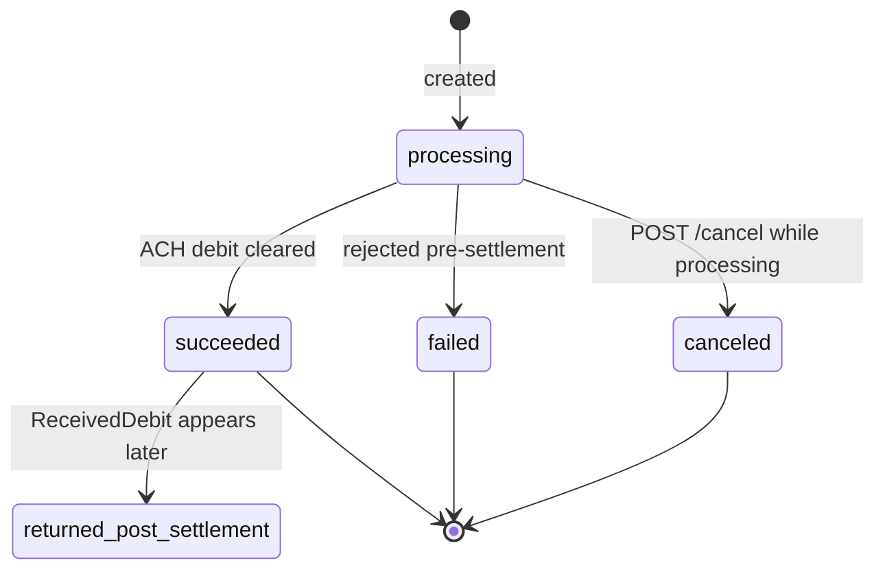
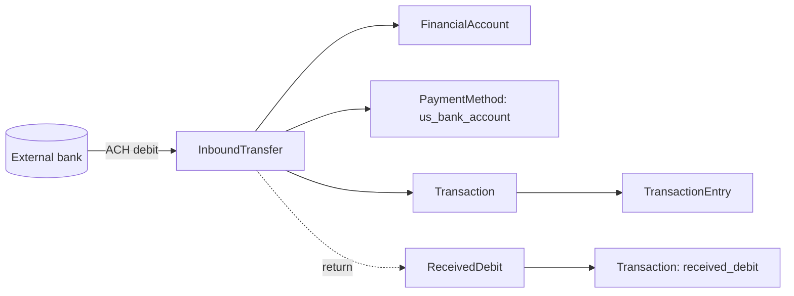

# Inbound Transfer

> API resource: `treasury.inbound_transfer` · API version: `2026-04-22.dahlia` · Category: [Treasury](README.md)

## What it is

An `InboundTransfer` (IBT) *pulls* money from an external US bank account into a [FinancialAccount](financial-accounts.md) via ACH debit. The platform initiates the pull on behalf of the connected account; the external bank account must have already authorized the debit (via NACHA mandate, microdeposit verification, Financial Connections, or similar).

If you want money to *arrive* without actively pulling — wires from a customer, ACH credits sent by a payroll system — you don't need IBT. Those simply produce [ReceivedCredit](received-credits.md) objects when the funds land. IBT is specifically the platform-initiated pull.

## Why it exists

Funding a FA without IBT means waiting for the user to push funds (initiate an ACH credit or wire from their bank). That's slow, error-prone, and most users don't know how. IBT lets the platform say "pull $X from this verified bank account into the FA" with a single API call. It's the canonical "fund my account" flow for fintech apps built on Treasury.

## Lifecycle & states



Note: the IBT object's `status` only goes `processing → succeeded | failed | canceled`. It does **not** flip to a "returned" status. A post-settlement return manifests as a separate [ReceivedDebit](received-debits.md) on the FA (debiting the funds back), with `linked_flows.inbound_transfer` pointing at this IBT and `returned: true` set on this IBT.

| Status | Meaning |
|---|---|
| `processing` | ACH debit submitted to network. Funds in `inbound_pending`. |
| `succeeded` | ACH cleared. Funds moved to `cash`. *Can still be returned later — see above.* |
| `failed` | Pre-settlement rejection (e.g. account closed at submission). No funds moved. |
| `canceled` | Canceled by API while still processing. |

`status_transitions.{succeeded_at,failed_at,canceled_at}` track timing. There is no `returned_at` because returns are modeled as ReceivedDebits.

## Anatomy of the object

### Identity

| Field | Notes |
|---|---|
| `id` | `ibt_…` |
| `object` | `"treasury.inbound_transfer"` |
| `livemode` | mode flag |
| `created` | unix seconds |
| `description` | Free text. |
| `statement_descriptor` | What the source bank shows on its statement (your "merchant name"). |
| `metadata` | Your bag. |

### Money

| Field | Notes |
|---|---|
| `amount` | Positive integer cents. |
| `currency` | `"usd"`. |

### Source / destination

| Field | Notes |
|---|---|
| `financial_account` | `fa_…` — the credited destination. |
| `origin_payment_method` | `pm_…` representing the external bank account being debited. **Must be already authorized** (mandate, microdeposit, Financial Connections). |
| `origin_payment_method_details` | Snapshot at IBT creation: `type` (`us_bank_account`), `us_bank_account.{last4,routing_number,bank_name,account_holder_type,network}`. |

### Status & failure

| Field | Notes |
|---|---|
| `status` | enum, see lifecycle. |
| `status_transitions.*` | Per-state timestamps. |
| `failure_details.code` | Reason for `status: failed`. Examples: `account_closed`, `account_frozen`, `bank_account_restricted`, `debit_not_authorized`, `insufficient_funds`, `invalid_account_number`. |
| `returned` | Boolean. `true` if a post-settlement return has occurred (and a ReceivedDebit has been created). |

### Linked flows

| Field | Notes |
|---|---|
| `linked_flows.received_debit` | `recd_…` — present once a return has occurred. Pointer to the [ReceivedDebit](received-debits.md) that took the money back. |
| `transaction` | `trxn_…` — the FA ledger Transaction this IBT created. |

### Receipts

| Field | Notes |
|---|---|
| `hosted_regulatory_receipt_url` | Hosted PDF receipt for the IBT. |

## Relationships



- `origin_payment_method` must be a `us_bank_account` with proper authorization. Stripe rejects un-mandated PMs at IBT creation.
- One IBT → one Transaction. A return creates a ReceivedDebit (with its own Transaction).

## Common workflows

### 1. Authorize the source bank (prerequisite)

Before IBT, the user must connect and authorize the external bank. Two main paths:

- **Financial Connections** — user logs into their bank via Stripe-hosted UI; instant verification, mandate captured. Strongly recommended.
- **Microdeposits** — Stripe sends two small deposits the user reports back to verify ownership. Slow (1–2 days) but fallback.

The output is a `pm_…` of type `us_bank_account` with `verified: true` and a stored mandate.

### 2. Pull funds into the FA

```http
POST /v1/treasury/inbound_transfers
  Stripe-Account: acct_…
  Idempotency-Key: <uuid>
  financial_account=fa_…
  amount=20000
  currency=usd
  origin_payment_method=pm_…
  description=Account funding
  statement_descriptor=Acme Funding
```

Returns `status: processing`. Watch for `treasury.inbound_transfer.succeeded`.

### 3. Cancel a processing IBT

```http
POST /v1/treasury/inbound_transfers/ibt_…/cancel
  Stripe-Account: acct_…
```

Only valid while `processing`. ACH submission windows close in minutes, so cancel rarely succeeds beyond a brief grace period.

### 4. Handle a return

Post-settlement returns happen days to ~60 days after `succeeded`. The detection flow:

1. `treasury.received_debit.created` arrives.
2. The ReceivedDebit's `linked_flows.inbound_transfer` is your `ibt_…`.
3. The IBT's `returned: true` is set; refetch to confirm.
4. Reverse the in-app effect: lower the user's account balance, surface a notice.

You don't need to listen for an event on the IBT itself — the ReceivedDebit creation is your signal.

## Webhook events

| Event | Fires when | Listener typically does |
|---|---|---|
| `treasury.inbound_transfer.created` | IBT submitted. | Mark in-progress in your UI. |
| `treasury.inbound_transfer.succeeded` | ACH cleared. Funds in `cash`. | Credit the user's in-app balance, send confirmation. |
| `treasury.inbound_transfer.failed` | Pre-settlement rejection. | Show failure with `failure_details.code` mapped to user-readable text. |
| `treasury.inbound_transfer.canceled` | Canceled via API. | Roll back any optimistic UI. |

For post-settlement returns, listen to `treasury.received_debit.created` and check `linked_flows.inbound_transfer`.

## Idempotency, retries & race conditions

- **Use `Idempotency-Key`.** A duplicate IBT debits the user's external bank twice; recovering requires a refund flow.
- The synchronous response is `processing`; trust webhooks for `succeeded`.
- `succeeded` is **not** terminal in the bookkeeping sense. ACH return windows are long. Always reconcile against `returned: true` when the ReceivedDebit arrives.
- A failed IBT does *not* roll back any in-app credit you may have applied optimistically — your code must handle that explicitly.

## Test-mode tips

- `stripe trigger treasury.inbound_transfer.succeeded` / `.failed` / `.canceled`.
- Test bank accounts (created via test-mode Financial Connections) work as origin PMs without real money movement.
- To simulate a return, after triggering `.succeeded`, manually create a ReceivedDebit via the dashboard test helpers with `linked_flows.inbound_transfer=ibt_…`.

## Connect considerations

- Always include `Stripe-Account: acct_…`.
- Required FA feature: `inbound_transfers.ach` in `active_features`.
- The mandate captured on `origin_payment_method` must reference the connected account, not the platform. If you collected the PM on the platform, you cannot use it as an IBT origin.
- Per-IBT and per-FA volume limits apply (set by Stripe based on underwriting). 4xx with `inbound_transfer_limit_exceeded` if over.

## Common pitfalls

- **Skipping `Idempotency-Key`.** Doubles the user's bank withdrawal.
- **Treating `succeeded` as terminal.** ACH returns happen — and you find out via a `received_debit.created` event, not an event on the IBT itself.
- **Optimistically crediting the user on `created`.** Wait for `succeeded`. If you must credit early, mark the credit as provisional and reverse on `failed`.
- **Reusing a PaymentMethod across connected accounts.** Mandates are per-account; you can't share an `origin_payment_method` between platforms or between connected accounts.
- **Ignoring `failure_details.code`.** Mapping codes to human messages is what makes failed IBTs survivable for users (`insufficient_funds` → "your bank declined; try a smaller amount or wait for funds to settle").
- **Confusing IBT with [ReceivedCredit](received-credits.md).** IBT is platform-pull; ReceivedCredit is third-party-push. They produce different objects and have different webhook chains.

## Further reading

- [API reference: InboundTransfer](https://docs.stripe.com/api/treasury/inbound_transfers/object)
- [Pull funds into an FA](https://docs.stripe.com/treasury/moving-money/financial-accounts/into-financial-accounts/inbound-transfers)
- [Financial Connections](https://docs.stripe.com/financial-connections) — preferred bank-verification path.
- [ReceivedDebit](received-debits.md) — where IBT returns surface.
